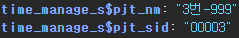
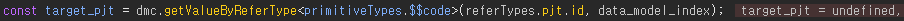

# Daily Retrospective

<br>

**작성자**: 고건호
**작성일시**: 2025-02-25

<br>

## 1. 오늘 업무 내용

<br>

- `테스트 요청` 기능 명세 수정으로 인한 코드 수정
- `GetConnPjtSearchUserAction`이 정상적으로 동작하지 않는 이슈 해결

### 1. `테스트 요청` 기능 명세 수정으로 인한 코드 수정

<br>

완료한 잡들의 기능 명세를 훑어보며 빠진 부분이 있는지 살피던 중, `테스트 요청`의 기능 명세가 수정된 것을 확인했습니다.

<br>

기존에는 2depth로 `테스트 요청`과 `테스트케이스 요청`이 존재했지만, 2depth가 사라지고 바로 `테스트 요청`을 할 수 있게 수정된 것 같았습니다.

<br>

따라서 기존에 `테스트 요청`인지, `테스트케이스 요청`인지에 따라 분기 처리가 들어갔던 부분들도 필요가 없어졌기에 해당 부분들을 코드에서 제거해줬습니다.

<br>

```typescript
// OpenRequestTestUserAction.ts

@action_impl(IOpenRequestTestUserAction)
export class OpenRequestTestUserAction {
  static executeAsync: IOpenRequestTestUserAction = async (request) => {
    const { userActionExecutor, payload, owner, execution_context, dm_manager } = request;

    const attr_feature = execution_context.getFeature<attribute.IAttributeFeature>(attribute.IAttributeFeature);

    const from_bizz_sid = "B_000000E201767"; // 시간관리
    const from_menu_sid = "M_000000E201768"; // 시간관리 조회
    const to_bizz_sid = "B_000000E201767";
    const to_menu_sid = "M_000000E201767";
    const user_action_identifier = new PageIdentifier(payload.identifier);

    // 우선 구현 이후 리팩토링
    const dmc = getDmc();
    const data_model_index = owner.data_model_index;

    // 잡코드
    const pjt = dmc.getValueByReferType<primitiveTypes.$$code>(referTypes.pjt.id, data_model_index);

    // 제목
    const title = dmc.getValueByReferType<primitiveTypes.$$txt>(referTypes.title.id, data_model_index);

    // 메모
    const memo = dmc.getValueByReferType<primitiveTypes.$$txt>("txt_002", data_model_index);

    // 변경사항
    const changes = dmc.getValueByReferType<primitiveTypes.$$txt>("txt_003", data_model_index);

    // 기타
    const etc = dmc.getValueByReferType<primitiveTypes.$$txt>("txt_001", data_model_index);

    // 부서 - EQC팀
    const dept_info = {
      sid: "EQC팀",
      code: "EQC팀",
      name: "EQC",
    };

    // 게시판 업무
    const board_bizz = dmc.getValueByReferType<primitiveTypes.$$code>("board_bizz", data_model_index);

    // 게시판 거래
    const board_data = dmc.getValueByReferType<primitiveTypes.$$code>("board_data", data_model_index);

    // 선택한 row의 카테고리
    const row_category = dmc.getValueByReferType<primitiveTypes.$$code>("cd_001", data_model_index);

    const category = _selectCategory(row_category);

    const data_sid = dmc.getValueByReferType<primitiveTypes.$$sid>(referTypes.data_sid.id, data_model_index);

    const record_sid = dmc.getValueByReferType<primitiveTypes.$$sid>(referTypes.record_sid.id, data_model_index);

    const qc_request = new Date().toISOString();

    // 기본 값이 할당된 default_data_model
    // DB를 갔다올 필요가 없기 때문에 채워서 그대로 전달
    // QC 요청일을 데이터 모델에서 빈 값으로 채워서 전달하면 -> 화면에서 당일로 날짜가 입력될 것으로 예상
    // TODO: 리팩토링
    const default_data_model: IArrayDataModelMapper = {
      time_manageXmaster: [
        {
          bizz_sid: "B_000000E201767",
          data_sid: data_sid,
          record_sid: record_sid,
          time_manage_s$bizz_sid: "B_000000E201767",
          time_manage_s$menu_sid: "M_000000E201767",
          time_manage_s$status_type: "U",
          time_manage_s$board_data: {
            sid: board_data.sid,
            code: board_data.code,
            name: board_data.name,
          },
          time_manage_s$pjt: {
            sid: pjt.sid,
            code: pjt.code,
            name: pjt.name,
          },
          time_manage_s$dept: {
            sid: dept_info.sid,
            code: dept_info.code,
            name: dept_info.name,
          },
          time_manage_s$board_bizz: {
            sid: board_bizz.sid,
            code: board_bizz.code,
            name: board_bizz.name,
          },
          time_manage_s$title: title,
          time_manage_s$txt_003: changes,
          time_manage_s$txt_002: memo,
          time_manage_s$cd_001: {
            sid: category.sid,
            code: category.code,
            name: category.name,
          },
          time_manage_s$txt_001: etc,
          time_manage_s$qc_request_dtm: qc_request, // QC 요청일 기본 값
        },
      ],
      time_manageXslip_history_array: [{}],
    };

    // 2. from -> to 데이터 매핑 (불러오기)
    // 견적 -> 할인 같이 정보가 바뀌는 경우에 필요한 로직으로 보임
    // TODO: 꼭 필요한 부분인지 다시 살펴봐야 할듯
    const from_slip_data_model = {
      bizz_sid: to_bizz_sid,
      data_model: default_data_model,
      menu_sid: to_menu_sid,
      menu_type: "input",
    };

    // 3. 팝업 호출 (UserAction)
    const data_model = await userActionExecutor.onDispatchActionAsync(user_action_identifier, {
      ...payload,
      action_mode: execution_context.action.action_mode ?? EN_ACTION_MODE.GetCreate,
      to_bizz_sid,
      to_menu_sid,
      from_bizz_sid,
      from_menu_sid,
      from_slip_data_model,
    });

    if (!data_model) {
      return;
    }

    //-------------------------------------------------------------------------------------------------

    function getDmc() {
      const data_model_id = attr_feature.getMenuAttr<menu_attrs.data_model_id>(menu_attrs.data_model_id).data;
      return dm_manager.getDataModelContainer(data_model_id);
    }

    function _selectCategory(row_category: primitiveTypes.$$code) {
      if (row_category.sid === "41") {
        // 선택한 row의 카테고리가 '개발'이면
        return {
          sid: "52",
          code: "52",
          name: "테스트",
        };
      }
      // 선택한 row의 카테고리가 'dev'라면
      return {
        sid: "501",
        code: "501",
        name: "TP",
      };
    }
  };
}
```

<br>

필요한 값들을 `dmc`에서 추출하는 부분은 다른 코드들을 리팩토링하며 함께 리팩토링을 진행할 예정입니다.

<br>

### 2. `GetConnPjtSearchUserAction`이 정상적으로 동작하지 않는 이슈 해결

<br>

`시간관리 조회` 화면의 `setup`이 더 이상 하드 코딩된 `setup`을 사용하지 않아도 됨에 따라 새로운 환경에서 제가 작성했던 코드들이 정상 동작하는지 확인하는 시간을 가질 필요가 있었습니다.

<br>

마침 어제 `GetBasicSetupProgram`과 `GetBasicDataModelProgram`으로 그려지는 `setup`에서 `dev._progress` 게시판에서 row의 잡코드로 검색을 할 수 있는 기능이 제대로 동작하지 않는다는 문의를 받았고 해당 부분을 확인하는 시간을 가졌습니다.

<br>

현재 제가 작성한 `GetConnPjtSearchUserAction`에서는 잡코드 관련 prop들을 아래와 같이 받아주고 있습니다.

<br>

```typescript
// time_manage_list_setup.ts
...
        time_manage_s$pjt: {
          sid: '00001',
          code: '00001',
          name: '1번-1',
        },
...
```

<br>

- `time_manage_s$pjt`
  - `time_manage_s$pjt_sid`
  - `time_manage_s$pjt_cd`
  - `time_manage_s$pjt_nm`

<br>

하지만 현재 `시간관리 조회` 화면의 `setup`에는 `time_manage_s$pjt` 관련 prop이 아래처럼 구성되고 있었습니다.

<br>



<br>

이 때문에 `GetConnPjtSearchUserAction`에서 제대로 `target_pjt`에 값을 할당해주지 못하고 있었던 것입니다.

<br>



<br>

해당 부분은 `GetBasicSetupProgram` 담당자와 얘기해보고 굳이 `time_manage_s$pjt_sid`, `time_manage_s$pjt_cd`, `time_manage_s$pjt_nm`을 묶는 `time_manage_s$pjt`가 필요 없다면 현재 그려지는 `setup`에 맞춰 제 코드를 수정하는 방향으로 진행하면 될 것 같다고 판단했습니다.

<br>

하지만 이는 검색 조건에 잡코드를 바로 반영시키기 위해 `page_route_options`에 넘겨줘야 하는 값을 고려하지 않은 방식이었습니다.

<br>

검색 조건에 특정 값을 바로 반영시키기 위해서는 사전에 정해진 형식에 맞춰 객체를 전달해야 하는 것으로 판단했는데, 잡코드의 경우 `pjt` 프로퍼티에

```typescript
pjt: {
  sid: 'example',
  code: 'example',
  name: 'example
}
```

같은 형식을 담아줘야 검색 조건에 정상적으로 반영됐습니다.

<br>

따라서 `time_manage_s$pjt`로 코드형 값을 가져오진 않더라도, `time_manage_s$pjt_cd` 값을 받아와야 `pjt` 객체를 `GetConnPjtSearchUserAction`에서 생성해준 뒤에 `page_route_options`에 담아 보내주는 식으로 문제를 해결했습니다.

<br>

```typescript
// 수정된 GetConnPjtSearchUserAction.ts

const page_route_options = {
  identifier: target_page_identifier,
  bizz_sid: target_bizz_sid,
  menu_type: EN_MENU_TYPE.PopupSearch,
  menu_sid: target_menu_sid,
  param: {
    bizz_sid: target_bizz_sid,
    interactive_mode: true,
    pjt: [{ sid: pjt_sid, code: pjt_cd, name: pjt_nm }],
    menu_sid: target_menu_sid,
    use_checkbox: util.code.isMultiCodeType($$multi_code),
  },
};
```

## 2. 동기에게 도움 받은 내용 (필수)

오늘 하루 동안 동기에게 받았던 도움에 대해서 기록합니다.
지식 공유, 정서 케어 등 사소한 내용도 상관 없습니다.
최소 1인에게 어떤 도움을 받았는지에 대해 써주시면 되고, 여러 명을 쓰셔도 됩니다.
