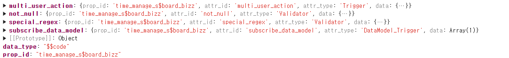
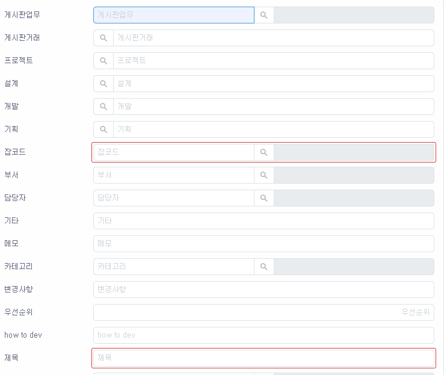

# Daily Retrospective

**작성자**: [허수경]  
**작성일시**: [2025-02-25]

## 1. 오늘 업무 내용

- DataModel Validator 속성 추가

### DataModel Validator 속성 추가

- Validator 속성을 추가하려면 먼저 AttrList 파일을 이해해야 합니다.
- AttrList는 refer_type, refer_group 등 기준별로 필요한 **Attribute(속성)** 를 정의한 파일로, 사용자가 직접 설정할 수 없는 속성들을 정리한 파일입니다.
- 시간관리업무의 항목들은 공통으로 사용하는 refer_type이 있기 때문에 AttrList에 함부로 속성을 추가할 수는 없습니다. 만약 시간관리업무에만 사용하는 항목이라면 AttrList.ts에 필요한 속성을 추가합니다.

(1) AttrList.ts에 필요한 attr을 추가

- 우선, AttrList.ts에 필요한 속성을 추가해야 합니다.

```ts
// 03.ecount.usecase\ecount.usecase.common\src\server\program\attr_generator\AttrList.ts

board_bizz: {
  [EN_MENU_TYPE.Input]: [
    trigger_attrs.multi_user_action,
    datamodel_trigger_attrs.subscribe_data_model,
    validator_attrs.code_special_regex,
    validator_attrs.not_null,
  ],

  [EN_MENU_TYPE.ListSearch]: [
    trigger_attrs.multi_user_action,
    datamodel_trigger_attrs.subscribe_data_model,
    validator_attrs.special_regex,
    validator_attrs.not_null,
  ],

  [EN_MENU_TYPE.StatusSearch]: [
    trigger_attrs.multi_user_action,
    validator_attrs.special_regex,
    validator_attrs.not_null,
  ],
},
board_data: {
  [EN_MENU_TYPE.Input]: [
    trigger_attrs.multi_user_action,
    datamodel_trigger_attrs.subscribe_data_model,
    validator_attrs.code_special_regex,
    renderer_attrs.view_type,
  ],
  [EN_MENU_TYPE.ListSearch]: [
    trigger_attrs.multi_user_action,
    datamodel_trigger_attrs.subscribe_data_model,
    validator_attrs.special_regex,
    validator_attrs.not_null,
  ],
},
```

- 위 코드에서 `board_bizz` 항목은 입력 페이지에서 4가지의 속성을 갖게 됩니다. 이들의 속성은 `attr_id`로 구분됩니다.



(2) generator_selector.ts에 규칙 정의

- AttrList.ts에서 refer_type 별로 속성(attr_id)이 추가되었으면, 이제 generator_selector.ts에서 이를 처리할 규칙을 정의해야 합니다.
- bizz_id, refer_type, attr_id, menu_type 등의 정보를 조합하여 해당 속성을 찾아내며 이렇게 함으로써 속성을 적용할 대상을 명확하게 식별할 수 있습니다.

```ts
// 03.ecount.usecase\ecount.usecase.common\src\server\util\generator_selector.ts

export function refer_type(
  refer_type: $$refer_type,
  attr_id: string,
  menu_type?: EN_MENU_TYPE,
  bizz_type?: EN_BIZZ_TYPE,
  bizz_id?: string
): IReferTypeAttrGenerator<any> {
  return (refer_type_gens[
    `${bizz_id}_${refer_type}_${attr_id}_${menu_type}` as keyof typeof refer_type_gens
  ] ||
    refer_type_gens[
      `${bizz_id}_${refer_type}_${attr_id}` as keyof typeof refer_type_gens
    ] ||
    refer_type_gens[
      `${bizz_type}_${refer_type}_${attr_id}_${menu_type}` as keyof typeof refer_type_gens
    ] ||
    refer_type_gens[
      `${bizz_type}_${refer_type}_${attr_id}` as keyof typeof refer_type_gens
    ] ||
    refer_type_gens[
      `${refer_type}_${attr_id}_${menu_type}` as keyof typeof refer_type_gens
    ] ||
    refer_type_gens[
      `${refer_type}_${attr_id}` as keyof typeof refer_type_gens
    ] ||
    refer_type_gens[
      `${attr_id}_${menu_type}` as keyof typeof refer_type_gens
    ] ||
    refer_type_gens[
      attr_id as keyof typeof refer_type_gens
    ]) as IReferTypeAttrGenerator<any>;
}
```

(3) attr_generator/refer_type에 각 attr 생성 함수 정의

- 마지막 단계에서는 generator_selector.ts를 통해 찾은 속성 정보를 실제로 생성하는 함수(attr_generator/refer_type)를 정의해야 합니다.
- 이 과정에서, 속성이 올바르게 동작하도록 필요한 데이터를 주입하고 있습니다.

```ts
import { validator_attrs } from "ecount.fundamental.define/attribute";
import {
  EN_ATTR_TYPE,
  EN_EXECUTE_CALLER_TYPE,
} from "ecount.fundamental.define/enum";
import { IReferTypeAttrGenerator } from "ecount.usecase.common/@abstraction";

export const time_manage_board_bizz_code_special_regex_input: IReferTypeAttrGenerator<
  validator_attrs.code_special_regex
> = (execution_context, setup, target) => {
  return {
    prop_id: target.prop.prop_id,
    attr_id: validator_attrs.special_regex,
    attr_type: EN_ATTR_TYPE.Validator,
    data: {
      data: {
        code: ["limit_code", "limit_noscript"],
        name: ["limit_name", "limit_noscript"],
      },
      caller_type: [EN_EXECUTE_CALLER_TYPE.change],
    },
  };
};
```

---

## 2. 동기에게 도움 받은 내용 (필수)

- 주원님께서 점심 식사 후 커피를 사주셔서 오후 업무도 기운 차리며 할 수 있었습니다.
- 현철님께서 법인카드를 빌려주신 덕분에 저녁 식사를 편하게 배달로 주문할 수 있었습니다.
- 강민님께서 저녁 식사 후 아이스크림을 사주셔서 더욱 달콤한 마무리를 할 수 있었습니다.
- 승준님, 강민님께서 validator 속성을 어느 파일에서 설정해야 하는지 친절하게 설명해주셔서 빠르게 해결할 수 있었습니다.

---

## 3. 개발 기술적으로 성장한 점 (선택)

### 2. 오늘 직면했던 문제 (개발 환경, 구현)와 해결 방법

#### not_null 에러가 화면에 뜨지 않은 문제

1. 문제상황

- 시간관리 입력 화면에서 게시판 업무, 잡코드, 제목 3가지 항목은 필수 입력값입니다. 하지만, 이 값들이 비어 있는 상태에서 저장 버튼을 눌러도 화면에 유효성 검사 에러가 표시되지 않았습니다.
- 디버깅을 진행한 결과, 서버에서는 올바르게 유효성 검사 에러를 반환하고 있었지만, 클라이언트 화면에서는 이를 감지하지 못하고 그대로 endpoint로 빠지고 있었다.

2. 원인분석

- 기존 로직을 확인한 결과, CreateAndModifyInventorySlipUserAction에서는 에러를 화면에 표시하는 코드가 존재했습니다.
- 하지만 현재 사용 중인 CreateAndModifyBasicSlipUserAction 파일에서는 해당 코드가 누락되어 있었던 것이 원인이었습니다.

3. 해결 방법

- CreateAndModifyBasicSlipUserAction.ts에서 아래와 같은 코드를 추가하여 에러 발생 시 적절하게 예외를 던질 수 있도록 수정했습니다.

```ts
// CreateAndModifyBasicSlipUserAction.ts
if (result.error) {
  execution_context.action.action_mode = _.vIsEquals(
    execution_context.action.action_mode,
    EN_ACTION_MODE.Create
  )
    ? EN_ACTION_MODE.GetCreate
    : EN_ACTION_MODE.GetModify;
  Exception.throw(ExceptionBuilder.create(result.error.name, result.error));
}
```

위 코드를 추가함으로써 유효성 검사 실패 시 화면에서 즉시 에러를 확인할 수 있도록 수정했습니다.



---

## 4. 소프트 스킬면에서 성장한 점 (선택)

validator를 담당하면서 generator를 이해하고자 노력했지만, validator 로직만 짜다보니 쉽지않았습니다. 하지만 요며칠 실제로 generator 코드를 수정하고 디버깅하는 과정을 거치면서 전체적인 흐름을 파악할 수 있었습니다.

계속 validator를 맡았기에 generator를 구현하는 동기들에게 빠르게 도움을 줄 수 있었고, 자연스럽게 해당 영역에 대한 이해도가 높아졌습니다.

이전에 현우 팀장님께서 "맡은 업무의 전문가가 되어, 해당 분야에서 질문이 있을 때 나를 찾을 수 있도록 노력해야 한다"고 말씀하셨는데, 이번 경험을 통해 validator뿐만 아니라 generator까지 맡게 되면서 점점 validator 분야에서 전문가로 성장하고 있다는 뿌듯함을 느꼈습니다.
