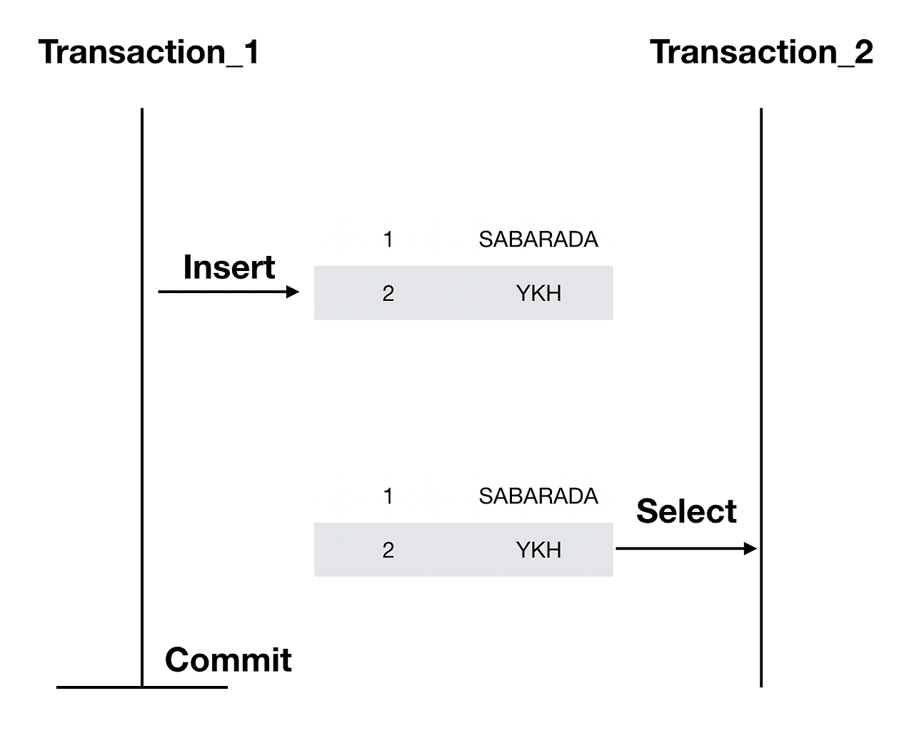
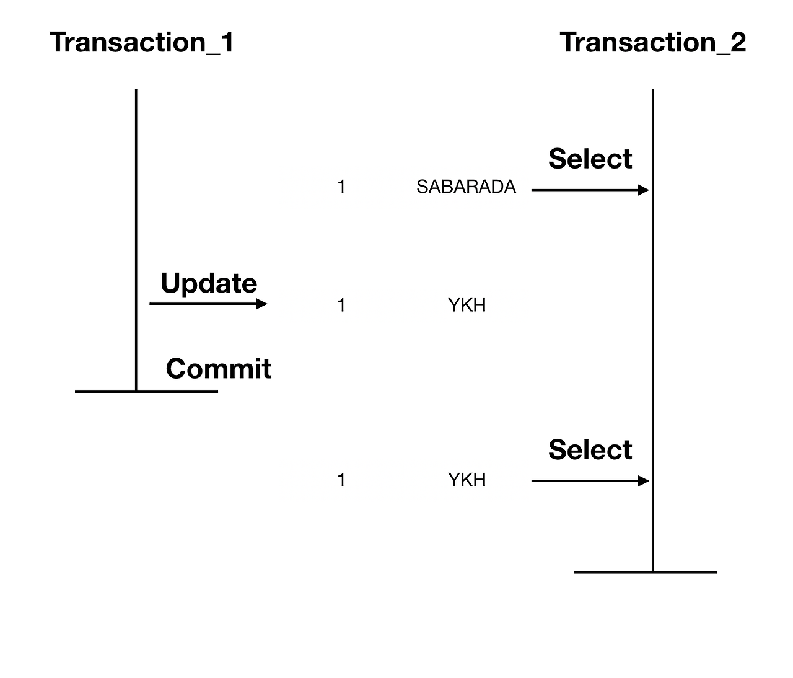
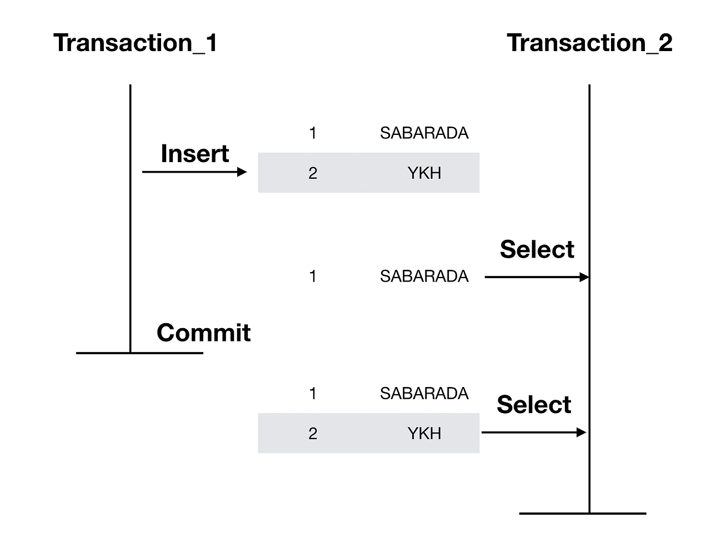

# Daily Retrospective

**작성자**: [설다은]  
**작성일시**: [2024-12-23]

## 1. 오늘 배운 내용 (필수)

### 🗒️[Command Pattern]

**1. Design Pattern?**<br>

- 프로그램 개발에서 반복적으로 등장하는 문제를 효과적으로 해결하기 위해 축적된 설계 지식의 집합.

**2. 특징**

- 동일한 디자인 패턴이라도 적용되는 맥락과 요구사항에 따라 그 형태는 변형될 수 있다.

**3. command Pattern**

###### <https://gsbang.tistory.com/entry/Design-Pattern-Command-Pattern%EC%BB%A4%EB%A7%A8%EB%93%9C-%ED%8C%A8%ED%84%B4>

###### <https://patterns-dev-kr.github.io/design-patterns/command-pattern/>

요청 자체를 '객체화'하는 것을 목표로 하는 디자인 패턴

▼ 이카운트에서 사용하는 변형된 커맨드 패턴에 대해 구현했다.

```ts
class TeleVision {
  powerOn: boolean;
  volume: number;
  channel: number;
}

class TvRemoteController {
  tv: TeleVision;

  public constructor(tv: TeleVision) {
    this.tv = tv;
  }

  public PowerSwitch() {
    console.log("전자기파 발산");
    this.tv.powerOn = !this.tv.powerOn;
  }

  public VolumeChange(is_up: boolean) {
    console.log("전자기파 발산");
    if (!this.tv.powerOn) {
      return;
    }

    this.tv.volume += isUp ? 1 : -1;
  }

  public ChangeChannel(channel_number: number) {
    console.log("전자기파 발산");
    if (!this.tv.powerOn) {
      return;
    }

    this.tv.channel = channel_number;
  }
}
```

위의 코드를 아래 커맨드패턴을 적용하여 작성해보았다.

```ts
abstract class BaseCommand<TRequest, TResult, TContext> {
  protected context: TContext;

  constructor(context: TContext) {
    this.context = context;
  }
  // 공통 기능 처리
  execute(dto: TRequest): TResult {
    this.onConfigure(dto);

    if (this.canExecute()) {
      return this.onExecute(dto);
    }

    return undefined as unknown as TResult;
  }
  // 비즈니스 로직 구현에서 필요시 초기화 작업 구현
  protected onConfigure(dto: TRequest): void {}

  protected canExecute(): boolean {
    return true;
  }
  // 비즈니스 로직을 위해 반드시 구현하도록 강제
  protected abstract onExecute(dto: TRequest): TResult;
}

export class TeleVision {
  powerOn: boolean;
  volume: number;
  channel: number;

  constructor() {
    this.powerOn = false;
    this.volume = 0;
    this.channel = 0;
  }
}

interface IRemoteControlRequest {
  channel_number?: number;
  volume_up?: boolean;
}

class RemoteControlAction extends BaseCommand<IRemoteControlRequest, boolean, TeleVision> {
  // 구현
  execute(dto: IRemoteControlRequest): boolean {
    console.log("전자기파 발산");
    return super.execute(dto);
  }
  protected onExecute(dto: IRemoteControlRequest): boolean {
    return true;
  }
}

export class ToggleAction extends RemoteControlAction {
  // 구현
  protected onExecute(dto: IRemoteControlRequest): boolean {
    // super.onExecute(dto);
    this.context.powerOn = !this.context.powerOn;
    return this.context.powerOn;
  }
}

export class VolumeAction extends RemoteControlAction {
  // 구현
  protected canExecute(): boolean {
    return this.context.powerOn;
  }

  protected onExecute(dto: IRemoteControlRequest): boolean {
    // super.onExecute(dto);
    if (dto.volume_up !== undefined) {
      this.context.volume += dto.volume_up ? 1 : -1;
      return true;
    }
    return false;
  }
}

export class ChannelAction extends RemoteControlAction {
  // 구현
  protected canExecute(): boolean {
    return this.context.powerOn;
  }
  protected onExecute(dto: IRemoteControlRequest): boolean {
    // super.onExecute(dto);
    if (dto.channel_number) {
      this.context.channel = dto.channel_number;
      return true;
    }
    return false;
  }
}
```

공통적으로 수행해야하는 동작이 있다면 그걸 공통으로 만들고, 그 공통을 상속받는 개별 메서드가 존재하는 형태로 캡슐화를 진행하여, 추후 비슷한 동작을 만들때도 유용하고, TV뿐만 아니라 다른데서도 (예를들면 radio, AI스피커 등) 공통 로직을 쓴다고 생각하면 활용성이 높은 디자인 패턴같다.

### 🗒️[DB, RDB, DBMS]

1. DB?<br>
   구조화된 데이터의 집합으로, 데이터를 체계적으로 저장하고 관리하는 저장소

2. RDB? <br>

- 하나의 데이터를 테이블(table)의 형태로 표현하며, 행(row,record, tuple)/열(column, attribute, item)과 그에 상응하는 값을 가진다.
- 서로 다른 테이블이 관계를 맺고 모여있는 집합체로 이해할 수 있다.
- 데이터의 구조가 명확하며 명확한 스키마가 필요한 경우, 관계를 맺고 있는 데이터가 자주 변경되는 경우에 사용한다.

  장점 :

  - 데이터의 분류, 정렬, 탐색 속도가 빠름

  - 스키마가 명확하게 정의되어 데이터 구조를 보장함

  - 신뢰성과 데이터 무결성 보장함 (테이블 생성 시 컬럼의 데이터타입을 지정하기 때문)

  - 관계를 통한 데이터 중복 최소화 (JOIN문을 통해 다른 table의 데이터를 조작할 수 있음, 확장이 용이함)

  - 정형 정보에 가장 효율적이고 유연하게 접근 가능

  단점 :

  - 기작성된 스키마 수정이 어려움 (정적스키마이기 때문)

  - 시스템이 커지면 JOIN문이 많은 복잡한 쿼리 발생 가능성 존재할 수 있음

  - Scale-up만 지원해 비용이 늘어날 수 있음

  - 다른 DB에 비해 자원이 많이 활용되어 시스템 부하가 높음
    <br><br>

3. RDBMS?<br>
   RDB를 관리하는 시스템으로 테이블 간의 관계를 기반으로 데이터를 관리함.<br>
   특징:<br>
   - 데이터 구조화 : 데이터를 테이블로 정리하여 읽고쓰기가 편함<br>
   - 관계 정의 : 테이블 간의 관계를 정의할 수 있음(ex. 외래키)<br>
   - 데이터 무결성 : 데이터의 정확성과 일관성 보장<br>
   - ACID 준수 : 트랜젝션이 안전하게 실행되도록 보장<br>
   - SQL지원 : 데이터조작과 정의를 위한 표준화된 언어 지원
     <br><br>

### 🗒️[Transation (트랜젝션)]

**1. Transation?**<br>

- 논리적인 하나의 작업 단위
- 더이상 분할될 수 없는 명령의 모음

```ts
UPDATE account
SET 잔액 = 잔액 - 100000
WHERE 고객 = 'A';

UPDATE account
SET 잔액 = 잔액 + 100000
WHERE 고객 = 'B';

```

위 예시를 보면, A의 잔액이 감소하는 동시에 B의 잔액이 증가해야한다. 만약 둘 중 하나만 실행되게 되면 오류가 발생하게된다. 그렇기 때문에 하나의 트랜젝션은 다 성공해서 commit이되거나, 하나라도 실패하면 rollback이 되어야 하는 것이다.<br>
이처럼 작업을 쪼개고 쪼갰을 때 더이상 쪼갤 수 없는 단위가 된다면 하나의 트랜젝션이라고 보면된다.
<br><br>

**2. 특징**<br>
**(1) 원자성 (All or Noting)**<br>
모두 실행하거나 모두 실행하지 않거나 두가지 상태만 존재한다.<br>

**(2) 일관성 (Consistency)**<br>
실행 이전과 이후의 DB는 항상 일관된 상태여야한다.<br>

**(3) 고립성 (Isolation)**<br>
어러 트랜젝션이 동시에 실행될 때도 혼자 실행되는 것처럼 동작해야한다.<br>

**(4) 지속성 (Durability)**<br>
트랜젝션 실해의 결과는 DB에 영구적으로 저장되어야한다.

### 🗒️[Isolation Level]

**1. Isolation Level?**<br>
트랜젝션 격리 수준이라고하며, 동시에 여러 트랜젝션이 처리될 때, 트랜젝션끼리 서로 얼마나 고립되어 있는지 정도를 나타낸 것.<br>
즉, 특정 트랜젝션이 다른 트랜젝션에 변경한 데이터를 볼 수 있도록 허용할지 여부를 결정하는 것.<br>

| Isolation Level  | Dirty Read             | Nonrepeatable Read | Phantom Read           | Serialization Anomaly |
| ---------------- | ---------------------- | ------------------ | ---------------------- | --------------------- |
| Read uncommitted | Allowed, but not in PG | Possible           | Possible               | Possible              |
| Read committed   | Not Possible           | Possible           | Possible               | Possible              |
| Repeatable read  | Not Possible           | Not Possible       | Allowed, but not in PG | Possible              |
| Serializable     | Not Possible           | Not Possible       | Not Possible           | Not Possible          |

**(1) READ UNCOMMITTED**<br>
어떤 트랜젝션에서 변경된 내용이 커밋 or 롤백의 여부 상관 없이 다른 트랜젝션에서 보여지는 것수준<br>
**(2) READ COMMITTED**<br>
어떤 트랜젝션에서 변경된 내용이 커밋되어야만 다른 트랜젝션에서 보여지는 수준 (온라인 서비스에서 가장 많이 선택되는 격리수준)<br>
**(3)REPEATABLE READ**<br>
트랜젝션이 시작되기 전에 커밋된 내용에 대해서만 조회할 수 있는 수준<br>
**(4)SERIALIZABLE**<br>
가장 단순하고 엄격한 수준, 읽기작업조차 안됨... 동시처리 능력이 거의 없다고 봐야함.<br>
<br>

**<표 용어 설명>**<br>
(1) dirty Read<br>
커밋되지 않은 변경 사항을 다른 트랜젝션에서 읽는 것 (PG는 모든 수준에서 Dirty Read를 허용하지 않음)<br>



(2) Nonrepeatable Read<br>
하나의 트랜젝션 중 같은 key를 가진 row를 두번 읽었는데 그 사이에 값이 변경되거나 삭제되어 결과가 다르게 나타나는 것



(3) Phantom Read<br>
한 트랜젝션 내에서 같은 쿼리를 두번 실행했는데, 첫번째 쿼리에 없던 유령 레커드가 두번째 쿼리에서 나타나는 것



(4) Serialization Anomaly<br>
트랜젝션 내에서 쿼리를 두번이상 수행할 때, 첫번째 쿼리에 있는 레코드가 추가 or 삭제되지 않는 것

## 2. 동기에게 도움 받은 내용 (필수)

**지은님**<br>
디자인패턴 구현 중 코드가 다 맞는 것 같은데 제대로 동작하지 않는 부분이 있었다.<br>
지은님이 코드를 한줄한줄 봐주시면서 빼먹은 부분을 확인해주었다.<br>
오늘도 어제와 똑같이 if가 끝났을 때 최종적으로 return하는 값을 챙겼어야하는데 놓쳤다.<br>
해당부분은 조금 더 연습이 필요해보인다...

## 3. 추가적인 궁금증 (선택)

RDB에 대해서 공부하다보니가 noSQL과의 차이점이 같이 나왔다.<br>
개발지식을 확장하기에는 noSQL이 뭔지에 대해서도 같이 공부하고 차이점을 이해하는게 좋아보인다.<br>
설명을 읽었을 때는 크게 감이 오지 않아서 유튜브에서 비교 예시문을 설명하는 영상을 보면(시각화된 자료)
더 이해가 잘 될 것 같다.

## 4. 도전 과제 (선택)

## 5. 해결 방안 및 배운 점 (선택)

**재희님**<br>
디자인패턴 메서드를 구현할 때 공통메서드에 콘솔로그가 있었다. 그걸 구현한 후에 하위 메서드가 동작할 때 상위 메서드를 super로 호출한 후 본인 메서드의 것을 OnExcute하게 구현을 했는데, 아예 super까지 공통로직에 넣어서 구현하는 방법을 알려주셨다.<br>
개발을 할 때 공통되는 것들은 최대한 공통에서 다 수행할 수 있도록 하는것이 다른사람들과 협업할 때 신경써야하는 부분인 것을 알게 되었다.<br>
나만 작성하는 코드가 아니니까 다른사람들이 개발할 때 조금 더 편하게 할 수 있는 방법도 생각하는 연습을 해야할 것 같다.

## 6. 오늘 느낀 개선점이 있다면? (선택)

## 7. 오늘의 교육을 더 좋게 만들 수 있는 방법이 있었을까? (선택)

## 8. 해결하지 못한 문제 및 의문점 (선택)
