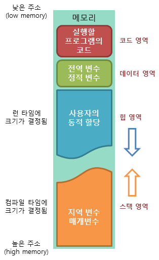

# Daily Retrospective

**작성자**: [설다은]  
**작성일시**: [2024-12-26]

## 1. 오늘 배운 내용 (필수)

### 🗒️[안티패턴]

1.  안티패턴?<br>
    많이 또는 자주 사용되는 패턴이지만 비효율적이거나 비생산적인 패턴으로 성능, 디버깅, 유지보수, 가독성 등에 있어 부정적 영향을 줄 수 있기 때문에 지양하는 패턴이다.

2.  종류<br>
    굉장히 많은 유형의 안티 패턴이 있다.
    오늘은 예제 코드를 통해 해당 코드의 무엇이 안티패턴에 해당하는지 직접 찾아보는 시간을 가졌다.
    그 중에서는 나도 코드를 작성할 때 범하는 실수들이 있었는데 이제 이런것들을 챙겨서 작성해야겠다.<br>

    **(1) 불필요한 변수 할당**

    ```ts
    const output = someData;
    return output;

    // someDate가 어떠한 가공을 거치고 이러면 변수로 할당하여 가져다쓰는게 좋지만 바로 값을 return하는 경우에는 필요없다.

    return someData;
    ```

    **(2) 불필요한 프로퍼티 호출**

    ```ts
    // 예제1)
    if (obj.list.get(key)) {
      const value = obj.list.get(key);
      console.log(value);
    }

    // obj.list.get(key)이 프로퍼티는 조건을 확인할때도 호출되고 value에 값을 할당할때도 호출된다.
    // 이렇게 중복되는 코드가 있다면 최초 변수로 할당하고 가져다 쓰는게 더 효율적이다.
    // 추가적으로 1번 예제와 동일한 이유로 value에 값을 할당 후 console.log를 찍는 것보다 최초 할당된 값을 바로 찍는게 좋다.

    const value = obj.list.get(key);
    if (value) {
      console.log(value);
    }

    // 예제2)
    for (let i = 0; i < arr.length; i++) {
      console.log(arr[i]);
    }

    // arr.length를 반복문을 호출할 때마다 호출하지 않도록 변수로할당하는게 좋다.

    const length = arr.length;
    for (let i = 0; i < length; i++) {
      console.log(arr[i]);
    }
    ```

    **(3) 분기문 남용**

    ```ts
    function getLocalizedErrorMessage(errorCode: number, language: string): string {
      if (language === "en") {
        if (errorCode === 400) {
          return "Bad Request";
        } else if (errorCode === 401) {
          return "Unauthorized";
        } else if (errorCode === 404) {
          return "Not Found";
        } else {
          return "Unknown Error";
        }
      } else if (language === "ko") {
        if (errorCode === 400) {
          return "잘못된 요청";
        } else if (errorCode === 401) {
          return "인증되지 않음";
        } else if (errorCode === 404) {
          return "찾을 수 없음";
        } else {
          return "알 수 없는 오류";
        }
      } else {
        return "Unknown Error"; // 지원되지 않는 언어
      }
    }

    // 분기문이 많아지면 코드의 가독성이 떨어진다.
    // 언어 안에 에러코드 분기문이 또 있기 때문에 언어나 에러코드가 더 추가된다면 코드는 더 복잡해질 것이다.
    // key:value형태의 map구조로 저장해놓으면 키에 해당하는 값을 바로 찾을 수 있기 때문에 가독성 및 성능이 개선될 수 있다.

    const localizedErrorMessages: Map<string, Map<number, string>> = {
      en: {
        400: "Bad Request",
        401: "Unauthorized",
        404: "Not Found",
      },
      ko: {
        400: "잘못된 요청",
        401: "인증되지 않음",
        404: "찾을 수 없음",
      },
    };

    function getLocalizedErrorMessage(errorCode: number, language: string): string {
      return localizedErrorMessages[language]?.[errorCode] ?? "Unknown Error";
    }
    ```

    (4) 불필요한 인스턴스 생성

    ```ts
    // 예제1)
    interface IStateRequest {
      info_list?: InfoListType[];
    }

    const state_program = ProgramBuilder.create<IStateRequest, IStateResult>(IStateProgram, execution_context);

    const { group_data } = state_program.execute({});

    // info_list는 선택적 프로퍼티이기 때문에 값이 undefined일 수 있다.
    // 마지막 state_program.execute({})이 실행하여 없는 값을 생성하는 것보다는 request의 타입을 명확히해서 값이 있을 때만 실행되게 하는게 좋다.
    // 값이 없는데도 실행되는 것 자체가 비용이기 때문에...

    type RequestType = IStateRequest | undefined;
    const { group_data } = state_program.execute();

    // 예제2)
    let resultItemJson: any = {};
    if (state.attribute_set_sid) {
      resultItemJson = JSON.parse(state.result_item_json);
    } else {
      resultItemJson = {
        option_one: "0",
        option_two: "0",
        option_three: "0",
        sequence_one: "1",
        sequence_two: "2",
        sequence_three: "3",
      };
    }

    // 일단 resultItemJson 변수에 빈 객체를 할당하는 것이 큰 낭비이다.
    // 두번째는, else뒤에 있는 resultItemJson의 값은 고정되어 있을텐데 변수로 할당하지 않고 매번 가져다쓴다면 굉장히 낭비적이다. 차라리 변수에 할당해놓고 값이 바뀔때만 갈아끼는게 효율적이다.

    const default_result = {
      option_one: "0",
      option_two: "0",
      option_three: "0",
      sequence_one: "1",
      sequence_two: "2",
      sequence_three: "3",
    };

    let resultItemJson: any; // 변수 선언만!!
    if (state.attribute_set_sid) {
      resultItemJson = JSON.parse(state.result_item_json);
    } else {
      resultItemJson = default_result;
    }
    ```

    (5) 부적절한 자료구조 사용

    ```ts
    function isAllowed(value: string): boolean {
      const allowedValues = ["apple", "banana", "cherry", "date", "elderberry"];
      return allowedValues.includes(value);
    }

    // value가 allowedValues에 포함되는지 확인하려는 의도라면 allowedValues는 중복되지 않는 배열일 것이다. >> set구조가 적합.
    // 그리고 배열은 전체를 탐색하기 때문에 시간복잡도가 O(n)이라면 set구조는 탐색 시 시간복잡도가 O(1)로 성능이 개선된다.

    const allowedValues = new Set(["apple", "banana", "cherry", "date", "elderberry"]);
    function isAllowed(value: string): boolean {
      return allowedValues.has(value);
    }
    ```

    (6) 부적절한 함수 사용

    ```ts
    const { source_list } = example_program.execute(request);
    const result_list = [];

    source_list.forEach((source) => {
      result_list.push({
        tenant_sid: source.com_code,
        name: source.nm,
      });
    });

    // 위 코드는 source_list를 순회하면서 result_list에 값을 넣어주고 있다.
    // forEach는 순회한 데이터를 .push를 통해 수동삽입해야하는데, 어떠한 값을 통해 새로운 배열을 만들어야한다면 map 사용이 더 효율적이다.
    // map은 애초에 기존 데이터를 가지고 새 배열을 만드는 메서드이기 때문에, 순회와 동시에 값이 삽입될 수 있다.

    const { source_list } = example_program.execute(request);
    const result_list = source_list.map((source) => {
      return {
        tenant_sid: source.com_code,
        name: source.nm,
      };
    });
    ```

    (7) 비효율적인 문자열 결합

    ```ts
    for (let j = 1; j <= 70; j++) {
      console.log("column" + j);
    }

    // 위 코드는 자바스크립트 엔진에서 숫자를 문자열로 변환 후 문자+문자를 결합하는 작업을 수행함 (스트링코더).
    // 위 방법을 조금 더 간결하게 하기 위해 ES6부터는 템플릿리터럴이 존재함.

    for (let j = 1; j <= 70; j++) {
      console.log(`column${j}`);
    }
    ```

    찾아보니 위 예시 외에도 많은 안티패턴이 존재한다.
    아래 내용을 참고해서 이런것도 있구나를 파악하면 도움이 될 것 같다.
    참고자료 : <https://ui.toast.com/fe-guide/ko_ANTI-PATTERN>

### 🗒️[메모리]

1. 메모리?<br>
   컴퓨터 구조 중 현재 실행되는 프로그램의 명령어와 데이터를 저장하는 부품으로 프로그램이 실행되려면 반드시 메모리에 저장되어 있어야한다.<br>
   또한, 프로그램에서 사용되는 변수들을 저장할 메모리도 필요하다.

2. 메모리 공간의 종류<br>
   (1) 코드영역<br>

   - 실행할 프로그램의 코드가 저장되는 영역 (= 텍스트 영역)<br>
   - CPU는 코드영역에 저장된 명령어를 하나씩 가져가 처리함.<br>

   (2) 데이터영역<br>

   - 프로그램 전역변수와 정적(Static) 변수가 저장되는 영역<br>
   - 프로그램의 시작과 함께 할당되며 프로그램 종류 시 소멸됨<br>

   (3) 스택영역<br>

   - 함수의 호출과 관계되는 지역변수와 매개변수를 저장하는 영역<br>
   - 정적 메모리 할당으로, 컴파일 시간에 메모리 크기가 결정되며, 함수 호출 시 자동으로 메모리가 할돵되고 해제됨<br>
   - 함수 호출 시 스택에는 함수의 매개변수 + 호출이 끝난 뒤 돌아갈 반환 주소값 + 함수에서 선언된 지역변수가 저장됨<br>

   (4) 힙 영역<br>

   - 사용자가 직접 관리할 수 있는 메모리 영역<br>
   - 동적 메모리 할당으로, 프로그램 실행 중에 메모리 크기가 결정되며, 개발자가 직접 메모리를 할당하고 해제해야함.<br>
   - GC : 힙 영역에서 동적으로 할당했던 메모리 영역 중 필요없게된 메모리 영역을 주기적으로 삭제하는 프로세스<br>

   

### 🗒️[if else VS switch]

1. if문과 switch문의 차이점

   if else : <br>

   - 조건을 위에서부터 순차적으로 확인함.
   - 조건이 많아지거나 복잡해질수록 성능저하 발생 가능성 높음.

   switch문 : <br>

   - jump table, lookup table을 사용하여 분기처리를 진행하여 찾으려는 값을 바로 찾아가서 확인함.

2. Jump Table?

- 조건값과 실행위치 (메모리주소)를 매핑한 테이블(배열)로, 주로 컴파일러 최적화를 위해 사용됨. (조건이 정수값 or 연속된 값일 때 성능이 최적화)
- 조건값에 따라 직접 해당 주소로 "점프"하기 때문에 실행 속도가 빠름.

3. Lookup Table?

- 키와 값을 매핑하는 자료구조, 특정 값에 대한 결과를 빠르게 검색하는데 사용됨.
- 주로 비연속적인 값 조건에서 객체를 활용하여 가독성과 유지보수성을 높힘.
- 일반적으로 해시테이블 or 배열을 기반으로 동작함.

결국, 점프테이블, 룩업테이블 모두 조건의 처리를 효율적으로 하기위한 기법으로, 조건의 성격에 맞게 적절히 선택하는 것이 중요함.

## 2. 동기에게 도움 받은 내용 (필수)

**지은님**<br>
오늘 안티패턴, 제네릭을 하면서 좀 힘들었는데, 아직 익숙치 않아서 그런것일 뿐 계속 보다보면 익숙해질 것이라는 위로를 받았다...ㅠㅠ

## 3. 개발 기술적으로 성장한 점 (선택)

### 1. 교육 과정 상 배운 내용이 아닌 개인적 호기심을 해결하기 위해 추가 공부한 내용

### 2. 오늘 직면했던 문제 (개발 환경, 구현)와 해결 방법

### 3. 위 두 주제 중 미처 해결 못한 과제. 앞으로 공부해볼 내용.

제네릭의 개념이나 왜 사용해야하는지는 이해했다. 다만 오늘 출제했던 문제에서 제네릭으로 수정하려면 어떻게 해야할지 감이 잘 오지 않았다. 외우려면 이해를 해야하는 편인데... 일단 최대한 이해해보고 안되면 외워야겠다!<br>
일단, 제네릭 관련된 코드를 보고 해석하는 연습을 조금 더 한 다음에 다시 이 코드를 보면 이해가 될 것 같다.

## 4. 소프트 스킬면에서 성장한 점 (선택)

코드를 읽는 스킬이 조금 성장한 것 같다.<br>
이전에는 한줄을 해석하는데 오랜 시간이 걸리는데도 잘 이해하지 못했다면 이제는 완전하지 못해도 어떤 내용인지 감은 오는 정도이다.<br>
다들 계속 코드를 보다보면 는다고 한 것처럼 조바심 내지 말고 천천히, 꾸준히 해야겠다.<br>

## 5. 제안하고 싶은 내용
