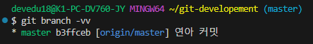
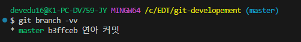

# Daily Retrospective  
**작성자**: [황주원]  
**작성일시**: [2024-12-26]  

## 1. 오늘 배운 내용 (필수)  
Git은 Snapshot 방식을 사용하고, SVN은 델타 방식을 사용한다.

여기서 Snashot의 의미는 뭘까?
> 사전적으로는 '순간적인 장면을 촬영한 사진' 을 말한다.
> 즉, 특정 시점의 데이터를 복사하여 저장하는 기술이라는 의미이다.

### Git의 Snapshot 방식
파일에서 변경된 부분을 찾아 수정된 내용만 저장하는 것이다.

이 상황이 변화된 부분만 찾아 사진을 찍는 것과 같다고 하여 스냅샷 방식이라고 부른다.

깃의 스냅샷 방식은 HEAD 가 가리키는 커밋을 기반으로 사진을 찍는다. 이를 스테이징 영역과 비교하여 새로운 커밋으로 기록한다.

해당 방식으로 빠르게 버전의 차이 부분을 처리하며, 용량을 적게 사용할 수 있다.

### 상태
스테이징 영역과 비교한다고 앞서 얘기했는데 이러한 영역들은 무엇일까?

이미지와 같이, add를 하면 스테이징 영역에 올라간다.

commit을 할 때 이렇게 스테이징에 올라간 부분들이 .git (숨김 폴더)에 저장되고,

push를 하면 원격 저장소에 저장된다.

## 2. 동기에게 도움 받은 내용 (필수)
- 중간에 연아님, 도형님과 3층에서 간식 타임을 가졌는데 머리를 맑게 하는데에 도움되었습니다.
- 승준님의 질문들이 제가 모르는 부분을 파악하는 데에 도움이 되었습니다.
---

## 3. 개발 기술적으로 성장한 점 (선택)
### 1. 교육 과정 상 배운 내용이 아닌 개인적 호기심을 해결하기 위해 추가 공부한 내용
### git pull vs git pull origin master
상황에 따라 git pull이 안 될 때가 있다. 

git pull 은 remote가 origin, 브랜치가 현재 브랜치라면 이 둘을 생략할 수 있다.

> git pull [remote] [branch]

git branch -vv 명령어로 

**[git pull 가능한 상황]**  

**[git pull 불가한 상황]**  

### 2. 오늘 직면했던 문제 (개발 환경, 구현)와 해결 방법

### 3. 위 두 주제 중 미처 해결 못한 과제. 앞으로 공부해볼 내용.
- revert vs reset
- 통신 패킷
- 커밋 옵션에 대한 이해
- 고아 커밋에 대한 이해

## 4. 소프트 스킬면에서 성장한 점  (선택)  
"자주 commit 하는 습관을 가지자" 
라고 재희 선임님께서 말씀을 처음 들었을 때, 의미가 와닿지 않았습니다. 

이전까지는 구축형 제품의 유지보수 업무를 하면서 해당 기능별 브랜치가 아닌 고객사별 개발/운영 브랜치로 다루었기 때문에, 커밋은 기능을 완벽하게 구현한 후 Commit 했습니다.

오늘 교육으로 인해 이카운트 ERP 개발 방식(commit .. 등) 에 대해 더 깊이 이해할 수 있었던 시간이었습니다.

또한, [질문을 잘 하는법](http://git2.ecount.kr/ecount-doc/ecount-docs/-/tree/master/KB(Knowledge%20base)?ref_type=heads) 에 대해 재희 선임님께서 공유해주셨습니다.

부끄럽지만 과거에 제가 잘못된 방식으로 질문했던 경험([질문을 잘 못한 경험](https://wondaydev.tistory.com/3))에 대해 회고했던 경험이 있습니다.  

공유해주신 질문을 잘 하는법을 보며 그때의 부족한 점들을 다시 상기해 보며 성장할 수 있었습니다.

이렇게 교육을 받는게 얼마나 좋은 기회이고 스킬 업을 할 수 있는 기회인지 또 한 번 생각들면서 더 노력해야겠다는 다짐을 했습니다.
