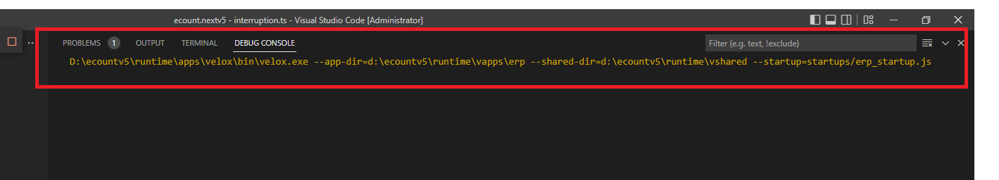

# Daily Retrospective  
**작성자**: [박성재]  
**작성일시**: [2024-12-30]  

## 1. 오늘 배운 내용 (필수)  
- 이카운트에서 사용하는 개발 도구 및 환경 세팅 방법
- 피들러 사용법 및 각종 기능들 링크

## 이카운트에서 사용하는 개발 도구 및 환경 세팅 방법
부서 배치를 받고나서도 활용하게될 것 같아, 재사용을 위해 개발환경 세팅 방법을 기록해두고자 합니다. 
편의에 맞춰 필요한 부분을 추가하거나 요약한 부분이 존재합니다.

## 1. 프레임워크 버전에 맞춘 VS CODE 설정

#### [권장사항] 드라이브 분리 (D 드라이브 추천)
1. 컴퓨터 관리
2. 저장소 - 디스크 관리 더블클릭
3. 주 저장소(C 드라이브) 우클릭 - 볼륨 축소
4. 축소할 공간 입력 - 축소

</br>

### STEP 1. .NET CORE 8 설치

아래 주소에서 자신의 platform, os에 맞는 최신 버전을 받아 설치하세요.


```
https://dotnet.microsoft.com/ko-kr/download/dotnet/8.0
```

```
https://dotnet.microsoft.com/ko-kr/download/dotnet/7.0
```
* 설치형 배포프로그램을 설치하기 위해서는 7.0 버전도 설치 필요합니다.


visual studio 2022 설치 안되어 있는 경우, 
http://60.60.0.116/ecsw/dotnet-sdk-8.0.400-win-x64.exe
.net 8.0 sdk 만 설치


### STEP 2. Git 설치

아래 주소에서 자신의 platform, os에 맞는 최신 버전을 받아 설치하세요.

```
https://git-scm.com/downloads
```


### STEP 3. Git Settings

#### 1) ecount.nextv5 (source)

 cmd창을 실행해서 아래의 커맨드를 차례대로 실행합니다.

```
1)
git clone http://git2.ecount.kr/ecount-dev/ecount.nextv5.git D:/ecxsolution/ecount.nextv5

2)
cd /d D:/ecxsolution/ecount.nextv5 && git remote add ecount http://git2.ecount.kr/ecount/ecount.nextv5
```

#### 2)  ecountv5 (runtime/env)

아래 커맨드 차례대로 실행

```
1) 
git clone http://git.ecount.kr/ecount-dev/ecount.nextv5.env D:/ecountv5

2)
cd /d D:/ecountv5 && git remote add ecount http://git.ecount.kr/ecount/ecount.nextv5.env
```


### STEP 4. vscode 설치

아래 주소에서 자신의 platform, os에 맞는 최신 버전을 받아 설치하세요.

```
https://code.visualstudio.com/download
```


### STEP 5. node.js 설치

1. 아래 주소에서 최신 버전 설치 (자신의 platform, os에 맞는 버전을 받아 설치하세요.)


```
https://nodejs.org/en/download
```

2. 커맨드 창에서 node 버전 확인

```typescript
node -v //16.16.0 
```

* 버전은 달라도 크게 문제 없습니다.
   

### STEP 6. Install Dev Environment

1. 관리자 권한으로 아래 파일 실행

```
D:/ecountv5/Env/install_env.bat
```

2. 커맨드 창에서 typescript 버전 확인

``` typescript
// typescript 버전은 4.9.5로 통일합니다
tsc -v // 4.9.5
```

* 해당 버전은 동일하게 맞춰주세요.


  - typescript 버전이 안바뀌는 경우 다음을 확인해주세요.

    1) `where tsc` 커맨드 실행

    2) `%UserProfile%/AppData/Roaming/npm/tsc`  경로가 가장 먼저 있지 않으면 위 경로에 있는 tsc 삭제or이름변경

    

3. vscode 확장프로그램 목록에 `Ecount Dev Tools` 있는지 확인

- 확장프로그램 설치가 되지 않았다면 문서 하단의 **`Ecount Dev Tools`가 설치되지 않는 경우** 진행

- bulder 버전이 2.6으로 고정되어 있다면 **`ecount bulder 버전이 2.6으로 고정된 경우(현재 최신 버전 3.0 beta)** 진행


</br>

### STEP 7. VS Code extensions 설치

다음의 vs code extention 들을 설치 바랍니다

* 아래에서 링크를 클릭하면 visual studio code 프로그램에서 다운받을수 있는 화면으로 이동됩니다.
  해당 설치 화면에서 install 버튼을 클릭하시면 됩니다.


#### 필수 설치

-   **C# for Visual Studio Code (powered by OmniSharp) (publisher: Microsoft) [[link](https://marketplace.visualstudio.com/items?itemName=ms-dotnettools.csharp)]**

    -   vs code에서 c# 개발을 할 수 있는 환경

-   **ESLint (publisher: Microsoft) [[lint](https://marketplace.visualstudio.com/items?itemName=dbaeumer.vscode-eslint)]**

    -   vs code에 eslint 통합. 코드 오류 검증 및 style 일관성을 위해 필요

-   **Prettier (publisher: Prettier) [[link](https://marketplace.visualstudio.com/items?itemName=esbenp.prettier-vscode)]**

    -   코드 formatter. style 일관성을 위해 필요

-   **GitLens (publisher: GitKraken) [[link](https://marketplace.visualstudio.com/items?itemName=eamodio.gitlens)]**

    -   git 관리 툴

-   **Git History (publisher: Don Jayamanne) [[link](https://marketplace.visualstudio.com/items?itemName=donjayamanne.githistory)]**
    -   git history 툴

-   **Ecount Deploy Program Extension (publisher: Ecount)**

    -   배포프로그램을 vscode에서 실행 할 수 있는 확장 프로그램입니다.
    -   deploy_Q&A.142735 게시글을 참고해주세요
  

#### 기타 vscode 설정
- - VSCode Quick Input(Ctrl + P) 창 넓게 만들기
    - work.249633 참고

* 해당 설정은  UI상으로 창 크키를 키우는 설정으로, 지금 진행하지 않으셔도 됩니다.

### STEP 8. 5.0 config 다운


-   그림은 zeus17 기준 입니다.
-   zeus 환경에 맞는 zeus 서버를 선택하시면 됩니다.
-   붉은 영역을 참고 하여 체크 후
-   Binding File Down 버튼을 click하세요.
-   배포프로그램이 설치되어있지 않다면 http://xdeploy.ecount.com/ 에 접속하여 다운받아주세요.

* 17기 교육진행은 zeus05를 기준으로 합니다.
  zeus05를 선택해 주세요.


### STEP 9. ERP 서버 실행

1. vscode 실행 후 `D:\ecxsolution\ecount.nextv5` 폴더 오픈

3. 원하는 실행모드 선택 후 재생 버튼 클릭 or `F5`

   

   - Run Velox [Release]
     - 디버깅이 필요없는 경우 선택
     - 속도가 빠름
   - Run Velox [ERP]

     - debug 가능하지만 attach상태는 아닙니다.

   - Run [ERP]
     - 디버깅이 필요한 경우 선택

     - debug + attach (attach C# attach와 비슷하다고 생각하면 됩니다.)

### STEP 10. 로컬 서버 접속 확인

1. 로컬 서버 config에 맞는 zeus 서버 로그인 (현재는 `zeus17ba-dev.ecount.com`)
    - test.ecount.com` 으로 접속하지 않습니다.
2. 그룹웨어 > 공유정보 > 5.0 게시판 접속 (테스트 코드별로 메뉴 명이 다를 수 있습니다.)
    - 3.0 에서 5.0 로컬(`https://test.ecount.com:5001/ec5`) 서버로 요청하고 있습니다.
3. 게시판 화면이 정상적으로 출력되면 정상
    - 흰 화면이 뜨는 경우 5.0 ERP 서버가 제대로 실행되고 있는지 확인 해주세요.
    - `erp_startup` 실행시 오류가 나는 경우 대부분 config 문제입니다. **STEP.8** 을 다시 확인해주세요.




## STEP 11-0. Visual Studio 2022 업데이트
17.7 이상으로 반드시 업데이트

 * 17기 이상 기수 부터는 visual studio 2022 (3.0 Framework) 설정을 진행하지 않습니다.


## STEP 11-1. 테스트 빌드 확인

1. vscode로 `D:/ecxsolution/ecount.nextv5/ecount.solution/src/01.ecount.fundamental/ecount.fundamental.datamodel/src/@test/@src.cases/definition/DataModelDefinitionBuilder.spec.ts` 파일 오픈

2. `F8` 눌러서 빌드

3. 브레이크 포인트 지정후 `F6` 눌러서 디버깅 되는지 확인

   

4. 안되는 경우 `@test`폴더 오른쪽 마우스 클릭 > Build Test [src] 실행 후 다시 `F6` 으로 테스트 실행


------

### `Ecount Dev Tools`가 설치되지 않는 경우

1. `Install from VSIX...` 선택

   

2. `D:/ecountv5/Env/common/extensions/ecount.vscode-dev-tool/vscode-dev-tool-0.0.1.vsix`  파일 선택 후 설치

   - 위 파일이 없는 경우 `D:/ecountv5` (산출물 폴더) origin/master 최신으로 pull

   

3. vscode 종료

4. `%UserProfile%/.vscode/extensions` 폴더 이동

5. `ecount.vscode-dev-tools-0.0.1` 폴더 삭제

   - 폴더명이 `ecount.vscode-dev-tool` 일 수도 있음

   

6. `D:/ecountv5/Env/install_env.bat` 관리자모드로 다시 실행

7. vscode실행 해서 설치되었는지 확인

   - 리로드가 필요할 수 있습니다.


### `ecount bulder 버전이 2.6으로 고정된 경우(현재 최신 버전 3.0 beta)

1. 'C:\Users\자기계정\\.vscode\extensions' 으로 이동한다.

2. 'ecount.vscode-dev-tool-0.0.1'의 폴더를 삭제한다.

3. 'D:\ecountv5\Env\install_env.bat' 파일을 관리자 권한을 실행한다.

4. vscode를 reload window 한다.

</br>

## 2. PG SQL 설치 및 테스트 DB 로그인 및 조회 확인
zeus05 DB를 사용합니다.

 ===== DB Info  =====

zeus05_pg_ba

ip: 10.10.10.102 

port: 45111

ecount_dev /acct@0000

=================


</br>

## 3. zeus05 테스트 코드 로그인 및  로컬 환경 연결
- 서버 vscode 디버깅
- 브라우저 F12 디버깅 

 ===== 테스트 계정  =====

303101 보람 1q2w3e4r5t

300000 기수 1q2w3e4r

</br>

## 4. DB 프로파일러 실행 확인
- 첨부파일 압축해제 및 실행
- local 연결  test.ecount.com
- zeus05ba3 직접 연결 가능여부 확인

</br>

## 5. 피들러 다운로드 및 실행 확인

### 피들러 다운로드
```
https://www.telerik.com/download/fiddler
```

### 피들러 HTTPS 설정
```
https://goddaehee.tistory.com/176
```


HTTPS 설정 링크 5번 진행단계에서
- Ignore server certificate errors (nsafe)의 체크 박스를 체크(V) 한다.
- 피들러를 끄고 다시 킨다.
- https 통신이 잘표시되는지 확인한다.

</br>

## 피들러 사용법 및 각종 기능들 링크
1. Fiddler 설치하기 : https://blog.naver.com/is_king/221909918323

2. HTTPS 패킷 캡처하기 : https://blog.naver.com/is_king/221909988849
3. 주요기능 - 패킷 캡처/변조(Break Point) : https://blog.naver.com/is_king/221910375849
4. 주요기능 - Filters 기능 : https://blog.naver.com/is_king/221915651398
5. QuickExec(스크립트 명령) 기능 : https://blog.naver.com/is_king/221915946887
6. 주요 단축키와 세션 아이콘/글자 색 의미 : https://blog.naver.com/is_king/221917033986
7. 주요기능 - Composer 기능 : https://blog.naver.com/is_king/221928829873
8. 세션을 재요청하는 Replay 기능 : https://blog.naver.com/is_king/221954541542

</br>

## 2. 동기에게 도움 받은 내용 (필수)
#### 허수경 선임
도서구매 시 지출결의서 작성 방법을 알려주셔서 수월하게 결재를 올릴 수 있었습니다.

#### 설다은 선임
법인카드 지출결의서 작성요령을 알려주셔서 덕분에 마음 편하게 저녁을 먹을 수 있었습니다.

---

## 3. 개발 기술적으로 성장한 점 (선택)

### 1. type과 프로토타입, 생성자 함수 사이 관계에 대한 고민
지난 주에 공부했던 내용 중 구현 로직 중에 매개변수로 생성자 함수를 하나의 타입으로 전달하여 서로 소통이 이루어지는 것을 보았습니다. 저는 이 type이라는 것에 왜 생성자 함수를 전달해서 타입체크를 해도 무방한지, 타입이란 결국 무엇인지 이해가 잘 되지 않은 상태였습니다.

이를 이해하기 위해서는 먼저 생성자 함수란 무엇인지, 프로토타입이란 무엇이고 어떻게 연관되어 있는 것인지 알아야겠다고 느꼈습니다. 더불어서 프로토타입 체이닝을 이해하여 instance of가 왜 생성자 함수 기반으로 프로토타입 체이닝을 통해 객체 간의 동등성을 비교할 수 있는지, 그 의미는 무엇인지 알 수 있을 것이라고 생각했습니다.

이를 한번에 정리하여 글로 풀어내기에는 아직 이해도가 부족하여, 단계적으로 정리해나가보려고합니다. 그 첫번째로, 이번에는 프로토타입과 연관지어서 함께 정리를 해보겠습니다.

### 프로토타입이란?
프로토타입이란 하나의 객체입니다. 그런데 <U>**한 객체의 상위(부모) 객체의 역할을 하는 객체로서 다른 객체에 공유 프로퍼티(메서드 포함)를 제공**</U>합니다. 이처럼 프로토타입을 사용하는 이유는 상속을 통해 코드의 재사용성을 높이고, 보다 객체지향적으로 프로그래밍을 가능하게끔하는데 그 목적이 있습니다.

예시를 하나 들어보겠습니다.

#### [ 프로토타입 사용 X 예시 ]

```javascript
/ 생성자 함수
function Circle(radius) {
 this.radius = radius;
 this.getArea = function () {
 // Math.PI는 원주율을 나타내는 상수다.
 return Math.PI * this.radius ** 2;
 };
}
// 반지름이 1인 인스턴스 생성
const circle1 = new Circle(1);
// 반지름이 2인 인스턴스 생성
const circle2 = new Circle(2);

console.log(circle1.getArea === circle2.getArea); // false
console.log(circle1.getArea()); // 3.141592653589793
console.log(circle2.getArea()); // 12.566370614359172
// Circle 생성자 함수는 인스턴스를 생성할 때마다 동일한 동작을 하는
// getArea 메서드를 중복 생성하고 모든 인스턴스가 중복 소유한다.
// getArea 메서드는 하나만 생성하여 모든 인스턴스가 공유해서 사용하는 것이 바람직하다.
```
코드를 보면 `Circle` 생성자 함수를 통해 인스턴스를 두개 생성하였습니다. radius 필드는 각 인스턴스마다 존재해야하지만, getArea라는 함수는 자신의 멤버변수인 radius를 사용하면되므로 굳이 인스턴스마다 존재할 필요가 없습니다. 즉, 아래의 그림처럼 <U>함수의 중복</U>이 일어나고 있습니다.


위처럼 동일한 생성자 함수에 의해 생성된 모든 인스턴스가 똑같은 메서드를 중복해서 소유하는 것은 메모리를 불필요하게 낭비할 수 있습니다. 또한 퍼포먼스에도 악영향을 주겠죠. 이러한 중복을 프로토타입을 사용하면 제거가 가능합니다.

</br>

#### [ 프로토타입 사용 예시 ]

```javascript
// 생성자 함수
function Circle(radius) {
 this.radius = radius;
}
// Circle 생성자 함수가 생성한 모든 인스턴스가 getArea 메서드를
// 공유해서 사용할 수 있도록 프로토타입에 추가한다.
Circle.prototype.getArea = function () {
 return Math.PI * this.radius ** 2;
};
// 인스턴스 생성
const circle1 = new Circle(1);
const circle2 = new Circle(2);
// Circle 생성자 함수가 생성한 모든 인스턴스는 부모 객체의 역할을 하는
// 프로토타입 Circle.prototype으로부터 getArea 메서드를 상속받는다.
// 즉, Circle 생성자 함수가 생성하는 모든 인스턴스는 하나의 getArea 메서드를 공유한다.
console.log(circle1.getArea === circle2.getArea); // true
console.log(circle1.getArea()); // 3.141592653589793
console.log(circle2.getArea()); // 12.566370614359172
```
- 위 코드를 보면 Circle이라는 키워드로 prototype 프로퍼티에 직접 접근하고있습니다. 이는 Circle 이라는 함수도 객체이기에 프로퍼티에 직접 접근이 가능하기 때문입니다.
- 또한 생성자 함수의 프로토타입에 getArea를 추가하였습니다.
이로써 생성자 함수가 만들어내는 모든 인스턴스는 단 하나의 getArea 메서드를 공유하여 사용할 수 있게됩니다.

이를 도식화하면 아래 그림과 같습니다.


예제를 통해 알아본 프로토타입에 대해 정리하면
- 모든 객체는 하나의 프로토타입을 갖습니다.
- 모든 객체는 `[[Prototype]]`이라는 내부슬릇을 가지며, 이 내부 슬릇의 값은 프로토타입의 참조를 가리킵니다.( `[[Prototype]]` 값이 `null`인 경우는 프로토타입이 없음 )
- 객체와 프로토타입과 생성자 함수는 서로 연결되어 있습니다.
  - `프로토타입`
    - 생성자 함수와 연결 : 모든 프로토타입은 `constructor` 프로퍼티를 갖습니다. 이 `constructor` 프로퍼티는  `prototype` 프로퍼티를 통해 자신을 참조하고 있는 생성자 함수를 가리키게됩니다.
  - `생성자 함수`
    - 프로토타입과 연결 : 모든 함수 객체는 `prototype` 프로퍼티를 가지며 생성자 함수도 마찬가지입니다. 이 `prototype` 프로퍼티는 생성자 함수가 생성할 인스턴스의 프로토타입을 가리킵니다.
  - `객체`
    - 프로토타입과 연결 : 프로토타입 객체에는 `__proto__` 라는 접근자 프로퍼티가 존재하는데, 이는 프로토타입 자신을 의미합니다. 객체는 프로토타입의 `__proto__` 프로퍼티를 `상속`받아 사용할 수 있고, 이 프로퍼티를 통해 프로토타입에 접근이 가능합니다.
    - 생성자 함수와 연결 : 자신의 프로토 타입이 갖고있는 `constructor` 프로퍼티를 `상속`받아 사용하여 자신을 인스턴스화한 생성자 함수에 접근할 수 있습니다.

</br>
그렇다면 이 프로토타입은 언제, 무엇으로 결정되며 언제 연결되는 것일까요?

그것은 객체의 생성 방식에 따라 결정됩니다. 이 중에서 클래스에 관한 내용은 다음에 이어서 정리해보기로 하고, 나머지 4개 케이스에 대해 한번 살펴보겠습니다.

### 객체의 생성방식에 따른 프로토타입 결정
1. 객체 리터럴
2. Object 생성자 함수
3. 생성자 함수
4. Object.create 메서드
5. 클래스

#### 1. 객체 리터럴
```javascript
// obj 객체는 Object 생성자 함수로 생성한 객체가 아니라 객체 리터럴로 생성했다.
const obj = {};
// 하지만 obj 객체의 생성자 함수는 Object 생성자 함수다.
console.log(obj.constructor === Object); // true
```


ECMAScript 사양에 따르면 Object 생성자 함수에 인수를 전달하지 않거나 `undefined` 또는 `null`을 인수로 전달하면서 호출하면 
내부적으로는 추상 연산 `OrdinaryObjectCreate`를 호출하여 `Object.prototype`을 프로토타입으로 갖는 빈 객체를 생성한다고 합니다.

</br>


또한 해당 빈 객체에 완성에 필요한 프로퍼티를 차례대로 추가하는 방식으로 구현된다고 한다.

이처럼 객체리터럴 방식으로 생성된 객체는 생성자 함수가 생성한 객체가 아님을 알 수 있습니다. 하지만 그럼에도 불구하고 예제에서처럼 해당 객체의 constructor 프로퍼티에는 Object가 바인딩되어 있습니다. 

리터럴 방식으로 만든 객체도 결국 객체이므로 일반적인 객체의 특성을 가져야만 합니다. 이 특성을 만들어주는 것이 바로 모든 객체의 조상인 `Object.prototype` 이며, 객체는 이를 상속받아야만 합니다. 

이 때, 프로토타입이 존재하려면 반드시 `prototype`, `construct` 프로퍼티에 의해 서로 연결되는 생성자 함수가 존재해야 합니다. 즉, 프로토타입과 생성자 함수는 단독으로 존재할 수 없고 언제나 쌍으로 존재합니다.

</br>

#### 2. Object 생성자 함수
```javascript
const obj = new Object();
obj.x = 1;
```
위 코드가 실행되면 추상 연산 OrdinaryObjectCreate에 의해 다음과 같이 Object 생성자 함수와 Object.
prototype과 생성된 객체 사이에 연결이 만들어집니다. 객체 리터럴에 의해 생성된 객체와 동일한 구조를 가집니다.


```javascript
const obj = new Object();
obj.x = 1;
// Object 생성자 함수에 의해 생성된 obj 객체는 Object.prototype을 상속받는다.
console.log(obj.constructor === Object); // true
console.log(obj.hasOwnProperty('x')); // true
```

</br>

#### 3. 생성자 함수
```javascript
function Person(name) {
 this.name = name;
}
const me = new Person('Lee');
```
위 코드가 실행되면 추상 연산 `OrdinaryObjectCreate`에 의해 다음과 같이 생성자 함수와 생성자 함수의 
`prototype` 프로퍼티에 바인딩되어 있는 객체와 생성된 객체 사이에 연결이 만들어집니다.


</br>

#### 4. Object.create 메서드
```javascript
// 생성자 함수
function Person(name) {
 this.name = name;
}

/ obj → Person.prototype → Object.prototype → null
// obj = new Person('Lee')와 동일하다.
obj = Object.create(Person.prototype);
obj.name = 'Lee';
console.log(obj.name); // Lee
console.log(Object.getPrototypeOf(obj) === Person.prototype); // true
```
- Object.create 메서드는 명시적으로 프로토타입을 지정하여 새로운 객체를 생성합니다. 
- Object.create 메서드의 첫 번째 매개변수에는 생성할 객체의 프로토타입으로 지정할 객체를 전달합니다.
- 두 번째 매개변수에는 생성할 객체의 프로퍼티 키와 프로퍼티 디스크립터 객체로 이뤄진 객체를 전달합니다.
- 두번째 인자는 생략이 가능합니다.

이 방식은 다음의 장점을 가집니다.
- new 연산자가 없이도 객체를 생성할 수 있다.
- 프로토타입을 지정하면서 객체를 생성할 수 있다. 
- 객체 리터럴에 의해 생성된 객체도 상속받을 수 있다.

</br>

### 프로토타입은 언제 만들어질까?
위에서 객체는 생성되고나면 항상 바인딩되는 생성자 함수가 존재하며, 프로토타입과 셋이서 서로 연결된다는 것을 알았습니다. 그렇다면 생성자 함수와 프로토타입은 언제 만들어지고 연결되는걸까요?

이 구분은 크게 두가지로 구분할 수 있습니다.
1. 사용자 정의 생성자 함수 사용
2. 빌트인 생성자 함수 사용

</br>

#### 1. 사용자 정의 생성자 함수 사용
```javascript
console.log(Person.prototype); // {constructor: ƒ}
// 생성자 함수
function Person(name) {
 this.name = name;
}
```
생성자 함수로서 호출할 수 있는 함수 `constructor`는 함수 정의가 평가되어 함수 객체를 생성하는 시점에 프로토타입도 더불어 생성됩니다.

따라서 함수 선언문으로 정의된 `Person`은 호이스팅에 의해 평가단계에서 이미 함수 객체가 생성되어 할당되었으며, `프로토타입`도 이미 만들어져 <U>함수를 정의하는 문에 도달하기 전에 이미 생성</U>되어졌기 때문에, 참조에 성공하고 있는 것을 알 수 있습니다.


생성된 프로토타입은 오직 `constructor` 프로퍼티만을 갖는 객체입니다. 프로토타입도 객체이고 모든 객체는 
프로토타입을 가지므로 프로토타입도 자신의 프로토타입을 갖습니다. 생성된 프로토타입의 프로토타입은 `Object.prototype`입니다.

</br>

#### 1. 빌트인 생성자 함수 사용
Object, String, Number와 같은 빌트인 생성자 함수도 일반 함
수와 마찬가지로 빌트인 생성자 함수가 생성되는 시점에 프로토타입이 생성됩니다. 모든 빌트인 생성자 함수는 전역 객체가 생성되는 시점에 생성되며, 생성된 프로토타입은 빌트인 생성자 함수의 prototype 프로퍼티에 
바인딩됩니다.


### 결론 및 예고
이처럼 <U>객체가 생성되기 이전에 생성자 함수와 프로토타입은 이미 객체화되어 존재</U>합니다. 이후 생성자 함수 또는 리터럴 표기법으로 객체를 생성하면 프로토타입은 생성된 객체의 `[[Prototype]]` 내부 슬롯에 할당됩니다. 이로써 생성된 객체는 프로토타입을 상속받게되어 프로퍼티들을 사용할 수 있습니다.

오늘은 생성자함수와 프로토타입에 대해서 공부해보았는데요. 다음 장에서는 클래스를 프로토타입과 엮어서 정리해보고, 오늘 미처 정리하지 못한 프로토타입 체이닝과 `instance of` 키워드에 대해 정리하면서

최종적으로 "Js에서 클래스란 무엇인지", "Js에서의 프로토타입과 클래스에 대한 이해를 바탕으로 typescript에서 비교의 뼈대가 되는 type이란 무엇인지"
나름대로 결론을 낼 수 있도록 해보겠습니다.
