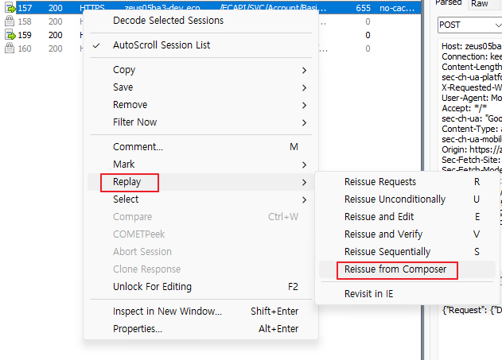
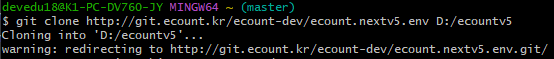

# Daily Retrospective  
**작성자**: [황주원]  
**작성일시**: [2024-12-30]  

## 1. 오늘 배운 내용 (필수)  
## Fiddler 
웹 요청을 캡처하여 요청에 대해 파악하고 디버깅을 할 수 있는 프록시 도구

### 주요기능
1) HTTPS 패킷 캡처하기 
- F12키로 캡처 옵션 ON -> 원하는 요청 테스트 -> 캡처 옵션 OFF

2) 세션 재요청 Replay 
- 요청 패킷을 사용자가 작성하여 보낼 수 있는 기능
- 마우스 오른쪽 키 -> Replay > Reissue from Composer  

🤔 reissue from composer는 그럼 어떤 의미인걸까?
> compose 는 구성하다/작곡하다 라는 의미를 담고 있다.
> 그럼 해당 구문의 의미는 재발행을 구성하다. 즉, 사용자가 요청패킷을 구성해서 재발행한다는 의미로 해석하면 될 듯 하다.

## 2. 동기에게 도움 받은 내용 (필수)
- 수경님과 간식 타임을 가졌는데 당 충전에 도움이 되었습니다.
- 강민님께서 vsix 파일 경로 잡아주는 데 도움 주셔서 감사했습니다.
- 현철님께서 Ecount Deploy Service > 메뉴 세팅 부분 알려주셔서 감사했습니다.

---

## 3. 개발 기술적으로 성장한 점 (선택)
### 1. 교육 과정 상 배운 내용이 아닌 개인적 호기심을 해결하기 위해 추가 공부한 내용

Fiddler 는 프록시 도구라고 하는데 '프록시' 의미를 정확히 알고 있지 않아 궁금했습니다.
## 프록시
- 서버와 클라이언트 사이에 중계기로서 **대리로 통신을 수행하는 것**을 '프록시', 그 중계 기능을 하는 것을 '프록시 서버'라고 부른다.

🤔 그럼 VPN이랑 비슷한거 같은데 둘 차이는 뭘까??
### 프록시와 VPN 차이
프록시 서버와 VPN(가상 프라이빗 네트워크)는 조직 내부 기업 네트워크(private 한 네트워크)와 공용 인터넷을 중개하는 기술이다.  
|  | 프록시 | VPN |
| ------ | ------- | ------- |
| 클라이언트-서버 역할 | 클라이언트-서버간의 통신을 익명화 | 클라이언트-서버간의 통신을 익명화 + 암호화 |
| 나가는 트래픽 | 정방향 프록시 서버는 나가는 트래픽을 익명화 | 나가는 트래픽을 익명화 + 암호화 |

[참고](https://aws.amazon.com/ko/compare/the-difference-between-proxy-and-vpn/)

### 2. 오늘 직면했던 문제 (개발 환경, 구현)와 해결 방법

**문제** 

git clone시 warning 표시 이후로 넘어가지 않는 문제가 있었습니다.

**원인**
원격 저장소의 주소(http://git.ecount.kr/ecount-dev/ecount.nextv5.env)가 .git 으로 끝나지 않아 발생한 것으로 파악되었습니다.

[문제 원인](https://shortcuts.tistory.com/44)

또한, 성준 책임님께서 git으로 조수가 끝나지않아서 env.git으로 리다이렉트된 것으로 무시하고 진행해도 된다고 알려주셔서 문제를 해결할 수 있었습니다.

### 3. 위 두 주제 중 미처 해결 못한 과제. 앞으로 공부해볼 내용.
- 역방향 프록시 서버에 대해 공부할 시간이 부족해 다음에는 공부해 볼 것입니다.
