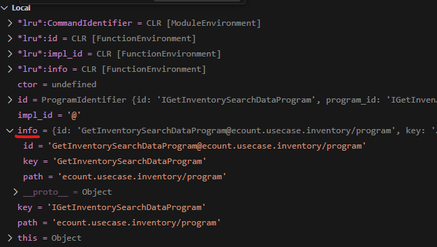

# Daily Retrospective

**작성자**: 나아연  
**작성일시**: 2024-12-30

## 1. 오늘 배운 내용 (필수)

3.0 : 윈도우
5.0 : 리눅스

ecount,common.switch...
=> https://zeus05-dev.ecount.com/ECERP/ECP/ECP050M?MENU_USER_CLOSED_YN=N&__v5domains=test&ec_req_sid=BA-ERv_21%21xNmQv%21#menuType=4&menuSeq=30&groupSeq=30&prgId=C000030&depth=2

`__v5domains=test` 파라미터 있으면 test.ecount.com

---

80000 => e zone

login.ecount.com => api /Getzone/...

logine.ecount.com

**학습키워드**
URL, PORT, DNS, localhost

## 2. 동기에게 도움 받은 내용 (필수)

민준님께서 라면 한 젓가락 나눠주셨습니다. 다음엔 제가 끓여드릴게요 ㅎㅅㅎ 반드시

---

## 3. 개발 기술적으로 성장한 점 (선택)

### 1. 교육 과정 상 배운 내용이 아닌 개인적 호기심을 해결하기 위해 추가 공부한 내용

ecount.next5 프로젝트에서 vscode 버깅을 하면서 command pattern을 적용한 것 같은 코드를 발견했다. 이전에 학습했던 command pattern은 아래처럼 직접 구현체를 실행시키는 방식이었다.

```jsx
const tv = new TeleVision();
new ToggleAction(tv).execute({});
new ChannelAction(tv).execute({ channel_number: 50 });
```

그런데 `ecount.solution/src/04.ecount.application/VeloxApps/app.inventory/src/server/action/GetInventoryDataAction.ts`에서 확인한 부분은 직접 객체를 생성하는 것처럼 보이지 않았다.

```tsx
executeSync(execution_context: IExecutionContext, data: GetInventorySetupRequestDto): GetInventorySetupResultDto {
  ...
  switch (data.menu_type) {
    ...
    case EN_MENU_TYPE.OutstandingStatusSearch:
      {
        const program = ProgramBuilder.create<GetInventorySetupRequestDto, GetInventorySetupResultDto>(
          IGetInventorySearchDataProgram,
          execution_context
        );

        result = program.execute(data);
      }

      break;
}
```

정확하지는 않지만, ProgramBuilder를 통해 GetInventorySetupRequestDto를 받아 GetInventorySetupResultDto를 반환하는 GetInventorySearchDataProgram라는 Program을 만들고 이를 execute하는 것 같다. 그런데 IGetInventorySearchDataProgram라는 인터페이스만 Builder에 넘겨주고 실제 로직 담긴 구현체는 어디서 생성하는지 알기 어려웠다.

```tsx
class DefaultProgramBuilder<TContext extends IContextBase = IExecutionContext> {
	getCtor(id: ProgramIdentifier, execution_context: TContext): any {
		const mapper = execution_context.getFeature<command.ICommandManager>(command.ICommandManager);

		const instanceTarget = mapper.getContructor<any>(id as unknown as $$svc_type) as any;

		return instanceTarget;
	}
	create<TProgramDto, TResult>(
		id: ProgramIdentifier,
		execution_context: TContext,
		configure?: IProgramConfigure
	): IBaseProgram<TProgramDto, TResult, TContext> {
		const instanceTarget = this.getCtor(id, execution_context);
		const program = new instanceTarget(execution_context);
    ...
		return program as unknown as IBaseProgram<TProgramDto, TResult, TContext>;
	}
```

ProgramBuilder를 보니 execution_context에서 생성자를 찾아오는 것 같다(`this.getCtor`). 그리고 객체를 생성(`new instanceTarget`)하여 반환한다. `getCtor`의 `mapper.getContructor`에서 조금 더 들어가보면 아래처럼 생성자를 가져오는 부분이 있다.

```jsx
  ctor = require<any>(path, true)[info.key] as ConstructorT<TCommand>;
```

아마 path에서 key와 일치하는 클래스를 찾아오는 것 같다. (사실 잘 모르겠다)
path와 key를 확인해보니 아래와 같다.



그리고 해당 key값은 아래처럼 직접 Identifier를 생성해줌으로써 지정하는 것 같다.

```jsx
export const IGetInventorySearchDataProgram = new ProgramIdentifier("IGetInventorySearchDataProgram");

export interface IGetInventorySearchDataProgram
  extends IBaseProgram<GetInventorySetupRequestDto, GetInventorySetupResultDto> {}
```

이렇게 생성한 객체를 program에 저장하고 execute까지 실행하는 게 아닐까 라고 추측했다.

### 3. 위 두 주제 중 미처 해결 못한 과제. 앞으로 공부해볼 내용.

그럼 기능을 담당하는 Interface를 생성할 때 마다 ProgramIdentifier에 인터페이스명을 직접 추가해야하는지 궁금했다.

---

작성한 거 아까워서 올립니당
