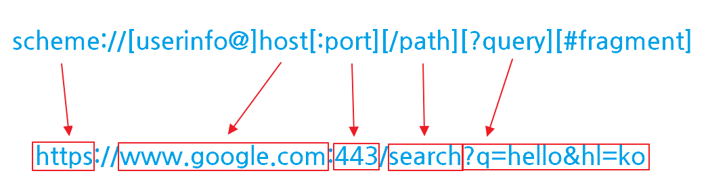

# Daily Retrospective  
**작성자**: [황주원]  
**작성일시**: [2024-12-31]  

## 1. 오늘 배운 내용 (필수)  

## URL
**URL 구성**

- 프로토콜: https
- 호스트명: www.google.com
- 포트번호: 443
- path: /search
- 쿼리 파라미터: q=hello&hl=ko

### scheme
> https://www.google.com:443/search?q=hello

여기서 'https'에 해당

- 주로 프로토콜(어떤 방식으로 자원에 접근할 것인가) 사용
- ex) http, https
- http는 80, https는 443 포트를 주로 사용

🤔 scheme 는 주로 프로토콜을 사용한다고 하는데 URL에서 나타낼 수 있는 scheme의 종류는 또 뭐가 있을까?

1) 특정 Application
    - file: 로컬 파일 시스템 접근 ex) file:///C:/Users/test.txt
    - 전화 연결 ex) tel://전화번호

2) 데이터 URL
    - ex) data:text/plain;base64,SGVsbG8sIFdvcmxkIQ==

[참고](https://inpa.tistory.com/entry/WEB-%F0%9F%8C%90-URL-%EA%B5%AC%EC%84%B1-%EC%9A%94%EC%86%8C-%EC%9A%94%EC%B2%AD-%ED%9D%90%EB%A6%84-%EC%A0%95%EB%A6%AC)

## VSCode 단축키
- 파일 찾기: Ctrl + P
- 디버깅 종료: Shift + F5
- 디버깅 현재 라인 실행, 함수 내부 타고 들어가지 않음: F10
- 디버깅 함수 내부 들어가기: F11

## 로드 밸런싱
- Scale-up: 더 빠른 동작을 위해서 하드웨어 성능을 높이는 방법
- Scale-out: 다수의 Server가 나눠서 작업을 하는 방법

ecount 는 L7 로드 밸런서를 사용한다고 한다.

### L4 및 L7 로드 밸런서
애플리케이션 계층(Layer 7)에서 작동하는 로드 밸런서로, 주로 HTTP/HTTPS 프로토콜을 기반으로 클라이언트-서버간의 트래픽을 분산시킨다.

L4 로드 밸런서는 헤더 정보만을 이용해 빠른 응답시간을 제공한다는 장점이 있다. 반면, Application 계층의 정보를 활용하지 못해 기능이 제한적이라는 단점이 있다.

L7 로드 밸런서는 요청 내용(URL, 헤더, 쿠키 등)을 기반으로 로드 밸런싱을 수행한다.  
요청 내용을 분석해 특정 서버로 전달하거나 캐싱 및 압축 등 다양한 기능을 구현할 수 있다는 장점이 있다. 반면, 패킷의 애플리케이션 계층 정보를 분석해야 하기 때문에 L4 로드 밸런서보다는 처리 시간이 오래 걸린다는 단점이 있습니다.

## 2. 동기에게 도움 받은 내용 (필수)
- 지은님과 안 되는 부분을 함께 해결해 나가며 도움이 되었습니다.
- 성철님께서 커피 사주셔서 상쾌한 오후를 시작할 수 있었습니다 :)
- 모든 동기분들이 문제가 발생하면 해결 방법을 먼저 알려주려고 하셔서 감사했습니다 ! 

---

## 3. 개발 기술적으로 성장한 점 (선택)
### 1. 교육 과정 상 배운 내용이 아닌 개인적 호기심을 해결하기 위해 추가 공부한 내용
🤔 디버깅할 때, 'debug 가능하지만 attach상태는 아닙니다.' 라고 떴는데 debug와 attach 상태가 무엇일까?

**attach 상태**
- 디버깅 도구 (ex) VSCode .. ) 가 현재 해당 프로세스에 연결(attach) 되어 있는 상태
- attach 상태에서 VSCode 로 디버깅을 다룰 수 있다. 

**디버깅 상태**
- attach 상태가 아닌 debug 가능한 상태는 디버깅 허용만 가능한 상태
- 디버깅 도구에서는 불가하고 디버깅 포트를 열어두었거나 APP || Process 가 디버깅 설정 되어 있음

 

🤔 **DB트리거**

Trigger는 방아쇠라는 의미이다. 방아쇠를 당기면 총기 내부에서 당겨지는 작업들이 진행된 뒤 자동으로 총알이 나간다.

DB에서 Trigger 는 특정 테이블에 DML(INSERT, UPDATE, DELETE) 문이 실행되었을 때, DB에서 자동으로 동작되도록 작성된 프로그램이다.

사용자가 직접 호출하는 것이 아닌 자동으로 호출하는 것이 핵심이다.

> ecount 에서는 3.0 버전의 테이블에 들어오게 되면 5.0 테이블로 데이터를 쌓도록 구현되어 있다고 한다.

### 2. 오늘 직면했던 문제 (개발 환경, 구현)와 해결 방법
1. ecount/master-hotfix에 테스트 코드가 없는 문제가 있었다.

    1-1. 성준 책임님께서 현재 테스트 프로그램은 관리가 안 되고 있어서 오류가 잘 발생하니 일단 넘어가라고 하셨다. 

2. web) 디버깅 안 되는 문제
    
    2-1. ``ecount.common.switchV5DomainGroup("test")`` 해당 커맨드 없이 진행하면 로컬로 동작하지 않음

### 3. 위 두 주제 중 미처 해결 못한 과제. 앞으로 공부해볼 내용.
- 포트
- localhost 

공부를 조금 더 깊게 하고자 합니다.
