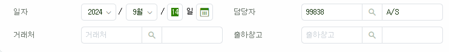
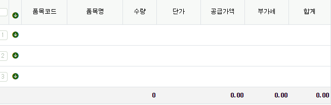

# Daily Retrospective

**작성자**: [김승준]  
**작성일시**: [2025-01-02]

## 1. 오늘 배운 내용 (필수)

### 교육 목표

-   `Framework 5.0`의 개념 이해를 통해 `실습교육`의 효과/효율을 높인다.

### `5.0` 프레임워크

-   `1.0` ~ `5.0` 까지 존재, `10.0`을 목표로
-   속성, 예외, 조건 들을 공통화, 표준화를 통해 개발 비용을 줄이기 위함.

### 웹 환경(시스템)

-   클라이언트
    -   브라우저
-   웹서버
    -   기능
-   DB서버
    -   CRUD

### [오전 숙제](#task)

**아래 요구사항을 브라우저 소스도 1개, 웹서버 소스도 1개, 테이블도 1개로 구현하려면**

공지사항

-   제목, 내용, 공지기간을 입력하고 조회 할 수 있어야 한다.

-   공지기간을 반드시 입력해야 한다

-   제목을 10글자만 입력 할 수 있다

숙제

-   제목, 내용, 과목을 입력하고 조회 할 수 있어야 한다.

-   과목을 반드시 입력해야 한다

-   제목을 입력하지 않으면 과목명을 제목으로 자동으로 입력(저장)해 준다.

-   제목은 20글자까지 입력 할 수 있다.

### [숙제에 대한 해설](#explantion)

### 용어

-   [업무=bizz](#bizz) : 공지사항, 숙제
-   [메뉴=menu](#menu) : 공지사항 입력.조회 , 숙제 입력.조회
-   데이터모델=data_model
    -   [Props](#prop) : 제목, 내용, 과목, 공지기간, 타입
-   [definition(명세서, 주민등록등본)](#definition) : 정의 ->태어나면서 생기고 변하지 않는 값
    -   ex) [bizz_definition](#bizz_definition), menu_definition, data_model_definition
    -   고유한 id(주민등록번호) : sid
        -   ex) bizz : bizz_sid,
-   [attribute (속성, 설정)](#attribute) : 바뀔수 있는 값. 필수입력, 글자수

-   [sid](#sid) : 1~9, A~W char(15) -> 3FE4RFGA78AWSKJ
    -   웹서버에서 만들어냄 (generate)
-   id : 개발자가 정해줌. -> notice, homework

## 2. 동기에게 도움 받은 내용 (필수)

-   `5.0` 용어에 대해 이해가 잘 안가는 부분이 많았는데 현철님께서 doc 링크를 공유해 주셔서 오늘 교육내용과 doc을 보며 다시한번 학습했습니다.
-   마니또 선물로 귀여운 마우스 패드와 힙한 안경닦이를 받았습니다. 감사합니다 마니또님ㅎㅎ

---

## 3. 개발 기술적으로 성장한 점 (선택)

### 앞으로 공부해볼 내용.

-   숙제의 일부분을 ecount의 코드화를 하는 과정에서 refer_type이 등장했는데

```
자리수 체크(prop)
    // 공지사항의 제목의 자리수를 알아야
    // 오너1이 공지사항, 오너2 제목
    // 자리수 → attr_id = max_length
    let 자리수 : number = attr.getValue({prop.bizz_sid, prop.prop_sid}, “max_length”)
    let data(서류.대상) = data_model.getValueByReferType(prop.refer_type)
    if(length(data) > 자리수){

    }
```

-   실제로 위와 같이 쓰이지 않을 수도 있다고 하셨지만, 위 코드에서 `prop.sid`가 아닌 `prop.refer_type`을 이용해서 값을 가져오는 이유가 아직 이해가 되지 않습니다. <br>
    이후 다은님이 기획자들도 `refer_type`에 대한 논의가 있었는데, 개발 상 필요하기 때문에 존재한다는 답변을 들었다고 했습니다.<br>
    추측해 보기에는 메서드 구성이 위 코드처럼 단순하지 않고, 같은 `refer_type`을 가지는 값들을 `data_model`에서 전부 불러오기 위함인가? 하는 생각을 했습니다.<br>
-   이에 대한 명쾌한 해답은 질문과 답변을 통해 들을 수도 있지만, 좀 더 구체적인 코드를 보거나, 개발을 진행하면서 `refer_type`의 쓰임새 등을 파악하고 싶습니다.

---

## 4. 소프트 스킬면에서 성장한 점 (선택)

하상수 부문장님께서 기능을 구현하는데 매몰되면 안되고 요구사항이 뭔지, 목표가 뭔지를 염두에 두어야한다고 말씀해주셨습니다.<br>
숙제를 기준으로 예를 들면, 소스를 한개로 구현하는데 매몰되어 단순하게 if문으로 만들어 버리면, 오히려 2개로 만들었을 때 보다 훨씬 안좋은 소스가 나오고, 최종 목표인 생산성이 떨어지는 결과가 나타납니다. <br>
물론, 이 예시는 너무 단순한 예시이기 때문에 당연하게 보이지만, 복잡한 상황일수록 단순하게 눈앞의 구현만을 볼 것이 아니라 최종적으로 구현하고자 하는 목표가 무엇인지는 상기하며 개발해야 할 것입니다.

# 학습내용

## 개념교육

1. 어떤 교육?

    - `Framework 5.0`의 개념

2. 교육의 목적

    - 다음주부터 진행할 `실습교육: 개발 방법`
    - 큰 틀의 개념을 이해 -> `실습교육`의 효과/효율을 높이기 위해

3. 방법

    - 가능하면 `기술적`요소를 뒤에 배치, `기술적`요소를 많이 배제
    - 비슷한 주제를 반복  
      넓게, 흐릿 -> 구체적, 좁게, 분명하게 -> 최종정리

## 프레임워크

-   개발자가 개발을 할 수 있도록 준비된 환경
-   개발자가 개발을 할 수 있도록 준비된 표준
-   개발자가 편하라고 미리 만들어둔 공통들

## 5.0 프레임워크

-   프레임워크 1.0 `구 프레임워크` : 공통화, 표준화 미흡, asp
-   프레임워크 2.0 `2.0` : 공통화 높이는, 표준화 높이는, asp -> asp.net(C#)
-   프레임워크 3.0 `3.0` : 공통화 높이는, 표준화 높이는, asp -> asp.net(C#), pipeLine(표준화)
-   프레임워크 4.0 `4.0` : 공통화, 속성, 예외, 조건
-   **프레임워크 5.0 `5.0` : 공통화, 속성, 예외, 조건**
-   프레임워크 10.0 `10.0` : 공통화, 속성, 예외, 조건 -- 목표

## 목표

1. 5.0은 왜 하는 것인가, 목표가 무엇인가

-   개발의 비용을 줄이기 것을 목표로 함.
    -   생산성
        -   고민, 이해, 코딩 - 설계
    -   인건비 : 개발시간

### 웹 환경 (시스템)

-   클라이언트

    -   화면
    -   브라우저
    -   서버
    -   사용자가 직접 눈으로 보면서 -> 단말기
    -   엑셀

-   웹서버
    -   기능
-   DB서버
    -   CRUD

### Task

-   어떤 기능일지에 따라 코드를 다르게 부여한다.  
    ex) 1 : 공지, 2 : 숙제
-   코드에 따라 분기 처리를 해준다.

    1. 화면

        1. 코드에 따라 보여줄 화면을 다르게 해준다  
           ex) 1일때는 공지기간을, 2일때는 과목을 보여준다.
        2. 코드에 따라 필수로 받는 입력을 다르게 한다.  
           ex) 1: 공지기간, 2: 과목
        3. 코드에 따라 제목 글자수 제한을 둔다.  
           ex) 1: 10글자, 2: 20글자

    2. 웹서버

        1. 코드가 2일때 제목이 없다면, 제목에 과목명을 넣어준다.
        2. 입력 조건을 다시 검증해준다. (1-2, 1-3)

    3. DB
        - 기능코드 : 1 or 2, not null
        - 제목 : 20글자
        - 내용
        - 과목
        - 공지기간 : Date, 시작, 끝

소스 1개라는 것이 공통적인 부분을 관리하는 것을 의미한다면?

-   각 기능들에서 공통적으로 나올 수 있는 부분을 세분화해 해당 서비스를 불러오는 형식으로 처리한다.
-   기능에 따라 코드를 부여한다는 점은 동일

    1. 화면

        1. 공간을 나눈 뒤, 해당 위치에 들어갈 내용, 구성을 상황에 맞게 가져온다.

        | 공지 |          |
        | ---- | -------- |
        | 제목 | 공지기간 |
        | 내용 |

        | 숙제 |      |
        | ---- | ---- |
        | 제목 | 과목 |
        | 내용 |

        2. 기능에 따라 입력값 제한을 둔다.
            1. 필수항목
            2. 글자수제한

    2. 웹서버

        1. 입력값 검사
            1. null(undefined, "") 값 체크
            2. 글자수 제한
        2. 제목
            1. 숙제일때 제목이 비어있다면 과목을 넣어준다.
        3. 내용
        4. 기간
        5. 과목

    3. DB
        - 기능코드 : 1 or 2, not null
        - 제목 : 20글자
        - 내용
        - 과목
        - 공지기간 : Date, 시작, 끝

### explantion

#### 기능 명세

1. UI

    - 화면에 보여지는 항목이 공지사항/숙제가 달라야 한다.

2. 서버
    1. 값을 **바꾸거나/채워주는** 처리
        - 제목이 입력되지 않으면 과목명을 제목으로 채워준다.
    2. 저장 못하게 **막아줘야** 되는 처리
        - 입력하지 않으면 저장 못한다.
        - 입력한 길이가 OO자리 수를 초과하면 저장 못한다.
3. DB
    - 한개 테이블 임에도  
      제목, 내용, 공지기간  
      제목, 내용, 과목

---

코딩 비슷하게 표현

방안1 : 고민을 전혀 하지 않았을 때의 방안
방안2 : 고민을 좀 해서, 요구사항을 만족시켰을때 방안

#### UI

-   공지사항 : html
-   숙제 : html

->
hide(서류.숨길항목)

#### 서버

-   막아줘
    제목

```
    if(공지사항 == true){
        if (length(제목)>10){
            저장 못함
        }
    } else if(숙제 == true){
        if(length(제목)>20){
            저장 못함
        }
    }
```

-> 안좋음 <br>
공지사항 | 숙제 <br>
어떤 항목 대상 <br>
몇자리

막아줘 템플릿 (공지사항)

-   게시판 종류 : 공지사항
-   대상 : 제목
-   자리수 : 10

막아줘 템플릿 (숙제)

-   게시판 종류 : 숙제
-   대상 : 제목
-   자리수 : 20

```
    if(서류.게시판종류 == "회고록"){
        저장가능
    }
    if(length(서류.대상)> 서류.자리수){
        저장못함
    }
```

-> (새로운 게시판을 만들어지더라도) 막아줘 소스를 수정할 일이 거의 없어짐.

-   채워줘

#### DB

-   공지사항 : 공지사항테이블
-   숙제 : 숙제테이블

->

-   게시판 테이블 - 제목 : 숙제, 공지사항 - 내용 : 숙제, 공지사함 - 공지기간 : 공지사항 - 과목 : 숙제<br>
    insert 게시판 테이블(제목, 내용, 공지기간, 과목, 타입) <br>
    values (@제목, @내용, @공지기간, @과목, @타입)

### bizz

업무
업무마다 업무의 목적이 있고 이에 따라 데이터의 구조, 처리방법 등이 달라집니다.<br>
ex) 재고 1 - 영업관리 - **판매**, **견적**, **구매** 등

### menu

하나의 업무 내 입력, 조회, 현황 등 다양한 메뉴가 있습니다. <br>
또한 같은 메뉴 타입에서도 목적에 따라 여러 메뉴로 구분하여 특징이 다를 수 있습니다<br>
업무를 이용 하기 위한 도구. 업무의 데이터를 사용.<br>
ex) 판매입력, 판매조회 등

### data_model

프로그램에서 다룰 항목을 정의합니다. (같은 목적을 가진 여러 항목의 묶음)

데이터모델은 데이터 항목들을 현재 상황에 맞게 재구성하기 위해 사용합니다.

ex) 판매내역 관리

-   우리는 상품을 팔면 누가 누구에게 어디에 있던 어떤 물건들을 각각 몇 개씩 얼마에 언제 판매했는지 알고 싶습니다
-   이를 위해 판매 1건당 1개의 판매 전표를 만들고, 판매내역을 모아서 조회하려고 합니다.

    판매 1건이 일어나면

    1. 일자 (언제 판매했는지), 담당자 (누가), 거래처 (누구에게), 출하창고 (어디에 있던) 로 구성된 데이터
    2. 품목코드/품목명 (어떤 물건들을), 수량 (몇 개씩), 단가/공급가액/부가세/합계 (얼마에) 로 구성된 데이터
       가 생깁니다. <br>
       이 두 종류의 데이터는 항목이 다르고 처리방법이 다르기 때문에 판매 1건을 입력하고, 조회할 때 2개의 데이터 모델이 필요합니다.

### prop

항목 (최종 데이터의 컬럼)
ex) 검색창 내 기준일자, 담당자, 거래처, 출하창고, 품목명, 수량, 단가 등

### definition

공통 기능이 동작하기 위한 정보 (인터페이스)
ex) bizz_definition, menu_definition, data_model_definition 등

#### bizz_definition

-   업무 id = `bizz_id` : 업무의 의미에 따라 id를 부여할 수 있습니다.
-   업무 sid = `bizz_sid` : 업무의 고유 sid 입니다.
-   업무 구분 = `type` : 재고, 회계, 기초코드, 게시판 등 업무 분류를 구분합니다.<br>
    업무 분류에 따라 업무 내에서 사용하는 데이터가 크게 달라질 수 있습니다.
-   속성 =`attributes` : 업무의 속성 목록입니다.
-   메뉴 = `menus` : 업무 관련 메뉴 목록입니다. <br>
    메뉴 등록 시점에 추가됩니다.
-   ...

### attribute

속성, 설정

### sid

데이터를 특정 하기 위한 Key
