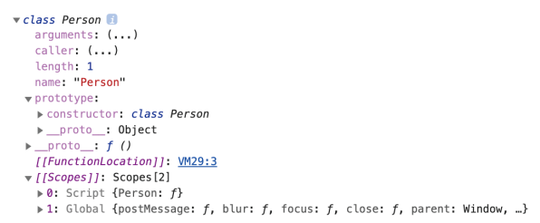
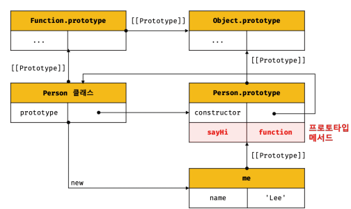
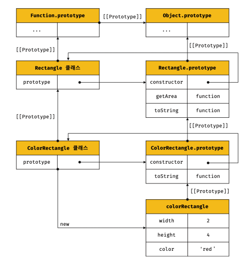

# Daily Retrospective  
**작성자**: [박성재]  
**작성일시**: [2025-01-02]  

## 1. 오늘 배운 내용 (필수)  
- 프레임워크란
- 이카운트 프레임워크 버전별 내용 요약
- 프레임워크 5.0의 목표
- 기능의 공통화에 대한 실습과제
- 5.0 프레임워크 기본 용어

</br>

## 프레임워크란
- 프레임워크는 개발자가 개발을 할 수 있도록 준비된`환경/표준`이라고할 수 있다.
- 또는 개발자가 편리하고 빠르게 개발을 할 수 있도록 미리 만들어둔 공통 틀이라고도 할 수 있다.

</br>

## 이카운트 프레임워크 버전별 내용 요약
| 프레임워크 버전 | 주요 내용                                   |
|----------------|--------------------------------------------|
| 1.0            | 공통화, 표준화 미흡, ASP 사용               |
| 2.0            | 부족했던 공통화, 표준화 수준 높임, ASP → ASP.net (C#) |
| 3.0            | 부족했던 공통화, 표준화 수준 높임, ASP.net (C#), pipeline(표준화) |
| 4.0            | 공통화, 속성, 예외, 조건                   |
| 5.0            | 공통화, 속성, 예외, 조건                   |
| 10.0(예정)           | 공통화, 속성, 예외, 조건                   |

</br>

## 프레임워크 5.0의 목표
- 개발의 비용(특히 시간 비용)을 줄여서 효율적으로 운용해나갈 수 있는 웹 서비스를 목표로 한다. 
- 더이상 판매/구매 등 특정지어서 개발하는 것이 아니라, 판매/구매 등의 특정 기능들을 공통화시켜 유지보수/신규개발 시 발생하는 리소스를 최소화하는 것이 목표이다.

## 기능의 공통화에 대한 실습과제

### 개요
비용아끼고 싶어	

화면 따로 개발하고 싶지 않야

기능도 따로 개발하고 싶지 않아

테이블도 1개만 있었으면 좋겠다

</br>

### 공지사항

제목, 내용, 공지기간을 입력하고 조회 할 수 있어야 한다.

공지기간을 반드시 입력해야 한다

제목을 10글자만 입력 할 수 있다


### 숙제

제목, 내용, 과목을 입력하고 조회 할 수 있어야 한다.

과목을 반드시 입력해야 한다

제목을 입력하지 않으면 과목명을 제목으로 자동으로 입력(저장)해 준다.

제목은 20글자까지 입력 할 수 있다.


### 과제 내용

위 요구사항을 브라우저 소스도 1개, 웹서버 소스도 1개, 테이블도 1개로 구현하려면

어떤 방법으로 개발 할 수 있을까?

</br>

## 해결방안 : 통합 게시판 시스템
공지사항, 숙제 등의 기능들은 모두 일련의 게시판 기능으로 여겨질 수 있습니다. 따라서 이러한 게시판의 특성을 가진 기능들에 대해 통합적으로 관리 가능한 통합 게시판 시스템 구축이 가능할 것으로 생각되었습니다. 통합 게시판 시스템 구축과정은 크게 3가지 과정이 필요합니다.

### 1. 통합 게시판 테이블 설계/구현

```sql
Post {
  id: number;
  title: string;
  content: string;
  boardType: BoardType; // 게시판 타입 (공지사항, 숙제 등)
  status: string; // 상태 (활성, 비활성 등)
  attributes: JsonObject; // 게시판 타입별 추가 필드를 유연하게 저장
  createdAt: Date;
  updatedAt: Date;
}
```
- id, title과 같은 공통필드들은 일반적인 컬럼으로 관리합니다.
- boardType이라는 컬럼을 통해 각 게시판의 종류를 구분합니다.
- 각 게시판별 특화된 데이터들이 있을 것인데, 이는 Json 타입을 통해 객체화하여 유연하게 관리할 수 있습니다.

### 2. 통합 게시판 공통 백엔드 로직 설계/구현

```javacript
// 게시판 타입 정의
enum BoardType {
  NOTICE = 'NOTICE',
  HOMEWORK = 'HOMEWORK',
  // 추가 타입들은 여기에 쉽게 확장 가능
}

// 2. 백엔드 API 설계
class BoardController {
  // 게시글 조회 
  async getPosts(boardType: BoardType, query: QueryParams) {
    const posts = await Post.find({
      where: { 
        boardType,
        // 타입별 추가 필터링 조건
        ...this.getBoardTypeSpecificFilters(boardType, query)
      }
    });
    
    return this.transformResponse(posts, boardType);
  }

  // 게시글 생성
  async createPost(boardType: BoardType, data: CreatePostDto) {
    // 타입별 유효성 검증
    this.validateByBoardType(boardType, data);
    
    const post = await Post.create({
      ...data,
      boardType,
      attributes: this.extractTypeSpecificFields(boardType, data)
    });
    
    return post;
  }

  // 게시판 타입별 특수 필드 처리
  private extractTypeSpecificFields(boardType: BoardType, data: any) {
    switch(boardType) {
      case BoardType.NOTICE:
        return {
          importance: data.importance,
          startDate: data.startDate,
          endDate: data.endDate
        };
      case BoardType.HOMEWORK:
        return {
          dueDate: data.dueDate,
          maxScore: data.maxScore,
          submitType: data.submitType
        };
      default:
        return {};
    }
  }
}
```
- 공통 컨트롤러를 통해 모든 게시판류의 CRUD를 공통화합니다.
- 위 예시에서는 컨트롤러에 로직이 존재하지만, 실제로는 서비스 로직, DB 액세스 등 분리되어 코드가 작성될 수 있습니다.
- 게시판의 종류별로 고유의 로직들이 존재할 수 있습니다. 해당 코드들은 분리되어 독립적으로 추가되게됩니다. 하지만 이를 추상화하여 모두 동일한 인터페이스 혹은 함수를 사용되게 되도록 구현할 수 있다면 더 좋을 것 같습니다.
- Validation/Permission 관련 로직을 추상화하여 동일하게 사용될 수 있도록 구현하되, 게시판 종류가 추가되면 독립적으로 추가될 수 있도록 구현합니다.

### 3. 통합 게시판 테이블 설계/구현
```javascript
// 3. 프론트엔드 구현
class BoardComponent {
  // 게시판 설정 정의
  private boardConfigs = {
    [BoardType.NOTICE]: {
      columns: ['title', 'importance', 'startDate', 'endDate'],
      validations: [/* 공지사항 관련 유효성 검증 규칙 */],
      permissions: [/* 공지사항 관련 권한 설정 */]
    },
    [BoardType.HOMEWORK]: {
      columns: ['title', 'dueDate', 'maxScore', 'submitType'],
      validations: [/* 숙제 관련 유효성 검증 규칙 */],
      permissions: [/* 숙제 관련 권한 설정 */]
    }
  };

  render() {
    const config = this.boardConfigs[this.props.boardType];
    
    return (
      <div>
        <BoardList 
          columns={config.columns}
          data={this.state.posts}
          permissions={config.permissions}
        />
        <BoardEditor
          validations={config.validations}
          onSubmit={this.handleSubmit}
        />
      </div>
    );
  }
```
- UI의 공통부분과 기능별 특화부분을 분리하여 관리합니다.
- 기능별 특화부분은 신규 게시판 종류가 추가되면 필요한 UI, 유효성 및 권한 등의 통합적인 설정을 독립적으로 추가할 수 있습니다.
- 즉, 설정기반 렌더링으로 작업량을 축소할 수 있을 것으로 기대됩니다.

### 개발자 To Do
위와 같은 방식으로 개발 진행 시, 개발자가 할 일은 크게 두가지입니다.

#### 1. 통합게시판 초기 공통 테이블, 공통 백엔드, 공통 프론트 설계/구현
#### 2. 새 게시판 타입 추가 시 그에 특화된 로직들 추가
- BoardType enum에 새로운 타입 추가
- (BE) 해당 게시판 타입에 특화된 특수 로직 추가
- (BE) 해당 게시판 타입에 맞춘 Validation, Permission 처리 추가
- (FE) 설정 로직에 새로운 타입에 대한 설정 추가(유효성, 권한 등 포함)

### 기대 효과
1. 게시판류의 기능들이 추가될 때, 해당 게시판에 특화된 설정/로직들만 추가하면 되기에 개발자의 작업량을 크게 감소시킬 수 있을 것입니다.
2. 책임을 명확하게 분리하여, 유지보수 시 수정해야할 위치를 최소화시킬 수 있습니다.
3. 게시판 타입별로 커스터마이징에도 용이한 방식이라고 생각합니다.
4. 모두 동일한 패턴으로 기능을 구현하기에, 개발자의 학습 곡선이 감소하며 버그 발생 가능성이 낮아질 것으로 기대됩니다.

</br>

## 5.0 프레임워크 기본 용어

### 1. bizz
- 업무
- 예) 판매, 견적, 구매 등

### 2. menu
- 메뉴
- 업무를 이용하기위한 도구
- 5.0에서는 중요한 지위(책임의 크기)를 부여하지 않고자 한다.
- 예) 판매입력, 판매조회 등

### 3. sid
- 데이터를 특정하기 위한 우리만의 Key
- 데이터 구조를 통일시키기위한 목적으로 사용한다.
- 예) bizz_sid, menu_sid, record_sid, data_sid, tenant_sid, user_sid 등

### 4. definition
- 명세서
- 사람으로 비유할때, 주민등록등본과 같은 개념
- 공통 기능이 동작하기 위한 정보이며, 기능을 가지지는 않는다.
- 예) bizz_definition, menu_definition, data_model_definition 등

### 5. data_model_template
- 데이터(전표)를 담는 그릇의 합집합 및 템플릿
- 예) 재고싱글, 재고멀티 등

### 6. data_model
- data_model template을 활용해, 메뉴타입별로 세분화 됨
- 예) 재고싱글-입력, 재고싱글-조회, 재고싱글-조회서치 등

### 7. object
- data_model의 항목 중 해당 업무에서 사용하고자하는 항목을 특정하는 역할
- 예) 판매입력 master, 판매입력 detail, 판매조회 master 등

### 8. table_model
- db 테이블과 짝을 이루는 데이터 담는 그릇
- db 처리를 할때만 사용됨
- db 테이블과 일치해야함.

### 9. refer_type, data_type, prop_id
| 항목       | data_type | 의미->refer_type | prop_id->prop_sid |
|------------|-----------|------------------|-------------------|
| 거래처     | 코드형    | 거래처           | 거래처                  |
| 품목       | 코드형    | 품목             | 품목                  |
| 추가항목코드형   | 코드형    | 추가항목코드형         | 추가항목코드형                  |
| 수량       | 숫자형    | 수량             | 수량              |
| 단가       | 숫자형    | 단가             | 단가              |
| 공급액     | 숫자형    | 공급액           | 공급액            |

## 느낀점
5.0 프레임워크를 본격 시작하게된 첫 교육입니다. 전체적으로 어떤 지점을 목표로하는 것인지는 다소 느낄 수 있었지만, prop, data model 등 구체적인 용어에 대한 설명이 들어가니 아직 이해가 어려운 상태입니다.

내일까지 개념 교육을 수강하더라도, 온전하게 이해하는 것은 어려울 것으로 예상되며 프레임워크 실습을 해나가면서 또한 부서 배치를 받고나서 실무를 해나가면서도 꾸준히 고민해봐야할 주제인 것 같기도 합니다.

쉽지않을 여정으로 예상되지만, 체계적으로 교육사항들을 전달해주시려는만큼 저도 최선을 다해서 앞으로 교육에 임해보겠습니다.

## 2. 동기에게 도움 받은 내용 (필수)

#### 최현철 선임
교육 중 세부적인 이해가 어려웠는데, 용어에 대해 세부적으로 이해하는데 도움이 될만한 자료를 공유해주셔서 도움이 되었고 감사합니다.

---

## 3. 개발 기술적으로 성장한 점 (선택)
아래의 3가지 주제 중 하나를 선택하여 작성합니다.

### 1. 클래스란 결국 무엇인가, Ts에서 타입의 의미 다시 살펴보기

</br>

### Js에서 클래스란 결국 무엇일까?
결론부터 얘기하자면 Js에서 클래스란 결국 하나의 `생성자 함수`입니다. 물론 정의 방식이나 내부적으로 돌아가는 방식은 다소 차이가 있지만, Js에서 클래스는 `생성자 함수`와 동일한 취급을 받습니다. 

```javascript
class Person {
 // 생성자
    constructor(name) {
 // 인스턴스 생성 및 초기화
        this.name = name;
    }
}

console.log(typeof Person); // function
console.dir(Person);
```
위 코드의 결과를 보면 Person이라는 것은 하나의 함수로 취급된다는 것을 알 수 있습니다. 더 자세히 살펴보기 위해, 크롬 개발자도구에서도 살펴보겠습니다.


- 그림을 보면 Person에는 모든 함수 객체가 가지고 있는 `prototype` 프로퍼티를 가지고 있는 것을 알 수 있습니다. 
- 해당 프로퍼티에는 Person과 함께 존재하게되는 프로토타입 객체가 가리켜집니다. 
- 그리고 해당 프로토타입 객체의 `constructor` 프로퍼티에는 Person 클래스 자신을 가리키고 있습니다. 이는 클래스가 인스턴스를 생성하는 `생성자 함수`라는 것을 의미합니다. 즉, `new` 연산자와 함께 `Person`을 호출하면 클래스는 생성자함수로써, `Person.prototype`이라는 프로토타입을 원형으로하는 인스턴스를 생성하게되는 것입니다.
- 물론 클래스가 생성자 함수와 정확하게 일치하는 것은 아닙니다. 예를들어 클래스는 생성자함수와 달리 일반 함수로 호출할 수 없습니다. 또한 보다 견고한 특징들을 가지고 있지만, 두 차이를 비교하는 내용은 범위를 벗어나므로 생략하도록 하겠습니다.

</br>

### 클래스의 인스턴스 생성
클래스 자체에 대해 보다 이해하기 위해 클래스를 통한 인스턴스의 생성 과정을 정리해보겠습니다.

```javascript
class Person {
 // 생성자
    constructor(name) {
 // 인스턴스 생성 및 초기화
    this.name = name;
 }
 // 프로토타입 메서드
    sayHi() {
        console.log(`Hi! My name is ${this.name}`);
 }
}
const me = new Person('Lee');
me.sayHi(); // Hi! My name is Lee
```

#### 1. 인스턴스 생성과 this 바인딩
- new 연산자와 함께 클래스를 호출하면 `constructor` 내부 코드가 실행 되기 전, 암묵적으로 빈 객체가 생성됩니다. 이 빈 객체가 바로 클래스가 생성한 인스턴스의 정체입니다.
- 이 때 클래스가 생성한 인스턴스의 프로토타입으로 클래스의 `prototype` 프로퍼티가 가리키는 객체가 설정됩니다.
- 그리고 암묵적으로 생성된 빈 객체인 인스턴스는 `this`에 바인딩됩니다. 따라서 `constructor` 내부의 `this`는 클래스가 생성한 인스턴스를 가리키게 됩니다.

#### 2. 인스턴스 초기화
`constructor` 내부 코드가 실행되어 `this`에 바인딩되어 있는 인스턴스를 초기화합니다. 즉, `this`에 바인딩되어 있는 인스턴스에 프로퍼티를 추가하고, `constructor`가 외부에서 인수로 전달받은 초기값으로 인스턴스의 프로퍼티 값을 초기화합니다. 만약 `constructor`가 생략되었다면 이 과정은 생략됩니다.

#### 3. 인스턴스 반환
- 클래스의 모든 처리가 끝나면 완성된 인스턴스가 바인딩된 this가 암묵적으로 반환됩니다.
- 참고로 클래스에서 정의한 함수 `sayHi`는 인스턴스 객체의 함수가 아니라, 인스턴스의 프로토타입 메서드입니다. 인스턴스 객체는 프로토타입의 메서드를 상속받아 그대로 사용할 수 있습니다.

위 과정을 통해 생성된 프로토타입 체인을 그림으로 살펴보면 아래와 같습니다.



</br>

### 상속된 클래스의 인스턴스 생성
이번에는 상속 관계에 있는 두 클래스가 어떻게 협력하며 인스턴스를 생성하게되는지 살펴보겠습니다.
```javascript
// 수퍼클래스
class Rectangle {
    constructor(width, height) {
        this.width = width;
        this.height = height;
 }
 getArea() {
    return this.width * this.height;
 }
 toString() {
    return `width = ${this.width}, height = ${this.height}`;
 }
}
// 서브클래스
class ColorRectangle extends Rectangle {
    constructor(width, height, color) {
        super(width, height);
        this.color = color;
 }
 // 메서드 오버라이딩
 toString() {
    return super.toString() + `, color = ${this.color}`;
 }
}
const colorRectangle = new ColorRectangle(2, 4, 'red');
console.log(colorRectangle); // ColorRectangle {width: 2, height: 4, color: "red"}
// 상속을 통해 getArea 메서드를 호출
console.log(colorRectangle.getArea()); // 8
// 오버라이딩된 toString 메서드를 호출
console.log(colorRectangle.toString()); // width = 2, height = 4, color = red
```
서브 클래스 ColorRectangle이 new 연산자와 함께 호출되면 다음 과정을 통해 인스턴스를 생성합니다.

#### 1. 서브클래스의 super 호출
- Js 엔진은 클래스 평가 시 수퍼클래스와 서브클래스 구분을 위해 수퍼클래스는 `base`, 서브 클래스는 `derived`를 값으로 갖는 내부 슬릇 [[ConstructorKind]]를 갖습니다. 
- 이를 통해 수퍼클래스와 서브클래스는 new 연산자와 함께 호출되었을 때의 동자이 구분됩니다.
- 서브클래스가 `new` 연산자와 함께 호출되고 <U>**자신이 직접 인스턴스를 생성하지 않고, 수퍼클래스에게 인스턴스 생성을 위임**</U>합니다.
이 때문에 서브클래스 `constructor` 내부에 `super` 호출이 없으면 에러가 발생합니다.
- 만약 서브클래스에 `constructor` 메서드 정의가 생략되면 암묵적으로 `super(...args)`를 호출하는 `constructor`를 생성하여 사용하게됩니다.

#### 2. 수퍼클래스의 인스턴스 생성과 this 바인딩
- 서브클래스의 `super`가 호출되고, 수퍼클래스의 `constructor`가 호출됩니다. 
- 수퍼클래스의 `constructor` 내부 코드가 실행되기 이전, 암묵적으로 빈 객체를 생성합니다. 이 객체가 클래스가 생성한 인스턴스입니다.
- 해당 빈 객체가 `this`에 바인딩됩니다. 따라서 수퍼클래스의 `constructor` 내부의 this는 생성된 인스턴스를 가리킵니다.
- 이 때 인스턴스는 수퍼클래스가 생성한 것이지만, `new` 연산자와 함께 호출된 함수를 가리키는 `new.target`은 서브클래스를 가리킨다. 이때문에 인스턴스를 생성한 주체가 서브클래스가 생성한 것으로 처리가된다.
- 따라서 생성된 인스턴스의 프로토타입은 서브클래스의 `prototype` 프로퍼티가 가리키는 프로토타입 객체가 된다.

#### 3. 수퍼클래스의 인스턴스 초기화
수퍼클래스의 `constructor`가 실행되어 `this`에 바인딩되어 있는 인스턴스를 초기화한다.

#### 4. 서브클래스 constructor로의 복귀와 this 바인딩
- `super`의 호출이 종료되고 제어 흐름이 서브클래스 `constructor`로 돌아온다.
- 이 때 `super`가 반환한 인스턴스가 `this`에 바인딩된다.
- 서브클래스는 별도의 인스턴스를 생성하지 않고 `super`가 반환한 인스턴스를 `this`에 바인딩하여 그대로 사용한다.

#### 5. 서브클래스 인스턴스 초기화
- `super` 호출 이후 서브클래스의 `constructor`에 기술되어 있는 인스턴스 초기화가 실행됩니다.
- `super`가 호출되지 않으면 인스턴스가 생성되지 않고, `this`바인딩도 이루어지지 않기 때문에 서브클래스의 `constructor` 내부의 인스턴스 초기화는 반드시 `super` 호출 이후에 처리되어야만 합니다.

#### 6. 인스턴스 반환
클래스의 모든 처리가 끝나면 완성된 인스턴스가 바인딩된 `this`가 암묵적으로 반환됩니다.

위 과정을 거쳐 생성완료된 클래스의 프로토타입 체인을 그림으로 봐보겠습니다.



</br>

### instance of 의미 살펴보기
이쯤에서 `instance of` 의 의미를 다시한번 살펴보겠습니다.
```javascript
object instanceof constructor;

// 아래는 설명
object:
판별할 객체.

constructor:
판별 목표 함수.
```
- 위 설명을 보면 우측의 `constructor` 위치에는 함수를 받는다고 나와있고, `object` 객체의 프로토타입 체인을 계속 거슬러 올라가며 `constructor`의 프로토타입에 해당하는 프로토타입이 있는지 확인합니다.
- 즉, 해당 인스턴스의 생성과정에 `constructor`라는 생성자 함수와 함께 존재하게되는 그 프로토타입 객체가 사용이 되어졌는지 여부를 묻는 기능이라고 할 수 있습니다.

#### 상속관계를 가진 클래스들이 존재하고, 구별할 때 instance of를 써도 될까?
결론은 instance of를 통해, 현재 들어온 객체가 서브클래스인지 수퍼클래스인지 구별은 불가능하다.
```javascript
class Person {
    constructor(name) {
        this.name = name;
    }
}
const me = new Person('Lee');
// Person.prototype이 me 객체의 프로토타입 체인 상에 존재하므로 true로 평가된다.
console.log(me instanceof Person); // true
// Object.prototype이 me 객체의 프로토타입 체인 상에 존재하므로 true로 평가된다.
console.log(me instanceof Object); // true
```
- me 객체를 생성하게되면 me 객체의 프로토타입은 `Person.prototype`이 되고,
 `Person.prototype`의 `prototype`은 `Object.prototype`이 된다.
- 따라서 `Person`과 `Object` 모두 체크를 통과하게 된다. 명확히 어떤 클래스로 생성했는지 (타입체크) 판별은 불가능하다는 얘기다.

#### 그렇다면 상속관계 가진 클래스들 명확히 타입체크하려면 어떻게해야할까?
```typescript
public static remove(officer: PublicOfficer): void {
        // officer 제거
        let findIdx = -1;
        const length = this.officers.length;
        for(let i=0; i<length; i++) {
            const current = this.officers[i];
            // TODO: 타입체크 추가(아직 못함)
            if(current && current instanceof officer.constructor && current.name === officer.name) {
                findIdx = i;
                break;
            }
        }

        if(findIdx && findIdx != -1)
            this.officers.splice(findIdx, 1);
    }
```
- 위 코드는 Generic 실습 때 구현하던 코드의 일부입니다.
- 매개변수로 받는 `officer`는 `PublicOfficer` 타입이며, 이는 수퍼클래스로, `PublicOfficer`를 상속받는 타입이 여러개 존재하며 동일성 체크를 위해 인자로 들어온 `officer`가 어떤 서브클래스인지 명확히 알 필요가 있었습니다.
- 위에서는 기존 저의 코드로 `instance of`를 사용하고 있습니다. 현재 상황에서는 해당 방식으로도 사용이 가능합니다.
왜냐하면 `officer`이 매개변수로 들어온 시점에서는 이미 하나의 완성된 객체라는 의미이고, `PublicOfficer`는 추상클래스입니다.
따라서 완성된 객체라는 의미는 `PublicOfficer`를 상속받은 객체 중 하나임을 의미하므로, 완성된 상태의 `current`와 온전히 동일한 타입을 가진 경우(프로토타입 객체가 일치하는 경우)에만 체크가 통과되므로
타입체크의 방법으로서 현재 상황에 사용이 가능합니다.

</br>

하지만, 보다 직관적으로 **타입이 일치하는가**를 확인하려면 아래와 같이 타입체크하는 것이 보다 명료하게 가능합니다.
```typescript
//... 타입체크 코드만 발췌
current.constructor.prototype === officer.constructor
//...
```
- `PublicOfficer`를 상속받은 객체들은 프로토타입 체인 상위에 모두 `PublicOfficer`를 가지고 있습니다.
- 하지만, `PublicOfficer`를 상속받은 객체들 각자 고유의 프로토타입들이 존재하고 이는 독립적으로 구별이 가능합니다.
- 따라서 보다 직관적으로 타입체크를 하려면, 해당 객체의 생성자를 이용해 프로토타입으로 타입체크를 하는것이 좋은 방법이라고 생각합니다.

</br>

### Ts에서 타입이란?
지금까지 정리해본 프로토타입과 클래스의 개념에대한 이해를 토대로 Js를 사용하는 Ts에서 타입이란 무엇인지 다시 정의해보겠습니다.

- Ts에서 타입이란 `값의 집합`을 의미합니다. 
- 값에는 크게 `원시타입`과, `비원시타입`이 존재하는데 비원시타입인 객체의 경우 그 `구조가 동일한 경우 동일한 타입`으로 취급될 수 있습니다.
- 만일 `인스턴스`를 기준으로 그 타입의 동등성을 비교하기 위해서는 해당 인스턴스의 `바로 상위의 프로토타입`을 통해 비교하는 것이 가장 명료한 방법이라고 할 수 있습니다.

### 후기
Js에서 클래스란 무엇인지와 Ts에서 Type이란 무엇인지 저 나름대로 결론을 내어봤습니다. 이것이 확실하고, 불변의 여지가 없다고는 아직 단언은
못하겠습니다. 해당 방식을 통해 교육을 받고, 개발해나가면서 틀린점들이 발견된다면 그때그때 수정해서 다시 이해한 바를 정립해나갈 예정입니다.

