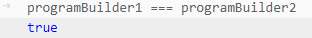

# Daily Retrospective

**작성자**: 고건호
**작성일시**: 2025-01-03

## 1. 오늘 배운 내용

- TypeScript의 전역 스코프
- TypeScript의 모듈 캐싱

### TypeScript의 전역 스코프

5.0 소스 코드를 보다보니 Java와는 다른 TypeScript의 모듈 구조에 대한 이해가 필요할 것 같아 어제 학습의 연장선 느낌으로 혼자 정리를 해봤습니다.

```typescript
// index.ts

const greeting: string = "Hello, TypeScript!!";
console.log(greeting);
```

`index.ts`에 위와 같은 코드를 작성하고

```typescript
// foo.ts

const greeting: string = "KOKEONHO";
console.log(greeting);
```

`foo.ts`에 이런 코드를 작성하면 `foo.ts`의 `greeting` 부분에 아래와 같은 에러가 발생합니다.

```plain
블록 범위 변수 'greeting'을(를) 다시 선언할 수 없습니다.ts(2451)
```

이런 에러가 발생하는 이유는 TypeScript에서는 기본적으로 파일마다 독립적인 스코프가 존재하지 않기 때문입니다.

`index.ts`와 `foo.ts` 파일은 모두 **전역 스코프(Global Scope)**에서 동작하고 있습니다.

따라서 두 파일의 `greeting` 변수가 같은 전역 스코프에 존재하며 변수 이름 충돌이 발생한 것입니다.

Java에서는 클래스나 메서드 내부에 변수를 선언하므로 로컬 스코프에 의해 이름 충돌이 방지되지만, TypeScript에서 **모듈(module)** 개념을 명시적으로 사용하지 않으면, 파일이 전역 스코프에서 동작하기 때문에 충돌이 발생합니다.

TypeScript에서는 다음과 같이 파일에 `import`와 `export` 키워드를 추가하는 **모듈화** 과정을 거쳐 변수나 함수가 전역으로 노출되지 않게 보호할 수 있습니다.

```typescript
// index.ts

export const greeting: string = "Hello, TypeScript!!";
console.log(greeting);
```

```typescript
// foo.ts

export const greeting: string = "KOKEONHO";
```

`export` 키워드가 붙은 두 `greeting`은 **전역 스코프**에 놓이지 않고 **모듈 스코프**로 한정됩니다. 그래서 동일한 이름의 `greeting`끼리 충돌이 발생하지 않는 것입니다.

### TypeScript의 모듈 캐싱

TypeScript의 모듈 시스템에서 모듈은 기본적으로 한 번만 로드되고 실행됩니다.

여러 번 모듈을 불러와 사용하더라도 해당 모듈은 최초 호출 시에만 로드되고 실행된다는 것을 의미합니다.

만약 매번 호출할 때마다 모듈을 실행시키는 방식이라면 메모리 사용이 불필요하게 늘어날 수 있기 때문에 이런 방식을 도입한 것으로 판단했습니다.

어제 개인 학습에서 5.0에서도 막연히 모듈 캐싱이 일어날 것이라고 생각하고 회고록을 작성 했는데, 오늘 학습하다보니 모듈 캐싱이 환경 마다 다를 수 있다는 점을 알게되었습니다. 그래서 로컬에서 서버를 띄워서 이를 테스트 해볼 수 있는지 확인해봤습니다.

(아직 테스트나 디버깅을 이런 식으로 하면 되는 것이 맞는건지 잘 모르는 채로 진행하는 것이라 틀린 내용이라도 일단 기록에 남겨 놓는 것이 좋을 것 같아 회고록에 기록하게 됐습니다. 틀린 부분이 있다면 지적해주시면 감사하겠습니다!)

우선 `GetInventoryDataAction.ts`의 `executeSync()` 함수 내부에서 다음과 같이 `ProgramBuilder` 객체를 선언해줬습니다.

```typescript
executeSync(execution_context: IExecutionContext, data: GetInventorySetupRequestDto): GetInventorySetupResultDto {
		let result = {} as GetInventorySetupResultDto;

		const programBuilder1 = ProgramBuilder;
		const programBuilder2 = ProgramBuilder;

    // 이하 생략
}
```

그리고 `executeSync()` 함수에 브레이크 포인트를 설정해주고 디버깅을 했고, 도중에 디버그 콘솔에서 비교 연산식을 입력하니 다음과 같은 결과를 확인할 수 있었습니다.



동등 비교 연산식의 결과 `true`가 반환되는 것을 확인했고, 1차적으로 `programBuilder1`과 `programBuilder2`가 같은 객체라는 것을 알 수 있었습니다.

또 확인하고 싶었던 것은

```typescript
const form_type_program = ProgramBuilder.create<
  V3FormTypeMapperRequestDto,
  string
>(IGetV3FormTypeMapperProgram, execution_context);
```

위 코드의 `create()` 함수 내부에서 디버그 콘솔을 통해 `this`를 호출하여 `programBuilder1`이나 `create()` 내부에서 선언해준 `programBuilder3`와 비교해보고 싶었는데, 아직 동작 방식이라든지 TypeScript에서 모르는 부분들이 너무 많아 실제로 디버깅을 해보지는 못 했습니다.

## 2. 동기에게 도움 받은 내용

오늘 아침에 승준님, 연아님, 강민님과 3층에서 담소를 나눴습니다. 어제 회식에 연아님이 참여하지 못하셔서 어떤 일들이 있었는지를 얘기하며 즐거운 시간을 보낼 수 있었습니다.
4시에 강민님과 3층에 내려갔는데 성철님 다은님 연아님 주원님 수경님이 파티를 하고 계셔서 같이 파티를 했습니다. 즐거웠습니다.

5.0 프레임워크를 디버깅 해보던 중, 빌드가 제대로 실행되질 않아서 골머리를 앓고 있었는데 강민님께서 친절히 무엇이 문제인지 함께 알아봐주셨습니다. 결국 문제는 Ecount Dev Tools 익스텐션이 설치되지 않아 발생하던 문제였고, 이를 해결할 수 있었습니다.

---

## 3. 개발 기술적으로 성장한 점

### 1. 교육 과정 상 배운 내용이 아닌 개인적 호기심을 해결하기 위해 추가 공부한 내용

모듈 캐싱이 5.0 프레임워크에서도 동작하는지 확인하기 위해 디버깅에 시간을 쏟았고, 디버그 콘솔에 조금 익숙해질 수 있었습니다.

특히 디버그 콘솔에서 직접적인 연산자 사용이 가능하다는 것을 오늘 처음 알았고, 앞으로 디버깅 시 유용하게 활용할 수 있을 것 같다고 느꼈습니다.

### 2. 오늘 직면했던 문제 (개발 환경, 구현)와 해결 방법

오늘 디버깅을 하며 모듈 캐싱을 확인하기 위해 코드를 수정하고 빌드를 하려는데, TS Builder의 버전이 2.6.25였던 탓에 계속 빌드가 실패했습니다.

개발 환경 설정 과정에서 혹시라도 놓친 부분이 있는지 처음부터 단계별로 확인해봤고, 결과적으로 TS Builder를 3.0.0 버전으로 업그레이드 했고 수정한 코드의 빌드를 원활히 진행할 수 있었습니다.
