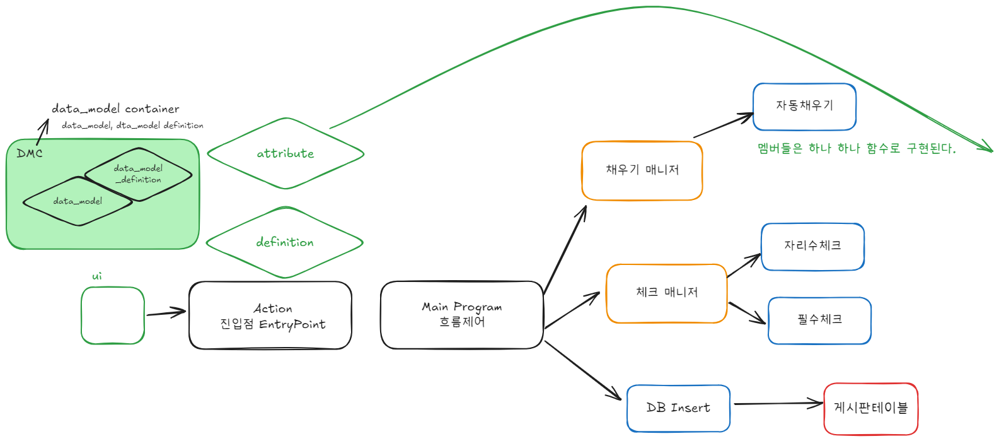

# Daily Retrospective  
**작성자**: [김민준]  
**작성일시**: [2025-01-03]  

## 1. 오늘 배운 내용 (필수)  

**5.0의 목적**
- 개발 비용을 줄이기 위해서
- 예전 소스 코드에는 모든 기능에 대해서 직접 하나하나씩 개발해야했음
    - 5.0을 통해 공통되는 부분은 최대한 묶어서 개발함으로써 
    - 개발 시간을 줄일 수 있음.

**용어 다시 정리**
- definition
    - 생성될 때 부터 생기는 정보 (id, sid 등등)
    - 주인: bizz, menu, data_model(prop)
- attribution
    - 생성된 후 바뀔 가능성이 있는 정보 (max_length, 필수 값 등등..)
    - 주인: bizz, menu, data_model(prop), 개인, 회사
- data_model
    - UI, 웹서버에서 사용하는 객체
- object
    - 데이터 모델을 이렇게 쓰고 싶다. 쓰고 싶은 prop을 고를 수 있음.
- table_model
    - db와 소통하기 위해 사용되는 객체    

**예시**
```javascript
// 자리수체크 소스는 1개만 있어야 한다. 다시말해, 제목전용, 내용전용의 자리수 체크가 있어선 안된다.
// 공지사항의 제목은 자리수 10자리, 숙제의 제목은 자리수20자리로 체크
// 자리수체크는 입력항목의 length가 자리수 속성값보다 크다면 저장 x
// 저장을 할 수 있으면 true를 아니면 return, 

자리수체크()
// 나를 호출한 업무가 공지사항인지 숙제인지 알아야한다 => bizz definition
// 나를 호출한 항목이 무엇인지 알아야한다 => data_model definition
// 자리수속성값을 알아야한다. 몇 자리로 설정했는지. 몇자리로 체크해야되는지 => attribute
// 항목의 값(데이터) 제목에 입력된 값 => data_model

var prop = 업무.data_model_definition.props[제목];
var 데이터 = data_model.getValue(prop.refer_type)

if(제목의 길이 > 자리수속성값) {
    return false
}
```

**ref_type**
- id 값은 바뀔 수 있다 하지만 똑같은 값을 참조해야된다면 어떻게 될까?
- id가 제목이고 같은 데이터베이스 컬럼을 참조한다면 id 값을 수정한다면 모든 같은 값을 참조하기 어렵다
- id를 수정하더라도 참조할 수 있도록 하는 변수가 필요하다. ref_type을 나둠으로써 id는 유연하게 값을 바꿀 수 있고 참조는 ref_type을 통해서 하면 되는 것이다.

```javascript
// 제목과 실제 참조하는 prop의 이름은 다를 수 있다.
// 그래서 제목을 통해 definition 을 통해 제목에 대한 prop 정보를 가져온 후
var prop = 업무.data_model_definition.props[제목];
var 데이터 = data_model.getValue(prop.refer_type)
```
 
**5.0 기본 구조**


- Action이 진입점이 되고 Program이 흐름제어를 담당한다.
- 프로그램이 채우기, 유효성 검사, DB 작업 등 여러 작업을 수행하게 됨
- 체크의 경우 자리수 체크, 필수 체크 등 공통 되는 작업으로 보여 체크 매니저라는 객체가 체크 관련 로직을 관리하게 된다. 

**dmc**
- dataModel과 DataModel Definition의 집합을 말한다.
    - DataModel: 우리가 필요한 데이터를 저장하고
    - DataModel Definition: 그 데이터를 어떻게 다룰지에 대한 규칙

**single과 multi**

`single`
| tenant_sid | No   | title     | content    | notice_limit | class      | bizz_sid | data_model_sid |
|------------|------|-----------|------------|--------------|------------|----------|----------------|
| 80000      | 1    | 새해공지  | 감기조심   | 2025.02.28   | null       | 공지사항   | single         |
| 80000      | 2    | 개념숙제  | ….        | null         | 개념       | 숙제       | single         |

- 회사 번호와 No, bizz_sid 3개로 기본키를 이루는 것은 비효율적이다.
- 인조식별자를 사용하자 $\to$ data_sid
- data_sid를 통해서 row를 유일하게 식별할 수 있다.

`multi`

| data_sid | tenant_sid | No   | title     | content    | notice_limit | class      | bizz_sid | data_model_sid |
|----------|------------|------|-----------|------------|--------------|------------|----------|----------------|
| d3       | 80000      | 1    | 개념숙제  | 감기조심   | 2025.02.28   | 개념       | 공지사항   | single         |
| d3       | 80000      | 1    | 개념숙제  | ….        | null         | 개념       | 숙제       | single         |

- 같은 숙제 게시판 내용이기 때문에 data_sid로 유일하게 row를 식별할 수 없다.
- record_sid라는 인조 식별자를 만들어 구분하자
- 또한 여러 게시글이 저장될 때 순서도 중요할 것이다. $\to$ content_sequence와 같은 컬럼을 추가하자


## 2. 동기에게 도움 받은 내용 (필수)

- **승준님, 주현님, 건호님, 성재님**과 같이 국밥 먹어서 좋았어요
- **동기분들**과 함께한 어제 회식 재밌었어요
- **수경님**이 모르는거 물어볼때마다 친절하게 알려주셔요

## 3. 개발 기술적으로 성장한 점 (선택)

### 1. 교육 과정 상 배운 내용이 아닌 개인적 호기심을 해결하기 위해 추가 공부한 내용

5.0 코드를 보다가 async 함수를 쓰는 것을 보고 이에 대해 공부해봐야겠다 생각이 들었습니다.

**콜백**
- 함수를 인자로 넘겨 나중에 실행할 수 있도록 한다.
- 동기와 비동기로 실행시킬 수 있다.
    - 특정 함수(setInterval, setTimeout)로 비동기를 실행할 수 있다.

**프라미스**
- 처음에는 `state` 상태 였다가 결과에 따라 `fullfilled` or `rejected`가 됩니다.

```javascript
let promise = new Promise(function(resolve, reject) {
    // resolve(~~~) or reject(~~~)
})
```

`resolve(value)`
- 일이 성공적으로 끝난 경우 그 결과를 나타내는 `value`와 함께 호출

`reject(error)`
- 에러 발생 시 에러 객체를 나타내는 `error`와 함께 호출

**프라미스 소비하기**

`then`, `catch`, `finally`

then
- 프로미스가 성공적으로 이행되었을 때 실행됩니다.

```javascript
let promise = new Promise((resolve, reject) => {
    if(~~~~) {
        resolve(1);
    }

    reject(new Error("너 에러났어~"));
});

promise
    .then(value => console.log(value));
```

reject
- 프로미스가 실패했을 때 실행됩니다.

```javascript
promise
    .catch(error => console.error(error));
```

finally
- 성공 실패 상관 없이 실행됩니다.

```javascript
promise
    .finally(() => console.log("끝났어.."));
```

주의점
- `resolve`는 두번되지 않습니다. 처음 호출된 시점의 값이 넘어갑니다.

**프라미스 체이닝**
- 값을 순차적으로 받아서 처리해야되는 문제가 있다고 가정합시다.
- `.then` 체인에 의해 값이 전달됩니다.
- 

```javascript

// 요청을 받아 request body만 가져온다.
// 가져온 body에서 날짜와 날씨만을 가져온다.

weatherPromise
    .then(response => response.body)
    .then(body => {
        return {
            date: body.date,
            weather: body.weather
        }
    })
```

**async와 await**
`async`
- function앞에 async를 붙이면 해당 함수는 항상 Promise(resolved promise)를 반환합니다.
```javascript
async function f() {
    return 1;
}
```

`await`
- `await` 키워드를 만나면 프라미스가 처리될 때까지 기다립니다.
- 프로미스가 처리되길 기다리는 동안 엔진이 다른 일을 할 수 있기 때문에 CPU 리소스가 낭비되지 않습니다.

```javascript
let value = await promise;
```

**프로미스 체이닝와 async, await**

```js
async function getDateAndWeather {
    const response = await fetch('/article/promise-chaining/user.json');
    const body = response.body;
    const {date, weather} = body;
    return {date, weather}
}
```


### 2. 오늘 직면했던 문제 (개발 환경, 구현)와 해결 방법

### [소수 만들기](https://school.programmers.co.kr/learn/courses/30/lessons/12977)
- 주현님이 동기방에 문제를 올려주셔서 풀어봤어요.
- 우선 에라토스테네스의 체를 이용하여 빠르게 소수를 판별할 수 있는 배열을 만들었어요.
    - 조건에 "각 원소는 1000이하"가 있어서 3개를 뽑아서 더했을 때 최대값은 3000이므로 3001을 설정한 후 3000까지의 소수를 모두 구해주었어요.
- 3중 포문으로 첫번째 수(i: 0 ~ n 중 하나), 두번째 수(j: i + 1 ~ n 중 하나), 세번째 수(z: j + 1 ~ n 중 하나)를 골라서 더한 후 소수인지 판별해주었어요. 

```javascript
function solution(nums) {
    const n = nums.length;
    const MAX = 3001;
    const MAX_SQRT = Math.ceil(Math.sqrt(MAX));
    const primes = Array(3001).fill(1);
    let res = 0;
    
    primes[0] = 0;
    primes[1] = 0;
    
    for(let i = 2; i < MAX_SQRT; i++) {
        if(!primes[i]) continue;
        for(let j = i * 2; j < MAX; j += i) {
            primes[j] = 0;
        }
    }
    
    for(let i = 0; i < n - 2; i++) {
        for(let j = i + 1; j < n - 1; j++) {
            for(let z = j + 1; z < n; z++) {
                const sum_ = nums[i] + nums[j] + nums[z];
                if(primes[sum_]) res++;
            }
        }
    }
    
    return res;
}
```

### 3. 위 두 주제 중 미처 해결 못한 과제. 앞으로 공부해볼 내용.

- 아까 부문장님께서 api는 동기적으로 처리된다고 하셨는데 긴 I/O Time으로 인해 코드가 block되지 않을까?
    - velox에서는 멀티스레드를 사용했다고 하는데 이 부분은 아직 잘 이해가 되지 않는다.