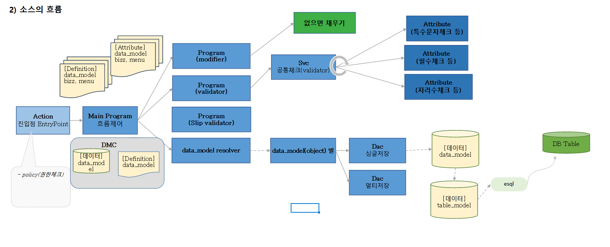

# Daily Retrospective

**작성자**: [김승준]  
**작성일시**: [2025-01-03]

## 1. 오늘 배운 내용 (필수)

### [복습](#review)

### 용어

-   DMC (data_model_container) : data_model(data) + data_model_definition
-   data_model_template : 데이터(전표)를 담는 그릇의 합집합 및 템플릿
-   [object](#data-model-table-model-object) : data_model의 항목 중 해당 업무에서 사용하고자하는 항목을 특정하는 역할
-   [table_model](#data-model-table-model-object)

    -   db table과 짝을 이루는 데이터를 담는 그릇.
    -   데이터 모델과 테이블 모델(DB)은 다르다.
    -   db처리를 할때만 사용됨
    -   db table과 일치해야 함

-   #### <U>**data_model**</U>
    -   UI, 웹서버에서 사용하는 데이터를 담는 그릇

### [record_sid와 data_sid](#record_sid-data_sid)

-   기술적용어 (개념) -> 인조식별자 = 고유한 값

### [전체적인 소스 흐름도](#flow-chart)

## 2. 동기에게 도움 받은 내용 (필수)

-   주현, 수경, 주원님에게 컵라면을 얻어 먹었습니다. 너무 맛있었습니다.
-   국물이 먹고 싶었는데 건호님께서 국밥을 먹으러가자고 해주셨습니다. 건호님, 주현님, 민준님, 성재님과 함께 간만에 외식을 했습니다.

---

## 3. 개발 기술적으로 성장한 점 (선택)

아래의 3가지 주제 중 하나를 선택하여 작성합니다.

### 1. 교육 과정 상 배운 내용이 아닌 개인적 호기심을 해결하기 위해 추가 공부한 내용

조성준 팀장님이 말씀하셨던 키워드중 일부를 학습했습니다.

#### [URL](#url-1)

URL (Uniform Resource Locator) : 인터넷에서 웹 페이지, 이미지, 비디오 등 리소스의 위치를 가리키는 문자열

#### [L7 로드밸런서](#layer-7-load-balancer)

OSI 7계층 모델에서 애플리케이션 계층(Application Layer, Layer 7)에서 작동하는 로드밸런서  
트래픽을 애플리케이션 레벨에서 분산시키며, HTTP, HTTPS, WebSocket 등의 프로토콜을 처리

### 2. 오늘 직면했던 문제 (개발 환경, 구현)와 해결 방법

-   리뷰를 하는 과정에서 같은 어제 궁금했던 부분이 또다시 등장했습니다.
    > `prop.sid`가 아닌 `prop.refer_type`을 이용해서 값을 가져오는 이유가 아직 이해가 되지 않습니다. <br> > \+ prop_id 를 기준으로 개발 안하려고 한다는 말씀을 하셨습니다.

-> 하상수 부문장님께 질문을 드렸습니다.

#### 답변

-   `let data = dmc.getValueByReferType(prop.refer_type);` -> O
-   `let data = dmc.getValueByPropId(prop.prop_id);` -> O
-   `let data = dmc.getValueByPropId("title");` -> 문제가 생김!!<br>
    -> `refer_type`을 기준으로 개발하거나 prop.id를 받아와 사용해야함.

\+
[관련 링크](<http://git2.ecount.kr/ecount-doc/ecount-docs/-/blob/master/KB(Knowledge%20base)/23026jihee/%5B%EB%A7%A4%EC%9A%B0%20%EC%86%8C%EC%86%8C%ED%95%9C%20%ED%8C%81%5D/2023/8.31_getValueByPropId%EA%B0%80%20%EC%95%84%EB%8B%8C%20getValueByReferType%EC%9D%84%20%EC%93%B0%EB%8A%94%20%EC%9D%B4%EC%9C%A0.txt>) : 이전에는 `prop_id` 문자열을 이용해 접근하는 경우도 있었을 수도 있겠다.

### 3. 앞으로 공부해볼 내용.

조성준 팀장님이 언급하셨던 키워드 중 하나인 `message queue`에 대해 공부해봐야겠습니다.

# 학습내용

## review

-   definition : 태어나면서 정해지는 것, 살아가면서 바뀌지 않는 것, 존재에 대한 정보
    -   definition의 주인 : bizz, menu, data_model
-   attribute : 설정, 속성, 살아가면서 언제든 바뀌는 것들 (글자색, 글꼴, ...) -> 목적(기능)이 분명함
    -   attribute의 주인 : bizz, menu, data_model, 회사, 유저

| owner_type | owner    | owner_type | owner  | 속성ID | 속성값 |
| ---------- | -------- | ---------- | ------ | ------ | ------ |
| 업무       | 숙제     | 항목       | 거래처 | 글자색 | 파란색 |
| 업무       | 공지사항 | 항목       | 제목   | 글자색 | 빨간색 |

```ts
// 자리수 체크 소스는 1개만 있어야한다. 다시말해 제목, 내용,... 에서 모두 동작해야 한다.
// 공지사항의 제목은 자리수 10자리, 숙제의 글자수 20자리로 체크
// 글자수체크는 입력 항목의 length가 글자수 속성값 보다 크면 저장을 할 수 없다.
// 저장 가능하면 true를 return, 저장을 못한다면 false return.
글자수_체크(prop){
// 1. bizz        definition  // 나를 호출한 업무가 무엇인지 알아야 한다. (공지사항인지, 숙제인지)
// 2. data_model  definition  // 나를 호출한 항목이 무엇인지 알아야한다.
// 3. prop        attribute   // 글자수 속성값을 알아야한다. 몇글자로 설정해야하는지
// 4. data_model  데이터      // 항목의 값(데이터), 제목에 입력된 값

    let prop = bizz_definition.data_model_definition.props[제목]
    let data = data_model.getValueByReferType(prop.refer_type);
    if(data.length > maxLength ) // (화면에서 입력한 제목의 값의 길이 >  3. 글자수 속성값)
        return false;
    }
    return true;
}
```

-   prop_id 를 기준으로 개발 안하려고 함

    -   `let data = dmc.getValueByReferType(prop.refer_type);` -> O
    -   `let data = dmc.getValueByPropId(prop.prop_id);` -> O
    -   `let data = dmc.getValueByPropId("title");` -> 문제가 생김!!<br>
        -> `refer_type`을 기준으로 개발하거나 prop.id를 받아와 사용해야함.

    [관련 링크](<http://git2.ecount.kr/ecount-doc/ecount-docs/-/blob/master/KB(Knowledge%20base)/23026jihee/%5B%EB%A7%A4%EC%9A%B0%20%EC%86%8C%EC%86%8C%ED%95%9C%20%ED%8C%81%5D/2023/8.31_getValueByPropId%EA%B0%80%20%EC%95%84%EB%8B%8C%20getValueByReferType%EC%9D%84%20%EC%93%B0%EB%8A%94%20%EC%9D%B4%EC%9C%A0.txt>) : 이전에는 `prop_id`를 문자열을 이용해 접근했었을 수도 있겠다

### refer_type

공지사항 -> data_model_definition

| 번호-> prop_id | 이름     | 역할->refer_type |
| -------------- | -------- | ---------------- |
| 1              | 제목3    | 제목             |
| 2              | 공지내용 | 내용             |
| 3              | 공지기한 | 기한             |

숙제 -> data_model_definition

| 번호-> prop_id | 이름       | 역할->refer_type |
| -------------- | ---------- | ---------------- |
| 11             | 제목2      | 제목             |
| 12             | 제출내용   | 내용             |
| 13             | 과목\_오늘 | 과목             |

이름은 bizz에 따라 바뀔 수 있는 값. <br>
-> prop의 의미를 나타내는 `refer_type`으로 처리.

## record_sid, data_sid

-   게시판테이블\_single

| tenant_sid <br>(회사코드) | record_sid <br>(라인고유키) | data_sid<br>(전표고유키) | No<br>(라인순번) | title<br> (제목) | notice_limit<br>(공지기한) | class<br>(과목) | biz_sid  | 전표일자   |
| ------------------------- | --------------------------- | ------------------------ | ---------------- | ---------------- | -------------------------- | --------------- | -------- | ---------- |
| 80000                     | r1                          | d1                       | 1                | 새해공지         | 2025.02.28                 | null            | 공지사항 |            |
| 80000                     | r2                          | d2                       | 2                | 봄맞이공지       | 2025.05.28                 | null            | 공지사항 |            |
| 80000                     | r3                          | d3                       | 1                | 개념숙제         | ...                        | 개념            | 숙제     |            |
| 80000                     | r4                          | d4                       | 1                | 판매전표         |                            |                 | 판매     | 2025.01.03 |
| 80000                     | r4                          | d5                       | 1                | 판매전표         |                            |                 | 판매     | 2025.01.04 |

-   게시판테이블\_single_content

| tenant_sid <br>(회사코드) | record_sid<br> (라인고유키) | content<br> (내용) |
| ------------------------- | --------------------------- | ------------------ |
| 80000                     | r1                          | 감기조심하세요     |
| 80000                     | r2                          | 꽃구경갑시다.      |

-   게시판테이블\_multi

| tenant_sid | record_sid | data_sid | No  | title    | content | notice_limit | class | biz_sid | 전표일자 |
| ---------- | ---------- | -------- | --- | -------- | ------- | ------------ | ----- | ------- | -------- |
| 80000      | r4         | d1       | 1   | 판매전표 |         |              |       | 판매    | 20250103 |
| 80000      | r5         | d2       | 1   | 판매전표 |         |              |       | 판매    | 20250104 |

테이블간의 관계, 특정값 찾기 등을 위해 `record_sid`, `data_sid`를 인위로 만들어 사용

### data model, table model, object

```ts
class data_model_board_single {
    tenant_sid :string,
    record_sid:string,
    data_sid:string,
    No:number,
    title:string,
    content:string,
    notice_limit:string,    // 공지사항
    class:string,           // 숙제
    bizz_sid:string,
    R:string                // 기능형항목
}
class data_model_board_single_input
class data_model_board_single_search
class data_model_board_single_list


class table_model_board_single { // 테이블의 모양과 같음.
    tenant_sid :string,
    record_sid:string,
    data_sid:string,
    No:number,
    title:string,
    notice_limit:string,    // 공지사항
    class:string,           // 숙제
    bizz_sid:string,
}

object_notice_single : data_model_board_single{
    target_props:[
        tenant_sid ,
        record_sid,
        data_sid,
        No,
        title,
        content,
        notice_limit,    // 공지사항
        bizz_sid,
    ]
}

object_homework_single : data_model_board_single{
    target_props:[
        tenant_sid,
        record_sid,
        data_sid,
        No,
        title,
        content,
        class,           // 숙제
        bizz_sid,
    ]
}


```

### 주요한 공통

-   값관련 : 값을 핸들링, 구조와 방식은 동일하지만, 동작 시점/위치에 따라 분류
    1. 초기값 : 화면이 뜨자마자 어떤 값이 저절로 입력
    2. 자동입력 : 거래처를 입력했더니 담당자가 자동으로 입력
    3. 저장시 값변경 : 제목을 입력하지 않았는데 저장했더니 저절로 입력
-   변경업무 : 입력할 수 있는 도구를 제공
-   조건부속성 : UI를 핸들링 (셀렉트박스를 선택함에 따라 보이는게 달라짐)
-   파생 : 이력(히스토리)
-   유효성체크 : 글자수, null, ...

### Flow Chart



### URL

URL (Uniform Resource Locator) : 인터넷에서 웹 페이지, 이미지, 비디오 등 리소스의 위치를 가리키는 문자열
|||||||||
|---|---|----|--|--|--|--|--|
|scheme|://|[userinfo@]|host|[:port]|[/path]|[?query]|[#fragment]|
|프로토콜|://||호스트명|:포트번호|/패스|?쿼리파라미터||

#### scheme

-   protocol : 어떤 방식으로 자원에 접근할 것인가 하는 약속

    -   예) http, https, ftp 등등

#### userinfo

-   URL에 사용자 정보를 포함해서 인증
-   요즘은 거의 사용하지 않음

#### host

-   호스트명(www.google.com)
-   도메인명 또는 ip 주소를 직접 사용가능
    -   DNS (Domain name Server)

#### port

-   접속 포트, 생락가능
-   생략시 http:80, https:443

#### path

-   리소스 경로
-   계층적 구조

    -   /home/file1.jpg
    -   /members
    -   /members/100
    -   /items/iphone12

#### query

-   query parameter, query string 등으로 불림, 웹서버에 제공하는 파라미터, 문자 형태
-   key=value 형태
-   ?로 시작되며, &로 여러개 추가 가능  
     ex) ?keyA=valueA&keyB=valueB

#### fragment

-   html 내부 북마크 등에 사용
-   웹문서 해시태크라고도 불림
-   서버에 전송하는 정보 아님

-   localhost

### Layer 7 Load Balancer

OSI 7계층 모델에서 애플리케이션 계층(Application Layer, Layer 7)에서 작동하는 로드밸런서  
트래픽을 애플리케이션 레벨에서 분산시키며, HTTP, HTTPS, WebSocket 등의 프로토콜을 처리

일반적인 L7 로드밸런서로는 NGINX, HAProxy, AWS Elastic Load Balancer (ALB), F5 BIG-IP, ...

Scale-up: 더 빠른 동작을 위해서 하드웨어 성능을 높이는 방법
Scale-out: 다수의 Server가 나눠서 작업을 하는 방법

통상적으로 Scale-out보다, Scale-up의 비용이 많이 든다.

-   각 존 마다 서버를 둠
-   로그인시 회사 코드를 통해 zone정보를 받아옴

-   L7 서버 세션(상태) 확인 `http://l7mon.ecounterp.com/`

-   L7 : 동기 <-> kafka : 비동기

-   AA1, AA2, AA3 가 존재할 때 업데이트(수시배포 진행 과정)

    1. AA1 을 L7에서 제외
    2. AA1 Test 진행 (자동화, QC)
    3. L7에 AA1 추가(최초에는 가중치 낮게)
