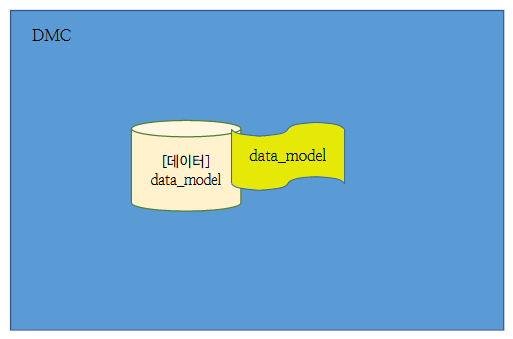
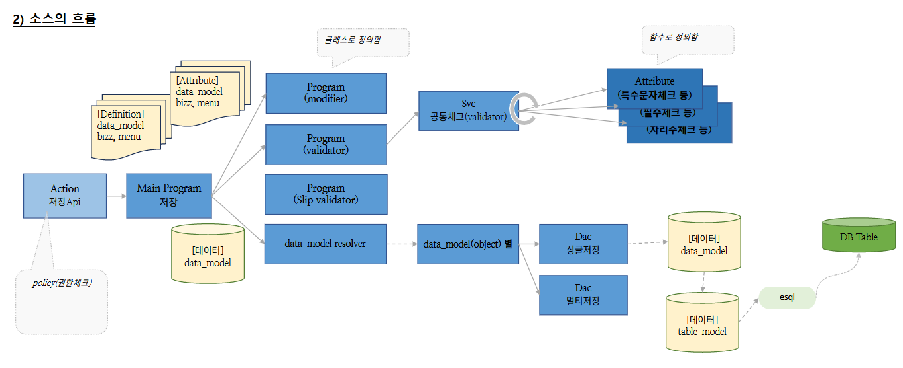
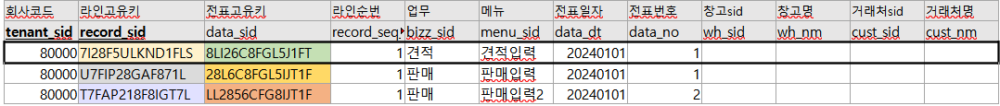
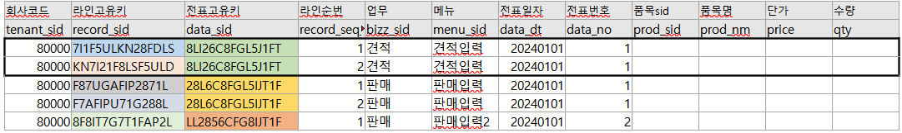
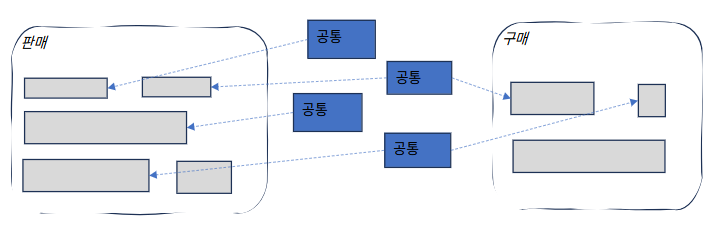

# Daily Retrospective  
**작성자**: [박성재]  
**작성일시**: [2025-01-03]  

## 1. 오늘 배운 내용 (필수)  
- 5.0 프레임워크의 용어 (추가)
- 5.0 프레임워크의 전체 흐름
- 5.0 프레임워크의 목표
- 5.0 프레임워크의 주요한 공통

</br>

## 5.0 프레임워크의 용어 (추가)

### 데이터를 담는 그릇의 종류
| 용어            | 설명                                                   |
|-----------------|--------------------------------------------------------|
| data_model_template | data_model을 target에 맞게 생성하기 위한 틀. 빌드하면 data_model 파일들이 생성된다. |
| data_model      | UI, 웹 서버에서 사용하는 데이터를 담는 그릇                          |
| table_model     | DB와 소통하기 위한 목적의 데이터를 담는 그릇                       |
| object          | 데이터모델을 내 전용으로 필요한 데이터만 이렇게 쓰고 싶다는 명세서  |

### 개발요소 용어
- `Action` : 서버의 API 진입점
- `Program` : 여러 처리들을 모아서 처리해주는 것
- `Syc` : 다른 usecase와 공유하지 않는 나만의 기능
- `Dac` : Db 처리해주는 것

### DMC


DMC(Data_Model Container)
- data_model : 데이터를 담는 그릇
- data_model definition : 데이터에 대한 설명서
- Acion부터 시작해서 로직이 실행되는 동안 데이터들은 이 DMC로 감싸진 상태로 이동되며, 사용된다.

</br>

## 5.0 프레임워크의 전체 흐름


1. UI에서 API로 요청을 보낸다.
2. `Action`부터 API 서버의 로직이 시작된다.
3. `Main Program`으로 요청이 전달되고 다시 세부 `Program`부터 비즈니스 로직이 실행된다.
4. `modifier` 프로그램이 실행되어 초기값이나 자동입력과 같은 로직이 실행된다.
5. `validator` 프로그램이 실행되어 유효성 검증이 수행된다.
6. `Slip validator` 프로그램이 실행되어 데이터 모델 전체의 유효성 검사가 진행된다.
7. DB에 액세스하여 DB에 CRUD 관련 처리를 수행한다.
8. UI로 요청에 대한 응답을 반환한다.

</br>

## 5.0 프레임워크의 목표

### 개발의 비용을 줄이는 것을 목표로 한다.
1. `통합` : 다르다는걸 인정하지 않겠다. (개발)
2. `일반화` : 다르다는걸 인정하겠다. (기획)

### 통합 사례

#### 테이블 통합
- 기존 : 판매 상/하단, 구매 상/하단, 견적 상/하단
- 변경 : 재고자유형싱글/멀티, 회계자유형싱글/멀티

#### 재고자유형싱글 -> 재고업무들이 사용할 상단 테이블



#### 재고자유형멀티 -> 재고업무들이 사용할 하단테이블



</br>

#### 소스 통합
- 기존 : 판매저장 -> 상단/하단저장, 구매저장 -> 상단/하단저장, 견적저장 -> 상단/하단저장
- 변경 : 저장 -> 재고자유형싱글/멀티저장, 회계자유형싱글/멀티저장

저장
- 재고자유형
- 회계자유형

</br>

### 일반화
일반화란 기획상으로, 사용자에게 설정을 위임하여 상황에 따라 사용자 설정에 따라 다르게 동작되도록 하겠다는 것을 의미한다.

- `판매` : 재고감소 -> 재고수불 감소
- `구매` : 재고증가 -> 재고수불 증가
- `견적` : 증감없음

- `설정`
    - `sc설정` : 설정 -> 속성 -> attribute -> attr
    - `개인 설정`
    - `양식설정`

### 5.0의 컨셉


- 더이상 판매/구매를 개발하는 개념이 아니다.
- 판매/구매에서 쓸 부품(공통)을 개발하는 개념이다.

</br>

## 5.0 프레임워크의 주요한 공통

### 1. 값관련

| 용어            | 설명                                                   |
|-----------------|--------------------------------------------------------|
| 초기값          | 화면이 뜨자마자 어떤 값이 저절로 입력되어 있었음        |
| 자동입력        | 거래처를 입력했더니 담당자가 자동으로 입력되었음        |
| 저장시 값변경   | 제목은 이력을 하지도 않았는데, 저장했더니 저절로 입력되어 있네 |

### 2. 변경업무
값을 입력하기위한 편의 업무 및 공통

### 3. 조건부속성
- UI를 핸들링하기위한 공통
- UI와 관련된 속성을 핸들링 하는 것
- `ex:` UI에서 어떤 속성이 존재하면, 이 때는 속성을 보여주고, 이때는 숨겨주고, 이때는 빨갛게 하는 등의 처리

### 4. 파생
- 다른 업무의 데이터를 만들어주는 공통
- 만들어준다기보다는, 호출해준다는 개념으로 접근해야 한다.

### 5. 유효성체크
입력을 통제한다.

</br>

## 2. 동기에게 도움 받은 내용 (필수)
#### 설다은 선임
법인카드 사용후, 결재 올리는 방법을 여쭤봤는데 친절히 알려주셔서 덕분에 수월히 결재를 올릴 수 있었습니다.

#### 이연아 선임
교육 받는 중간중간 소소한 담소를 나누며 머리를 식힐 수 있어 도움이 되었습니다.

</br>

## 3. 개발 기술적으로 성장한 점 (선택)

### 1. 화살표 함수
오늘은 Js의 화살표 함수에 대해서 한번 정리해보겠습니다.

### [ 화살표 함수 정의 ]

### 함수 정의
```javascript
const multiply = (x, y) => x * y;
multiply(2, 3); // 6
```
화살표 함수는 함수 선언문으로 정의할 수 없고, 함수 표현식으로 정의해야합니다. 호출방식은 일반 함수와 동일합니다.

</br>

### 매개변수 선언
```javascript
const arrow = (x, y) => { ... };
```
매개변수가 여러개인 경우 소괄호 `()` 안에 매개변수를 선언한다.

```javascript
const arrow = x => { ... };
```
매개변수가 한 개인 경우는 소괄호 `()`를 생략할 수 있다.

```javascript
const arrow = () => { ... };
```
매개변수가 없는 경우는 소괄호 `()`를 생략할 수 없다.

</br>

### 함수 몸체 정의
```javascript
// concise body
const power = x => x ** 2;
power(2); // 4
// 위 표현은 다음과 동일하다.
// block body
const power = x => { return x ** 2; };
```
- 함수 몸체가 하나의 문으로 구성된다면 함수 몸체를 감싸는 중괄호 `{}`를 생략할 수 있다.
- 이때 함수 몸체 내부의 문이 값으로 평가될 수 있는 표현식인 문이라면, 그 값이 암묵적으로 반환된다.

```javascript
const arrow = () => const x = 1; // SyntaxError: Unexpected token 'const'
// 위 표현은 다음과 같이 해석된다.
const arrow = () => { return const x = 1; };
```
- 함수 몸체를 감싸는 중괄호 {}를 생략한 경우 함수 몸체 내부의 문이 표현식이 아닌 문이라면 에러가 발생한다.
- 표현식이 아닌 문은 반환할 수 없기 때문이다.

```javascript
const create = (id, content) => ({ id, content });
create(1, 'JavaScript'); // {id: 1, content: "JavaScript"}
// 위 표현은 다음과 동일하다.
const create = (id, content) => { return { id, content }; };

// { id, content }를 함수 몸체 내의 쉼표 연산자문으로 해석한다.
const create2 = (id, content) => { id, content };
create2(1, 'JavaScript'); // undefined
```
- 객체 리터럴을 반환하는 경우 객체 리터럴을 소괄호 `()`로 감싸주어야 합니다.
- 객체 리터럴을 소괄호 `()`로 감싸지 않으면 객체 리터럴의 중괄호 `{}`를 함수 몸체를 감싸는 중괄호 `{}`로 잘못 해석합니다.

```javascript
const sum = (a, b) => {
 const result = a + b;
 return result;
};
```
- 함수 몸체가 여러 개의 문으로 구성되면 중괄호 `{}`를 생략할 수 없습니다.
- 반환값이 있다면 명시적으로 반환해야 합니다.

```javascript
[1, 2, 3].map(v => v * 2); //  [ 2, 4, 6 ]
```
- 화살표 함수도 일급 객체이므로 고차함수에 인수로 전달이 가능합니다.
- 일반 함수에 비해 표현이 간결하고 가독성이 좋습니다.

</br>

### [화살표 함수와 일반 함수의 차이]
화살표 함수는 일반 함수와 다른 여러가지 특징을 가지고 있습니다. 이를 한번 정리해보겠습니다.

### 1. 화살표 함수는 인스턴스를 생성할 수 없는 non-constructor이다.

```javascript
const Foo = () => {};
// 화살표 함수는 생성자 함수로서 호출할 수 없다.
new Foo(); // TypeError: Foo is not a constructor

Foo.hasOwnProperty('prototype'); //  false
```
- 화살표함수는 생성자 함수로서 호출이 불가능합니다.
- 화살표함수는 인스턴스를 생성할 수 없으므로 `prototype` 프로퍼티가 없으며, 프로토타입도 생성하지 않습니다.
이는 매우 중요한 특징으로, 메모리 관리를 효율적으로 하고싶을 때 화살표 함수를 적극적으로 사용할 수 있을 것입니다.

### 2. 중복된 매개변수 이름을 선언할 수 없다.
```javascript
// 일반 함수
function normal(a, a) { return a + a; }
console.log(normal(1, 2)); // 4

// 화살표 함수
const arrow = (a, a) => a + a;
// SyntaxError: Duplicate parameter name not allowed in this context
```
- 일반 함수는 중복된 매개변수 이름을 선언해도 에러가 발생하지 않습니다.
- 화살표 함수에서는 중복된 매개변수 이름을 선언하면 에러가 발생합니다.

### 3. 화살표 함수는 함수 자체의 this, arguments, super, new.target 바인딩을 갖지 않는다.
- `this`, `arguments`, `super`, `new.target`을 참조하면 상위 스코프의 것을 참조합니다.
- 만약 화살표 함수가 화살표 함수에 중첩되어 있다면 스코프 체인 상에서 가장 가까운 상위 함수 중에서 화살표 함수가 아닌 함수의 `this` 등을 참조하게됩니다.

</br>

## 화살표 함수의 this
화살표 함수와 일반함수가 구별되는 가장 큰 특징은 바로 `this`라고할 수 있습니다. 화살표 함수의 `this`는 일반 함수와 달리 함수 정의 시점에 <U>자신의 상위 스코프의 `this`</U>로 정적으로 결정됩니다. 이는 **콜백 함수 내부의 this 문제**를 해결하기위해 의도적으로 설계된 것이라고 합니다.

### 콜백 함수 내부의 this 문제

```javascript
class Prefixer {
    constructor(prefix) {
        this.prefix = prefix;
    }
 add(arr) {
 // add 메서드는 인수로 전달된 배열 arr을 순회하며 배열의 모든 요소에 prefix를 추가한다.
 // 1번
    return arr.map(function (item) {
        return this.prefix + item; // 2번
        // TypeError: Cannot read property 'prefix' of undefined
    });
 }
}
const prefixer = new Prefixer('-webkit-');
console.log(prefixer.add(['transition', 'user-select']));
```
위 예제를 실행하면 `TypeError`가 발생합니다.

- `add` 메서드를 호출하였을 때 메서드로서 호출되었으므로, 1번인 `add` 메서드 내부의 `this`는 `prefixer` 객체를 가리킵니다.
- 하지만, `add` 함수 내에서 사용되는 `map` 함수의 인수로 전달한 콜백 함수의 내부인 2번의 `this`는 `undefined`가 됩니다. 왜냐하면, 클래스 내부의 모든 코드에는 `strict mode`가 암묵적으로 적용되고, `strict mode`에서 일반 함수로서 호출된 모든 함수 내부의 `this`는 전역 객체가 아닌 `undefined`가 바인딩되게 때문입니다.
- 여기서 발생하는 문제가 바로 `콜백 함수 내부의 this 문제`입니다. 즉, 개발자는 콜백함수 외부의 `this`와 콜백함수 내부의 `this`를 동일하게 인식하고 코드를 작성했지만, 이 둘이 다르기 때문에 발생한 문제인 것입니다.


해당 문제를 해결하기 위해 ES6 이전에는 아래 3가지 방법을 사용했습니다.

#### 1. add 메서드를 호출한 prefixer 객체를 가리키는 this를 회피 후 콜백 함수 내부에서 재사용

```javascript
...
add(arr) {
 // this를 일단 회피시킨다.
 const that = this;
 return arr.map(function (item) {
 // this 대신 that을 참조한다.
 return that.prefix + ' ' + item;
 });
}
...
```

#### 2. Array.prototype.map 함수의 두 번째 인수로 add 호출한 this를 전달

```javascript
...
add(arr) {
 return arr.map(function (item) {
 return this.prefix + ' ' + item;
 }, this); // this에 바인딩된 값이 콜백 함수 내부의 this에 바인딩된다.
}
...
```
ES5에서 도입된 `Array.prototype.map`은 두번째 인수로 콜백함수 내부에서 `this`로 사용할 객체를 전달할 수 있습니다.

#### 3. Function.prototype.bund 메서드 사용

```javascript
...
add(arr) {
 return arr.map(function (item) {
 return this.prefix + ' ' + item;
 }.bind(this)); // this에 바인딩된 값이 콜백 함수 내부의 this에 바인딩된다.
}
...
```

</br>

ES6부터는 화살표 함수를 활용해서 위와 같은 방법들에 비해 훨씬 간결한 방식으로 해당 문제를 해결할 수 있습니다.

```javascript
class Prefixer {
    constructor(prefix) {
        this.prefix = prefix;
 }
 add(arr) {
    return arr.map(item => this.prefix + item);
 }
}
const prefixer = new Prefixer('-webkit-');
console.log(prefixer.add(['transition', 'user-select']));
// ['-webkit-transition', '-webkit-user-select']
```
- `add` 함수 내부의 `map` 함수의 인수로 사용되는 콜백 함수 내 `this`가 상위 스코프인 `add` 함수의 `this`인 `prefixer` 객체를 가리키게 되어 정상적으로 기능이 동작되고 있습니다.

</br>

## 후기
화살표 함수에 대해 막연하게 외부의 `this`를 사용하고 싶을 때 사용한다고만 생각하고 있었는데, 이번에 확실하게 정리해보면서 명확한 정의와 탄생배경, 그리고 왜 화살표 함수를 쓰고 언제 써야하는지 보다 명확히 느껴볼 수 있었습니다. 

특히, 화살표함수가 프로토타입 객체를 생성하지 않는다는 아주 큰 장점도 알게되어, 앞으로는 상황에 따라 적극적으로 활용해봐야겠다는 생각이 들었습니다.

---

## 4. 소프트 스킬면에서 성장한 점  (선택)

### 도메인 지식
5.0 프레임워크를 어제부터 처음으로 배우게되면서, 제가 이전에 경험했던 일반적인 개발을 위한 설계와는 많이 다르다는 것을 느꼈습니다.

이카운트에서 원활하게 개발 업무를 수행하려면 전체적인 Flow부터 사용하는 용어까지 추가적으로 공부해야하는 것들이 
많음을 느꼈으며, 이제 시작 단계이지만 앞으로 어떠한 관점을 가지고 교육에 임하고 업무에 임해야할 지 배울 수 있는 시간이었습니다.

5.0 프레임워크의 목표와 전체 흐름과 용어 등을 처음으로 익혔고, 실습해나가며 개념을 보다 다지고 살을 붙여나갈 계획입니다.

---

## 5. 제안하고 싶은 내용
5.0 프레임워크 개념에 대해 전반적으로 이해하는 것이 어려운 편이었습니다.

개인적으로 5.0 프레임워크의 개념 공부 시에도 실제 코드를 기반으로 설명을 듣는다면, 각종 개념들에 대해 오히려 더 잘 이해할 수 있지 않을까라는 생각도 들었습니다.

