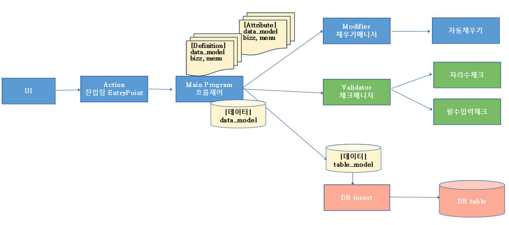
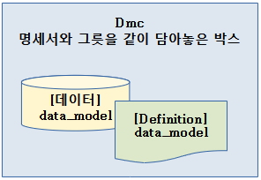

# Daily Retrospective

**작성자**: [설다은]  
**작성일시**: [2025-01-03]

## 1. 오늘 배운 내용 (필수)

### 🗒️[5.0 동작 흐름]

<br>
_위는 UI에서 사용자가 저장 엑션을 취했을 때 소스 흐름을 설명한 이미지이다._<br><br>
사용자가 액션을 취하면 Entry Point가 있다.<br>
여기서는 '어~ 해야할 일 어서오고~'의 느낌으로 맞이해주는 역할만 한다.<br>
그 다음 M.P한테 보내서 각각 해야할 일 순서대로 잘 뿌려줘라는 역할을 한다.<br>
MP에서는 액션이 뭔지에 따라 각각 modifier나 validator같은 매니저한테 해야할 일을 분담한다.<br>
각 매니저는 해야할 일 (기능)을 잘게 쪼개서 팀원이 하나의 일에만 집중하여 작업할 수 있도록 역할을 더 작게 분담해주는 역할을 하게된다.<br><br>
작업은 병렬적으로 진행되는게 아니라 한 작업이 끝나면 다음 작업으로 넘어가는 형태이다.<br>

<br><br>
<br>
**DMC (Data_model Container)**<br>
: 이 안에는 data_model_definition과 data_model이 담겨져 있다.<br>
: 서버에서 알아서 data_model_definition과 data_model을 하나의 박스로 담아놓는다.<br>
: 데이터가 소스 흐름에 따라 이동할 때 DMC단위로 이동하다가 마지막에 DB에 넣을 때 data_model만 table_model로 변환되어 DB작업이 이루어진다.

### 🗒️[5.0 용어 개념 (추가)]

[데이터를 담는 그릇의 종류]
| **용어** | **개념** |
|---------------------|---------------------------------------------------|
| data_model_templete | data_model을 만들기 위한 설계도 |
| data_model | UI, 웹서버에서 사용하는 데이터를 담는 그릇 |
| object | data_model 중 나는 이렇게 쓰고 싶어라고 설정하는 것 |
| tabel_model | DB와 소통하기 위한 목적의 데이터를 담는 그릇 |
<br>

**교육을 진행하는 의미 :**<br>
① 협업하는 사람들간의 소통을 원활히 하기 위해 용어를 알자.<br>
② 전체 흐름을 알고 있어야 현재 내가 개발하는 기능이 어느시점에 동작하며 어디까지 영향을 미치는지 고려할 수 있다. 이런걸 알아가는 시간을 가지자.<br>
③ 왜 이렇게 해야했는지, 왜 이렇게 했는지 이유를 알아가보자.<br>

## 2. 동기에게 도움 받은 내용 (필수)

**지은님**<br>
마지막에 헷갈리는 부분에 대해 같이 공부해주셨다.

**성철님**<br>
토마토를 가져와줘서 쉬는시간에 먹고 힘이 났다.

## 3. 개발 기술적으로 성장한 점 (선택)

### 1. 교육 과정 상 배운 내용이 아닌 개인적 호기심을 해결하기 위해 추가 공부한 내용

### 2. 오늘 직면했던 문제 (개발 환경, 구현)와 해결 방법

### [어제 의문이 들었던 소스코드에 대한 이해]

_요구사항_
(1) 자리수체크 소스는 1개만 있어야한다.
(2) 공지사항의 제목은 자리수 10자리, 숙제의 제목은 자리수 20자리 체크한다.
(3) 자리수체크는 입력항목의 length가 자리수 속성값보다 크면 저장할 수 없다.
(4) 저장을 할 수 있으면 true를 반환, 저장을 못하면 false를 반환

```ts
    자리수체크() {
        // 필요한 재료
        // bizz definition : 나를 호출한 업무가 무엇인지 알아야한다. 공지사항? 숙제?
        // data_model definition : 나를 호출한 항목이 무엇인지 알아야한다.
        // prop attribute : 자리수속성값을 알아야한다. 몇자리로 체크해야하는지?
        // data_model data : 항목의 값(데이터) = 제목에 입력된 값

        let prop = 업무.data_model_definition.props["제목"];
        let data = data_model.getValueByReferType(prop.refer_type);

        if(length(data) > 자리수속성값) {
            return false;
        }
        return true;
    }
```

어제는 잘 이해가 가지 않았는데 요구사항과 로직을 구현할 때 필요한 재료들을 먼저 나열하고 하나씩 풀어가니 이해가 되었다.<br>
그렇지만 아직 코드를 실제를 안 짜봐서 그런지 100% 이해된거는 아니라서 다른 사람이 작성한 코드를 자주 보는 연습이 필요할 것 같다.<br>

### 3. 위 두 주제 중 미처 해결 못한 과제. 앞으로 공부해볼 내용.

혼자 소스의 흐름을 보다보니 아래와 같은 궁금한 점이 생겼다.<br>
의문점1. dmc라는에 data_model_definition이랑 data_model을 묶어놓은거라고 했는데,
이게 DB에 값이 쌓이기 전까지 서버로직적 처리할 때 같이 묶여 다니다가
data_model을 table_model로 변환되는 작업이 있는데 여기서는 분리되는건가?하는 헷갈린다.<br>
의문점2. 매니저가 팀원한테 일을 전달할때도 definition이 같이 전달되는건지?<br>
의문점3. dmc는 M.P단계에서 만들어지는 것인가?<br>

## 4. 소프트 스킬면에서 성장한 점 (선택)

## 5. 제안하고 싶은 내용
