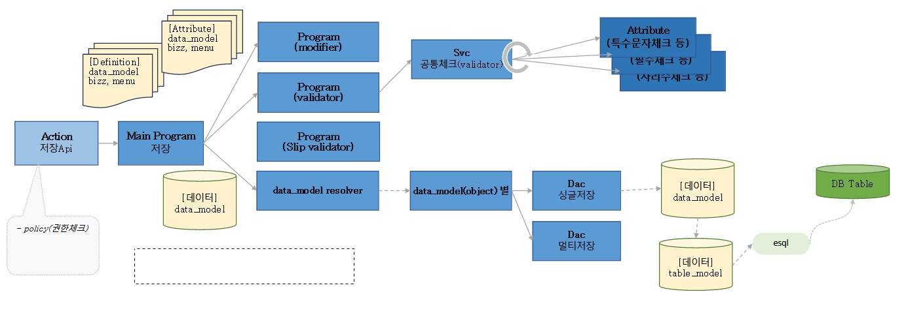

# Daily Retrospective

**작성자**: [이지은]  
**작성일시**: [2025-01-03]

## 1. 오늘 배운 내용 (필수)

### 지난 수업 정리

#### definition vs attribute

-   definition: 주민등록등본처럼 태어나면서 정해지는 것, 살아가면서 바뀌지 않는 것, 존재에 대한 정보를 가지고 있음
-   attribute: 설정, 속성, 살아가면서 언제든 바뀌는 정보를 가지고 있음

#### refer_type vs prop_id

공지사항 -> data_model_definition
|번호 -> prop_id|이름|역할 -> refer_type|
|---|---|---|
|1 |제목2|제목|
|2|내용|내용|
|3| 공지기한|공지기한|

숙제 -> data_model_definition
|번호 -> prop_id|이름|역할 -> refer_type|
|---|---|---|
|11|제목4|제목|
|12|내용|내용|
|13| 과목 |과목|

-   이름, 번호를 외우는거보다 역할(refer_type)을 외워서 할 일을 주는게 더 편하다.
-   로직에서는 바뀔 수 있는 prop_id를 쓰지 않고 refer_type을 쓴다.

```ts
var 데이터 = dmc.getValueByPropID(prop.prop_id); // (o)
var 데이터 = dmc.getValueByPropID("title"); // (x) -> string으로 하드코딩
```

-   이런 식으로 prop_id를 문자열 하드코딩 하지 않는다는 것.

### 5.0 프레임워크의 전체 흐름



-   `Action`: 진입점(Entry Point). Action은 로직을 수행하지 않고 출입만 시킨다.
-   `Main Program`: 흐름 제어를 한다.
-   `Program`: 각 프로그램마다 매니저를 두어 각 프로그램을 담당하게 함
    -   `Modifier`: 자동 채우기 등 변경
    -   `Validator`: 자리수 체크, 필수 체크 등 유효성 테스트
    -   `Slip Validator`: 안전 재고 체크 같은 유효성 테스트
-   이 흐름 안에서 데이터, attribute, definition 이 셋이 움직이게 된다.
-   팀마다 다른 역할을 하고 있다면 각 팀이 필요로 하는 정보가 달라진다. 이때 모든 정보를 가져가서 그중 필요한 정보를 찾아쓰라고 하면 상당히 비효율적이다. 각각의 매니저(Modifier, Validator)가 어떤 팀원에게 무슨 일을 시킬지 결정하고 각 팀원(자동 채우기, 자리수 체크, 필수 체크)이 필요로 하는 데이터를 DMC에서 꺼내서 주는 것이다.

### DMC(Data Model Container)

-   DMC 안에는 data model과 data model definition이 담겨져 있다.
-   DTO != DMC : DTO의 종류 중 하나가 DMC

### DB 내 한 테이블에서 PK가 다른 문제를 어떻게 해결할까?

#### 기존 테이블

게시판테이블
|제목| 내용| 공지기한| 과목| 업무|
|---|---|---|---|---|
|새해공지|감기조심하세요| 2025.02.28| null| 공지사항|
|개념숙제| ....| |개념| 숙제|

-   한 테이블에서 PK가 다른 문제를 해결하기 위해 인조 식별자를 이용한다.

#### 게시판테이블 싱글

| tenant_sid | record_sid | data_sid | No  | title      | content        | notice_limit | class | bizz_sid |
| ---------- | ---------- | -------- | --- | ---------- | -------------- | ------------ | ----- | -------- |
| 80000      | r1         | d1       | 1   | 새해공지   | 감기조심하세요 | 2025.02.28   | null  | 공지사항 |
| 80000      | r2         | d2       | 2   | 봄맞이공지 | 꽃구경갑시다   | 2025.02.28   | null  | 공지사항 |
| 80000      | r3         | d3       | 1   | 개념숙제   | ....           |              | 개념  | 숙제     |

#### 게시판테이블 멀티

| tenant_sid | record_sid | data_sid | No  | title    | content | notice_limit | class | bizz_sid |
| ---------- | ---------- | -------- | --- | -------- | ------- | ------------ | ----- | -------- |
| 80000      | r4         | d3       | 1   | 개념숙제 | ....    |              | 개념  | 숙제     |
| 80000      | r5         | d3       | 1   | 개념숙제 | ....    |              | 개념  | 숙제     |

-   싱글 테이블에서는 일부 불필요한 칼럼(순번)이 포함되어 있지만, 멀티 테이블과 동일한 구조를 유지함으로써 작업 효율성과 시간 비용을 절감하려는 방식이다.

### 데이터를 담는 그릇의 종류

-   data_model_template: 유사한 data_model을 여러 개 생성할 때 도와주는 도구
-   data_model: UI, 웹 서버에서 사용하는 데이터를 담는 그릇
    -   object: data_model을 조정하여 사용한다. 필요한 prop만 골라서 쓴다. 아예 data_model을 변형하는 것이 아니라 data_model을 이렇게 쓰고 싶다라는 정보만 가지고 있다.
-   table_model: DB와 소통하기 위한 목적의 데이터를 담는 그릇

=> data_model이 DB로 이동할 때, table_model로 변환된다.

## 2. 동기에게 도움 받은 내용 (필수)

**연아님**: 라면을 먹을지 말지 고민하고 있었는데 같이 먹자고 해주셔서 나눠 먹었습니다.
**다은님**: 5.0 개념 수업 때 놓친 내용을 물어봤을 때 답변해주셨습니다.

---

## 3. 개발 기술적으로 성장한 점 (선택)

### 1. 교육 과정 상 배운 내용이 아닌 개인적 호기심을 해결하기 위해 추가 공부한 내용

한 테이블 내에서 PK가 다른 문제를 해결하기 위해 인조 식별자를 사용했다는 이야기가 나왔다. 그래서 본질 식별자와 인조 식별자를 비교해봤다.

#### 본질 식별자 vs 인조 식별자

1. 본질 식별자

    - 정의: 개체의 본질적인 속성 중 유일성을 보장할 수 있는 하나를 식별자로 사용하는 방식
    - 특징:
        - 데이터 자체의 속성을 이용해 고유성을 보장함
        - 예를 들어, 주민등록번호, 이메일 주소, 차량 번호판 등이 본질 식별자로 사용될 수 있음
        - 해당 속성은 데이터의 의미와 밀접하게 연결되어 있어 직관적.
    - 장점:
        - 고유한 의미를 가지므로 데이터 이해가 쉽다.
        - 이미 존재하는 속성을 활용하므로 추가적인 식별자 생성이 필요 없다.
    - 단점:
        - 현실 세계에서 데이터 변경이 발생하면 문제가 생길 수 있음
        - 복합키(여러 속성을 조합한 식별자)가 필요한 경우, 설계가 복잡해질 수 있음

2. 인조 식별자

    - 정의: 데이터의 본질적인 속성과 무관하게 시스템적으로 생성한 고유한 식별자를 사용하는 방식
    - 특징:
        - 주로 데이터베이스에서 자동 생성된 번호(ID), UUID(범용 고유 식별자) 등이 사용됨
        - 데이터의 의미와 독립적이며, 단순히 고유성을 보장하기 위해 생성됨
    - 장점:
        - 데이터의 변경으로부터 독립적이므로 안정적.
        - 복합키가 필요하지 않아 단순한 설계 가능
        - 시스템 간 데이터 연계와 확장이 용이
    - 단점:
        - 데이터 자체의 의미를 반영하지 않으므로 직관성이 떨어질 수 있음
        - 본질 식별자를 따로 관리해야 하는 경우가 있음

#### DTO(Data Transfer Object, 데이터 전송 객체)

1. DTO란?

-   DTO란 프로세스 간 데이터를 전달하는 객체를 의미한다.
-   말 그대로 데이터를 전송하기 위해 사용하는 객체라서 그 안에 비즈니스 로직 같은 복잡한 코드는 없고 순수하게 전달하고 싶은 데이터만 담겨있다.
-   주로 시스템의 다양한 계층 간(예. 클라이언트와 서버, 서비스 계층과 데이터 액세스 계층) 데이터를 전달하는 데 사용된다.

2. DTO의 주요 용도

-   클라이언트와 서버 간 데이터 전송: API 호출이나 JSON 데이터 교환 시, 필요한 데이터를 묶어 클라이언트와 서버 간 교환한다.
-   엔티티와 분리된 데이터 표현: 데이터베이스 엔티티와 별개로, 외부에 노출할 데이터를 제한하거나 변환하여 전송한다.
-   데이터 구조 정의: 응답 데이터의 구조를 명확히 정의하고, 필요한 필드만 포함하여 응답 데이터의 크기를 줄인다.

### 3. 위 두 주제 중 미처 해결 못한 과제. 앞으로 공부해볼 내용.

오늘 그림으로 5.0의 전체적인 흐름을 설명해주셨는데 그 흐름에 맞게 data, definition, attribute가 움직이게 된다고 한다. 그런데 DMC에는 data_model과 data_model_definition이 담겨있다고 했다. 다은님이 이 부분에 대해서 나에게 물어봤는데 나도 다시 이 흐름을 적용해서 생각해보려니까 헷갈려졌다. 이 흐름에서 DMC 상태로 움직이는 건지 data, definition, attribute 각각이 움직이게 되는건지 이해가 잘 되지 않았다. 확실히 혼자 생각할 때보다 질문을 받아서 다시 생각해보니까 개념에 빈 부분이 많았다. 상수 팀장님께서 완전히 이해하지 못하더라도 70~80% 정도 이해하고 이 다음에 다시 볼 기회에 완벽히 이해하면 된다고 말씀해 주셨어서 그때를 노려서 완전히 이해해야 겠다.

그리고 다음주부터 5.0 실습이 진행되기 때문에 주말에 타입스크립트 부족한 부분을 더 열심히 공부해야겠다.

---
