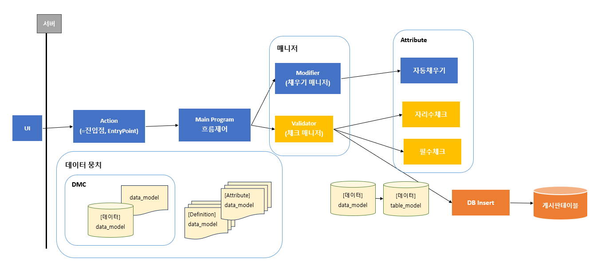
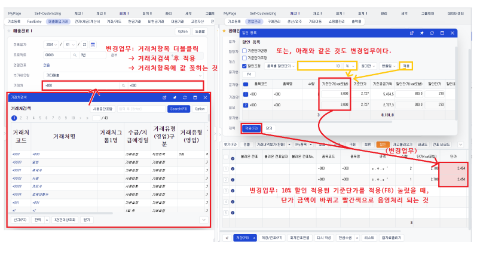
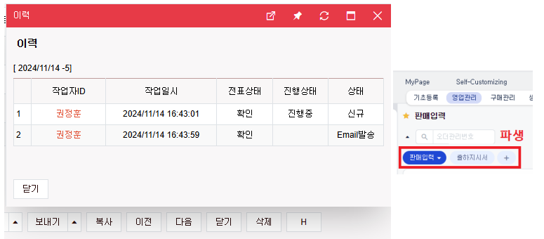
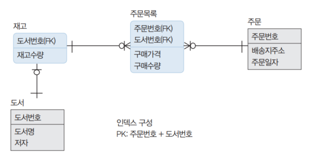
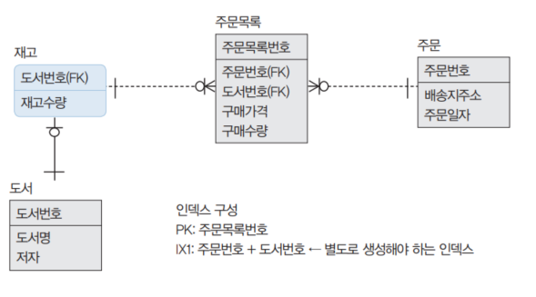
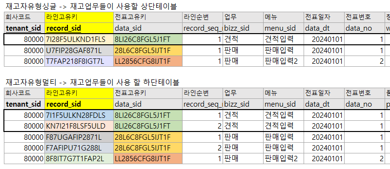

# Daily Retrospective

**작성자**: 허수경 <br>
**작성일시**: 2025-01-03(금)

## 1. 오늘 배운 내용 (필수)

- 용어 복습
- 그외 용어\_데이터를 담는 그릇의 종류
- 프레임워크 5.0 전체 흐름
- 주요한 공통

### 용어 복습

---

#### 1. 서류 종류

- definition: 태어나면서 정해지는 것, 살아가면서 바뀌지 않는 것, 존재에 대한 정보
- attribute: 설정, 속성, 살아가면서 언제든 바뀌는 것들

#### 2. owner

- 항목만으로 어떤 bizz의 prop인지 모르니 owner로 구분한다.
- attribute 중심으로 존재한다
- `owner_type`이 될 수 있는 것들: bizz, menu, data_model, prop, 회사, 개인

  - ex) 회사 시스템 전체에 글꼴 스타일을 적용할 때는 회사가 owner가 된다.

- **예시**:

  | owner_type | owner | 속성ID | 속성값 |
  | ---------- | ----- | ------ | ------ |
  | 항목       | 제목  | 글자색 | 파란색 |
  | 회사       | 80000 | 글자색 | 빨간색 |

#### 3. refer_type

- `prop`의 의미를 나타낸다. 주로 업무적인 필요에 의해 정의된다.
- 데이터모델에 포함된 데이터는 `refer_type`이 중복될 수 없다.
- `id는 변할 수 있기에 `refer_type`를 사용한다.

### 그외 용어\_데이터를 담는 그릇의 종류

---

#### 1. data_model_template

- `data_model`를 만들기위한 설계도, 빌드를 하면 data_model이 만들어진다.

#### 2. data_model

- UI, 웹서버에서 사용하는 실제 데이터를 담는 그릇
- 제일 중요한 개념으로서, 해당 개념을 이해한 것만으로 오늘 교육의 80%는 성공했다.

```
class data_model_게시판_single {
	tenant_sid: string,
	record_sid: string,
	data_sid: string,
	no: number,
	title: string,
	content: string,
	notice_limit	// 공지사항만 작성
	class: string,	// 숙제만 작성
	bizz_sid: string,
	R: string		// 기능형항목 : DB에 저장하지않음
}
```

#### 3. object

- `data_model`를 커스터마이징해서 사용하겠다.
- `target_props` : 원조 `data_model`중에서 사용할 `prop`만 기재

```
object_공지사항_single: data_model_게시판_single {
	target_props: [
		tenant_sid,
		record_sid,
		data_sid,
		no,
		title,
		content,
		notice_limit	// 공지사항만 작성
		bizz_sid,
	]
}

object_숙제_single: data_model_게시판_single {
	target_props: [
		tenant_sid,
		record_sid,
		data_sid: string,
		no: number,
		title: string,
		content: string,
		class: string,	// 숙제만 작성
		bizz_sid: string,
	]
}
```

#### 4. table_model

- `DMC`가 쭉 흘러가다가 DB insert 직전에 갈아타는 모델
- DB와 소통하기 위한 목적의 데이터를 담는 그릇

```
class table_model {
	tenant_sid: string,
	record_sid: string,
	data_sid: string,
	no: number,
	title: string,
	notice_limit	// 공지사항만 작성
	class: string,	// 숙제만 작성
	bizz_sid: string,
	// R: string		// DB에 저장하지않을 것이기에 제거
}
```

### 프레임워크 5.0 전체 흐름



#### 1. 액션

- UI로부터 넘어온 api의 진입점
- 기능을 구현하면 안된다.

#### 2. Main Program

- 액션은 진입점 역할만 하니 중간에서 흐름을 제어한다.

#### 4. DMC (Data Model Container)

- definition 중 한장(data_model_definition)을 뽑아 같이 들고 다닌다.
- 이 안에는 data_model과 data_model_definition이 담겨져있다.

#### 3. 데이터뭉치

- attribute를 확인하기 위해서는 두 가지 서류(definition, attribute)가 필요하다.
- 이 두가지는 항상 데이터(DMC)와 함께 다닌다.

#### 4. 매니저

- 데이터 뭉치속에서 각 attribute가 필요한 서류를 골라줌

### 주요한 공통

---

- 페이지 단위로 개발을 할 때, 이미 개발된 것을들 활용해야한다는 것을 인지 해야한다.
- 부품 단위로 개발할 때, 그 부분이 어느 공통에 포함되어 있는지 인지해야한다.

#### 1. 값관련

- 값이 저절로 채워진다는 공통점을 가지고 있다.
- **초기값**: 화면이 뜨자마자 어떤 값이 저절로 입력되어 있었음
- **자동입력**: 제목은 입력하지도 않았는데, 저장했더니 저절로 입력되어 있음
- **저장시 값변경**: 거래처를 입력했더니 담당자가 자동으로 입력되었음

#### 2. 변경업무

- 입력할 수 있는 도구 제공한다.
  - 거래처(기초코드): 이미 만들어진 데이터를 불러옴
  - 할인: 10% 입력
- **예시**
  

#### 3. 조건부속성

- 다 갖춰져있는데 상황에 따라 속성을 다르게 설정
- UI생태계에서 작동하는 속성을 핸들링하는 모든 것

#### 4. 파생

- 한 업무에서 변경이 일어나면, 파생된 업무도 함께 실행한다
- 서로 다른 업무간에 삭제, 수정을 한몸처럼 동작할 수 있도록 한다.
- ex) 판매이력을 생성할 때 이력이 같이 생성됨
- **예시**
  

---

## 2. 동기에게 도움 받은 내용 (필수)

- 도형님께서 수업 중 질문하신 내용을 다시 도형님께 물어보아 부문장님의 답변을 더 잘 이해할 수 있었습니다. 옆에서 책임님께서도 보충 설명해주셔 감사했습니다.
- 현철님께서 토마토와 케이크를 나눠 주셔 즐거운 간식 시간을 가질 수 있었습니다.
- 성재님, 주현님, 건호님께서 수업 시간에 다양한 질문을 던져 주셔서 생각지도 못했던 부분에 대해 고민하고 배울 수 있었습니다.

---

## 3. 개발 기술적으로 성장한 점 (선택)

### 1. 교육 과정 상 배운 내용이 아닌 개인적 호기심을 해결하기 위해 추가 공부한 내용

#### 1) 인조식별자란?

- 테이블을 싱글과 멀티로 나눠 관리할 때 멀티 테이블 관리를 위해 `recode_sid`(라인고유키)를 인조식별자로 사용하여 데이터를 관리한다고 하여 인조식별자가 무엇인지 궁금해졌다.
- 업무에 존재하지 않으나 원래의 식별자가 너무 복잡하게 구성되어 있어 인위적으로 만든 식별자로, 대리식별자라고도 한다.
- 본질 식별자가 여러 속성의 조합으로 이루어져있을 때, 인조식별자를 사용하면 개발 편의성이 향상될 수 있다.

- **예시**: <br>
  [본질식별자]
  

  - `주문목록`테이블에서 `주문번호(FK)`와 `도서번호(FK)`의 조합으로 주식별자를 구성했다.
  - 복합키로 인해 조작 및 관리가 복잡하며, 이를 기준으로 데이터를 조회하거나 수정할 때 불편함이 있다.

  [인조식별자]
   - `주문목록`테이블에서 `주문목록번호`라는 `인조식별자`를 생성하여 바로 PK에 접근할 수 있다.

[이카운트의 경우]


- 원래라면 멀티 테이블에서 `tenant_sid`, `data_sid`, `recode_seq_sid`를 조합하여 식별했을텐데 `recode_sid`를 인조식별자로 사용함으로써 관리와 개발을 더 쉽고 효율적으로 처리할 수 있도록 설계되었다.

#### 2) 동시성 이슈과 Isolation Level

- 금일 주현님께서 안전재고 체크와 관련해 **동시성 문제**가 발생하지 않을지 질문을 주셨다. 이에 부문장님께서 **버전 체크를 통해 문제를 예방**하고 있다고 설명하셨다.

  **버전 체크**

  - 예를들어 A와 B가 동시에 상품 재고 데이터를 수정하려고 할 때, B가 A의 변경 사항을 반영하지 않고 데이터를 수정하려고 시도하면, 시스템이 "수정된 파일"이라는 메시지를 출력하며 저장을 제한한다.
  - 이러한 방식은 **낙관적 잠금(Optimistic Locking)** 의 대표적인 예로, 데이터를 수정하기 전에 버전 번호나 타임스탬프를 비교하여 데이터 충돌을 방지한다.

  **Isolation Level**

  - 해당 상황에서 이카운트의 Isolation Level이 `READ UNCOMMITTED`라는 점이 떠올랐다.
  - `READ UNCOMMITTED`는 커밋되지 않은 데이터를 읽을 수 있으므로 `Dirty Read`와 같은 동시성 문제가 발생할 가능성이 높다. 그래서 버전 체크와 같은 애플리케이션 레벨의 동시성 제어를 통해 이러한 문제를 보완하고 있는 것으로 생각했다.

### 3. 위 두 주제 중 미처 해결 못한 과제. 앞으로 공부해볼 내용.

---

## 4. 소프트 스킬면에서 성장한 점 (선택)

### 문서 작성 능력

- GitLab의 교육 자료를 보며 교육 내용을 보충하는데에 도움을 받았습니다. 정리된 자료를 기반으로 교육 내용과 매칭하며 학습하였고, 이를 바탕으로 회고록을 작성했습니다. docs 문서들을 읽으면서 회고록을 작성할 때 학습학 내용을 그대로 옮겨 적는 것이 아니라, 내용을 모르는 타인도 쉽게 이해할 수 있도록 명확하고 체계적으로 작성하는 것을 목표로 삼았습니다.

---

## 5. 제안하고 싶은 내용

- 이전 기수의 제안을 반영해주셔서 개념 교육을 실습 전에 배치해 주신 점 진심으로 감사드립니다.<br>
  다만, 예정된 2일간의 개념 교육을 모두 마치지 못한 점이 조금 아쉽습니다. 현재까지 약 80%의 진도가 진행되었고, 나머지 20%는 추후 보강해 주시겠다고 말씀하셨습니다.
  2일 차인 오늘 오전에 부문장님께서 생각했던 것보다 진도가 느리게 진행되고 있다고 판단하시어 다소 빠르게 진도를 나가셨던 것 같습니다. 개념 교육 기간을 연장한다면 교육하시는 분과 교육받는 분 모두 조금 더 여유로운 환경에서 학습에 임할 수 있을 것 같습니다.
