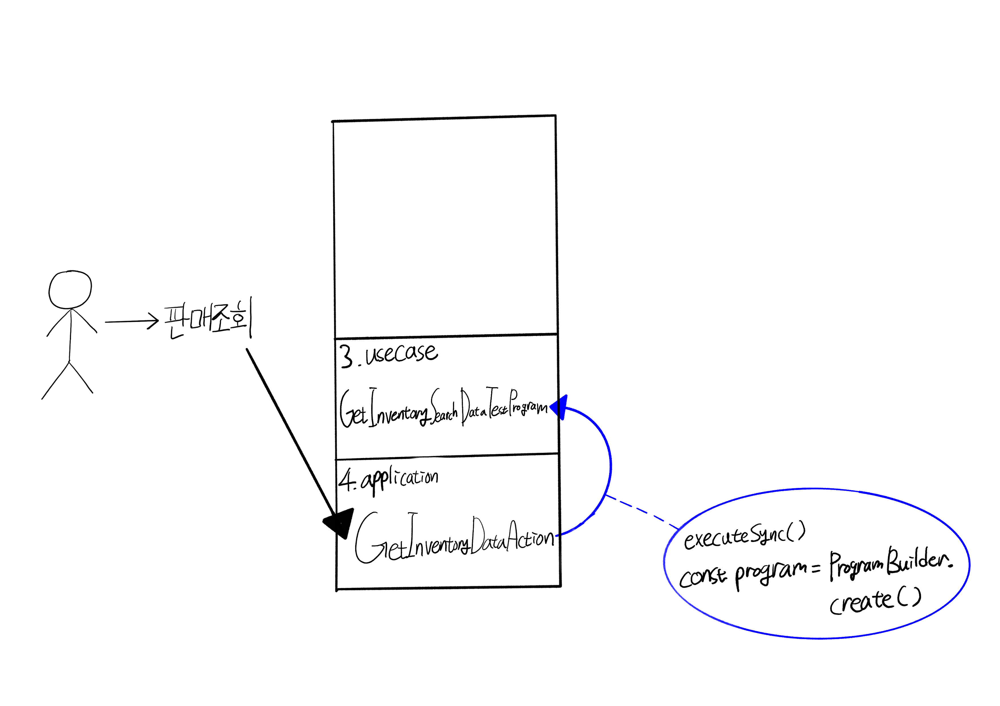
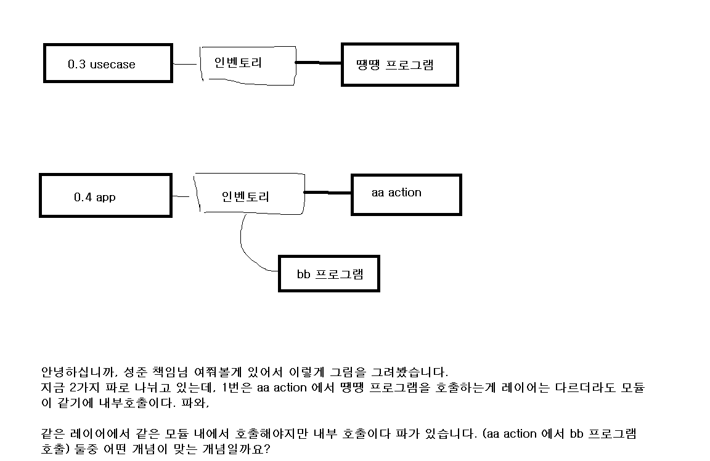
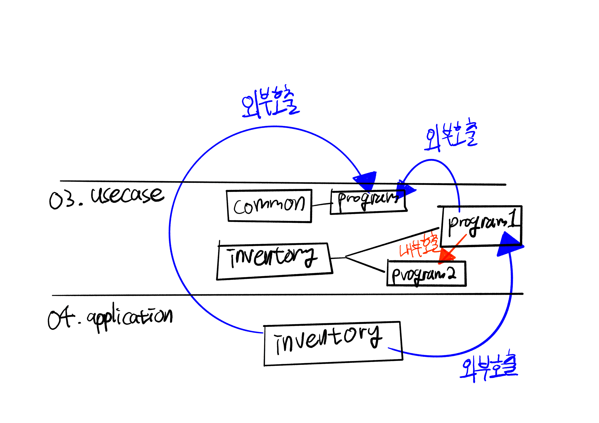

# Daily Retrospective

**작성자**: 고건호
**작성일시**: 2025-01-06

## 1. 오늘 배운 내용 (필수)

- 5.0 실습을 통한 흐름 이해

### 5.0 실습을 통한 흐름 이해

5.0 실습 코드를 작성해보며 5.0의 흐름과 아키텍처가 왜 이렇게 짜여졌는지를 이해할 수 있었습니다.

`04.application` 레이어에서는 API의 진입점만을 제공하고 실제 비즈니스 로직은 `03.usecase` 레이어에서 `program`과 `svc(service)`를 통해 지원되고 있음을 알 수 있었습니다.

`program`은 **하나의 독립된 로직의 흐름**을 가지는 로직의 단위이고 **정의부**(`ProgramIdentifier`, `interface`)와 **구현부**(`class`)로 구성됩니다.

`svc`는 `program`과는 달리 `Identifier`를 별도로 필요로하지 않고, 해당 클래스를 바로 참조해서 사용합니다. 이는 `svc`가 단순히 유틸리티 성격의 로직을 캡슐화하거나 특정 기능만을 처리하기 위한 목적이 크기 때문이라고 판단했습니다.

`svc`와 `program`의 용법과 동작 방식, 구현 방식이 다른 이유는 아직 완벽히 이해하진 못하였으나, `private`이 공식적으로 지원되지 않는 환경에서 캡슐화를 통한 객체지향 프로그래밍의 기본 원칙을 구현하기 위한 시도라고 짐작할 수 있었습니다.

#### 5.0 실습 코드

5.0에서 코드를 직접 작성하고 구현부를 갈아 끼워보며 동작의 흐름을 따라갈 수 있었습니다.

저는 `04.application` 레이어의 `GetInventoryDataAction.ts` 파일 내부 `executeSync()` 함수에 중단점을 설정하고 어떤 식으로 `03.usecase` 레이어를 호출하고 인터페이스가 동작하는지 살펴봤습니다.

우선 호출의 흐름을 간단한 그림으로 표현하면 다음과 같습니다.



최초의 `판매 조회` 요청이 들어오면 `GetInventoryDataAction.ts`의 `executeSync()` 함수는 다양한 `menu_type` 값에 따라 실행되는 로직을 분기하고 각각의 로직에서 `ProgramBuilder`를 통해 `program`을 생성하고 실행하는 구조를 가지고 있습니다.

이번 실습에서는 첫 번째 분기를 통해 `IGetInventorySearchDataTestProgram`의 구현체인 `GetInventorySearchDataTestProgram.ts`로 진입하게 되었습니다.

```typescript
import { ProgramIdentifier } from "ecount.infra.base/abstraction";
import { IBaseProgram } from "ecount.infra.bridge/base";
import {
  GetInventorySetupRequestDto,
  GetInventorySetupResultDto,
} from "@shared_usecase_inventory/@abstraction";

export const IGetInventorySearchDataTestProgram = new ProgramIdentifier(
  "IGetInventorySearchDataTestProgram"
);

export interface IGetInventorySearchDataTestProgram
  extends IBaseProgram<
    GetInventorySetupRequestDto,
    GetInventorySetupResultDto
  > {}
```

```typescript
import {
  EN_AGGREGATE_TYPE,
  EN_MENU_TYPE,
} from "ecount.fundamental.define/enum";
import { IBizz, IMenu, ISetup, ITenant, IUser } from "ecount.infra.base/setup";
import { IExecutionContext } from "ecount.infra.bridge/base";
import { my, pg } from "ecount.infra.bridge/table_model";
import { program_impl } from "ecount.infra.common/decorator";
import { BaseProgram, ProgramBuilder } from "ecount.infra.common/program";
import { menu_attrs } from "ecount.usecase.base/@abstraction";
import {
  GetPsConnSidRequestDto,
  GetV3EcmnPrgMgmtRequestDto,
  IBizzAttrGeneratorProgram,
  IGetPsConnSidProgram,
  IMenuAttrGeneratorProgram,
  IMenuAttrGeneratorProgramReqeustDto,
  IMenuHeaderGeneratorProgram,
  IMenuHeaderGeneratorProgramReqeustDto,
  ITenantAttrGeneratorProgram,
  IUserAttrGeneratorProgram,
} from "ecount.usecase.common/@abstraction";
import {
  GetInventorySetupRequestDto,
  GetInventorySetupResultDto,
  IGetInventorySearchDataTestProgram,
} from "ecount.usecase.inventory/@abstraction";

/**
 * UI 용 Search 데이터 가져오기
 */
@program_impl(IGetInventorySearchDataTestProgram)
export class GetInventorySearchDataTestProgram
  extends BaseProgram<GetInventorySetupRequestDto, GetInventorySetupResultDto>
  implements IGetInventorySearchDataTestProgram {
  // 내부 로직은 `GetInventorySearchDataProgram.ts`와 동일
}
```

#### 프로그램 생성 및 실행 흐름

##### 1. `ProgramBuilder.create()` 호출

- `ProgramBuilder.create()`는 `IGetInventorySearchDataTestProgram`을 식별자로 받아 실행 컨텍스트(`execution_context`)를 전달 받습니다.
- `create()` 함수는 내부적으로 `getCtor()` 함수를 호출하여 해당 식별자(`IGetInventorySearchDataTestProgram`)에 매핑된 클래스(`GetInventorySearchDataTestProgram`)의 생성자를 반환합니다.

##### 2. `GetInventorySearchDataTestProgram.onExecute()` 호출

- `execute()` 함수를 통`해 `onExecute()` 함수가 호출됩니다.
- `onExecute()` 함수는 실행을 위한 전반적인 로직을 포함하고 있습니다.
- `dto`를 받아 특정 데이터를 가공 후 `GetInventorySetupResultDto 타입의 결과를 반환합니다.

##### 3. 결과 반환

- `onExecute()` 함수에서 반환된 결과는 `executeSync()` 함수로 전달되어 이후 로직에서 사용됩니다.

#### 이제야 이해할 수 있었던 5.0의 비용 절감

5.0 프레임워크에 대한 개념 교육을 들으며, 이카운트의 자체 프레임워크가 계속 변화하고 발전하는 이유는 **비용 절감** 때문이라는 것을 확고히 이해했습니다.

그 관점을 유지한 채로 오늘 실습을 진행해보니, 개념 교육에서 들었던 **비용 절감**이 어떤 것이고, 그것을 이카운트에서는 어떻게 구현했고 어떻게 실무에 사용하는지 알 수 있었습니다.

`ProgramIdentifier`는 특정 `program`을 식별하기 위한 인터페이스 타입으로 동작합니다. 이 식별자를 통해 `DefaultProgramBuilder`는 어떤 프로그램을 생성해야 하는지 판단합니다.

```typescript
ProgramBuilder.create<ISetup, ISetup>(
  IGetInventorySearchDataTestProgram,
  execution_context
);
```

이 코드에서 `IGetInventorySearchDataTestProgram`은 `ProgramIdentifier` 역할을 수행하고, 이 식별자를 통해 `program`이 구별됩니다.

이렇게 인터페이스와 인터페이스의 구현부를 통한 개발은 동일한 인터페이스를 구현하는 여러 프로그램이 있을 경우 `ProgramIdentifier`를 바꾸는 것만으로 다른 구현체를 사용할 수 있습니다. 이는 이카운트의 자체 프레임워크가 궁극적으로 지향하는 비용 절감을 구현하는 핵심 요소 중 하나로 볼 수 있습니다.

---

## 2. 동기에게 도움 받은 내용

오늘 강민님, 주현님, 도형님, 성재님과 5.0에서 내부 모듈과 외부 모듈을 규정 짓는 관점에 대한 이야기를 나누며 깊이 있는 이해를 할 수 있었습니다.

---

## 3. 개발 기술적으로 성장한 점

### 1. 교육 과정 상 배운 내용이 아닌 개인적 호기심을 해결하기 위해 추가 공부한 내용

### 2. 오늘 직면했던 문제 (개발 환경, 구현)와 해결 방법

오늘 수업이 끝나고 동기들 간에 모듈의 내부 호출과 외부 호출에 대한 이해가 갈리는 일이 있었습니다.


(이 멋진 그림은 주현님이 그려주셨습니다.)

다른 레이어에서 이루어진 호출이더라도 같은 모듈이라면 내부 호출이라고 보는 입장과 같은 레이어에서 같은 모듈 내에서 이루어진 호출만 내부 호출이라고 보는 입장으로 나뉘었습니다.

간단히 설명해보자면,

```plain
(03. usecase layer)
ecount.usecase.common
ecount.usecase.inventory

(04. application layer)
ecount.application.inventory
```

위와 같은 모듈들이 존재할 때, `ecount.application.inventory`에서 호출한 `ecount.usecase.inventory`는 같은 `inventory` 도메인에 해당하니, 내부 호출이라고 봐야한다는 입장과 엄연히 레이어가 다르니 외부 호출이라고 봐야한다는 입장으로 나뉘었던 것입니다.

성준 책임님께 여쭤본 결과, 외부 호출이라고 보는 것이 더 타당하다는 결론이 났습니다.

그림을 통해 제가 이해한 바를 나타내면 아래와 같습니다.



### 3. 위 두 주제 중 미처 해결 못한 과제. 앞으로 공부해볼 내용.

오늘 코드를 통한 실습은 순전히 로직 부분은 복사 + 붙여넣기를 통한 실습이었습니다. 내일은 비즈니스 로직 부분과 DTO까지 전부 직접 코드를 작성하면서 실제 개발을 하는 것처럼 실습을 이어나가보고 싶습니다.
