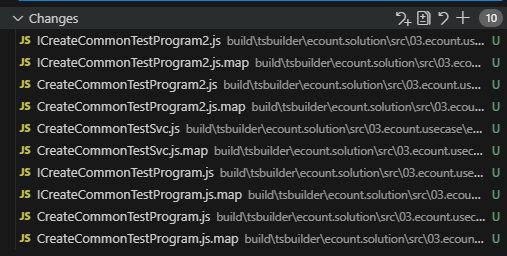

# Daily Retrospective

**작성자**: 나아연

**작성일시**: 2025-01-06

## 1. 오늘 배운 내용 (필수)

**학습목표**

- 소스 폴더와 산출물 폴더의 차이점에 대해서 이해한다.
- solution / project / module / (plaform) / micromodule 에 대한 이해

### 모듈과 마이크로 모듈

```js
import { IBasicCodeFeature, ISelectTmCdDataConnIProgram } from "ecount.usecase.basic/@abstraction";
```

- ecount.usecase.basic :모듈
- @abstraction: 마이크로 모듈

@: 실제 구현부가 아닌 테스트, 인터페이스를 구분

### 소스와 산출물

- ecount.nextv5 - 소스 폴더
- ecountv5 - 산출물 폴더

소스폴더에서 작성한 .ts 을 빌드하면 산출물 폴더에 .js파일이 생성된다.


경로 : D:\ecountv5\Runtime\vshared\modules

### Program & Svc

**Program**

- 하나의 독립된 로직의 흐름을 가지는 로직의 단위
- 하나의 인터페이스만 제공(`execute()`)
- 정의부(ProgramIdentifier, interface)와 구현부(class)로 구성

**Svc**

- SVC는 주로 usecase 모듈 내부에서 사용되는 비즈니스 로직을 개발 하기 위한 command
- Identifier를 별도로 정의하지 않고 해당 클래스를 바로 참조해서 사용
- 이로 인해 Svc는 해당 모듈 밖에서는 참조할 수 없음
- 만약, 특정 Svc를 다른 모듈에서 사용하는 경우는 Program으로 변경해서 외부로 export 해야 함

| 구분    | 설명                                                             | 참고                                              |
| ------- | ---------------------------------------------------------------- | ------------------------------------------------- |
| svc     | private \| 다른 모듈에서 사용하지 않는 것                        | ecount.usecase.common != ecount.usecase.inventory |
| program | public \| program 사용할 때 인터페이스를 호출해야 하는 제약 존재 |                                                   |
| feature | dependency injection                                             |                                                   |

### 구현하기 시 주의사항

- `index.ts`에 내가 추가한 파일을 넣어야함
- 프로젝트 참조할 때 마이크로 모듈 단위로 할 것

## 2. 동기에게 도움 받은 내용 (필수)

성철님과 어려운 부분을 공유하며 든든함을 얻었습니다!!

## 3. 개발 기술적으로 성장한 점 (선택)

### 1. 교육 과정 상 배운 내용이 아닌 개인적 호기심을 해결하기 위해 추가 공부한 내용

**typescript @(decorator)**

자바에서는 어노테이션이라 불리는 `@`를 타입스크립트에서는 데코레이터라고 부른다.

> 자바 어노테이션은 컴파일 타임에 상관지만 **타입스크립트 데코레이터는 컴파일 타임에는 상관하지 않아**, 오히려 파이썬의 데코레이터와 유사하다고 한다.

데코레이터를 잘 사용하면 횡단 관심사를 분리하여 관점 지향 프로그래밍을 적용한 코드를 작성할 수 있다.

데코레이터는 일종의 함수이며 메타 프로그래밍의 한 기법으로, 클래스나 메서드, 속성 등에 메타데이터를 추가하거나 수정하는 데 사용됩니다. 이는 런타임 시점에서 객체의 동작을 동적으로 변경할 수 있는 강력한 도구다.

잘 이해할 수 없다.

```tsx
@program_impl(ICreateCommonTestProgram)
export class CreateCommonTestProgram extends BaseProgram<TestDto, string> implements ICreateCommonTestProgram {
  constructor(execution_context: IExecutionContext) {
    super(execution_context);
  }

  onExecute(dto: TestDto): string {
    console.log(dto);

    return "hi";
  }
}
```

```jsx
let CreateCommonTestProgram = class CreateCommonTestProgram extends BaseProgram {
  constructor(execution_context) {
    super(execution_context);
  }
  onExecute(dto) {
    console.log("hi");
    return "hi";
  }
};
CreateCommonTestProgram = __decorate([program_impl(ICreateCommonTestProgram)], CreateCommonTestProgram);
export { CreateCommonTestProgram };
```

오늘 구현과제였던 Program을 컴파일했을 때 `@program_impl`의 모양이 바뀐 것을 확인했다.
일단 데코레이터가 함수라는 것은 파악할 수 있었다..

---

**왜 `index.ts`에 파일을 추가해야 할까 ?**

=> 한 번에 export 하기 위해서 ..

### 3. 위 두 주제 중 미처 해결 못한 과제. 앞으로 공부해볼 내용.

산출물을 보면서 데코레이터가 함수인 것은 파악했으나, 어떻게 동작하는지 파악하지 못했다.
program_impl 데코레이터로 해당 프로그램의 ProgramIdentifier를 지정하는데 사용한다.
후에 ProgramBuilder를 통해서 특정 Program을 실행한다.

스프링과 비교했을 때, 스프링은 빈으로 등록한 인터페이스의 구현체를 스캔하고 등록하여 의존성 주입을 하는데
여기서도 어떤 Program을 사용할지 의존성을 주입받을 때 필요한 것이 아닐까 추측한다.
데코레이터가 횡단 관심사를 분리하는데 유용하다고 하니, 어떤 객체를 사용할지 선택하는 로직을 횡단관심사로 두고 실제 로직에 집중할 수 있도록 `@program_impl`을 사용한 것은 아닐지 생각한다.

이전에도 해결하지 못한 과제인데, Identifier를 사용하는 이유가 무엇인지 파악하지 못했다.
