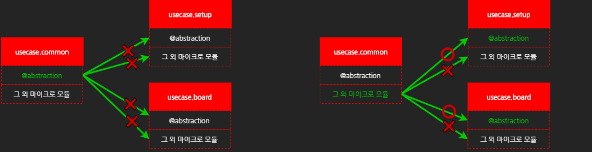
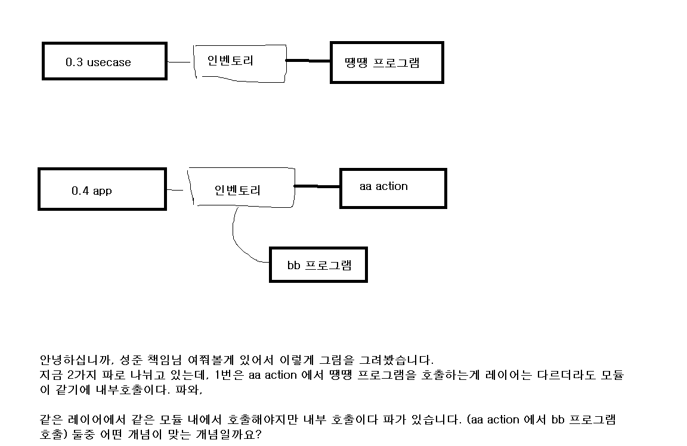

# Daily Retrospective

**작성자**: [박주현]  
**작성일시**: [2025-01-06]

# 1. 오늘 배운 내용

## 1️⃣ 5.0 디렉토리 구조

5.0 의 소스 코드 흐름을 보기 위해 디렉토리 구조를 살피고, program과 svc 를 만들어 보았습니다.


### 📍소스 폴더/산출물 폴더

5.0 프레임워크의 디렉토리는 크게 2가지로 나뉩니다. `ecount.nextv5 - 소스 폴더`, `ecountv5 - 산출물 폴더`
소스폴더에서 작성한 .ts 을 빌드하면 산출물 폴더에 .js파일이 생성됩니다. ts 파일로 소스코드를 작성하고, build 를 하면 ecountv5 폴더에 작성한 소스를 js 파일로 변환하여 갖게됩니다. 5.0 프레임워크 서버를 가동시키면 산출물 폴더의 소스를 벨록스 인터프리터가 읽어 런타임환경이 되어 실행하게 됩니다.
이렇게 소스 폴더와 산출물 폴더를 나누면 2가지 장점을 갖습니다.

> 👍 장점
>
> 1. 개발자의 전체 빌드 시간 최소화 f8 를 눌러 부분 빌드가 가능합니다.
> 2. 다른팀의 소스에 관여 하지 않는다.

### 📍주요 폴더

ecount.nextv5가 root 폴더이며 하위에 5개의 주요 폴더가 있습니다.

```
1. ecount.solution - 5.0 프레임워크를 구성하는 여러 프로젝트들이 있습니다. 대부분의 개발자들이 개발을 하고 있는 5.0 프레임워크 메인 솔루션입니다.

2. @env - 5.0 프레임워크를 위한 여러 설정 정보, 실행 환경 정보 등이 있습니다.

3. ecount.core - 5.0 프레임워크를 구동하기 위한 저수준의 서버 모듈이 있습니다(velox등)

4. ecount.core.browser - 5.0 프레임워크를 구동하기 위한 저수준의 브라우저 모듈이 있습니다(uikit등)

5. ecount.misc - ecount.solution이외의 5.0을 구성하기 위한 다양한 프로젝트가 존재합니다.
```

### 📍프로젝트(project)

ecount.solution 하위에는 총 4개의 프로젝트로 구성되어 있습니다.

프로젝트의 순서는 프로젝트간 참조의 순서를 의미합니다.

상위 프로젝트에서 하위 프로젝트는 참조할 수 없습니다.

01.ecount.fundamental 프로젝트에서 02.ecount.infrastructure를 참조할 수 없습니다.

하나의 프로젝트에는 여러개의 모듈(module) 구성되어 있습니다.

**01.ecount.fundamental**

5.0의 가장 기초적인 소스들이 있는 폴더

**02.ecount.infrastructure**

Base 가 되는 인터페이스 등 소스 코드 틀이되는 인터페이스나 소스코드가 있는 폴더

**03.ecount.usecase**

03.ecount.usecase 프로젝트는 주로 이카운트 ERP의 업무(비즈니스) 로직을 다루는 레이어 입니다.
usecase 모듈의 각 이름은 주로 해당 usecase가 다루는 업무 도메인으로 분류되어 정의됩니다.

```
ecount.usecase.base - 플랫폼 독립적인 모듈, usecae내의 최상위 모듈, 모든 usecase에서 참조가 필요한 타입이 주로 위치합니다.
ecount.usecaes.common - 여러 업무에 공통적으로 필요한 로직이 위치합니다. ecount.usecase.base 하위에 위치합니다.
ecount.usecase.inventory - 주로 재고업무를 다루는 로직이 위치합니다.
ecount.usecase.setup - 주로 설정과 관련된 업무를 다루는 로직이 위치합니다.
```

@asbtraction - 다른 모듈에서 참조할 수 있게 모듈 밖으로 export 됩니다. 주로 interface와 Identifier를 정의합니다.

@implement - 다른 모듈에서 참조할 수 있게 모듈 밖으로 export 됩니다. 주로 구현체(class)를 정의합니다.

그외 마이크로 모듈 - 대부분의 업무로직이 위치합니다(program, dac, svc등) 구성됩니다. 외부로 export 되지 않습니다. 해당 usecaes 내에서만 참조 가능합니다.


다른 모듈내에서 프로그램을 호출하기 위해선 @abstraction 의 인터페이스를 활용하여 호출해야 합니다.

**04.ecount.application**
5.0 프레임워크 API 의 진입점으로 여러가지 action 소스코드들이 존재합니다.

### 📍모듈(module)

프로젝트 내의 여러 로직들을 플랫폼(base, server, browser) 단위로 구성한 폴더입니다.

```
예외적으로 01.ecount.fundamental 프로젝트와 ecount.infra.base, ecount.usecase.base 모듈은 플랫폼 독립적인 폴더입니다.
```

그외의 모든 모듈은 server / brwoser와 같이 플랫폼을 기반한 폴더 구성을 가지고 있습니다.
하나의 모듈은 여러개의 마이크로 모듈(micromodule)로 구성되어 있습니다.
@shared 폴더는 server와 browser에서 동일하게 사용하는 마이크로 모듈을 정의하는 폴더입니다.

### 📍플랫폼(platform)

플랫폼(base, server, browser) 단위로 구성한 폴더입니다.
base 는 server와 browser를 융합한 복합 소스가 있는 폴더이고, browser와 server 폴더는 각각의 소스를 갖는 폴더입니다.

### 📍마이크로 모듈(micromodule)

소스코드 내에서 참조할 수 있는 단위를 의미합니다.
5.0 내에 작성된 모든 모듈(일반적의미)은 마이크로 모듈(micromodule) 단위로 참조 할 수 있습니다.
(일부 모듈단위 프로젝트 제외)

---

# 2. 동기에게 도움 받은 내용

건호님께 소스코드가 달라서 충돌나는 부분이나 브랜치의 헤더가 다른 커밋을 바라보아 발생하는 소스코드 누락 문제를 도와주셨습니다. 수경님이 텐텐을 주셔서 개발자로서 '성장'을 이끌어주셨습니다. 강민님과 도형님, 현철님, 성재님과 외부호출및 내부호출에 대해 이야기를 나눠 도움을 받았습니다.

---

# 3. 개발 기술적으로 성장한 점

## 3-2. 오늘 직면했던 문제 (개발 환경, 구현)와 해결 방법

program과 svc 를 test 로 만들어서 판매조회시 디버깅이 되는지를 테스트해보았습니다.
이때 program과 svc이 각각 무엇인지 이해하고 호출을 하는 방법에 대해 공부하였습니다.

### 외부 호출 vs 내부 호출

```ts
// 1. svc 호출
// CreateCommonTestSvc
// 1-1. 동일 모듈

const svc = SvcCommandBuilder.create(
  CreateCommonTestSvc,
  this.execution_context
);
const result = svc.execute(dto);

// 1-2. 다른 외부 모듈 (svc는 private 제외)

// 2. program 호출
// CreateCommonTestProgram
// 2-1. 동일 모듈
//  common.
const test_program = ProgramBuilder.create<CreateCommonTestProgram, string>(
  ICreateCommonTestProgram,
  execution_context
);

test_program.execute();

// CreateCommonTestProgram2
// 2-2. 다른 외부 모듈
const test_program = ProgramBuilder.create<CreateCommonTestProgram, string>(
  ICreateCommonTestProgram,
  execution_context
);

test_program.execute();
```

위 과제를 구현하는 것이 문제였는데, 동기들끼리 해석하는 부분이 달라 각각 다르게 구현을 하고 내부호출과 외부 호출에 대해서 심도있는 고민을 하였습니다.

관련하여 성준 팀장님께 여쭤보았고, 모호한 부분을 고쳐주시며 넓은 의미에선 중요하지 않는 개념이라 배웠습니다.

### 질문



### 답변

```
모듈을 어떻게 볼꺼냐에 따라서 다를것 같은데,
모듈을
(03 layer)
ecount.usecase.common
ecount.usecase.inventory

(04 layer)
app.inventory

각각 다른 모듈로 보는게 맞는것 같습니다.

최초 제 요구사항이 직관적인 이해를 떨어뜨린것 같아요.
03 layer 프로그램에서 inventory 모듈(같은모듈)의 program을 호출하고, common 모듈(다른 모듈)의 program을 호출하게 구현해 주세요.

최초 가이드에서 이미 모듈의 기준을 구분지어 났기때문에 (물리적인 분리) 후자가 맞는것 같아요.
```

결국 내부 호출이란 무조건 같은 모듈 내에서 일어나는 호출을 말하는 것이고, 외부 호출이란, 다른 모듈 및 다른 프로젝트의 다른 모듈에서 호출하는 것을 모두 외부 호출이였습니다.

### program vs svc

둘의 차이점이 직관적으로 와닿지 않았고, 좀 더 깊게 학습했습니다.

**Program**

하나의 독립된 로직의 흐름을 가지는 로직의 단위입니다.
하나의 인터페이스만 제공합니다(execute())
정의부(ProgramIdentifier, interface)와 구현부(class)로 구성됩니다.

**Svc**

SVC는 주로 usecase 모듈 내부에서 사용되는 비즈니스 로직을 개발 하기 위한 command입니다.
Identifier를 별도로 정의하지 않고 해당 클래스를 바로 참조해서 사용하는 것이 특징입니다.
이로 인해 Svc는 해당 모듈 밖에서는 참조할 수 없습니다.
만약, 특정 Svc를 다른 모듈에서 사용하는 경우는 Program으로 변경해서 외부로 export 해야 합니다.
command란, IExecutableSync 타입을 implements한 클래스 또는 객체(duck typing)를 의미합니다.

> 요약
>
> ```
> program  - 하나의 독립된 로직의 흐름을 가지는 로직의 단위, interface가 하나만 존재(execute())
>
> feature - 특정 목적을 위해 설계된 클래스, 다양한 interface 설계
>
> svc - 특정 usecase 내부에서만 사용하는 비즈니스 로직의 단위 , interface가 하나만 존재(execute())
> ```

### 소프트웨어 아키텍처에 대한 궁금증

이카운트 5.0 내에서 쓰이는 디자인패턴은 이해가 가고, 직관적으로 왜 쓰는지 이해가 갔지만 소프트웨어 아키텍처는 이런 구조를 갖는 이유가 궁금했습니다.
널리 쓰이는 MVC 패턴이 있지만, 이와 비슷한 개념은 있되 그 구조가 매우 달랐습니다. Action은 요청의 진입점으로서 C 컨트롤러와 비슷한 역할을 하고 프로그램과 svc 는 m은 세분화 한 것과 비슷하고(마이크로 서비스처럼 작게 나누어) 프론트엔드 파트와 browser 폴더 소스는 아마도 v와 비슷한 개념을 가질 것이라 생각이 됩니다.

5.0 소스를 보면 SOLID 에서도 Dependency Inversion Principle (의존성 역전 원칙)을 매우 잘 지킨 프레임워크로 보입니다. 저수준 모듈은 고수준 모듈을 의존하지 못하고, 모듈간 의존을 할 때도 인터페이스를 의존하고 있습니다.(@abstraction) 하지만 소프트웨어 아키텍처에 대해선 왜 이렇게 했는지 이해가 아직 가지 않습니다.
서비스가 도메인 별로 아닌 공통화를 위해서라도 공통화 기능을 하나의 모델(도메인으로) 생각하고 코딩을 할 수 있을 거 같습니다.

그나마 현재 5.0과 비슷한 소프트웨어 아키텍처를 찾아보았는데, MVVM 패턴과 비슷했습니다.

```
MVVM 패턴의 동작 순서는 아래와 같습니다.

1. 사용자의 Action들은 View를 통해 들어오게 됩니다.
2. View에 Action이 들어오면, Command 패턴으로 View Model에 Action을 전달합니다.
3. View Model은 Model에게 데이터를 요청합니다.
4. Model은 View Model에게 요청받은 데이터를 응답합니다.
5. View Model은 응답 받은 데이터를 가공하여 저장합니다.
6. View는 View Model과 Data Binding하여 화면을 나타냅니다.
```

하지만 MVVM 패턴은 UI 애플리케이션 개발에서 사용되는 소프트웨어 아키텍처 패턴입니다. 왜 이런 구조를 갖게되었는지, 아키텍처 강의가 있다면 요청의 흐름, 그리고 소스 코드 작성에 대해 이해가 쉬울 것 같습니다.

---

# 4. 소프트 스킬면에서 성장한 점

동기들과 함께 토론하고 문제를 함께 해결하는 태도가 성장하였습니다.

---

# 5. 제안하고 싶은 내용

5.0엔 커맨드 패턴말고도 더 많은 디자인 패턴이 있다고 느낍니다. 먼저 빌더 패턴이 있습니다. 널리쓰이는 빌더 패턴과 다르지만, 자체적으로 사용하는 SVC, Program 빌더 패턴에 대한 교육이 있다면 좋다고 생각하였습니다.

이런 아키텍처를 갖게된 이유, 아키텍처 구조를 체계화해 교육이 있었으면 좋겠습니다. 모든 사람들이 각자가 가진 지식을 기반으로 현재의 내용을 이해하고 있습니다. 각자가 가진 백그라운드 수준 및 지식이 각각 다르기 때문에 누군가는 특정 부분에 대핸 이해를 하지만, 다른 부분은 감을 못잡거나, 아예 이해를 못하는 사람이 발생할 수 있다고 생각합니다. 전향자 선배분들도 이것이 왜 이렇게 되는지 모르고 그저 주어진대로만 하기에 어려움을 느끼시는 것 같았습니다.

각각의 브랜치의 제일 최신 커밋이 달라 소스 코드 내용이 다릅니다. 특히나 지금 '판매조회' 기능으로 테스트 중인데, 이카운트 내부에서 판매조회를 개발중에 있어 어제와 오늘의 화면이 다르게 나오거나 갑자기 이상한 에러가 나타나 해결하는데에 많은 시간을 소요하고 있습니다.
