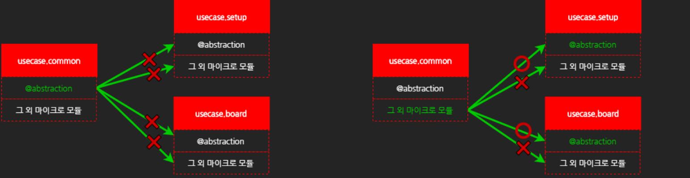

# Daily Retrospective

**작성자**: [이지은]  
**작성일시**: [2025-01-06]

## 1. 오늘 배운 내용 (필수)

### 5.0 프레임워크 구조 및 개발 환경

#### ecount.solution 프로젝트

ecount.solution 하위에는 총 4개의 프로젝트로 구성되어 있다.

-   `01.ecount.fundamental`
-   `02.ecount.infrastructure`
-   `03.ecount.usecase`
-   `04.ecount.application`

프로젝트의 순서는 프로젝트 간 참조 순서를 의미한다.

상위 프로젝트에서 하위 프로젝트는 참조할 수 없다. </br>
ex. `01.ecount.fundamental` 프로젝트에서 `02.ecount.infrastructure`를 참조할 수 없다.

#### ecount.solution 모듈 / 마이크로 모듈

모듈은 프로젝트 내의 여러 로직들을 플랫폼(base, server, browser) 단위로 구성한 폴더이다. <br>
하나의 모듈은 여러 개의 마이크로 모듈(micromodule)로 구성되어 있다.

-   소스 코드 내에서 참조할 수 있는 단위를 의미한다.
-   5.0 내에 작성된 모든 모듈은 마이크로 모듈 단위로 참조할 수 있다.

#### ecountv5(산출물) 폴더

TSBuilder를 통해 `.ts` 파일은 컴파일 되어서 해당 파일이 속한 플랫폼별 산출물 폴더에 `.js` 파일로 변환된다.<br>
산출물의 root 폴더 하위에는 모듈(module) 단위 폴더가 구성된다.<br>
server는 `.ts` 파일이 `.js` 파일로 단순 트랜스파일 되지만, browser는 모듈(module) 단위로 번들링 되어 `.js` 파일이 생성된다.<br>
또한, 브라우저의 `.js` 파일은 동적 로딩을 위한 산출물의 version 정보도 함께 생성된다.<br>

### svc

-   svc는 주로 usecase 모듈 내부에서 사용되는 비즈니스 로직을 개발하기 위한 command이다.
-   Identifier를 별도로 정의하지 않고 해당 클래스를 바로 참조해서 사용하는 것이 특징이다. 이로 인해 svc는 해당 모듈 밖에서는 참조할 수 없다.
-   만약 특정 svc를 다른 모듈에서 사용하는 경우는 Program으로 변경해서 외부로 export해야 한다.
    -   svc -> private
    -   program -> public

### Program

-   하나의 독립된 로직의 흐름을 가지는 로직의 단위이다.
-   하나의 인터페이스만 제공한다 -> execute()
-   정의부(ProgramIdentifier, interface)와 구현부(class)로 구성된다.
    -   ProgramIdentifier - 해당 프로그램을 외부에서 참조하기 위한 식별자
    -   interface - 해당 프로그램의 input, output 명세를 위한 interface
-   동일한 파일에 프로그램의 interface 명세도 함께 작성한다.
    -   반드시 ProgramIdentifier와 interface의 이름(ICheckAuthorityProgram)을 일치시켜야 한다.

### usecase 모듈 export 원칙

usecase는 각각의 도메인 별로 모듈이 구성되었지만, 각 업무 간에는 서로 참조해야 할 상황이 많이 발생한다. <br>
이를 위해 usecase 내의 마이크로 모듈은 아래와 같이 구성되며 각각 구조적인 특징을 가지고 있다.

-   @abstraction - 다른 모듈에서 참조할 수 있게 모듈 밖으로 export된다. 주로 interface와 Identifier를 정의한다.
-   @implement - 다른 모듈에서 참조할 수 있게 모듈 밖으로 export된다. 주로 구현체(class)를 정의한다.
-   그 외 마이크로 모듈 - 대부분의 업무 로직이 위치한다. (program, dac, svc 등) 외부로 export되지 않는다. 해당 usecase 내에서만 참조 가능하다.



대부분의 usecase를 구성하는 업무 로직은 그외 마이크로 모듈에 위치한다.
이는 해당 usecase 외부로 export 할 수 없다. 만약 해당 업무로직이 다른 모듈로 export 해야 한다면 아래의 원칙에 따라 개발하면 된다.

1. 구현체 자체를 export 해야 하는 경우 - @implement

    - 특정 class를 위부로 노출해야 하는 경우가 있습니다. 주로 Feature인 경우가 많다.
    - 해당 class 를 직접 참조해서 상속을 구현할 경우, 해당 class의 인스턴스를 직접 생성해서 실행할 경우 등에 해당된다.
    - 이럴 때는 해당 class를 @implement 에 추가하여 export한다.
    - 그러면 다음과 같이 참조할 수 있다.

    ```ts
    import { some_feature } from "ecount.usecase.common/@implement";
    ```

2. 구현체를 export 하지 않아도 되는 경우 - @abstraction
    - 단순히, 특정 비즈니스 로직의 호출을 외부에서 해야 하는 경우는 해당 로직을 Program으로 만든 후 ProgramIdentifer를 @abstraction에 추가하여 외부로 export 하면 된다.

### Program vs Feature vs SVC

#### 정의

-   Program : 하나의 독립된 로직의 흐름을 가지는 단위, interface가 하나만 존재(execute())
-   Feature : 특정 목적을 위해 설계된 클래스, 다양한 interface 설계
-   svc : 특정 usecase 내부에서만 사용하는 비즈니스 로직의 단위, interface가 하나만 존재 (execute())

#### 5.0 프레임워크 내의 구조적 제약을 기준으로 판단해보자.

-   내가 만든 모듈을 외부 모듈에서 쓸 수 있게 expor해야 한다 – program, feature (svc로 만들면 코드가 간결해진다, interface X)
-   04에 있는 외부 환경에 의존적인 로직 이다 – feature
-   02에서도 사용할 수 있다 – feature (program X), feature는 infra.bridge에 정의 가능
-   런타임에 동적으로 변경가능(주입)해야 한다(1:N) – feature

## 2. 동기에게 도움 받은 내용 (필수)

-   **다은님**: 기능적인 부분을 워낙 잘 알고 계셔서 같이 차근차근 정리해보니까 코드의 구조를 이해할 수 있었습니다.
-   **수경님**: svc를 구현할 때, 모르는 부분에 대해 설명해주셨습니다.
-   **승준님**, **도형님**: Program을 구현할 때 디버그 콘솔에 index 관련 에러가 발생했었는데 같이 문제되는 부분을 찾아주셔서 해결하고 넘어갈 수 있었습니다.

---

## 3. 개발 기술적으로 성장한 점 (선택)

### 1. 교육 과정 상 배운 내용이 아닌 개인적 호기심을 해결하기 위해 추가 공부한 내용

다음 수업을 위해서 Dependency Injection 관련 내용을 공부해 놓으면 이해하기 쉬울 거라고 말씀해주셔서 c#에서의 DI에 대해 찾아봤다.

### Dependency Injection (DI)

#### Dependency Injection

-   Dependency Injection은 객체가 자신의 의존성을 스스로 생성하지 않고, 외부에서 제공받도록 설계하는 소프트웨어 개발 기법이다. 이 패턴은 객체 간의 결합도를 줄이고, 코드의 유연성과 재사용성을 높이는 데 도움을 준다.

#### DI는 왜 필요한가?

소프트웨어에서 객체는 다른 객체의 기능을 필요로 하는 경우가 많다.<br>
예를 들어, OrderService가 PaymentService를 사용해야 한다고 가정해 보자.

1. 전통적인 방식 (강한 결합)

    ```c#
    public class OrderService
    {
        private PaymentService _paymentService;

        public OrderService()
        {
            _paymentService = new PaymentService();
        }

        public void ProcessOrder()
        {
            _paymentService.ProcessPayment();
        }
    }
    ```

    - OrderService는 PaymentService를 직접 생성하고 사용한다.
    - 이 경우 두 클래스 간의 결합도가 높아지며, PaymentService를 변경하거나 교체하기 어려워진다.

2. Dependency Injection (약한 결합)

    ```c#
    public class OrderService
    {
        private readonly IPaymentService _paymentService;

        // 의존성을 외부에서 주입
        public OrderService(IPaymentService paymentService)
        {
            _paymentService = paymentService;
        }

        public void ProcessOrder()
        {
            _paymentService.ProcessPayment();
        }
    }
    ```

    - OrderService는 PaymentService에 의존하지만, 이를 직접 생성하지 않고 외부에서 주입받는다.
    - 이렇게 하면 PaymentService를 다른 구현으로 쉽게 교체할 수 있다.

#### Dependency Injection의 장점

-   유지보수성 증가
-   테스트 용이성
-   유연성 및 재사용성 증가
-   코드 가독성 향상

#### Dependency Injection의 구현 방식

1. Constructor Injection

    ```c#
    public class OrderService
    {
        private readonly IPaymentService _paymentService;

        public OrderService(IPaymentService paymentService)
        {
            _paymentService = paymentService;
        }
    }
    ```

    - 생성자를 통해 의존성을 주입한다.

2. Property Injection

    ```c#
    public class OrderService
    {
        public IPaymentService PaymentService { get; set; }
    }
    ```

    - 속성을 통해 의존성을 주입한다.

3. Method Injection

    ```c#
    public void ProcessOrder(IPaymentService paymentService)
    {
        paymentService.ProcessPayment();
    }

    ```

    - 의존성을 메서드의 매개변수로 주입한다.

#### DI 컨테이너

-   의존성 관리를 자동화하는 도구가 DI 컨테이너이다.
-   대표적인 DI 컨테이너로는 Microsoft.Extensions.DependencyInjection, Autofac, Ninject 등이 있다.

### 2. 오늘 직면했던 문제 (개발 환경, 구현)와 해결 방법

### index 에러

**승준님**, **도형님** 도움으로 해결

#### 1차 문제: index.ts 에러 발생

-   새로 구현한 프로그램을 index.ts에 작성했으나, 디버깅 과정에서 에러가 발생하여 디버그 콘솔에 빨간 에러 메시지가 출력됨.
-   팀장님께 확인한 결과, index.ts에 인터페이스와 구현부를 모두 선언해야 했다는 사실을 알게 됨. 일부 선언이 누락되어 문제가 발생한 것.
-   누락된 부분을 추가해 1차 문제는 해결했으나, 이후에도 index.ts에서 문제가 계속 발생하여 어디가 문제인지 찾기가 어려운 상태였음.
-   구조적인 이해 부족으로 문제 해결에 많은 시간이 소요됨.

#### 2차 문제: ProgramBuilder 중복 호출

-   index.ts 문제 해결이 어려워 승준님이 코드를 검토.
-   문제를 확인한 결과, 프로그램 내부에서 ProgramBuilder를 중복 호출하고 있었음.
-   ProgramBuilder가 이미 호출된 상태에서 다시 호출되면서 문제가 발생했던 것으로 확인됨.
-   중복 호출된 부분을 제거한 뒤 디버깅이 정상적으로 작동함.

#### 결론

-   1차 문제는 index.ts에 인터페이스와 구현부를 모두 선언해야 한다는 규칙을 누락한 것이 원인이었음.
-   2차 문제는 ProgramBuilder를 중복 호출한 로직에서 문제가 발생했음.
-   두 문제를 해결한 후, 디버깅이 원하는 대로 작동함.

### Program, SVC, inventory, common

오늘 실습 시작부터 감을 잡기 어려웠다. 전체적으로 실습을 마치고 나서 헷갈렸던 부분이 뭘까 생각을 해봤는데 비즈니스 로직을 구현하는 두 방법인 Program과 SVC를 비교해야 했고, inventory와 common에 구현한 모듈을 비교했어야 했는데 이 두 가지 개념이 섞이면서 먼 산으로 가고 있었던 것 같다.
주현님이 팀장님께 채팅으로 물어봤던 개념에 대해 다시 생각해보면서 관련 내용을 정리할 수 있었다.

-   Program & SVC
    -   Program: 동일한 모듈에서만 사용하는 로직에 적합.
    -   SVC: 외부 모듈에서도 사용될 가능성이 있는 경우 사용.
-   inventory & common
    -   inventory: 특정 모듈 내에서만 사용하는 기능이나 로직을 구현.
    -   common: 여러 모듈에서 공통으로 사용되는 기능이나 로직을 구현.

=> 지금 생각해보면 당연한건데 오전 내내 헷갈렸다.

### 3. 위 두 주제 중 미처 해결 못한 과제. 앞으로 공부해볼 내용.

svc 관련 실습을 할 때 xxxSvc.ts 코드를 살펴보면 DacBuilder로 Dac을 부르는 코드들이 있었다. Dac에 대해 궁금해졌는데 매뉴얼에는 관련 내용이 쓰여져 있는게 없어서 궁금하다.

---

## 4. 소프트 스킬면에서 성장한 점 (선택)

실습이 끝난 뒤 다은님과 함께 이론적으로 하나씩 다시 생각해보는 시간을 가졌다. 다양한 상황을 가정하며 "이렇게 했을 때", "저렇게 했을 때"의 예시를 들어보며 정리한 덕분에 내용을 더 빠르고 명확하게 이해할 수 있었다.
