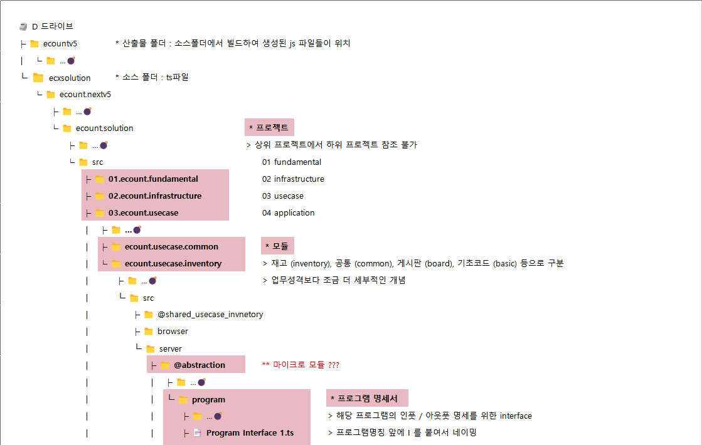
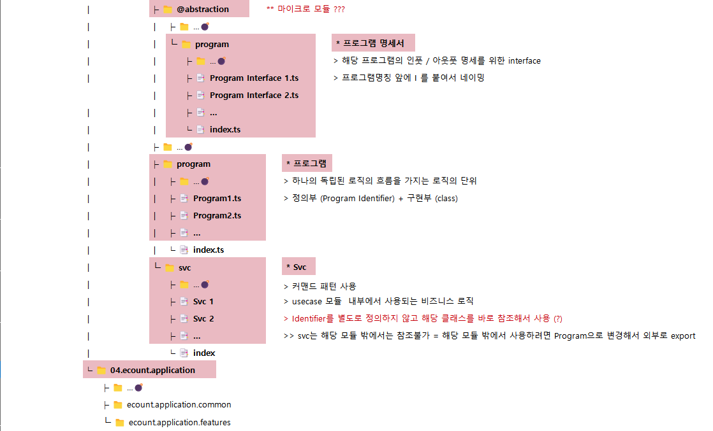

# Daily Retrospective

**작성자**: [최현철]  
**작성일시**: [2025-01-06]

## 1. 오늘 배운 내용 (필수)

1. 소스 / 산출물 폴더

   - ecount.nextv5 : 소스폴더 (소스폴더에서 작성 후 빌드하면)
   - ecountv5 : 산출물 폴더 (여기에 js파일로 생성)

2. 프로젝트 레이어

   - 01.ecount.fundamental
   - 02.ecount.infrastructure
   - 03.ecount.usecase
   - 04.ecount.application

3. 모듈 / 마이크로 모듈

   - 참조할 때에는 마이크로 모듈 단위로 참조해야한다.
   - 03.ecount.usecase 내에 있는 ecount.usecase.setup 이라는 모듈
   - 해당 모듈 내 @implement 라는 마이크로 모듈
   - ts 파일 추가 시 index파일에도 추가해야함

4. 신규 프로젝트를 만들 때 project.base.json 파일 내에 정보를 넣어줘야함(?)

   - 속도이슈떄문

5. 구현하기

   - svc : 모듈 내에서만 참조 private
   - program : public
   - feature : 내일 이어서 진행

## 2. 동기에게 도움 받은 내용 (필수)

1. 빌드가 안되는 문제에 대해서 강민님이 해결해주셨습니다. 소스폴더와 산출물 폴더의 리모트 다른 문제

2. 마이크로 모듈에 대해 이해가 안갔는데, 주현님꼐서 공부하신 내용을 설명해주셨습니다.

- 모듈 > 플랫폼 > 마이크로모듈

3. 성철님이 저녁을 주문해주시고, 주현님과 함께 3층에 옮겨주셔서 저녁을 편하게 먹을 수 있었습니다.

4. 오늘 교육 내내 이해가 어려워 질문조차 못했었는데, 주현, 성재님이 질문을 많이해주셔서 따라가는데 도움이 되었습니다.

5. 9시가 넘어 피곤했는데 수경님께서 텐텐을 주셔서 힘나서 더 공부하였습니다.

---

## 3. 개발 기술적으로 성장한 점 (선택)

### 1. 교육 과정 상 배운 내용이 아닌 개인적 호기심을 해결하기 위해 추가 공부한 내용

1. 디렉토리 구조/역할 익숙해지기
   
   

2. 프로그램 구현 익숙해지기

   1. 프로그램 파일 생성/작성 - ★파일 생성했으니 index.ts에도 반드시 추가하기

      ```typescript
      import { MicroModules(?) } from "ecount.project.module/micro_module";

      @program_impl(IProgramName)
      export class ProgramName
      extends BaseProgram<InputType, OutputType>
      implements IProgramName
      {
      constructor(execution_context: IExecutionContext) {
         super(execution_context);
      }

      onExecute(dto: InputType): OutputType {
         // 실행로직
      }
      }
      ```

   2. 프로그램 명세 (=인터페이스 만들기) - ★파일 생성했으니 index.ts에도 반드시 추가하기

      ```typescript
      import { MicroModules(?) } from "ecount.project.module/micro_module";

      export const IProgramName = new ProgramIdentifier(
      "IProgramName"
      );

      export interface IProgramName
      extends IBaseProgram<InputType, OutputType> {}
      ```

   3. 프로그램 호출

      ```typescript
      const program_name = ProgramBuilder.create<InputType, OutputType>(
      IProgramName,
      this.execution_context
      );

      program_name.excute(dto: InputType);
      ```

3. svc 구현 익숙해지기

   1. svc 파일 생성 - ★파일 생성했으니 index.ts에도 반드시 추가하기

      ```typescript
      import { SvcCommand } from "ecount.infra.common/svc";

      export class SvcName extends SvcCommand<InputType, OutputType> {
        protected onExecute(request_dto: InputType): OutputType {
          // 실행로직
        }
      }
      ```

   2. svc 호출

      ```typescript
      const svc_name = SvcCommandBuilder.create(
        SvcName,
        this.execution_context
      );
      svc.execute(request_dto);
      ```

4. 프로그램, svc 클래스의 부모 확인해보기

   1. 프로그램 클래스 부모 - 02.ecount.infrastructure

      - 클래스를 만들 때 매개변수 3개를 받아야 하나, 마지막 매개변수 TContext는 기본값이 잡혀있기 때문에 2개 (dto, result)만 써도됨.
      - onConfigure, onExcute, excute 말고 다른 메소드들(생략한 메소드들)도 역할정도는 알면 좋을듯

      ```typescript
      export abstract class BaseProgram<
          TProgramDto,
          TResult,
          TContext extends IContextBase = IExecutionContext
        >
        extends Profileable
        implements IBaseProgram<TProgramDto, TResult, TContext>
      {
        // static task_changer = 'execute' as const;
        constructor(public execution_context: TContext) {
          super();
        }
        protected onConfigure(configuration_context: IConfigurationContext) {}
        protected abstract onExecute(dto: TProgramDto): TResult;
        execute(dto: TProgramDto): TResult {
          // 생략
        }
        protected executeCore(dto: TProgramDto): TResult {
          // 생략
        }
        protected dispatchCacheEvent<TEntityKey = any, TData = TProgramDto>(
          data: ICacheEventDto<TData>,
          options?: ICacheEventOptions<TData, TEntityKey, TContext>
        ): void {
          // 생략
        }

        protected getPropIdByReferType(
          refer_type: string,
          definition: IDataModelDefinition
        ): string {
          // 생략
        }

        protected convertDataModels<TData = any>(
          dmc: IDataModelContainer
        ): TData[] {
          // 생략
        }
      }
      ```

   2. Svc 클래스 부모 - 02.ecount.infrastructure

      - 클래스를 만들 때 매개변수 3개를 받아야 하나, 마지막 매개변수 TContext는 기본값이 잡혀있기 때문에 2개 (dto, result)만 써도됨. === 프로그램 부모랑 똑같음

      ```typescript
      export abstract class SvcCommand<
          TDataModel,
          TResult,
          TContext extends IContextBase = IExecutionContext
        >
        extends SvcCommandBase<TDataModel, TResult, TContext>
        implements ISvcCommand<TDataModel, TResult, TContext>
      {
        public contributors = new DefaultFeatureCollection();

        constructor(execution_context: TContext) {
          super(execution_context);
        }

        protected onValidate(data_model: TDataModel): void {}
        protected onPreExecute(data_model: TDataModel): void {}
        protected onPostExecute(
          data_model: TDataModel,
          result: TResult
        ): void {}

        protected abstract onExecute(data_model: TDataModel): TResult;

        execute(data_model: TDataModel): TResult {
          // 생략
        }

        private _executeCore(data_model: TDataModel): TResult {
          // 생략
        }
      }
      ```

### 2. 오늘 직면했던 문제 (개발 환경, 구현)와 해결 방법

1. 빌드 안되는 문제 : 산출물 / 소스 폴더의 리모트 차이 - 강민님께 도움
2. 외부 모듈을 참조한다는 개념 : 다른 모듈에 있는 프로그램을 export/import하여 호출하는 것 - 성준팀장님께 질문
3. 디버그 시 브레이크 포인트에 안잡히는 문제 : 강력새로고침 Ctrl + Shift + R - 강민님께 도움

---

## 4. 소프트 스킬면에서 성장한 점 (선택)

주현/성재/건호님 처럼 모르는 것에 대해 투명하고 자신있게 질문할 수 있어야 학습속도가 빠르다는 것을 배웠습니다.
노력해보겠습니다.

---

## 5. 제안하고 싶은 내용

도형, 연아님이 집까지 1시간반~2시간 정도 걸리는데, 택시로는 20~30분이면 갈 수 있는 거리입니다.
1시간, 1시간반 더 공부하고 택시를 타고 가면 집에 도착하는 시간이 똑같은데, 동기분들에게도 더 공부하고 택시탈 수 있는 기회가 주어지면 좋을 것 같습니다.

저도 서비스본부 신입 때, 대중교통 1시간40분, 택시 30분이어서 10시반까지 더 공부하고 편하게 갈 수 있어 더 좋은 환경에서 공부할 수 있었던 기억이 있습니다.

본인이 원한다면 동기들에게도 해당 기회가 주어지면 좋을 것 같습니다. (52시간 내)

집에 도착하는 시간이 똑같고, 이동하는 피로도도 줄고 학습 집중/연속성도 올라가 좋을 것 같습니다.
