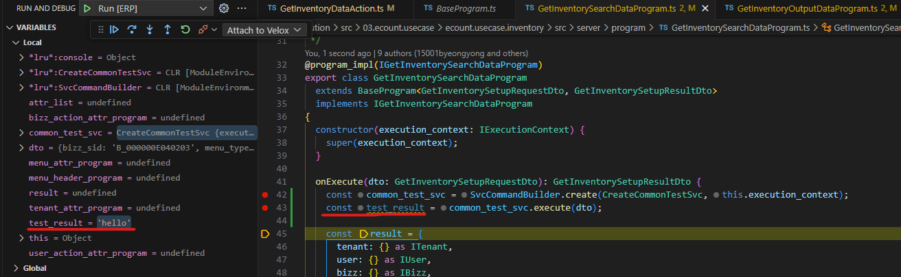
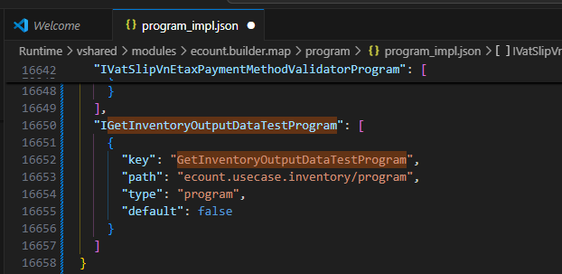

# Daily Retrospective

**작성자**: 허수경

**작성일시**: 2025-01-06

## 1. 오늘 배운 내용 (필수)

- 프레임워크 5.0 구조 이해
- SvcCommand
- Program
- import 구문 작성 규칙(link)

### 프레임워크 5.0 구조 이해

---

- GitLab: http://git2.ecount.kr/ecount-doc/ecount-docs/-/blob/master/5.0-manual/000.renewal/002.framework/000.5.0%20framework%20structure.md?ref_type=heads

#### 1. ecount.nextv5(소스 폴더) 구성

ecount.nextv5가 root 폴더이며 하위에 5개의 주요 폴더가 있습니다.

- ecount.solution - 5.0 프레임워크를 구성하는 여러 프로젝트들이 있습니다. >> 대부분의 개발자들이 개발을 하고 있는 5.0 프레임워크 메인 솔루션입니다.
- @env - 5.0 프레임워크를 위한 여러 설정 정보, 실행 환경 정보 등이 있습니다.
- ecount.core - 5.0 프레임워크를 구동하기 위한 저수준의 서버 모듈이 있습니다(velox등)
- ecount.core.browser - 5.0 프레임워크를 구동하기 위한 저수준의 브라우저 모듈이 있습니다(uikit등)
- ecount.misc - ecount.solution이외의 5.0을 구성하기 위한 다양한 프로젝트가 존재합니다.

#### 2. 프로젝트

ecount.solution 하위에는 총 4개의 프로젝트로 구성되어 있습니다. <br>
|ecount.solution|
|--|
|01.ecount.fundamental|
|02.ecount.infrastructure|
|**03.ecount.usecase**|
|04.ecount.application |

- 프로젝트의 순서는 프로젝트간 참조의 순서를 의미합니다.
- 상위 프로젝트에서 하위 프로젝트는 참조할 수 없습니다. (01.ecount.fundamental 프로젝트에서 02.ecount.infrastructure를 참조할 수 없습니다.)
- 하나의 프로젝트에는 여러개의 **모듈(module)** 구성되어 있습니다.

#### 3. 모듈과 마이크로 모듈

**모듈**

- 프로젝트 내의 여러 로직들을 플랫폼(base, server, browser) 단위로 구성한 폴더입니다.
- 예외적으로 `01.ecount.fundamental` 프로젝트와 `ecount.infra.base`, `ecount.usecase.base` 모듈은 플랫폼 독립적인 폴더입니다.
- 그외의 모든 모듈은 server / brwoser와 같이 플랫폼을 기반한 폴더 구성을 가지고 있습니다.
- 하나의 모듈은 여러개의 **마이크로 모듈(micromodule)**로 구성되어 있습니다.
- 레이어 하위 폴더들(`account`, `common`, `inventory` 등)

**마이크로 모듈**

- 소스코드 내에서 참조할 수 있는 단위를 의미합니다.
- 5.0 내에 작성된 모든 모듈(일반적의미)은 마이크로 모듈(micromodule) 단위로 참조 할 수 있습니다. (일부 모듈단위 프로젝트 제외)
- `server` 플랫폼 하위 폴더들(`@abstraction`, `@implement`, `dac`, `svc` 등)

> 모듈과 마이크로 모듈 사이의 경로는 왜 생략하는가?
> 아아아아아

#### 4. velox 및 브라우저 실행 환경에 대한 이해

**quick build**

- 수정하던 .ts 파일에서 F8 을 누르면 해당 모듈(module)이 빌드 됩니다. 빌드는 모듈(module)단위로 실행 됩니다.

**project build**

- vscode 상의 파일 탐색기에서 project 폴더에서 우클릭한후 project build를 선택합니다. 해당 프로젝트의 모든 모듈이 전체 빌드 됩니다.

**debug**

- vscode의 Run and Debug 패널을 오픈한 후 debug 옵션을 선택합니다.
  아래의 debugging 옵션 중 하나를 선택한 후 F5를 누르면 debugging이 실행 됩니다.
  현재 5.0의 debug 옵션은 총 7개가 있습니다.

> 주로 Run Velox [Release], Run [ERP] 옵션을 많이 사용합니다

1. Run Velox [Release] - velox엔진을 release 모드로 실행 시킵니다. ERP 디버깅은 안됩니다. 주로 UI를 디버깅할때 서버의 응답속도롤 향상시키기 위해 사용합니다.
2. Run [ERP] - velox 엔진을 debug 모드로 실행 시킵니다. ERP 디버깅이 가능합니다.
3. Run Velox [ERP] - velox 엔진을 debug 모드로 실행 시킵니다. ERP 디버깅은 불가능 합니다.
4. Attach to Velox - Run Velox [ERP]을 실행한후, 해당 옵션을 실행하면 ERP 디버깅 가능한 상태가 됩니다.
5. Run Velox [Application] - ERP 이외의 외부 Application을 실행합니다.
6. Attach to Velox Application - Run Velox [Application]을 실행한후, 해당 옵션을 실행하면 Application 디버깅 가능한 상태가 됩니다.
7. Run [Application] - velox 엔진을 debug 모드로 실행 시킵니다. Application 디버깅이 가능합니다.

### SvcCommand

---

- http://git2.ecount.kr/ecount-doc/ecount-docs/-/blob/master/5.0-manual/000.renewal/002.framework/304.Svc.md?ref_type=heads
- 주로 usecase 모듈 내부에서 사용되는 비즈니스 로직을 개발 하기 위한 command입니다.
- Identifier를 별도로 정의하지 않고 해당 클래스를 바로 참조해서 사용하는 것이 특징으로 Svc는 해당 모듈 밖에서는 참조할 수 없습니다.
- 만약, 특정 Svc를 다른 모듈에서 사용하는 경우는 Program으로 변경해서 외부로 export 해야 합니다.

#### 1. SVC 구현하기

- `SvcCommand`를 상속 받아 `onExecute()` 메소드를 구현합니다.

```typescript
// 03.ecount.usecase > inventory > svc > CreateCommonTestSvc.ts
import { SvcCommand } from "ecount.infra.common/svc";
import { GetInventorySetupRequestDto } from "ecount.usecase.inventory/@abstraction";

export class CreateCommonTestSvc extends SvcCommand<
  GetInventorySetupRequestDto,
  string
> {
  protected onExecute(data_model: GetInventorySetupRequestDto): string {
    return "hello";
  }
}
```

#### 2. SVC 사용하기

- 실행할 Svc를 직접 참조하여 SvcCommandBuilder를 통해 실행합니다.
- 동일 usecase 내에 정의된 Svc만 참조 가능합니다.

```typescript
// 03.ecount.usecase > inventory > program > GetInventorySearchDataProgram.ts
@program_impl(IGetInventorySearchDataProgram)
export class GetInventorySearchDataProgram {
  onExecute(dto: GetInventorySetupRequestDto): GetInventorySetupResultDto {
    const common_test_svc = SvcCommandBuilder.create(
      CreateCommonTestSvc,
      this.execution_context
    );
    const test_result = common_test_svc.execute(dto);

    // etc
  }
}
```



- SvcCommand 반환값 "hello"가 `test_result`에 잘 담겨있음을 확인했다.
  <br>
  <br>

### Program

---

- http://git2.ecount.kr/ecount-doc/ecount-docs/-/blob/master/5.0-manual/000.renewal/002.framework/302.Program.md?ref_type=heads
- 하나의 독립된 로직의 흐름을 가지는 로직의 단위입니다.
- 하나의 인터페이스만 제공합니다(`execute()`)
- 정의부(ProgramIdentifier, interface)와 구현부(class)로 구성됩니다.

#### 1. Program 명세

- 프로그램 명세는 2가지로 구성됩니다.
  - `ProgramIdentifier` - 해당 프로그램을 외부에서 참조하기 위한 식별자
  - `interface` - 해당 프로그램의 인풋/아웃풋 명세를 위한 interface
  - (둘 다 같은 인터페이스를 두고 표현을 다르게 하는 것이다.)
- 프로그램 명세는 해당 usecase의 `@abstraction/program` 하위에 작성합니다.
- 동일한 파일에 프로그램의 interface 명세도 함께 작성합니다.
- _반드시 ProgramIdentifier와 interface의 이름(ICheckAuthorityProgram)을 일치시켜야 합니다._

```typescript
// 03.ecount.usecase > inventory > @abstraction > program > IGet...ts
// 코드의 별 의미는 없음. 지금은 이렇게 인터페이스를 작성한다 정도만 이해하기
import { GetInventorySetupRequestDto } from "@shared_usecase_inventory/@abstraction";
import { ProgramIdentifier } from "ecount.infra.base/abstraction";
import { ISetup } from "ecount.infra.base/setup";
import { IBaseProgram } from "ecount.infra.bridge/base";

export const IGetInventoryOutputDataTestProgram = new ProgramIdentifier(
  "IGetInventoryOutputDataProgram"
);

export interface IGetInventoryOutputDataTestProgram
  extends IBaseProgram<GetInventorySetupRequestDto, ISetup> {}
```

- 프로그램 명세를 작성하면 반드시 해당 마이크로 모듈 - `index.ts`에서 export를 해야 합니다.

```typescript
export * from "./IGetInventoryOutputDataTestProgram";
```

#### 2. Program 구현

- usecase내의 program 폴더에 파일을 생성합니다.
- `BaseProgram`을 상속받아 `onExecute()` 함수를 정의 합니다.
- 이때 해당 프로그램에 명세된 interface를 implements 합니다.
- `program_impl` 데코레이터를 정의하고 해당 프로그램의 ProgramIdentifier(= 명세된 interface)를 지정합니다.

```typescript
@program_impl(IGetInventoryOutputDataTestProgram)
export class GetInventoryOutputDataTestProgram
  extends BaseProgram<GetInventorySetupRequestDto, ISetup>
  implements IGetInventoryOutputDataTestProgram
{
  constructor(execution_context: IExecutionContext) {
    super(execution_context);
  }

  onExecute(dto: GetInventorySetupRequestDto): ISetup {
    // etc
  }
}
```

- 현재 코드 내용은 테스트를 위해 갖다 쓴 것이므로 중요하지않음
- 중요한 부분은 `@program_impl(명세한 인터페이스)` 데코레이터를 통해 interface와 구현체(현재 클래스)를 매핑한다는 것이다.

#### 3. Program 실행

- `ecount.infra.common/program`에 정의된 `ProgramBuilder`를 통해서 특정 Program을 실행할 수 있습니다.
- 실행 하고자 하는 프로그램의 `ProgramIdentifier`를 통해 program을 생성해서 실행할 수 있습니다.

```typescript
const test_program = ProgramBuilder.create<dto, otherDto>(
  IGetInventoryOutputDataTestProgram, // 위에서 명세한 interface(= ProgramIdentifier)
  execution_context
);
test_program.execute(data);
```

### import 구문 작성 규칙

---

- [GitLab 문서](http://git2.ecount.kr/ecount-dev/ecount.nextv5/-/blob/master/ecount.solution/@document/env/05.lint.md?ref_type=heads)

### Dependency Injection (DI)

---

- 의존성 주입(DI)은 객체가 자신이 의존하는 객체(Dependency)를 직접 생성하지 않고, 외부에서 제공받는 디자인 패턴이다. 이를 통해 객체 간 결합도를 낮추고 코드의 재사용성, 테스트 가능성, 유지보수성을 향상시킬 수 있다.

- 예시:

```javascript
// before DI
class UserService {
  constructor() {
    this.logger = new Logger(); // UserService가 Logger를 직접 생성
  }

  getUser() {
    this.logger.log("log...");
    return { id: 1, name: "susukkang" };
  }
}
```

- 위 코드에서 UserService는 Logger 클래스에 직접적으로 의존하고 있다.
- 만약 Logger의 구현을 변경하거나 다른 로거를 사용해야 한다면, UserService 내부 코드를 수정해야 한다.

```javascript
// after DI
class UserService {
  constructor(logger) {
    this.logger = logger; // 의존성 주입
  }

  getUser() {
    this.logger.log("log...");
    return { id: 1, name: "susukkang" };
  }
}
```

- UserService는 Logger 객체를 외부에서 주입받을 수 있어 Logger를 변경하거나 테스트 목적으로 교체하기 쉽다.

#### 왜 Dependency Injection을 사용하는가?

1. 결합도 감소

- 객체 간 직접적인 의존성을 제거하여 유연성을 높인다.

2. 테스트 용이

- 객체가 의존성을 직접 생성하지 않기 때문에 테스트 시 의존성을 쉽게 모의(Mock) 객체로 교체할 수 있다.

3. 유지보수성 향상

- 의존성 변경 시, 객체 내부를 수정하지 않아도 된다.

---

## 2. 동기에게 도움받은 내용 (필수)

- 민준님과 지은님의 도움으로 디버깅 과정에서 발생한 문제들을 해결할 수 있었습니다.
- 연아님과 대화를 통해 서로 모르는 지식을 채워 나갔고, 이를 기반으로 성준 팀장님께 더 구체적인 질문을 드릴 수 있었습니다.

### + 동기들 질문으로 얻은 지식

#### 5.0에서 @ 사용

1. 소스상의 @

- typescript decorator 문법입니다.

2. 폴더상의 @

- 특정 폴더를 상위로 보내는 정렬의 목적.
- absctact, test등이 너무 밑에 있으면 확인하기 어려워 폴더에 @를 붙였다고 합니다.

---

## 3. 개발 기술적으로 성장한 점 (선택)

### 1. 교육 과정 상 배운 내용이 아닌 개인적 호기심을 해결하기 위해 추가 공부한 내용

#### program 인터페이스와 구현체

- program 인터페이스를 명세하고, 구현체를 작성한 후에, program을 실행하는 곳에서는 구현체를 직접 사용하지 않는다는 점이 의문이 들었다.  
  이에 구현체 파일을 삭제해봤더니 아래와 같은 에러가 발생했다:  
  `SyntaxError: The requested module [...] does not provide an export named [구현체 파일명]`.
- `@program_impl` 데코레이터를 통해 **인터페이스와 구현체가 매핑**되며, 이 매핑 정보는 산출물에서 `program_impl.json`파일로 저장된다.



- 위에서 구현한 `GetInventoryOutputDataTestProgram` 구현체와 인터페이스가 `program_impl.json`에 저장되었다.

### 2. 오늘 직면했던 문제 (개발 환경, 구현)와 해결 방법

#### 모듈의 구분

```
03.ecount.usecase
├── ecount.usecase.account
├── ecount.usecase.common
└── ecount.usecase.inventory
04.ecountapplication
├── app.account
├── app.common
└── app.inventory
```

- **같은 레이어 같은 모듈이 아니면 다른 모듈이다.**
- 03.ecount.usecase의 inventory와 04.ecountapplication의 inventory는 같은 의미이지만 물리적으로 분리되어 있어 다른 모듈이다.

_위 기준이 확립되기 전에 레이어가 달라도 모듈명이 같으면 같은 모듈인줄 알았다. 하지만 같은 모듈에서만 참조할 수 있는 SVC 특성을 이용하여 SVC를 참조하면서 깨닫게 되었다._

**실습1) 다른 레이어, 같은 모듈에서 SVC 호출**

.png>)

- 같은 모듈에 위치하더라도 레이어가 다르기에 다른 모듈로 인지한다.

**실습2) 같은 레이어, 다른 모듈에서 SVC 호출**

.png>)

- 같은 레이어에 위치하더라도 모듈이 다르기에 다른 모듈로 인지한다.

---

## 4. 소프트 스킬 면에서 성장한 점 (선택)

- 오전 시간에 이론과 실습을 병행하면서 프로젝트의 전체 구조와 동작 방식을 파악할 수 있었습니다. 특히, 디버깅 과정을 통해 **action의 진입점 API**를 확인하고, 이후 프로그램으로 넘어와 비즈니스 로직이 수행되는 흐름을 직접 경험할 수 있었습니다. 이러한 과정을 통해 실무와 한 걸음 더 가까워진 느낌이 들어 매우 뿌듯했습니다.
