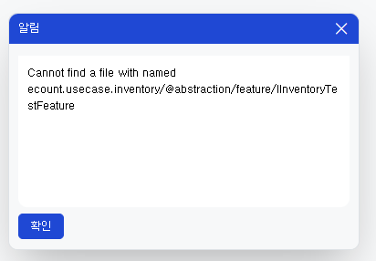

# Daily Retrospective

**작성자**: 고건호
**작성일시**: 2025-01-07

## 1. 오늘 배운 내용

- `program` 복습
- `feature` 예습
- `feature` 실습

### `program` 복습

#### `program`

- 하나의 독립된 **로직의 흐름**을 가진 로직의 단위
- 하나의 인터페이스만 제공(`execute()`)
- 정의부(ProgramIdentifier, interface)와 구현부(class)로 구성

#### `program` 명세

- `ProgramIdentifier` - 해당 program을 외부에서 참조하기 위한 식별자
- `interface` - 해당 program의 input/output 명세를 위한 interface

program 명세 = 해당 `usecase`의 `@abstraction/program` 하위에 작성

동일한 파일에 program의 interface 명세도 함께 작성

**반드시 ProgramIdentifier와 interface의 이름을 일치시켜야 함**

```typescript
// 03.ecount.usecase
// ecount.usecase.inventory
// @abstraction/program

import { ProgramIdentifier } from "ecount.infra.base/abstraction";
import { IBaseProgram } from "ecount.infra.bridge/base";
import {
  GetInventorySetupRequestDto,
  GetInventorySetupResultDto,
} from "@shared_usecase_inventory/@abstraction";

export const IGetInventorySearchDataTestProgram = new ProgramIdentifier(
  "IGetInventorySearchDataTestProgram"
); // 해당 program을 외부에서 참조하기 위한 식별자 선언

export interface IGetInventorySearchDataTestProgram
  extends IBaseProgram<
    GetInventorySetupRequestDto,
    GetInventorySetupResultDto
  > {} // 해당 program의 input/output 명세를 위한 interface

// 반드시 ProgramIdentifier와 interface의 이름을 일치시켜야 함
// 현재는 `IGetInventorySearchDataTestProgram`으로 일치시킨 상황
```

위와 같이 program 명세를 작성하고 **반드시** 해당 마이크로 모듈에서 export

```typescript
// 03.ecount.usecase
// ecount.usecase.inventory
// @abstraction/program/index.ts
...
export * from './IGetInventorySearchDataTestProgram'; // 반드시 `index.ts`에 추가해야 함
```

#### `program` implementation

- `usecase` 내의 `program` 폴더에 파일 생성
- `BaseProgram`을 상속 받아 `onExecute()` 함수 정의
- 이 과정에서 프로그램에 명세된 interface `implements`
- `program_impl` 데코레이터 정의 후 해당 program의 `ProgramIdentifier` 지정

```typescript
/**
 * UI용 Search 데이터 가져오기
 */
@program_impl(IGetInventorySearchDataTestProgram) // 데코레이터 정의
export class GetInventorySearchDataTestProgram
  extends BaseProgram<GetInventorySetupRequestDto, GetInventorySetupResultDto>
  implements IGetInventorySearchDataTestProgram
{
  constructor(execution_context: IExecutionContext) {
    super(execution_context);
  }

  ...
}
```

### `feature` 예습

#### `feature` 명세

- `FeatureIdentifier` - 해당 feature를 **외부에서 참조**하기 위한 식별자
- `interface` - feature를 사용하기 위한 interface

#### `FeatureIdentifier`

- runtime과 compile time에 feature를 특정할 수 있는 key 역할
- **반드시 Feature interface와 동일한 이름**
- 변수명과 `feature_id`가 일치해야 함
- feature의 구현체(class)가 속한 `usecase`의 `@abstraction`에 feature interface와 동일한 파일에 선언

#### `Feature interface`

- feature를 사용하는 방법을 나타냄
- **반드시** `IFeature`를 상속
- **반드시** `FeatureIdentifier`의 변수명(`feature_id`)와 동일한 이름으로 생성
- feature의 구현체(class)가 속한 `usecase`의 `@abstraction`에 `FeatureIdentifier`와 동일한 파일에 선언

#### `feature` 구현

- feature 구현 시에는 `Feature Interface`를 import하여 해당 기능 구현
- `usecase` `@implement`에 구현

#### `feature` 등록 및 변경

program의 `onConfigure()` 함수를 재정의하면 해당 program이 실행될 때 사용할 feature를 등록 or 변경 가능

### `feature` 실습

오늘 교육 내용을 토대로 커스텀 feature를 생성하여 `GetInventoryDataAction.ts` 파일에 적용하고 이를 디버깅해봤습니다.

```typescript
// IInventoryTestFeature.ts

import { FeatureIdentifier, IFeature } from "ecount.infra.base/abstraction";

export const IInventoryTestFeature = new FeatureIdentifier(
  "IInventoryTestFeature"
);

export interface IInventoryTestFeature extends IFeature {
  printWord(): void;
}
```

```typescript
// InventoryTestFeature.ts

import { IInventoryTestFeature } from "ecount.usecase.inventory/@abstraction";

export class InventoryTestFeature implements IInventoryTestFeature {
  feature_id = IInventoryTestFeature.feature_id;

  printWord(): void {
    console.log("InventoryTestFeature working!!! ");
  }
}
```

```typescript
// GetInventorySearchDataProgram.ts
import {
  EN_AGGREGATE_TYPE,
  EN_MENU_TYPE,
} from "ecount.fundamental.define/enum";
import { IConfigurationContext } from "ecount.infra.base/abstraction";
import { IBizz, IMenu, ISetup, ITenant, IUser } from "ecount.infra.base/setup";
import { IExecutionContext } from "ecount.infra.bridge/base";
import { my, pg } from "ecount.infra.bridge/table_model";
import { program_impl } from "ecount.infra.common/decorator";
import { BaseProgram, ProgramBuilder } from "ecount.infra.common/program";
import { menu_attrs } from "ecount.usecase.base/@abstraction";
import {
  GetPsConnSidRequestDto,
  GetV3EcmnPrgMgmtRequestDto,
  IBizzAttrGeneratorProgram,
  IGetPsConnSidProgram,
  IMenuAttrGeneratorProgram,
  IMenuAttrGeneratorProgramReqeustDto,
  IMenuHeaderGeneratorProgram,
  IMenuHeaderGeneratorProgramReqeustDto,
  ITenantAttrGeneratorProgram,
  IUserAttrGeneratorProgram,
} from "ecount.usecase.common/@abstraction";
import {
  GetInventorySetupRequestDto,
  GetInventorySetupResultDto,
  IGetInventorySearchDataProgram,
  IInventoryTestFeature,
} from "ecount.usecase.inventory/@abstraction";
import { InventoryTestFeature } from "ecount.usecase.inventory/@implement";

/**
 * UI 용 Search 데이터 가져오기
 */
@program_impl(IGetInventorySearchDataProgram)
export class GetInventorySearchDataProgram
  extends BaseProgram<GetInventorySetupRequestDto, GetInventorySetupResultDto>
  implements IGetInventorySearchDataProgram
{
  constructor(execution_context: IExecutionContext) {
    super(execution_context);
  }

  protected onConfigure(configuration_context: IConfigurationContext): void {
    configuration_context.setFeature<IInventoryTestFeature>(
      IInventoryTestFeature,
      new InventoryTestFeature()
    );

    configuration_context
      .getFeature<IInventoryTestFeature>(IInventoryTestFeature)
      .printWord();
  }

  ...
}
```

```typescript
import { ApiActionBase } from "ecount.application.common/action";
import {
  EN_AUTHORITY_TYPE,
  EN_MENU_TYPE,
} from "ecount.fundamental.define/enum";
import { IConfigurationContext } from "ecount.infra.base/abstraction";
import { IExecutionContext } from "ecount.infra.bridge/base";
import { ProgramBuilder } from "ecount.infra.common/program";
import { AuthorityDataDto } from "ecount.usecase.base/@abstraction";
import {
  IDataValidationFeature,
  IValueResolverConfigureFeature,
} from "ecount.usecase.common/@abstraction";
import { SlipDataValidationFeature } from "ecount.usecase.common/@implement";
import {
  GetInventorySetupRequestDto,
  GetInventorySetupResultDto,
  IGetInventoryDataAction,
  IGetInventoryInputDataProgram,
  IGetInventoryOutputDataProgram,
  IGetInventorySearchDataProgram,
} from "ecount.usecase.inventory/@abstraction";
import { InventoryGetExecuteMainValueResolverConfigureFeature } from "ecount.usecase.inventory/@implement";
import {
  IGetV3FormTypeMapperProgram,
  ITemplateCodeDetailFormFeature,
  ITemplateUtilFeature,
  IV3DataModelFeature,
  IV3FormAttributeFeature,
  IV3TemplateUtilFactory,
  V3FormTypeMapperRequestDto,
} from "ecount.usecase.setup/@abstraction";
import {
  InputFormAttrV3ToV5ConvertFeature,
  OutputFormAttrV3ToV5ConvertFeature,
  TemplateCodeDetailFormFeature,
  V3DataModelFeature,
} from "ecount.usecase.setup/@implement";

/**
 * 재고 데이터 읽어오기
 */
@_authorize({ authority_type: EN_AUTHORITY_TYPE.Access } as AuthorityDataDto)
export default class GetInventoryDataAction
  extends ApiActionBase<GetInventorySetupRequestDto, GetInventorySetupResultDto>
  implements IGetInventoryDataAction
{
  protected onConfigure(configuration_context: IConfigurationContext): void {
    ...
  }

  executeSync(
    execution_context: IExecutionContext,
    data: GetInventorySetupRequestDto
  ): GetInventorySetupResultDto {
    let result = {} as GetInventorySetupResultDto;

    if (_.vIsEmpty(data.form_type)) {
      ...
    }

    switch (data.menu_type) {
      case EN_MENU_TYPE.ListSearch:
      case EN_MENU_TYPE.StatusSearch:
      case EN_MENU_TYPE.PopupSearch:
      case EN_MENU_TYPE.OutstandingStatusSearch:
        {
          // GetInventorySearchDataProgram 내부에서 onConfigure() 함수를 재정의했을 때
          const program = ProgramBuilder.create<
            GetInventorySetupRequestDto,
            GetInventorySetupResultDto
          >(IGetInventorySearchDataProgram, execution_context);

          result = program.execute(data);
        }

        break;
      case EN_MENU_TYPE.List:
      case EN_MENU_TYPE.Status:
      case EN_MENU_TYPE.Popup:
      case EN_MENU_TYPE.OutstandingStatus:
        {
          ...
        }
        break;
      case EN_MENU_TYPE.Input:
        {
          ...
        }
        break;
    }

    return result;
  }
}
```

---

## 2. 동기에게 도움 받은 내용 (필수)

오늘 현철님, 도형님, 강민님과 함께 한식 뷔페에 가서 합리적인 가격에 맛있는 점심을 먹었습니다. 오전에 쌓인 피로가 씻은 듯이 사라졌습니다.

---

## 3. 개발 기술적으로 성장한 점

### 1. 교육 과정 상 배운 내용이 아닌 개인적 호기심을 해결하기 위해 추가 공부한 내용

### 2. 오늘 직면했던 문제 (개발 환경, 구현)와 해결 방법



위에 작성한 실습 코드대로 저장하고 빌드를 하니 계속 사진과 같은 에러가 발생하며 `판매 조회` 페이지가 제대로 불러와지지 않는 에러가 지속적으로 발생했습니다.

그래서 `index.ts` 파일에 제가 추가한 파일을 기재하지 않았는지 꼼꼼이 살펴보고 파일 단위로 빌드도 다시 해봤지만 계속 같은 문제만 일어났습니다.

그러던 중, `InventoryTestFeature.ts` 파일의 import문이 뭔가 이상하다는 것을 깨달았습니다.

```typescript
import { IInventoryTestFeature } from "ecount.usecase.inventory/@abstraction/feature/IInventoryTestFeature";
```

해당 파일의 import문에서 제가 작성한 `Feature Interface`의 경로가 2 depth를 넘은 전체 경로로 지정되어 있다는 것을 뒤늦게 알아차렸고, 이를 2 depth 경로로 수정해줬습니다.

```typescript
import { IInventoryTestFeature } from "ecount.usecase.inventory/@abstraction";
```

import문에 2 depth까지만 적어줘야 하는 이유는 아무래도 다른 모듈을 참조하지 못하게 하려고 제약을 걸어놓은 것 같습니다.

---
