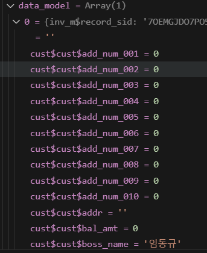
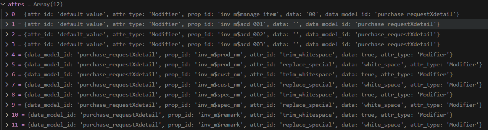

# Daily Retrospective  
**작성자**: [김민준]  
**작성일시**: [2025-01-07]  

## 1. 오늘 배운 내용 (필수)  

`inventory_attr_map.ts`
- Action 정보별로 가져야할 속성 정보값?
- 유효성 검사 정보들이 담겨있다..

#### Feature

목적
- default_feature를 설정할 수 있다.
- 원하는 시점에 Feature를 변경할 수 있습니다.
- FeatureScope를 사용할 수 있다.

명세
- `FeatureIdentifier`
    - 해당 feature를 외부에서 참조하기 위한 식별자

- `interface`
    - feature를 사용하기 위한 interface

정의
- `FeatureIdentifier`와 `interface`를 같이 구현하자

```typescript
import { FeatureIdentifier, IFeature } from 'ecount.infra.base/abstraction';

export const IInventoryTestFeature = new FeatureIdentifier('IInventoryTestFeature');

export interface IInventoryTestFeature extends IFeature {
    test(): void
}
```

구현
- `@default_feature`시 설정하지 않았을 때 기본 feature가 됩니다.
- 주의
    - 구현 class의 export 시 default로 하면 안됩니다.
    - 동일 feture identifier(interface)에 2개 이상의 default가 존재하면 build 시 오류가 발생합니다.

```typescript
@default_feature(IInventoryTestFeature)
export class InventoryTestFeature implements IInventoryTestFeature {
   constructor(execution_context?:IExecutionContext) {
        ...
   }	
   ...
}
```

사용

```typescript

// onConfigure
context.setFeature(IInventoryTestFeature, new InventoryTestFeature(context));

// onExcute
execution_context.getFeature<IInventoryTestFeature>(IInventoryTestFeature);
```

**이카운트에서 feature 사용을 선택한 이유**
1. 3.0에서 특정 유틸성 함수의 역할을 context의 확장 method로 추가하였다.
- context객체와 같이 특정 객체의 기능이 너무 커지는 것을 예방

2. 동일 Layer 모듈간 공유가 필요하다요
- 모듈간 순환참조를 예방하기 위해서 Interface 참조가 필요

3. Program의 경우, 정의 가능한 Method를 Base에서 추상함수로 제공하고 있어 유틸성 함수의 수만큼 Program이 생성되어야한다.
- Feature의 경우, 하나의 Feature내에 여러개의 함수를 정의하고, Interface로 명세할 수 있으니 해당 구조를 사용

**feature를 사용해야되는 경우**
1. 로직의 흐름은 동일하나, 상황에 따라 실행 Instance를 변경해야되는 경우
2. 공통 유틸성 함수를 구현하는 경우
-  카테고리에 따라 1개의 Feature가 상세 기능들을 가지도록 구현

**resolver**
- resolver를 통해서 필요한 프로그램을 실행시킬 수 있다.
- 아래의 경우  `ExecuteSetupMainProgram`의 `PostExecuterProgram`을 통해 resolver가 실행된다.
```typescript
// Redis저장
// save_notification.ts
export const save_notification: IDefinitionAttrGenerator<definition_attrs.post_executer.save_notification> = (
	execution_context,
	slip_data_mdoel
) => {
	return {
		attr_id: definition_attrs.post_executer.save_notification,
		attr_type: EN_ATTR_TYPE.PostExecuter,
		prop_id: '',
		data: {
			resolver: ICreateNotificationWrapperProgram, // resolver는 이 프로그램을 실행시켜주는 역할을 한다. 
		},
	};
};
```

파생
- 다른 업무의 데이터를 만들어주는 공통
- 만들어준다기 보다는, 호출해준다는 개념으로 접근해야한다.

판매전표 저장
- 파생
    - 생산전표 저장
    - xxx전표 저장
- 파생공통 Feature 호출
    - 생산업무의 action_program_resolver 이걸로 명세되어 있는 프로그램을 호출해
    - IcreateInventory를 호출해야할지 iAccountxxx를 호출해야할지 모른다.

용어 정리
data_model_id: quoationXmaster, quoationXdetail, ... 
- 견적 상단과 발주이ㅛ청 상단을 구분하고 싶다.

object_id: master
- 견적 내에서 사용되는 object_id를 관리하고 싶다.

object.target_props
- 양식설정 항목설정의 전체 항목

**저장 로직 실행과정**

1. `ExecuteSetupMainProgram` (main 프로그램)
2. `PreExecuterProgram` (미리 실행할 프로그램)
3. `SlipInitializationProgram`
4. `DataModelInitializeProgram`
5. `DataModelModifierProgram`
6. `DataModelValidatorProgram`
7. `SlipValidatorProgram` (비즈니스 로직 유효성 검사)
8. `DataModelResolverProgram` (데이터 저장 로직)
9. `DerivedSlipProgram` (수정, 진행상태 변경 시 파생 관련 에러)


## 2. 동기에게 도움 받은 내용 (필수)
- **성재님, 강민님, 건호님**과 `setFeature`의 필요성에 대해서 논의할 수 있어서 좋았어요.
- **수경님**이 db validator와 파일 validator와의 차이에 대해서 알려주셨어요.
- **승준님**이 삶은 계란을 나눠주셨어요.
- **주현님**이 유부초밥을 나눠주셨어요. 두분 다 감사합니다 ㅎㅎ.

---

## 3. 개발 기술적으로 성장한 점 (선택)
아래의 3가지 주제 중 하나를 선택하여 작성합니다.

### 1. 교육 과정 상 배운 내용이 아닌 개인적 호기심을 해결하기 위해 추가 공부한 내용

**`setFeature`, `getFeature`를 통해서 `feature`를 가져와야할까?**
- `private` 변수를 선언 후 구현체를 넣는 것과 `setFeature`를 통해서 feature를 설정하는 것과 차이가 없을까?
- `setFeature`와 `getFeature`를 사용하는 것은 코드가 길어지는 일이라고 생각합니다.
    - 변수로 구현체를 받으면 구현체를 `onConfigure`에서 선언 후 사용하면 됩니다.
- 그럼에도 불구하고 `setFeature`를 사용해야할까?
```typescript

class GetInventoryDataAction extends ApiActionBase<> {

    private create_history_feature: ICreateHistoryTestFeature;

    protected onConfigure(configure_context: IConfigurationContext): void {

        // case 1 setFeature를 쓰지 않는 경우

        create_history_feature = new CreateHistoryTestFeatureV1(); 

        // case 2 setFeature를 쓰는 경우

        configure_context.setFeature<ICreateHistoryTestFeature>(
            ICreateHistoryTestFeature,
            new CreateHistoryTestFeatureV1();
        )
    }

    onExecute(execution_context) {
        // case 1
        this.create_history_feature.test();

        // case 2
        const history_feature = execution_context.getFeature<ICreateHistoryTestFeature>(ICreateHistoryTestFeature);
        history_feature.test();
    }
}
```


**context는 scopeDepth라는 것을 가진다.**
- Action을 제외하고 program을 실행할 때 마다 scopeDepth가 하나씩 증가한다. 각 scopeDepth에서 feature를 따로가지는데
    - feature를 set하더라도 다른 스코프에 영향을 미치지 않는다.
    - setFeature를 하지 않았다면 Action에서 설정한 feature을 가져온다.
- setFeature에서 특별한 기능을 가지고 있기 때문에 setFeature를 사용하여 Feature를 가져오는 것이 좋다.
```typescript
// 현재 스코프를 가져온 후 현재 스코프에 대한 feature를 가져오는 것을 확인할 수 있다.
let feature = this.#_metacontextFeatures.getCurrentScope(id.feature_id) as TFeature | undefined;
```
### 2. 오늘 직면했던 문제 (개발 환경, 구현)와 해결 방법

### 3. 위 두 주제 중 미처 해결 못한 과제. 앞으로 공부해볼 내용.

**DataModelModifierProgram 디버깅 해보기**

```typescript
onExecute(data: IDataModelContainer): IDataModelContainer {
		// modifier 실행
		const attrs: IAttribute[] = data.getAttrsByAttrType(EN_ATTR_TYPE.Modifier); // attribute 타입이 modifier인 attribute 필터링
		const data_model = data.getDataModel(); // 데이터 모델은 실제 데이터를 담고 있었음.

		for (let index = 0; index < data_model.length; index++) {
			for (const attr of attrs) { // attr.prop_id == 'inv_m$manage_item' 일 때 예시
				const descriptor: IPropDefinition | undefined = data.getPropDef(attr.prop_id);
				if (descriptor !== undefined) {
					let modifier: IModifier | undefined;

                    // modifier = ƒ manage_item_default_value()
					modifier = modifiers.getModifier(descriptor.data_type, attr.attr_id, descriptor.refer_type);

					if (!modifier && descriptor.refer_group) {
						modifier = modifiers.getModifierByReferGroup(
							descriptor.data_type,
							attr.attr_id,
							descriptor.refer_group
						);
					}

					if (modifier) {
						let option_creator: IBaseOptionCreator | undefined;
						option_creator = modifiers.getModifierOptionCreator(
							descriptor?.data_type || '',
							attr.attr_id,
							_.vSafe(descriptor.refer_type)
						);

						if (!option_creator && descriptor.refer_group) {
							option_creator = modifiers.getModifierOptionCreatorByReferGroup(
								descriptor?.data_type || '',
								attr.attr_id,
								_.vSafe(descriptor.refer_group)
							);
						}

                        // dmc에 propId를 통해 값을 set 해준다. 
                        // modifier 함수의 반환 타입은 $$code
                        // type $$code = $$base_code & {sid: $$sid}
                        // type $$base_code = {code: $$txt; name: $$txt;} 
						data.setValueByPropId<typeof attr.data>(
							attr.prop_id,
							modifier(
								data.getValueByPropId<typeof attr.data>(attr.prop_id, index) ?? '',
								option_creator ? option_creator(this.execution_context, data, attr, index) : attr.data
							),
							index
						);
					}
				}
			}
		}

		return data;
	}
```

```typescript
export const manage_item_default_value: IModifier<$$code, string> = (value: $$code, options: string) => {
	value.code = value?.code?.length ? value.code : options;
	value.sid = value?.sid?.length ? value.sid : options;

	return value;
};
```

**datamodel**


**attrs**


**modifier 목록**

```typescript
// 02.ecount.infrastructure/ecount.infra.attribute/src/server/modifier/index.ts
export * from '@shared_infra_attribute/modifier';
export * from './harmful_html_tag';
export * as modifier_option_creator from './option_creator';
export * from './dept_default_value';
export * from './manage_item_default_value';
export * from './pjt_default_value';
// export * from './default_code_default_value';
export * from './corresponding_cust_default_value';
export * from './apply_taxbill_type_default_value';
export * from './barcode_no_default_value';
export * from './barcode_type_default_value';
export * from './cancel_reason_default_value';
export * from './donate_organization_default_value';
export * from './expect_omit_tf_default_value';
export * from './first_approve_no_default_value';
export * from './pay_method_type_default_value';
export * from './pay_position_type_default_value';
export * from './request_no_default_value';
export * from './tax_bizz_permit_tf_default_value';
export * from './tax_office_certify_cd_default_value';
export * from './taxbill_approve_no_default_value';
export * from './taxbill_classify_type_default_value';
export * from './taxbill_discount_no_default_value';
export * from './taxbill_form_type_default_value';
export * from './taxbill_serial_no_default_value';
export * from './taxbill_type_default_value';
```

- `modifier`가 어디에 쓰이는지 정확히 이해하기가 어려웠습니다.
- 내일 반드시 질문할 거리!!

**아직 definition이나 data_model이 실제 코드에서 어떻게 쓰이는지 잘모르겠습니다.**
- 아직 조금 더 배우고 정리해야될 부분입니다.

위 주제는 각각 하나의 선택항목으로 간주합니다.
(위 주제에서 2개 작성하면 2개 선택항목 작성한 셈)

---

## 4. 소프트 스킬면에서 성장한 점  (선택)  

- 오늘 동기분들과 한 문제에 대해서 의견을 나누려고 노력해봤던 것 같습니다. 앞으로도 의견교류를 적극적으로 하자!
