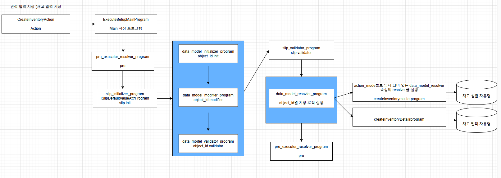

# Daily Retrospective

**작성자**: [김승준]  
**작성일시**: [2025-01-07]

## 1. 오늘 배운 내용 (필수)

### Resolver

특정 시점에 프로그램을 실행하도록 하는 것.

### Validation

사용자의 validation : db에 저장
비즈니스 로직의 validation : 파일로 저장
전체 속성 (사용자, 비즈니스 로직) : redis로 캐싱

### Feature

#### Feature의 명세

Feature의 명세는 2가지로 구성됩니다.

1. FeatureIdentifier : 해당 feature를 외부에서 참조하기 위한 식별자
2. interface : feature 사용하기 위한 interface

#### Feature 사용 기준

1. 로직의 흐름은 동일하나, 상황에 따라 실행 Instance를 변경해야 되는 경우.

2. 공통 유틸성 함수를 구현하는 경우

#### Feature의 특징

-   resolver와의 차이<br>
    post execute resolver(속성) : 추상화, 실체가 없음, 명세한 resolver가 있다면(특정 조건:업무,메뉴에 따라서) 실행<br>
    Feature : interface 이력, 무조건 실행해야할때
-   프로그램과의 차이<br>
    프로그램 : indentifier가 고정<br>
    feature : interface를 선택가능

-   [실습](#실습)<br>
    상황에 따라 실행 Instance를 변경하는 Feature 구현하기

### 프로그램 흐름도



### 프로그램 흐름(코드)

1. `CreateInventoryAction.ts`

    ```ts
    const program = ProgramBuilder.create<IActionProgramResolveProgramRequestDto, IActionProgramResolveProgramResult>(IActionProgramResolveProgram, context);

    const result = program.execute(slip_dto);
    ```

    `IActionProgramResolveProgram`을 이용해 `ActionProgramResolveProgram` 호출

2. `ActionProgramResolveProgram`

    ```ts
    const resolver = this.execution_context.bizz_mgr
        .getMenuDefinition(this.execution_context, this.execution_context.action.bizz_sid, this.execution_context.action.menu_sid || "")
        ?.attributes?.find((x) => x.attr_id == definition_attrs.info.action_program_resolver)?.data[action_mode];
    if (resolver) {
        const program = ProgramBuilder.create<ExecuteSetupMainRequestDto, ExecuteSetupMainResultDto>(resolver, this.execution_context);
        return program.execute({
            slip_data_model: slip_data_model,
            additional_info: additional_info,
            derive_info: derive_info,
            current_template: current_template,
        }) as unknown as ProgramResult;
    }
    ```

3. `ExecuteSetupMainProgram`
4.  1. `pre_executer_resolver_program`

        ```ts
        //------------------------------------------------------------------------
        // [#1] pre_executer resolver
        //------------------------------------------------------------------------
        pre_executer_resolver_program.execute({
            definitions: smc_definition,
            slip_attributes: this.smc.getAttrsByAttrType(EN_ATTR_TYPE.PreExecuter),
            slip_data_model: slip,
        });
        ```

    2. `slip_initializer_program`
        ```ts
        //------------------------------------------------------------------------
        // [#2] slip initializer
        //------------------------------------------------------------------------
        // dmc 생성하지 않고, 데이터 모델 원본을 직접 변경한다.
        slip_initializer_program.execute({
            definitions: smc_definition,
            slip_attributes: this.smc.getAttrsByAttrType(EN_ATTR_TYPE.Initializer),
            slip_data_model: slip,
        });
        ```
    3. 반복(dmc별)

        1. `data_model_initializer_program`
        2. `data_model_modifier_program`
        3. `data_model_validator_program`

        ```ts
        for (const dmc of this.dmc) {
            //------------------------------------------------------------------------
            // [#3] data_model initializer
            //------------------------------------------------------------------------
            data_model_initializer_program.execute(dmc);

            //------------------------------------------------------------------------
            // [#4] data_model modifier
            //------------------------------------------------------------------------
            data_model_modifier_program.execute(dmc);

            //------------------------------------------------------------------------
            // [#5] data_model validator
            //------------------------------------------------------------------------
            const validator_result = data_model_validator_program.execute({
                data_model_container: dmc,
                menu_type,
            });

            if (!_.vIsEmpty(validator_result.exception)) {
                validator_error_list.push(...validator_result.exception.details);
            }
        }
        ```

    4. `slip_validator_program`
        ```ts
        //------------------------------------------------------------------------
        // [#6] slip valiator
        //------------------------------------------------------------------------
        // 전표 기준 비즈니스 로직 처리(허용창고, 편집제한일자등..)
        const slip_validator_result = slip_validator_program.execute({
            dmc: this.dmc,
            slip_data_model: slip,
            slip_attributes: this.smc.getAttrsByAttrType(EN_ATTR_TYPE.Validator),
            additional_info: request.additional_info,
        });
        ```
    5. `pre_data_model_resolver_program`
        ```ts
        //------------------------------------------------------------------------
        // [#7] data_model resolver
        //------------------------------------------------------------------------
        this.smc = pre_data_model_resolver_program.execute(this.smc);
        this.dmc = this.smc.getDataModelContainers();
        ```
    6. `data_model_resolver_program`

        ```ts
        //------------------------------------------------------------------------
        // [#8] data_model resolver
        //------------------------------------------------------------------------
        // 상단 / 하단 / 부속 data_model 단위로 처리
        // checkJSJ getDataModelContainser 소스정리
        const slip_created_result: { [key: string]: IResolveInventoryDataModelProgramResult } = {};
        const return_data_model: IArrayDataModelMapper = {};
        _.vForEach(this.dmc, (dmc) => {
            const data_model = dmc.getDataModel();
            // if (_.vIsEmpty(data_model)) return;

            slip_created_result[dmc.data_model_id] = data_model_resolver_program.execute({
                action_mode: slip.action_mode,
                dmc,
                data_sid: slip.data_sid,
            });

            return_data_model[dmc.data_model_id] = data_model as [{ [prop_id: string]: any }];
        });
        ```

        `action mode`에 따라 `data_model_resolver` 을 실행

    7. `post_executer_resolver_program`
        ```ts
        //------------------------------------------------------------------------
        // [#10] 개별 전표 저장후
        //------------------------------------------------------------------------
        post_executer_resolver_program.execute({
            definitions: smc_definition,
            slip_attributes: this.smc.getAttrsByAttrType(EN_ATTR_TYPE.PostExecuter),
            slip_data_model: slip,
            dmcs: this.dmc,
        });
        ```

## 2. 동기에게 도움 받은 내용 (필수)

-   주현님께서 디버그 창에서 콘솔이 안찍히는 문제를 해결해주셨습니다.
-   주원님께서 오타가 있다는 것을 찾아주었습니다.

---

## 3. 개발 기술적으로 성장한 점 (선택)

아래의 3가지 주제 중 하나를 선택하여 작성합니다.

### 1. 교육 과정 상 배운 내용이 아닌 개인적 호기심을 해결하기 위해 추가 공부한 내용

### 2. 오늘 직면했던 문제 (개발 환경, 구현)와 해결 방법

-   파일을 여러개 만드는 상황에 너무 지저분한것 같아 폴더를 만들고 폴더 내부에 index.ts를 작성했지만, index를 제대로 인식하지 못하는 문제가 발생했습니다. <br>
    -> 해당 폴더를 인식할 수 있도록 폴더가 위치한 디렉토리의 index.ts에 `import * from ./폴더이름`을 해줘야 합니다.

### 3. 위 두 주제 중 미처 해결 못한 과제. 앞으로 공부해볼 내용.

1. Feature의 분기처리를 bizz_type을 받아 Factory에서 switch문으로 다른 feature를 생성하도록 처리했습니다.
   5.0에서는 if문을 제거한다는 방향성이 있다고 하셨기 때문에, switch문을 사용하지 않고 구현하는 방법을 고민해봐야겠습니다.
2. 코드를 돌면서 프로그램 흐름을 따라갔지만 중간중간 놓친 부분이 많았습니다. 단순히 코드를 불러오는 것이 아닌 상황에 따라 프로그램을 불러오는 형태라 코드를 이해하는 것이 힘들었습니다.
   이런 부분을 더 잘 이해할 수 있도록 코드를 뜯어보고, 구현하는 연습을 해야겠습니다.

---

# 학습내용

## 실습

### 요구사항

1.  전표저장은 공통으로 구현(executeSetupMainProgram) 되어있음<br>
    -> 일단 getInventoryDataAction 에서 해보기

2.  전표 저장시에는 무조건 이력정보를 저장해야 된다.
3.  재고 전표를 저장할 때에는 이력을 파일로 저장해야 된다. | createFileHistoryFeature

4.  회계전표를 저장할 때에는 이력을 DB로 저장해야한다. | createDBHistoryFeature

5.  게시글을 저장할때에는 console.log 로 찍는다. | createconsoleHistoryFeature
6.  세무 전표를 저장할때에는 이력을 저장하지 않는다.

    ```
    // 예시
    createAccountProgram
        feature를 할당
            executeSetupMainProgram

    createInventoryProgram
        feature를 할당
            executeSetupMainProgram // 1개

            init()                  // 분기
    ```

### 구현

1.  > `usecase.common/src/server/@abstract/feature`위치에 `ICreateHistoryFeature.ts`, `ICreateHistoryFactory.ts` 생성

    `ICreateHistoryFeature.ts`

    ```ts
    import { FeatureIdentifier, IFeature } from "ecount.infra.base/abstraction";
    import { EN_BIZZ_TYPE } from "ecount.fundamental.define/enum";

    export const ICreateHistoryFeature = new FeatureIdentifier("ICreateHistoryFeature");

    export interface ICreateHistoryFeature extends IFeature {
        history(bizz_type: EN_BIZZ_TYPE): void;
    }
    ```

    ` ICreateHistoryFactory.ts`

    ```ts
    import { FeatureIdentifier, IFeature } from "ecount.infra.base/abstraction";
    import { ICreateHistoryFeature } from "./ICreateHistoryFeature";
    import { EN_BIZZ_TYPE } from "ecount.fundamental.define/enum";

    export const ICreateHistoryFactory = new FeatureIdentifier("ICreateHistoryFactory");

    export interface ICreateHistoryFactory extends IFeature {
        createHistory(bizz_type?: EN_BIZZ_TYPE): ICreateHistoryFeature;
    }
    ```

2.  > `usecase.common/src/server/@implement/feature/history`위치에 `CreateConsoleHistoryFeature.ts`, `CreateDBHistoryFeature.ts`, `CreateDummyHistoryFeature.ts`, `CreateFileHistoryFeature.ts`, <br>`CreateHistoryFactory.ts`, `index.ts` 생성

    `CreateConsoleHistoryFeature.ts`, `CreateDBHistoryFeature.ts`, `CreateDummyHistoryFeature.ts`, `CreateFileHistoryFeature.ts`<br>

    히스토리 로직은 구현하지 않으므로 이름만 다르고 구조는 동일

    ```ts
    import { IExecutionContext } from "ecount.infra.bridge/base";
    import { ICreateHistoryFeature } from "ecount.usecase.common/@abstraction";
    import { EN_BIZZ_TYPE } from "ecount.fundamental.define/enum";

    export class CreateConsoleHistoryFeature implements ICreateHistoryFeature {
        feature_id: string = ICreateHistoryFeature.feature_id;
        execution_context: IExecutionContext;
        constructor(execution_context: IExecutionContext) {
            this.execution_context = execution_context;
        }
        history(bizz_type: EN_BIZZ_TYPE): void {
            // history 로직
            console.log(bizz_type, "console");
        }
    }
    ```

    `CreateHistoryFactory.ts`

    ```ts
    import { EN_BIZZ_TYPE } from "ecount.fundamental.define/enum";
    import { IExecutionContext } from "ecount.infra.bridge/base";
    import { default_feature } from "ecount.infra.common/decorator";
    import { ICreateHistoryFactory, ICreateHistoryFeature } from "ecount.usecase.common/@abstraction";
    import { CreateFileHistoryFeature } from "./CreateFileHistoryFeature";
    import { CreateDBHistoryFeature } from "./CreateDBHistoryFeature";
    import { CreateConsoleHistoryFeature } from "./CreateConsoleHistoryFeature";
    import { CreateDummyHistoryFeature } from "./CreateDummyHistoryFeature";

    @default_feature(ICreateHistoryFactory)
    export class CreateHistoryFactory implements ICreateHistoryFactory {
        feature_id: string = ICreateHistoryFactory.feature_id;
        execution_context: IExecutionContext;

        constructor(execution_context: IExecutionContext) {
            this.execution_context = execution_context;
        }
        createHistory(bizz_type: EN_BIZZ_TYPE): ICreateHistoryFeature {
            const bizzType = bizz_type;
            switch (bizzType) {
                case EN_BIZZ_TYPE.Account:
                    return new CreateFileHistoryFeature(this.execution_context);
                case EN_BIZZ_TYPE.Inventory:
                    return new CreateDBHistoryFeature(this.execution_context);
                case EN_BIZZ_TYPE.Board:
                    return new CreateConsoleHistoryFeature(this.execution_context);
                case EN_BIZZ_TYPE.VatSlip:
                    return new CreateDummyHistoryFeature(this.execution_context);
                default:
                    throw new Error("not implemented");
            }
        }
    }
    ```

3.  > `usecase.common/src/server/@abstract/program`위치에 `ICreateCommonTestProgram.ts` 추가

    ```ts
    import { ProgramIdentifier } from "ecount.infra.base/abstraction";
    import { IBaseProgram } from "ecount.infra.bridge/base";

    export const ICreateCommonTestProgram = new ProgramIdentifier("ICreateCommonTestProgram");

    export interface ICreateCommonTestProgram extends IBaseProgram<undefined, void> {}
    ```

4.  > `usecase.common/src/server/program`위치에 `CreateCommonTestProgram.ts`

    ```ts
    import { IExecutionContext } from "ecount.infra.bridge/base";
    import { BaseProgram } from "ecount.infra.common/program";

    import { program_impl } from "ecount.infra.common/decorator";
    import { ICreateCommonTestProgram, ICreateHistoryFactory } from "ecount.usecase.common/@abstraction";
    import { IConfigurationContext } from "ecount.infra.base/abstraction";
    import { CreateHistoryFactory } from "ecount.usecase.common/@implement";

    @program_impl(ICreateCommonTestProgram)
    export class CreateCommonTestProgram extends BaseProgram<undefined, void> implements ICreateCommonTestProgram {
        constructor(execution_context: IExecutionContext) {
            super(execution_context);
        }
        protected onConfigure(configuration_context: IConfigurationContext): void {
            configuration_context.setFeature(ICreateHistoryFactory, new CreateHistoryFactory(this.execution_context));
        }
        onExecute(): void {
            const testStr = "TestProgram";
            console.log(testStr);
            const definition = this.execution_context.bizz_mgr.getBizzDefinition(this.execution_context, this.execution_context.action.bizz_sid);
            const bizz_type = definition?.type;
            const create_history_factory = this.execution_context.getFeature<ICreateHistoryFactory>(ICreateHistoryFactory);
            const create_history = create_history_factory.createHistory(bizz_type);
        }
    }
    ```

5.  > `.../application/.../inventory/src/server/action/GetInventoryDataAction.ts`에 프로그램 실행 코드 추가.

    ```ts
    const test_program = ProgramBuilder.create(ICreateCommonTestProgram, execution_context);
    test_program.execute(execution_context);
    ```
