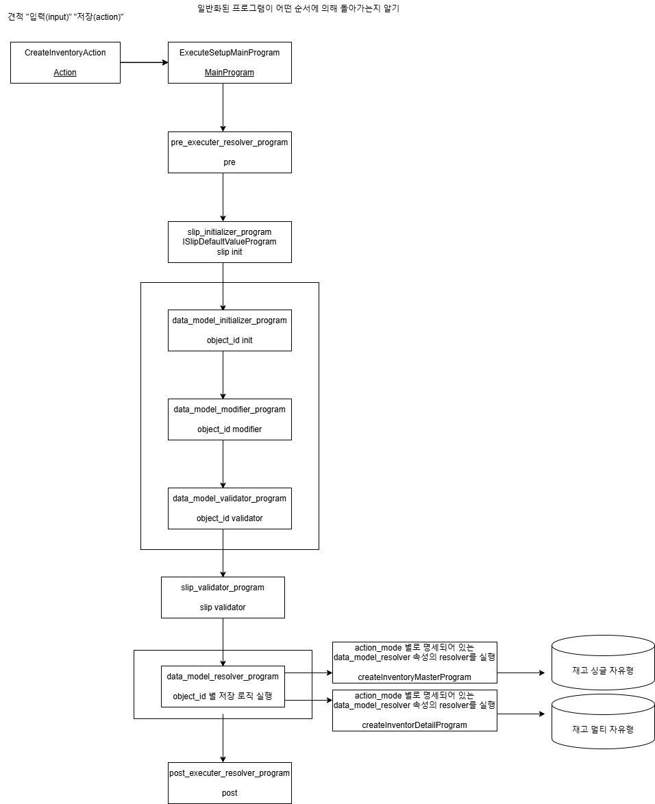

# Daily Retrospective

**작성자**: 나아연

**작성일시**: 2025-01-07

## 1. 오늘 배운 내용 (필수)

### 속성

```json
{
    prop_id
    attr_id:"not_null" | "max_lenght" ..
    attr_type
    data
    refer_type
    resolver : 어떤 attr_id 일 때 resolver 실행(위 attr_type 따라서 즉 속성에 따라서)
}
```

저장 action => dataModelValidatorProgram => dataModelValidatorSvc

재고1-구매관리-발주요청입력

- 설정정보, 데이터 가져오는 api 분리
- getInventorySetUpCache : 캐시된 셋업정보의 키 가져옴
- getInventoryDataAction : 키를 통해서 설정값 가져옴

---

### inventory_attr_map.ts

- 액션모드 별로 가져야하는 정보 리스트
- pre , post, initial, validator ...
- validtor: db vs file에서 관리(inventory_attr_map):
  - 사용자가 validator 설정 가능 => DB 관리
  - 비즈니스 로직(ecount) 관점 => file로 관리

```
inventory_attr_map
    .creat => 재고 생성 시 할 수 있는 액션 list
    .postexecute => 이후에 수행할 로직
```

---

### Feature

언제사용하느냐 &
속성과 feature 사용 차이 알기

요구사항:

- 전표 저장 시에는 무조건 이력정보를 저장해야 된다.
- 재고 전표를 저장할 때에는 이력을 파일로 저장해야 된다. createFileHistoryFeature : IcreateHistoryTestFeature
- 회계 전표를 저장할 때에는 이력을 DB로 저장해야 된다. createDBHistoryFeature : IcreateHistoryTestFeature
- 게시글을 저장할 때에는 console.log로만 찍는다. createConsoleHistoryFeature : IcreateHistoryTestFeature
- 세무 전표가 저장할 때에는 이력을 저장하지 않는다. createDummyHistoryFeature : IcreateHistoryTestFeature

```
0)
executeSetupMainProgram
    IcreateHistoryTestFeature
        1. f (판매)... if (매출) => 5.0에 맞지 않음
---
1)
executeSetupMainProgram
    init()
        회계 createDBHisotryFeature < 여기서 분기
        재고 createFiile..
---
2)
createAccountProgram (창구)
    feature 할당
        executesetupmainprogram (1개)

createInventoryProgram
```

1. post executer resolver (속성) : 실체가 없음. 너가 명세한 resolver가 있으면 실행해 | 실행시점 다를때 (할지말지)
2. IcreateHistoryTestFeature : interface 이력 | 무조건 실행할 때

getFeature : 인스턴스 가져오기

setFeature : 생성자 할당하기

---

### quotation_bizz_definition.ts

견적에 대한 업무 definiton

- 파생 : 공통업무)
- 판매전표 입력
  - 파생
    - (추가수량) 생산입고 전표...
    - xxx 전표
  - 파생공통 Feature 호출
    - 생산업무의 attr_id (action_program_resolver 이걸로 명세되어 있는 프로그램을 호출해)
    - ICreateInventoryProgram
    - IAccountInventoryProgram

명세 속성이 어디서 사용되느냐

1. CreateInventionAction -> CreateInventoryProgram 직접 호출 XXXX !!
2. 업무가 설정해 놓은 resovlver 프로그램을 호출해 줄게 (내가 파생해야 하는 업무가 무엇인지 알지 못하게)
   - action_program_resolver -> CreateInventoryProgram
     -> 여기서 명세 속성이 사용된다

```jsx
attributes: [
    {
        attr_id: definition_attrs.info.derive_use_info,
        attr_type: EN_ATTR_TYPE.Information,
        data: {
            list: [ // 시리얼과 전표이력 파생
                { bizz_sid: 'B_000000E040638', menu_sid: 'M_000000E040638', use_yn: true }, //시리얼
                { bizz_sid: 'B_000000E040716', menu_sid: 'M_000000E040716', use_yn: true }, //전표이력
            ],
        },
        prop_id: '',
    },
```

---

흐름 예시를 정리해보았다. 흐름을 보기 위한 것이라 호출하는 클래스가 다를 수 있다.

1. Action

inventory를 생성하는 api를 호출하여 `CreateInventoryAction`을 실행한다.
definition에서 파생업무(`definition_attrs.info.derive_use_info`)를 찾아 dto에 담는다.
해당 dto를 넘겨주며 `IActionProgramResolveProgram` 구현체를 실행한다.

- CreateInventoryAction.ts

```ts
executeSync(context: IExecutionContext, request: ActionDataBase<InventoryRequestDto>): ExecuteSetupMainResultDto {
    ...

    const derive_target = bizz_definition?.attributes?.find((attr) =>
        _.vIsEquals(attr.attr_id, definition_attrs.info.derive_use_info)
    )?.data?.list as DeriveBizzInfoTargetDto[];

    const slip_dto = {
        ...
        derive_info: {
            smc: {} as SlipDataModelContainer,
            derive_target: derive_target,
        },
        ...
    } as IActionProgramResolveProgramRequestDto;

    const program = ProgramBuilder.create<
        IActionProgramResolveProgramRequestDto,
        IActionProgramResolveProgramResult
    >(IActionProgramResolveProgram, context);

    const result = program.execute(slip_dto);

    return result;
}
```

definition은 아래와 같은 형태이다.

```tsx
export const bizz_definition = {
    ...
    attributes: [
		{
			attr_id: definition_attrs.info.derive_use_info,
			attr_type: EN_ATTR_TYPE.Information,
			data: {
				list: [
					{ bizz_sid: 'B_000000E040638', menu_sid: 'M_000000E040638', use_yn: true }, //시리얼
					{ bizz_sid: 'B_000000E040716', menu_sid: 'M_000000E040716', use_yn: true }, //전표이력
				],
			},
			prop_id: '',
		},
```

- ActionProgramResolveProgram.ts

```ts
@program_impl(IActionProgramResolveProgram)
export class ActionProgramResolveProgram
	extends BaseProgram<ProgramDto, ProgramResult>
	implements IActionProgramResolveProgram
{
	protected onExecute(dto: ProgramDto): ProgramResult {
		const { slip_data_model, additional_info, derive_info, current_template } = dto;
		const action_mode = _.vSafe(dto.action_mode, this.execution_context.action.action_mode);

		const resolver = this.execution_context.bizz_mgr
			.getMenuDefinition(...)
			?.attributes?.find((x) => x.attr_id == definition_attrs.info.action_program_resolver)?.data[action_mode];

			const program = ProgramBuilder.create<ExecuteSetupMainRequestDto, ExecuteSetupMainResultDto>(
				resolver,
				this.execution_context
			);
			return program.execute(...);

		return {} as unknown as ProgramResult;
	}
}
```

definition에 정의되어 있는 action_program_resolver과 일치하는 action_mode를 찾는다.

- input.ts

```tsx
{
    prop_id: '',
    attr_id: definition_attrs.info.action_program_resolver,
    attr_type: EN_ATTR_TYPE.Information,
    data: {
        [EN_ACTION_MODE.Create]: 'ICreateInventoryProgram',
        [EN_ACTION_MODE.Modify]: 'IModifyInventoryProgram',
        [EN_ACTION_MODE.Delete]: 'IModifyStatusInventoryProgram' /* 삭제 */,
        [EN_ACTION_MODE.UnDelete]: 'IModifyStatusInventoryProgram' /* 삭제취소 */,
        [EN_ACTION_MODE.Confirm]: 'IModifyConfirmInventoryProgram' /* 확인 */,
        [EN_ACTION_MODE.UnConfirm]: 'IModifyConfirmInventoryProgram' /* 확인취소 */,
    } as definition_attrs.info.action_program_resolver,
},
```

입력이니 `EN_ACTION_MODE.Create`의 값인 `ICreateInventoryProgram`를 사용할 것 같다.

- CreateInventoryProgram.ts

```ts
	private _executeMainSetupProgram(request: ExecuteSetupMainRequestDto): ExecuteSetupMainResultDto {
		const program = ProgramBuilder.create<ExecuteSetupMainRequestDto, ExecuteSetupMainResultDto>(
			IExecuteSetupMainProgram,
			this.execution_context
		);

        ...
		return program.execute(request);
	}
```

`IExecuteSetupMainProgram` 구현체를 실행한다.

2. MainProgram
   1. create program
   2. pre executer resolver
   3. slip initializer
   4. data_model initializer
   5. data_model modifier
   6. data_model validator
   7. slip valiator
   8. data_model resolver
      1. master
      2. detail
      3. ...
   9. derived slip
   10. post executer resolver

2-4, 2-5, 2-6은 하나의 사이클로, 아래 data_model 요소를 순회하면서 실행한다.

2-9(파생업무)는 CreateInventoryAction에서 찾아 dto로 넘겨주었던 derive_target으로 수행한다.



## 2. 동기에게 도움 받은 내용 (필수)

성철님께서 질문 내용을 공유해주셨습니다. 그리고 업무와 메뉴, 입력에 대해서도 설명해주셨습니다. 짱이세요

---

## 3. 개발 기술적으로 성장한 점 (선택)

### 1. 교육 과정 상 배운 내용이 아닌 개인적 호기심을 해결하기 위해 추가 공부한 내용

Feature 구현 과제를 하면서 Feature을 왜 사용하는지에 대한 의문이 생겨서 성철님, 수경님, 민준님과 성준 책임님께 질문드렸습니다.

```
[창구]
    const feature = getFeature(CreateHistory) : 할당 by Factory || new XXXFeature()
    feature.createHistory (1개)
```

위 학습 내용을 바탕으로 아래와 같이 구현 과제를 수행했습니다.

```tsx
export const ICreateHistoryFactory = new FeatureIdentifier("ICreateHistoryFactory");
export interface ICreateHistoryFactory extends IFeature {
  createInstance(execution_context: IExecutionContext, method?: string): ICreateHistory;
}
```

```tsx
@default_feature(ICreateHistoryFactory)
export class CreateHistoryFactory implements ICreateHistoryFactory {
  feature_id: string = ICreateHistoryFactory.feature_id;
  constructor(execution_context: IExecutionContext | undefined) {}
  public createInstance(execution_context: IExecutionContext, method?: string): ICreateHistory {
    if (method === "db") {
      return new CreateDBHistory(execution_context);
    }
    return new CreateConsoleHistory(execution_context);
  }
}
```

```tsx
@_authorize({ authority_type: EN_AUTHORITY_TYPE.Access } as AuthorityDataDto)
export default class GetInventoryDataAction
	extends ApiActionBase<GetInventorySetupRequestDto, GetInventorySetupResultDto>
	implements IGetInventoryDataAction
{
	protected onConfigure(configuration_context: IConfigurationContext): void {
		const execution_context = configuration_context as unknown as IExecutionContext;

		configuration_context.setFeature<ICreateHistory>(
			ICreateHistory,
			execution_context
				.getFeature<ICreateHistoryFactory>(ICreateHistoryFactory)
				.createInstance(execution_context, 'db')
		);
```

스프링처럼 구현체가 처리할 수 있는 것인지 아닌지를 판단하게 하고 싶었지만, JS 리플렉션을 알 수 없어서 간단히 if 문으로 처리했다.

- `feature를 할당`한다는 것은 여러개의 feature를 사용할 수 있다는 거 같은데, Factory에도 분기문이 있다. 그렇다면 왜 feature을 사용하는가?

Q. feature를 쓰는 이유가 if문을 제거하기 위해서라고 이해했는데, TempleteWidgetFactory파일을 보니까 switch문에 따라서 다른 feature를 생성해주고 있는 걸로 보여서요! 혹시 해당 파일에선 switch를 사용하는 다른 이유가 있는걸까요?

```jsx
switch (bizz_id) {
    case EN_ECMENU_COLLECTION.Quotation:
    case EN_ECMENU_COLLECTION.SalesOrder:
    case EN_ECMENU_COLLECTION.PurchaseRequest:
        return new InventoryOtherSlipTemplateButtonFeature(execution_context);
    case EN_ECMENU_COLLECTION.Sales:
        return new InventoryHistoryGroupTemplateButtonFeature(execution_context);
    ...
```

A. 제기준에서는 저 코딩을 구현한 인원이 5.0 기준적인 정답의 측면으로 접근하면
파일을 분리하기에 조금 과하다고 판단해서 하나의 파일에 분기처리를 했을 것으로 예상합니다. (저는 분리하는게 맞다고 보고요.)

답변을 받았지만 사용하고자 하는 Feature를 동적으로 할당받기 위해서는 분기문이 불가피하지 않을까 생각한다. action별로 다른 program을 사용하게끔 하는 것처럼 enum키와 매핑하지 않는다면 어떻게 분기문 없이 동적으로 구현체를 주입할 수 있을지 잘 모르겠다.

### 3. 위 두 주제 중 미처 해결 못한 과제. 앞으로 공부해볼 내용.

- 5.0 -> 한번의 소스를 만들고 싶다.

  ㄴ executesetupmainprogram <- 1개여도 구현체(DB/File/Console)는 여러 개 아닌가 ?

  ㄴ 어떤 소스를 한 번만 만들 수 있는지 ?

  ㄴ createHistory를 한번만 하고싶다는 건가 ? ?

- 정리하다보니 inventory_attr_map에 Action별 executor, validator 등이 정의되어 있는데, input.ts의 내용과 차이를 잘 모르겠다...

---
