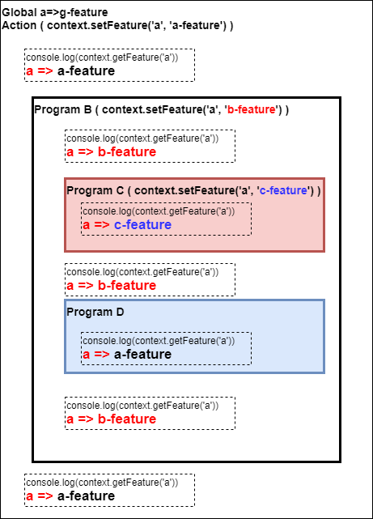
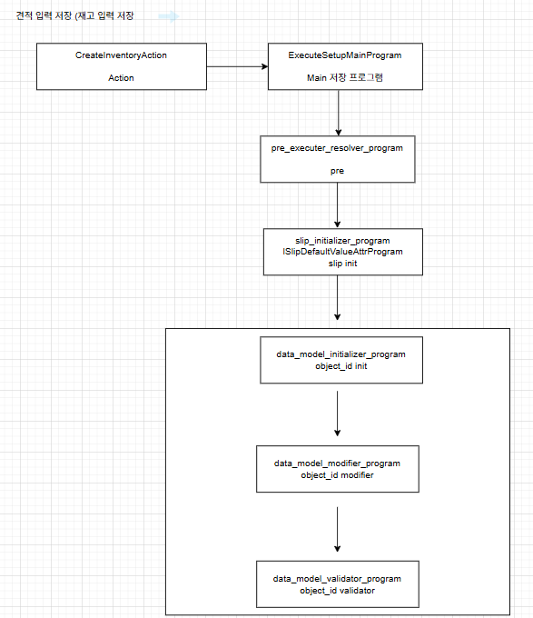
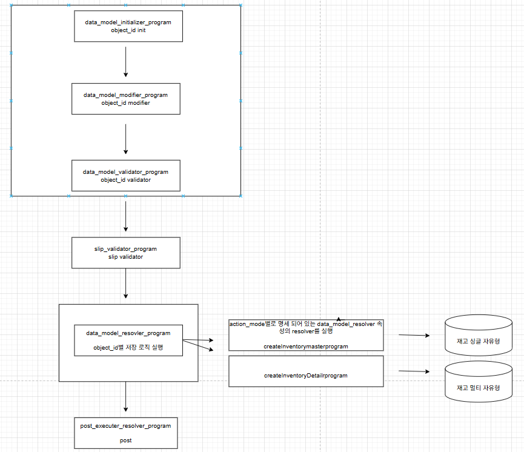

# Daily Retrospective  
**작성자**: [박성재]  
**작성일시**: [2025-01-07]

## 1. 오늘 배운 내용 (필수)  
- 5.0프레임워크 Feature의 개념과 사용법
- 5.0 프레임워크 전체 흐름 실제 코드로 정리해보기

## 5.0프레임워크 Feature의 개념과 사용법

### 내가 이해한 Feature의 개념
5.0 프레임워크에서 로직의 흐름은 `Action`에서 시작되어 하나의 `Main Program`에 전달되고 `Validator`와 같은 그 하위 `Program`들에 의해 비즈니스 로직이 실행되게 됩니다. 

여기서 `Feature`는 기능 로직에서 메인 관심사는 아니지만 실행의 흐름을 제어하는 등의 `Action`이나 `Program`들을 도와주는 일종의 `세미 공통 서포터 역할`이라고 이해했습니다.

### Feature는 언제 사용하면 좋을까?
1. 로직의 흐름은 동일하지만, 상황에 따라 실행 `Instance`를 변경해야하는 경우
2. 공통 유틸성 함수를 구현하는 경우
    - 카테고리에 따라 1개의 `Feature`가 상세 기능(함수)들은 가지도록 구현

</br>

### Feature의 명세

#### [ FeatureIdentifier ]
해당 `feature`를 외부에서 참조하기 위한 식별자입니다.

- runtime과 compile time에 `feature`를 특정할 수 있는 `key`역할을 합니다.
- 반드시 `Feature Interface`와 동일한 이름으로 합니다.
- 변수명과 `feature_id`가 일치해야 합니다.
- feature의 구현체(class)가 속한 `usecase`의 `@abstration`에 feature interface와 동일한 파일에 선언 합니다.

#### [ Feature Interface ]
`Feature`를 구현하기위한 기능 명세 역할을 합니다.

- 반드시 `IFeature`를 상속 받아야 합니다.
- 반드시 `Feature Identifier`의 변수명(`feature_id`)와 동일한 이름으로 만들어야 합니다.
- `feature`의 구현체(class)가 속한 `usecase`의 `@abstration`에 `feature identifier` 동일한 파일에 선언 합니다.

</br>

### Feature의 사용법
하나의 `Action`이나 `Program`에서는 여러개의 `Feature Interface`를 가질 수 있습니다. 그리고 각 `Feature Interface`마다 로직에 필요한 구현체를 통해 `Feature`의 기능을 사용할 수 있게됩니다. `Feature`를 사용하는 방법에 대해 단계별로 정리해보겠습니다.

### 1. Feature Interface 명세
```typescript
// ITestFeature.ts

import { FeatureIdentifier, IFeature } from 'ecount.infra.base/abstraction';

export const ITestFeature = new FeatureIdentifier('ITestFeature');

export interface ITestFeature extends IFeature {
	printLog(): void;
}
```
- 먼저 구현체를 일괄적으로 관리할 수 있으며, 외부에서 사용될 수 있도록 인터페이스를 명세해야합니다.
- 구현체가 필수적으로 구현해야하는 `기능(함수)`를 `IFeature` 인터페이스를 상속받아 정의합니다.
- `IFeature` 인터페이스에는 `string` 타입의 `feature_id` 필드가 존재하며, 구현체는 이 필드도 반드시 정의해주어야 합니다.

### 2. Feature 구현체 작성
```typescript
// TestFeature.ts

import { IExecutionContext } from 'ecount.infra.bridge/base';
import { ITestFeature } from 'ecount.usecase.setup/@abstraction';

export class TestFeature implements ITestFeature {
	feature_id: string = ITestFeature.feature_id;

	constructor(execution_context: IExecutionContext) {
		console.log('execution_context = ' + execution_context);
	}

	printLog(): void {
		console.log('feature 테스트');
		console.log(this.feature_id);
	}
}
```
- 인터페이스에서 명세한 필드와 기능을 구현하고 있습니다.
- 필요에 따라 `execution_context`를 전달받아 다른 `Feature`를 호출해서 연계해서 사용하거나 활용할 수 있습니다.

### 3. Feature 등록하기
```typescript
// GetInventoryDataAction.ts
export default class GetInventoryDataAction
	extends ApiActionBase<GetInventorySetupRequestDto, GetInventorySetupResultDto>
	implements IGetInventoryDataAction
{
    protected onConfigure(configuration_context: IConfigurationContext): void {
		const execution_context = configuration_context as unknown as IExecutionContext;

        // ...
        configuration_context.setFeature<ITestFeature>(ITestFeature, new TestFeature(execution_context));
    }
}
```
- `Feature`를 사용하기 위해서는 `IExecutionContext` 타입의 `ExecutionContext`라는 하나의 컨텍스트에 `Feature`를 등록해야합니다.
- `ExecutionContext`는 `Feature`를 관리하기위한 하나의 컨텍스트로서 일정한 유효 범위를 의미하는 **스코프** 별로 `Feature`를 관리할 수 있도록 도와줍니다.
- `ExecutionContext` 인스턴스의 `setFeature` 함수를 이용해 등록하며, 제네릭 타입으로 사용 `Feature`의 인터페이스 타입을 선언해주어야 합니다. 또한 함수의 첫 인자로 `Feature Interface`에 명시된 `FeatureIdentifier`를 전달해주고, 두번째 인자로 `Feature`의 구현체를 전달해주어야 합니다.
- 일반적으로 `Feature`을 호출하는 객체의 설정하는 단계에서 등록합니다.

### 4. Feature 사용하기
```typescript
// GetInventoryDataAction.ts
export default class GetInventoryDataAction
	extends ApiActionBase<GetInventorySetupRequestDto, GetInventorySetupResultDto>
	implements IGetInventoryDataAction
{
    // ...

    executeSync(execution_context: IExecutionContext, data: GetInventorySetupRequestDto): GetInventorySetupResultDto {
		const execution_context = configuration_context as unknown as IExecutionContext;

        // ...
        const input = execution_context.getFeature<ITestFeature>(ITestFeature);
        input.printLog(); // feature 테스트
    }
}
```
- `ExecutionContext` 컨텍스트에 `Feature`를 등록해두었으므로 로직에서 해당 `Feature`를 꺼내어 사용할 수 있습니다.
- `ExecutionContext` 인스턴스의 `getFeature` 함수를 사용하며, 제네릭 타입으로 사용 `Feature`의 인터페이스를 전달해주고, 함수의 인자로 `Feature Interface`에 명시된 `FeatureIdentifier`를 전달하여 원하는 타입의 `Feature`를 가져올 수 있습니다.

</br>

### Feature 여러개 사용하기
```typescript
// GetInventoryDataAction.ts
export default class GetInventoryDataAction
	extends ApiActionBase<GetInventorySetupRequestDto, GetInventorySetupResultDto>
	implements IGetInventoryDataAction
{
    protected onConfigure(configuration_context: IConfigurationContext): void {
		const execution_context = configuration_context as unknown as IExecutionContext;

        // ...
        configuration_context.setFeature<ITestFeature>(ITestFeature, new TestFeature(execution_context));
    }

    // ...
    executeSync(execution_context: IExecutionContext, data: GetInventorySetupRequestDto): GetInventorySetupResultDto {
		const execution_context = configuration_context as unknown as IExecutionContext;

        // ...
        const input = execution_context.getFeature<ITestFeature>(ITestFeature);
        const input2 = execution_context.getFeature<ITestFeature2>(ITestFeature2);
        input.printLog(); // feature 테스트
        input2.printLog2(); // feature 테스트2
    }
}
```
- 위처럼 하나의 `Action`이나 `Program`에서 여러개의 `Feature`를 등록하고 사용할 수 있습니다.
- 주의할 점은 하나의 사용 `Feature`에는 반드시 독립적인 하나의 `interface`로서 등록되어야 한다는 것입니다.
즉, 여러개의 `Feature`를 사용하려면 각 `Feature`들은 모두 서로 다른 `interface`로서 명세되어야 합니다.

</br>

### Default Feature
```typescript
@default_feature(IV3AttributeFeature)
export class BoardAttrV3ToV5ConvertFeature implements IV3AttributeFeature {
   constructor(execution_context?:IExecutionContext) {
        ...
   }	
   ...
}

```
- `Feature`의 구현체 중, 만약 인터페이스의 기본 구현체로 설정하고 싶다면 `@default_feature(인자1)` 을 클래스에 데코레이터로 선언해주면 됩니다.
- 데코레이터의 인자에는 해당 구현체의 `feture identifier`를 전달하면됩니다.
- 만약 동일한 `Feature` 인터페이스(feture identifier)에 2개 이상의 `default` 구현체가 존재하면 build 에러가 발생합니다.
- `default feature` 구현체는 반드시 위 예제처럼 `IExecutionContext` 타입을 선택 매개변수로 받는 생성자를 구현해야합니다.
- 컨텍스트에 해당 인터페이스로 `setFeature`를 하지 않은 상태이면 설정한 `deafault feature`가 생성됩니다.

</br>

### Feature를 스코프 별로 나누어 관리하기
`Feature`를 컨텍스트에 등록할 때 등록되는 `Feature`에는 스코프('유효범위')가 존재합니다. 



- 로직의 진입점인 `Action`에서는 Global 범위의 `Feature`로 관리됩니다.
- `Action` 하위의 `Program` 들에서는 컨텍스트에 `Feature`를 등록하면 등록한 `Feature`로 해당하는 `Feature Interface`의 `Feature`가 변경됩니다.
- 별도로 등록하지 않을 경우 Global 범위의 `Feature`로 적용됩니다.
- 위 그림을 보면 `Actiont`에서 선언한 `a-feature`가 2 Depth 아래의 `Program D`에서도 별도로 `Feature`를 등록하지 않아, `getFeature`를 했을 때 Global 범위인 `a-feature`가 반환되는 것을 알 수 있습니다.
- 또한, 별도로 `Feature`를 등록한 `Program B`와 `Program C`에서는 각각 자신의 범위의 `Feature`로만 가져와지는 것을 확인할 수 있습니다.

</br>

## 5.0 프레임워크 전체 흐름 실제 코드로 정리해보기
교육 마지막 시간에 팀장님과 함께 실제 로직 코드를 기준으로 하나의 비즈니스 Flow를 직접 그려나가보는 과정을 해보았습니다.

아래 흐름도를 따라 지금까지 이해해본 큰 흐름을 정리해보겠습니다.





### 1. CreateInventoryAction
재고입력 메뉴에서 저장하는 기능의 API 로직 진입점입니다.

`bizz_manager`를 통해 `bizz_definition`를 가져오고, 현재 업무에 따른 파생업무 목록을 가져옵니다.

파생 업무 목록과 기타 필요한 정보들을 통해 `slip_dto`로 감싼 뒤, 로직을 실행할 프로그램들을 지정하는 `ActionProgramResolveProgram`으로
전달합니다.

### 2. ActionProgramResolveProgram
전달받은 `slip_dto`를 통해 현재 `action_mode`가 무엇인지 정보를 얻습니다. `action_mode`에 따라 `resolver`를 지정하고, 지정된 `resolver`가 있다면
그 `resolver`에게 로직 실행을 위임합니다. 만약 지정된 `resolver`를 찾을 수 없다면 빈 객체를 반환합니다.

### 3. ExecuteSetupMainProgram
`Program`의 최상위에 존재하여 하위 `Program`들에 세부 로직 실행을 위임합니다. `pre_executer_resolver_program`부터 순서대로 수행시킵니다.

### 3. PreExecuterProgram
`pre_executer_resolver_program` 단계로서, 요청으로 받은 업무 및 메뉴 특성에 따라 설정된 `slip_attribute`들로부터 추출 가능한 `pre_execute resolver` 목록들에 존재하는 `Program`들이,

 서버에서 pre_executer 역할을 하는 `Program`들을 명세해놓은 목록(즉 `@abstraction` 영역에 `pre_executer` 역할을하는 `attr_resolover` 목록을 선언해놓은 `index.ts`에 존재하는 `Program` 목록)에
 과 일치하는 `Program`일 경우 그 로직을 실행시킵니다. 본 로직을 실행시키게됩니다. `pre_excuter`들은 본 로직 수행 전 필요한 초기 설정들을 하는 역할을 합니다.

### 4. slip_initializer_program
기본값 설정 등의 데이터 관련 초기 설정을 수행합니다. 상위에서 매니저 역할을하는 `initializer`가 하위 `initialize program`들에게 해당 역할을 수행시키게됩니다.

### 5. data_model_initializer_program
데이터 모델을 가공하는 등의 역할을 수행합니다. 

### 6. data_model_modifier_program
값 자동으로 채워넣기 등의 변경업무 로직을 수행합니다.

### 7. data_model_validator_program
사용자가 설정한 `validation`기능을 적용하는 로직을 수행합니다.

### 8. slip_validator_program
기능 내부적으로 정의된 `validation` 기능을 수행하여 검증합니다.

### 9. data_model_resovler_program
하위 `Program`을 통해서 DB에 액세스하여 데이터 저장, 수정, 조회 등을 수행하도록 합니다.

### 10. post_executer_resolver_program
로직 수행이 끝나고나서 추가적으로 처리하고 싶은 로직을 수행합니다.

</br>

## 2. 동기에게 도움 받은 내용 (필수)
#### 김민준 선임, 나강민 선임, 고건호 선임, 박주현 선임 
오늘 `Feature` 개념에 대해서 여러가지 의문점들이 있었는데, 함께 대화를 통해서 덕분에 많은 것을 배울 수 있었습니다.

</br>

---

## 4. 소프트 스킬면에서 성장한 점  (선택)  
오늘도 교육에 임할 때 모르는 것이 있으면 주저하지 않고, 질문을 많이 했던 하루였습니다. 질문을 제가 많이하다보니 팀장님께서 교육을 진행하실 때, 어쩌면 저를 기준으로 오늘의 교육의 진척도를 확인하며 진행하시고 계실수도 있겠다라는 기분도 들었던 것 같습니다.

개인적으로 별도로 팀장님께 질문을 드렸을 때는 원활하게 많이 배워갈 수 있었는데, 다수의 동기분들과 교육을 함께 듣는 중간에는 아직 질문을 드리고 답변을 받아도 통쾌하게 이해가 안가는 상황이 많았습니다.

질문의 방식을 다양하게 지속적으로 시도하고 어제보다 더 좋은 질문을 할 수 있는 신입 개발자가 되도록 노력해봐야겠다는 생각이 들었습니다.

