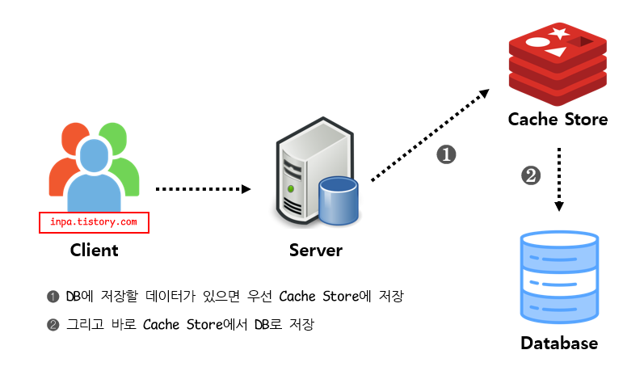

# Daily Retrospective

**작성자**: [박주현]  
**작성일시**: [2025-01-07]

# 1. 오늘 배운 내용

## 1️⃣ Feature 란 무엇인가?

Feature는 인터페이스를 통해 여러가지 기능을 하는 클래스를 확장하고, 런타임 시점에 onConfigure() 함수 등에서 DI 를 통해 특정 기능을 하는 클래스를 정해 나중에 무언갈 액션을 취할 수 있습니다.

Feature의 명세는 2가지로 구성됩니다.

```
FeatureIdentifier - 해당 feature를 외부에서 참조하기 위한 식별자

interface - feature 사용하기 위한 interface
```

각각의 요소들은 다음과 같은 역할과 약속이 있습니다.

### Feature Identifier

```
runtime과 compile time에 feature를 특정할 수 있는 key역할을 합니다.
반드시 Feature Interface와 동일한 이름으로 합니다.
변수명과 feature_id가 일치해야 합니다.
feature의 구현체(class)가 속한 usecase의 @abstration에 feature interface와 동일한 파일에 선언 합니다.
```

### Feature Interface

```
Feature를 사용하는 방법을 나타냅니다.
반드시 IFeature를 상속 받아야 합니다.
반드시 Feature Identifier의 변수명(feature_id)와 동일한 이름으로 만들어야 합니다.
feature의 구현체(class)가 속한 usecase의 @abstration에 feature identifier 동일한 파일에 선언 합니다.
```

### e.g.

```ts
import { FeatureIdentifier, IFeature } from "ecount.infra.base/abstraction";

export const ITemplateUtilTestFeature = new FeatureIdentifier(
  "ITemplateUtilTestFeature"
);
export interface ITemplateUtilTestFeature extends IFeature {
  check(): void;
}
```

### Feature 구현 및 생성

Feature 구현시 1에서 선언한 Feature Interface를 import하여 해당 기능을 구현 해야 합니다.

usecase @implement에 구현 합니다. (외부 module에서 참조 가능)

생성 방법은 직접 import하여 new하는 방법과 default feature 등록을 하여 생성하는 2개의 방법이 있습니다.

```ts
import { default_feature } from "ecount.infra.common/decorator";
import { ITemplateUtilTestFeature } from "ecount.usecase.setup/@abstraction";

@default_feature(ITemplateUtilTestFeature)
export class FeatureTest implements ITemplateUtilTestFeature {
  feature_id: string = ITemplateUtilTestFeature.feature_id;

  check(): void {
    console.log("성공");
  }
}
```

### Default Feature

Feature 구현 class 중 default_feature decorator가 붙은 객체는 decorator 첫 parameter에 할당된 IFeatureIdentifier의 기본 feature가 됩니다.
동일 feture identifier(interface)에 2개 이상의 default가 존재하면 build 시 오류가 발생합니다.
default feature는 반드시 다음 형태의 constructor를 구현 해야 합니다.

```ts
@default_feature(import 받은 인터페이스 명)
```

아무것도 set하지 않은 상태에서 getFeature를 하게 되면 Default Feature가 생성됩니다.
구현 class의 export 시 default로 하면 안됩니다.

### Feature 변경

Action, Program, Svc등 주요 excutable class는 Feature를 변경 할 수 있습니다.

Dac이나 기타 class, 함수에서는 변경 불가 합니다.

변경 방법

```
Action - onConfigure 구현
Program, Svc - onConfigure 구현,  각 Builder를 통한 create 함수의 configure option
```

Action 이나 Program 등에서 onConfigure 함수 내에서 setFeature() 를 하면 feature 인터페이스에 알맞은 클래스의 인스턴스를 DI 해주게 됩니다.

**e.g.**

```ts
export default class GetInventoryDataAction
  extends ApiActionBase<GetInventorySetupRequestDto, GetInventorySetupResultDto>
  implements IGetInventoryDataAction
{
  protected onConfigure(configuration_context: IConfigurationContext): void {
    configuration_context.setFeature<ITemplateUtilTestFeature>(
      ITemplateUtilTestFeature,
      new FeatureTest()
    );
    const a = configuration_context.getFeature<ITemplateUtilTestFeature>(
      ITemplateUtilTestFeature
    );
    a.check();
  }
  // 이후 다른 함수와 로직들
}
```

이렇게 변경된 Feature는 Feature Scope내에서 유효하게 됩니다. getFeature 를 하게되면 feature 인터페이스에 주입된 클래스의 인스턴스를 반환하게 됩니다.

## 2️⃣ 소스 코드의 흐름

개념때 배운 개념을 "견적서 입력" 기능을 예시로 더욱 디테일하게 살펴보았습니다.


```
이미지를 클릭하여 크게 확대하여 보시면 화질구지 이미지가 아닌 또렷한 이미지를 보실 수 있습니다.
```

### 1. Actuion

기능 로직에 대한 진입점입니다. FE의 요청을 받는 클래스입니다.

### 2. MainProgram

각각의 프로그램을 실행시키는 매니먼트를 하는 클래스입니다. 필요한 프로그램을 동기적으로 호출하여 하나의 기능이 동작하도록 합니다. 이후 3번부터 9번까지의 파란 프로그램들을 선택적으로 호출합니다.

### 3. pre_executer

데이터 가공을 하기 전에 동작해야할 것들을 실행시키는 클래스입니다. 로깅등이 해당 pre 에 들어갈 수도 있습니다. 보다 디테일하게 들어가면 로깅을 처리하는건 더 공통 영역에서 처리해줍니다. 로깅은 업무 비즈니스에 포함되어 있지 않고, 요구사항이 견적일때만 로깅을 남겨줘! 라고 하면 공통 영역의 기능을 활용하면 됩니다.

### 4. slip_init

전표(slip) 에 대하여 초기화에 관련된 프로그램,svc 들을 처리하는 클래스입니다.

### 5. object_id 별 (init -> modifier -> validator)

하나의 전표에 딸려있는 여러 object 에 대해 init -> modifier -> validator 합니다. object 들은 object_id 로 구분 될 수 있고, 대표적인 예시로 상단/ 하단 / 오던관리 / … 등이 있습니다.
이런 오브젝트들은 object_id 로 각각의 init -> modifier -> validator 과정을 거치게 됩니다.
즉 object_id 별로 5번 과정이 반복해서 일어나게 됩니다.

### 6. slip_validator

최종 전표에 대한 밸리데이션을 하게 됩니다. 저번에 배운 버전 체크 등이 대표적인 예시입니다.

### 7. object_id별 저장 resolver

object_id별 저장 resolver 호출해 저장하는 클래스입니다. object_id별로 반복문을 돌며 저장 프로그램을 호출하게 됩니다. 모든 저장 로직은 하나의 트랜잭션에 묶여 원자성을 지킵니다.
즉 모든 데이터가 저장될거면 다 같이 저장되고, 하나의 저장 로직이 실패한다면 모든 데이터의 저장이 실패됩니다.

### 8. create000MasterProgram & create000DetailProgram

dac 을 호출하며 DB 저장 기능을 하는 프로그램입니다. master Program 은 싱글 저장 dac을 호출하고, detail Program 은 멀티 저장 dac 을 호출하게 됩니다. dac을 통해 data_model 을 DB 테이블과 매칭되는 table_model로 변환하고 esql을 통해 최종적으로 DB에 저장됩니다.

### 9. post_executer

전표저장이후의 사후처리를 담당하는 클래스입니다. 알림을 보내는 용도, 메신저 발송, 쪽지 발송 등 프로그램을 호출하여 기능을 할 수 있습니다.

---

# 2. 동기에게 도움 받은 내용

건호님과 강민님과 현철님과 연아님과 성재님과 feature 기술에 대해 대화를 나누며 이해를 넓혔습니다. 승준님과 민준님이 발생한 에러를 같이 해결해주셨습니다.

---

# 3. 개발 기술적으로 성장한 점

## 3-1. 교육 과정 상 배운 내용이 아닌 개인적 호기심을 해결하기 위해 추가 공부한 내용

### pre_executer_program & post_executer_program

pre_executer_program 과 post_executer_program 에서 어떤 기능들을 할 수 있을지 궁금증이 생겼습니다. 스프링 프레임워크에서도 이와 비슷한 AOP 에서 할 수 있는 기능들을 생각하며 어떤 기능들을 할지 정하고 이것이 맞는 성준 팀장님께 여쭤봤습니다. 결론적으로 대부분은 맞았습니다.

pre_executer_program 에선 로깅 기능을 호출할 수 있었습니다. 데이터 가공 전에 할만한 기능으로 권한 체크를 떠올릴 수 있지만, 권한 체크는 pre 에서 하지 않습니다.
권한 체크는 아예 로직 진입점인 Action 에서 처리하게 됩니다. 타입스크립트의 데코레이터 기술을 활용하여 요청을 보냈을 시 바로 이 요청을 허용해도 될 사람인지 확인합니다. 데코레이터야말로 스프링의 AOP 와 매우 유사한 기술로 보였습니다.

**e.g.**

```ts
@_authorize({ authority_type: EN_AUTHORITY_TYPE.Access } as AuthorityDataDto)
export default class GetInventoryDataAction
	extends ApiActionBase<GetInventorySetupRequestDto, GetInventorySetupResultDto>
	implements IGetInventoryDataAction
```

post_executer_program 에서 할 수 있는 기능은 알림을 보내는 용도, 메신저 발송 등을 생각하여 여쭤봤습니다. 팀장님께선 맞다고 하시며 전표 저장후 모든 사후처리를 할 수 있다 하셨습니다. 메신저 발송이나 알림 등은 비동기적으로 처리해야하므로 메시지 큐에 발행하는 정도만을 할 것이라 예상해보았습니다. 후에 구독을 처리하는 프로그램에서 메신저 및 알림을 사용자에게 적절히 띄울 것입니다.

### 캐싱

양식을 저장하는 로직 마지막 부분에 레디스 캐시에 저장하는 로직이 있었습니다. 이 로직을 통해 이카운트에서 캐싱을 활용한다는 것을 알았고, 어떤 캐싱 전략을 활용했을지 생각해 보고 이 내용을 성준 팀장님께 여쭤보며 정답을 체크 했습니다.

이카운트에서 사용자 커스텀처럼 양식의 어떤 요소 요소들을 사용자 설정을 할 수 있습니다. 이런 설정에 따라 화면에 다르게 ui로 나타납니다. 이런 설정 내용들은 무수히 큰 데이터를 가지고 있고 json 형태로 보았을 때 4000 줄이 넘었습니다. 매번 조회 페이지를 갈 때 마다 해당 페이지의 양식을 요청해 받아오면 매번 4000 줄이 넘는 json 파일을 주고 받아야합니다. 이렇게 하지위해 데이터를 캐싱합니다.

대부분 IT 서비스는 주로 조회 되는 상품들을 캐싱합니다. 상품을 이카운트에서 하나하나 전표나 데이터로 본다면 이카운트는 그렇게 하지 않습니다. 이카운트는 페이지의 양식 설정 하나하나가 데이터로서 db에 저장될 수 있습니다. 그리고 이런 설정으로 뷰페이지를 렌더링합니다. 한번 정한 양식은 잘 바뀌지 않으며 각각의 개별 데이터 조회 보다 더 많이 쓰입니다. 따라서 자주 변경되는 각각의 데이터인 전표나 이력을 캐싱하는 것이 아닌, 주로 쓰이고 큰 데이터 양을 가지는 양식 설정을 캐싱하게 됩니다.

양식 설정이 수정되거나 생성되면 그 변경 내용으로 바로 캐싱을 하는 전략을 사용합니다. 이는 Write Through 패턴 입니다. 하지만 캐시에서 DB로 저장하는지 아니면 캐싱과 DB저장을 각각 하는지에 대해선 소스코드를 더 살펴봐야합니다.

캐싱전략에는 크게 두가지를 이야기 할 수 있습니다.

**Write Through 패턴 vs Write Around 패턴**

```
📍Write Through 패턴

데이터베이스와 Cache에 동시에 데이터를 저장하는 전략
데이터를 저장할 때 먼저 캐시에 저장한 다음 바로 DB에 저장 (모아놓았다가 나중에 저장이 아닌 바로 저장)
Read Through 와 마찬가지로 DB 동기화 작업을 캐시에게 위임
DB와 캐시가 항상 동기화 되어 있어, 캐시의 데이터는 항상 최신 상태로 유지
캐시와 백업 저장소에 업데이트를 같이 하여 데이터 일관성을 유지할 수 있어서 안정적
데이터 유실이 발생하면 안 되는 상황에 적합
자주 사용되지 않는 불필요한 리소스 저장.
매 요청마다 두번의 Write가 발생하게 됨으로써 빈번한 생성, 수정이 발생하는 서비스에서는 성능 이슈 발생
기억장치 속도가 느릴 경우, 데이터를 기록할 때 CPU가 대기하는 시간이 필요하기 때문에 성능 감소
```



<br>

```
📍Write Around 패턴

Write Through 보다 훨씬 빠름
모든 데이터는 DB에 저장 (캐시를 갱신하지 않음)
Cache miss가 발생하는 경우에만 DB와 캐시에도 데이터를 저장
따라서 캐시와 DB 내의 데이터가 다를 수 있음 (데이터 불일치)
```


이카운트의 캐싱전략이 완벽하게 Write Through 전략이라고 할 순 없지만, 비슷한 형태를 가져갑니다. 그래서 erp 기능 교육 수업 때도 양식을 바꾸면 바로 적용되는 것이었습니다.

## 3-2. 오늘 직면했던 문제 (개발 환경, 구현)와 해결 방법

빌드 에러를 겪었습니다. 그리고 많은 동기들이 저와 비슷한 에러를 겪었습니다.

**상황**

인터페이스나 클래스를 만들어주고 나선 항상 index.ts 폴더에 만든 파일을 명시해줘야합니다. 모든 파일들을 인덱스에도 설정했는데도, 테스트 시 index.js 에서 제가 만든 클래스의 인스턴스를 찾을 수 없다고 나타났습니다.

**원인**

5.0엔 04레이어와 03레이어가 있습니다. 그리고 4레이어의 소스 코드에선 대부분 3 레이터의 인스턴스들을 사용합니다. 수정 순서는 3번 -> 4번 순으로 설정을 바꾸고, 빌드 순서는 4번 먼저하니 3번에 변경된 내용들이 빌드돼 index.js 에 반영되지 않아, 인스턴스를 차지 못하는 것이었습니다.

**해결**

03 레이어와 04 레이어 순으로 빌드를 해 문제를 해결했습니다. 별것도 아닌 이슈였는데, 디버깅 조차할 수 없는 상황에 낙담했지만, 동기들과 이것저것 만지며, 가능성을 유추하고 해결했습니다.

---

# 4. 소프트 스킬면에서 성장한 점

마니또를 맞춘 포상으로 오늘은 아침에 성범 책임님께서 커피를 사주셨습니다. 동기뿐 아니라 선배이신 책임님과 가벼운 이야기와 담소를 나눠서 좋았습니다. 특히 대회에서 수상한 카페에서 사주셔서 맛있었습니다. 취업 준비와 5.0 프로그램 배포 등 이야기를 나눴습니다.

5.0에 대해서 함께 이해한 바를 동기들끼리 토론하는 분위기가 형성되어 보기 좋았습니다.

---

# 5. 제안하고 싶은 내용

성준 팀장님께서 오늘 다이어그램 도식표와 소스코드를 1대1 매칭시키면서 알려주셨는데, 너무 좋았습니다. 많은 부분이 추상화 되어 있어서 이해하기 어려웠는데, 그래도 그림과 표가 있으니 이해하기 쉬웠습니다.
