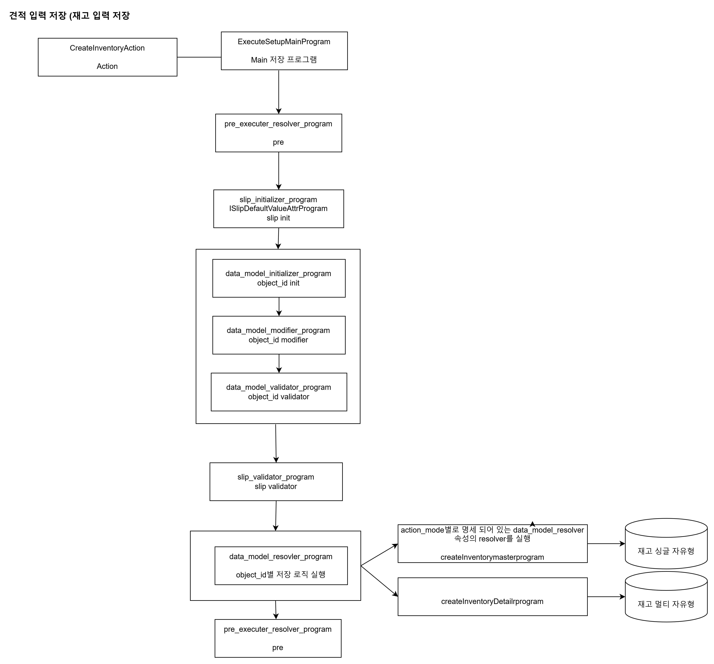

# Daily Retrospective

**작성자**: [설다은]
**작성일시**: [2025-01-07]

## 1. 오늘 배운 내용 (필수)

### 🗒️[resolver]

: 업무마다 실행해야할 때가 다른 경우 resolver를 사용한다.<br>
: program은 인터페이스 execute가 고정되어 있지만, resolver는 인터페이스 execute도 설정할 수 있다.<br>

### 🗒️[Feature]

: 이 로직에서 무조건 실행해야할 때는 feature를 사용한다.<br>
: 3.0의 if문을 없애기위해 코드를 하나로 만들고, 그것을 구현하기 위한 각각의 feature를 생성한 것<br>
: 인터페이스를 통해 비즈니스로직을 매번 수정하지 않아도 되어 의존성을 낮춤.

_구현흐름_<br>
(1) interface 구현 + index에 추가<br>
경로 : D:\ecxsolution\ecount.nextv5\ecount.solution\src\03.ecount.usecase\ecount.usecase.common\src\server\@abstraction\feature\ICreateHistoryFeature.ts

```ts
import { FeatureIdentifier, IFeature } from "ecount.infra.base/abstraction";
// feature_id와 변수명은 일치해야한다.
//반드시 Feature Interface와 동일한 이름이어야한다..
export const ICreateHistoryFeature = new FeatureIdentifier("ICreateHistoryFeature");
// 반드시 IFeature을 상속받아서 구현해야한다.
export interface ICreateHistoryFeature extends IFeature {
  init(): void;
  excute(): void;
}
```

(2) Feature 구현체 구현 + index에 추가<br>
경로 :
D:\ecxsolution\ecount.nextv5\ecount.solution\src\03.ecount.usecase\ecount.usecase.common\src\server\@implement\feature\createFile(DB/Console)HistoryFeature.ts

```ts
// CreateFileHistoryFeature
import { default_feature } from "ecount.infra.common/decorator";
import { ICreateHistoryFeature } from "ecount.usecase.common/@abstraction";
// default_feature를 쓰면 호출하는 부분에서 setFeature할 필요없이 getFeature만 사용하면 됨. (같은 인터페이스를 사용하는 feature중 하나에만 걸어야함.)
@default_feature(ICreateHistoryFeature)
export class CreateFileHistoryFeature implements ICreateHistoryFeature {
  init(): void {
    console.log("init");
  }
  excute(): void {
    console.log("excute");
  }
  feature_id: string;
}

// CreateDBHistoryFeature
import { ICreateHistoryFeature } from "ecount.usecase.common/@abstraction";
export class CreateDBHistroyFeature implements ICreateHistoryFeature {
  init(): void {
    console.log("init");
  }
  excute(): void {
    console.log("excute");
  }
  feature_id: string;
}

// CreateConsoleHistoryFeature
import { ICreateHistoryFeature } from "ecount.usecase.common/@abstraction";
export class createConsoleHistoryFeature implements ICreateHistoryFeature {
  init(): void {
    console.log("init");
  }
  excute(): void {
    console.log("excute");
  }
  feature_id: string;
}
```

(3) 호출 로직 추가<br>
경로 : D:\ecxsolution\ecount.nextv5\ecount.solution\src\04.ecount.application\VeloxApps\app.inventory\src\server\action\GetInventoryDataAction.ts

```ts
	protected onConfigure(configuration_context: IConfigurationContext): void {
		const execution_context = configuration_context as unknown as IExecutionContext;
        // default가 아닌 다른 feature를 쓰려면 set으로 설정해줘야함.
		configuration_context.setFeature(ICreateHistoryFeature, new createConsoleHistoryFeature());
    }
    ......
	executeSync(execution_context: IExecutionContext, data: GetInventorySetupRequestDto): GetInventorySetupResultDto {
		let result = {} as GetInventorySetupResultDto;
        // execute할 때 호출할 feature를 작성
		execution_context.getFeature<ICreateHistoryFeature>(ICreateHistoryFeature).excute();
    }
```

### 🗒️[로직 흐름의 도식화]


도식화한 부분이랑 실제 로직이랑 매칭하는게 어려웠는데 같이 도식화를 하면서 조금 더 이해가 갔다.<br> 자주자주 보면서 실제로직이랑 흐름을 매칭하는 연습을 해야겠다.

## 2. 동기에게 도움 받은 내용 (필수)

**민준님**<br>
Feature구현 시 잘 안되는 부분이 있었는데 흐름을 설명해주어서 이해가 잘 되었다.<br>

**성철님**<br>
점심시간에 커피를 사주었다... 힘든 하루 한줄기 빛! 감사합니다~

## 3. 개발 기술적으로 성장한 점 (선택)

### 1. 교육 과정 상 배운 내용이 아닌 개인적 호기심을 해결하기 위해 추가 공부한 내용

### 2. 오늘 직면했던 문제 (개발 환경, 구현)와 해결 방법

여러 개념들이 계속 주입되다보니 헷갈리는 개념들이 생기기 시작했다.<br><br>
해결방법 : 성준팀장님께 각각이 어떤 개념인지 설명요청을 하였다.<br><br>
헷갈렸던 개념 : data_model_id / object_id / prop_id<br>

- data_model_id : 같은 상단, 하단이라도 업무에 따라서 다르기 때문에 이를 구분하기 위해 사용하는 것 (ex. quotationXmaster, quotationXdetail, ...)<br>
- object : quotationXmaster 가지고 있는 정보들<br>
- object_id : quotationXmaster가 가지고 있는 정보들의 id<br>
- object.target_props : 해당 object가 가지고 있는 prop들의 집합<br>

∴ 아직도 헷갈리지만 익숙해지고, 소스를 구현하다보면 자연스럽게 체득할 수 있는 부분이라고 생각했다. 소스코드를 많이 보면서 익숙해질 수 밖에 없을 것 같다.

### 3. 위 두 주제 중 미처 해결 못한 과제. 앞으로 공부해볼 내용.

## 4. 소프트 스킬면에서 성장한 점 (선택)

오늘도 지은님이랑 같이 Feature에 대해서 스스로 먼저 구현해보고 같이 맞춰보는 시간을 가졌다.<br>
지은님이 모르는 부분은 내가 설명해주고, 반대로 내가 모르는 부분은 지은님이 설명해주면서 상호 도움이 되는 관계로 성장하고 있는 것 같아서 좋다.

## 5. 제안하고 싶은 내용

수업이 너무 빨라서 따라가기 힘들다는 느낌이 들었습니다.<br>
프레임워크에대해서 노베이스인 상태에서 소스코드를 보면서 설명해주시는데 화면이 훅훅 넘어가니까 해당 파일이 뭔지, 해당 부분이 어떻게 구현되고 있는건지 생각할 시간을 가질 수 없습니다.<br>
오히려 이렇게 넘어가버려서 추후 구현시간에 스스로 개념을 이해해야하는 시간이 늘어나는 것 아닌가 하는 생각이 들어서 조금만 천천히, 구체적으로 설명해주시면 좋을 것 같습니다.<br>
설명하실 때 갑자기 뛰어넘어버리는 부분도 있는데 그 공백이 뭔지 애매해서 질문하기가 어렵습니다...<br>
