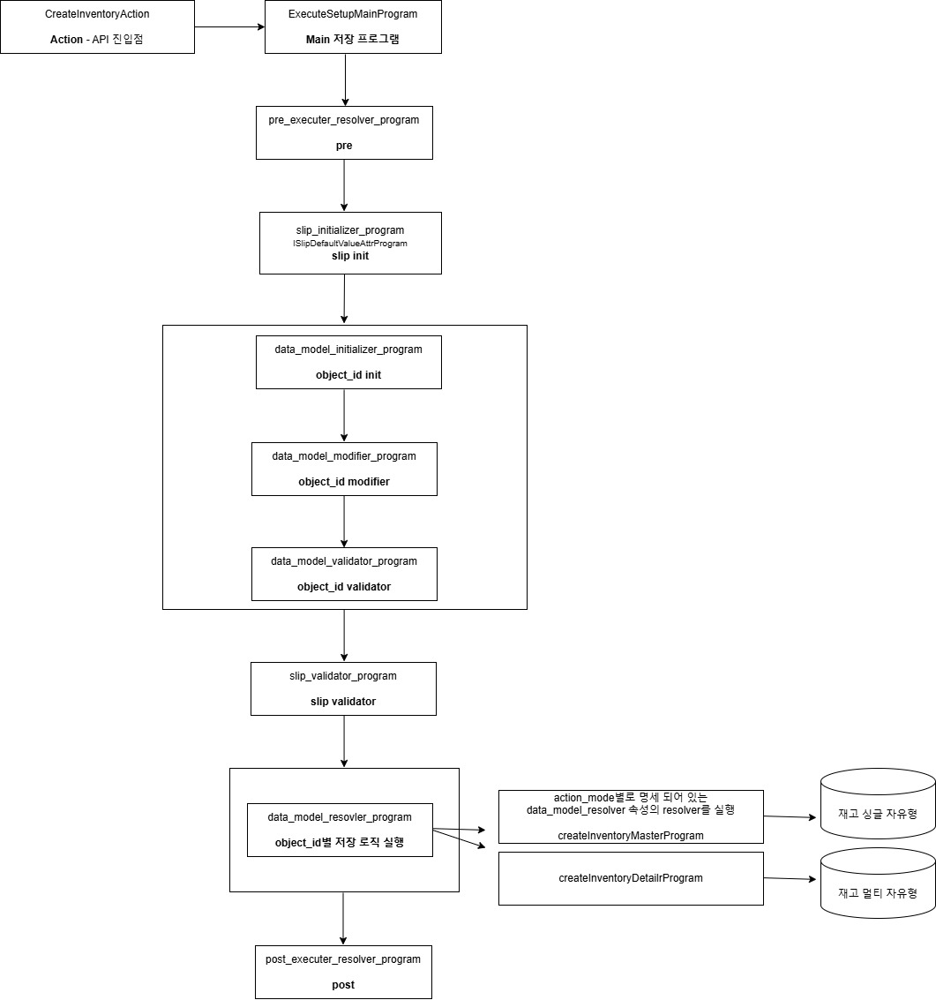

# Daily Retrospective  
**작성자**: 이연아  
**작성일시**: 2025-01-07  

## 1. 오늘 배운 내용 (필수)  
### Feature
#### Feature 명세는 2가지로 구성된다.
- `Feature Identifier` : 해당 feature를 외부에서 참조하기 위한 식별자
	- runtime과 complie time에 feature를 특정할 수 있는 key 역할
	- 반드시 Feature Interface와 동일한 이름 사용
	- 변수명과 feature_id가 일치해야 함
- `interface` : featur를 사용하기 위한 interface
	- Feature를 사용하는 방법을 나타냄
	- 반드시 IFeature를 상속받고, Feature Identifier의 변수명과 동일한 이름 사용

=> 2가지 모두 feature의 구현체가 속한 usecase의 @abstration에 선언

#### Feature 구현 및 생성
- Feature Interface를 import하여 해당 기능을 구현해야 함
- usecase의 @implement에 구현
- 생성 방법
	1. 직접 import하여 new하는 방법
	2. default feature 등록하여 생성

```typescript
import {IV3AttributeFeature} from 'ecount.usecase.setup/@abstraction'
import {BoardAttrV3ToV5ConvertFeature} from 'ecount.usecase.setup/@implement'
...
context.setFeature(IV3AttributeFeature, new BoardAttrV3ToV5ConvertFeature(context));
```

#### Default Feature
- `@default_feature`가 붙은 객체는 decorator 첫 parameter에 할당된 IFeatureIdentifier의 기본 feature가 된다.
- 동일 default identifier(interface)에 2개 이상의 default가 존재하면 build시 오류가 발생한다.
- default feature는 반드시 아래와 같은 constructor를 구현해야 한다.
- 누구도 set하지 않은 상태에서 getFeature를 하게 되면 default feature가 생성된다.
```typescript
@default_feature(IV3AttributeFeature)
export class BoardAttrV3ToV5ConvertFeature implements IV3AttributeFeature {
   constructor(execution_context?:IExecutionContext) {
        ...
   }	
   ...
}
```

#### Feature 변경
- Action, Program, Svc 등 주요 excutable class는 Feature를 변경할 수 있다.
- Dac이나 기타 class, 함수에서는 변경할 수 없다.
- 변경 방법
	- Action - onConfiguration 구현
	- Program, Svc - onConfiguration 구현, 각 Builder를 통한 create 함수의 configure option

#### resolver vs feature
- post execute resolver(속성) : 추상화 - 실체가 없음, 명세한 resolver가 있으면 실행 / 메인 로직에서 실행 여부가 다를 때 사용
- feature : interface 이력, 메인 로직에서 무조건적으로 실행되어야 할 때 사용

[실습]
1. Feature 명세
D:\ecxsolution\ecount.nextv5\ecount.solution\src\03.ecount.usecase\ecount.usecase.setup\src\server\\@abstraction\feature\ITestFeature.ts
```typescript
import { FeatureIdentifier, IFeature } from 'ecount.infra.base/abstraction';

export const ITestFeature = new FeatureIdentifier('ITestFeature');
export interface ITestFeature extends IFeature {
	init(): void;
	execute(): void;
}
```

2. Feature 구현
D:\ecxsolution\ecount.nextv5\ecount.solution\src\03.ecount.usecase\ecount.usecase.setup\src\server\\@implement\feature\TestFeature.ts
```typescript
import { ITestFeature } from 'ecount.usecase.setup/@abstraction';

export class TestFeature implements ITestFeature {
	init(): void {
		console.log('feature init 호출');
	}
	execute(): void {
		console.log('feature execute 호출');
	}
	feature_id: string;
}
```

3. Feature 사용
D:\ecxsolution\ecount.nextv5\ecount.solution\src\04.ecount.application\VeloxApps\app.inventory\src\server\action\GetInventoryDataAction.ts
```typescript
protected onConfigure(configuration_context: IConfigurationContext): void {
	const execution_context = configuration_context as unknown as IExecutionContext;

	// setFeature 사용
	configuration_context.setFeature<ITestFeature>(ITestFeature, new TestFeature());
	...
}

executeSync(execution_context: IExecutionContext, data: GetInventorySetupRequestDto): GetInventorySetupResultDto {
	let result = {} as GetInventorySetupResultDto;
	...
	// getFeature 사용
	execution_context.getFeature<TestFeature>(ITestFeature).execute();
}
```

### 실행 흐름 (저장 로직)
견적서입력 저장 기능에 대한 전체적인 흐름을 도식화하며 파일과 매칭



## 2. 동기에게 도움 받은 내용 (필수)
- 실습 과정에서 성재님, 지은님, 다은님의 도움을 많이 받을 수 있었습니다. 감사합니다!
- 이론적인 부분에서 막막할때 현철님이 이해하기 쉽게 설명해주셨고, 설명을 들으며 강민님과 주현님과 함께 이야기를 나누며 이해할 수 있었습니다. 감사합니다!
- 강민님이 콘솔에 찍히지 않는 문제를 해결해주셨습니다. 감사합니다!

---

## 3. 개발 기술적으로 성장한 점 (선택)
### 3. 위 두 주제 중 미처 해결 못한 과제. 앞으로 공부해볼 내용.
5.0 프레임워크에 대해서 배우는 과정에서 코드를 이해하는 것도 어렵지만, 아직까지 회사 프레임워크에서 사용하는 용어에 익숙하지 않아서 오는 버퍼링도 있는 것 같습니다. 개념시간에 배운 내용을 복습하면서 그 때 익히지 못했던 내용을 이번 실습을 하면서 최대한 익숙해지려는 노력이 필요할 것 같습니다. </br>
도식화하며 실제 파일과 매칭해보니 좋았습니다. 다만, 아직까진 정확한 흐름 이해가 부족한 것 같아 매칭된 코드를 봐야할 것 같습니다.

---

## 4. 소프트 스킬면에서 성장한 점  (선택)  
실습을 하면서 비록 껍데기만 만들어놓고 호출 잘되고 있나 파악하고 있는 정도지만, 어제는 그것조차 너무 어렵고 막막했었습니다. 오늘은 최대한 이론을 파악해보려고 노력하고 적극적으로 많은 사람들한테 물어보면서 이해하려고 노력했습니다. 어떤 질문을 할지조차 어려웠지만, 모두가 친절하게 알려주기 때문에 (아직은 많이 부족하지만) 질문하는 것을 두려워하지 않고 성장하고 있는 것 같습니다!   

---