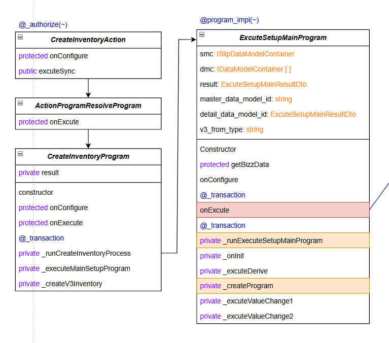
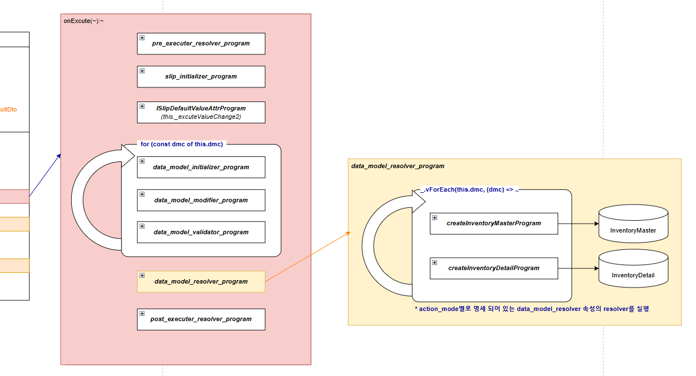

# Daily Retrospective

**작성자**: [최현철]  
**작성일시**: [2025-01-07]

## 1. 오늘 배운 내용 (필수)

- server layer / ExecuteSetupMainProgram

  - attr.data.resolver : 인터페이스가 담겨있으니, ProgramBuilder.create에 담겨서 프로그램 생성되는거임.

- 입력화면 진입 시 속성 전체다 가져옴 (내려오는 json 확인)

- inventory_attr_map

  - 밸리데이터 속성들은 파일로 관리하고있다. (로직에 없어야 공통화 가능하다, DB로 가려고하는중)
  - 액션모드 별로 정리
  - save_notification
  - 사용자설정 열린 것 : DB / 로직 상에서 필요한 : 파일 (설정 열 수 없음)

- Resolver : 이 속성을 가지고있으면, 이 프로그램을 실행시켜줘

  - attr_id가 A면, 프로그램 B를 실행시켜줘
  - http://git2.ecount.kr/ecount-doc/ecount-docs/-/blob/master/5.0-manual/000.renewal/002.framework/402.Attribute-Resolver.md?ref_type=heads

- Feature

  - http://git2.ecount.kr/ecount-doc/ecount-docs/-/blob/master/5.0-manual/000.renewal/002.framework/303.Feature.md?ref_type=heads
  - Attribute VS Feature
    - 메인로직에서 무조건 실행한다 = Feature
    - 작동이 조건부이다 = Attribute
  - Feature의 인터페이스만 알고있으면, 메인 로직에서 인터페이스로 프로그램 빌드해서 실행시킴.

- Data_model_resolver : 데이터 모델을 실행시킨다 ?

- 파생

  - 파생으로 생산전표를 저장할 때 createInventory바로 부르는게 아니라, 업무의 definition 안에있는 Data_model_resolver를 불러서 호출한다.

- 데이터 모델은 N개의 object로 구성되어있음

- 권한체크는 데코레이터로 메인 프로그램 위에있음

- 재고 저장 흐름 교육

## 2. 동기에게 도움 받은 내용 (필수)

1. 건호반장님께서 교육장 환경개선을 위해 많은 것들을 요청해주셨습니다.

2. 이해가 안돼서 조급한 마음이 들었는데, 연아님도 비슷한상황이라고 위로해주셔서 다시 힘낼 수 있었습니다.

3. feature 구현 후 프로그램에서 getFeature할 때 메소드가 호출이 안됐는데, 인터페이스에 메소드가 정의되어있지 않았기 때문이란 것을 강민님께서 알려주셨습니다.

4. feature 개념에 대해서 잘 이해가 가지 않았는데, 건호/강민/주현님께서 토론까지하시며 자세히 알려주셔서 이해하는데 도움이 되었습니다.

5. 저녁 주문이 누락돼서 식사시간이 좀 늦어졌는데 강민님께서 shutdown/a를 해주셔서 문서들을 지킬 수 있었습니다.

---

## 3. 개발 기술적으로 성장한 점 (선택)

### 1. 교육 과정 상 배운 내용이 아닌 개인적 호기심을 해결하기 위해 추가 공부한 내용

1. getFeature VS setFeature

- Feature를 설정?

  ```typescript
  protected onConfigure(configuration_context: IConfigurationContext) {

      configuration_context.setFeature<IConvertV5ToV3InventoryFeature>(
        IConvertV5ToV3InventoryFeature,
        V3InstanceFactory.getV5toV3ConvertInstance(this.execution_context)
      );
      //... 생략
    }
  ```

- 설정했던 Feature를 호출?

  ```typescript
  private _modifyV3Inventory(request: ExecuteSetupMainRequestDto) {
    if (_.vIsEmpty(this.result.error) == false) {
      return;
    }

    const v3_inventory_feature =
      this.execution_context.getFeature<IModifyV3InventoryFeature>(IModifyV3InventoryFeature);
    v3_inventory_feature.execute({ ...request.slip_data_model, smc: request.derive_info.smc });
  }
  ```

2. 부모들

   ```typescript
   export interface IReadonlyFeatureCollectionContainer {
     getFeature<TFeature extends IFeature>(
       id: FeatureIdentifier,
       exception_if_not_found?: IException
     ): TFeature;
     tryGetFeature<TFeature extends IFeature>(
       id: FeatureIdentifier | string
     ): TFeature | undefined;
     hasFeature(id: FeatureIdentifier): boolean;
   }

   export interface IFeatureCollectionContainer
     extends IReadonlyFeatureCollectionContainer {
     setFeature<TFeature extends IFeature>(
       id: FeatureIdentifier,
       feature: TFeature
     ): void;
   }

   export interface IFeature {
     feature_id: string;
   }
   ```

3. setFeature가 왜 2가지 방식 ?

   ```typescript
   protected onConfigure(configuration_context: IConfigurationContext) {
     configuration_context.setFeature<IConvertV5ToV3InventoryFeature>(
       IConvertV5ToV3InventoryFeature,
       V3InstanceFactory.getV5toV3ConvertInstance(this.execution_context)
     );

     configuration_context.setFeature<IV3SlipLinkFeature>(
       IV3SlipLinkFeature,
       new V3SlipLinkFeature(this.execution_context)
     );
   }
   ```

---

- 내가 이해할 수 있도록 재고저장 흐름 정리

1. 재고 공통 저장로직 호출 전
   

2. 재고 공통 저장로직 호출 후
   

## 4. 소프트 스킬면에서 성장한 점 (선택)

이해가 안되고 답답할 때 저는 짜증과 좌절부터 하는데, 주현님께서는 유연하게 대처를 잘하는 것 같습니다.
성준팀장님께서 진도가 어떤지, 과제를 내도 괜찮을지 여쭤보셨었습니다.
그 때 주현님께서 "머리털 다빠질거같습니다." 라고 유머있게 얘기해서 분위기도 풀리고, 다같이 더 설명들을 수 있는 기회가 주어졌습니다.

평소에도 다 이해하셨음에도 동기들에게 정보를 공유하고자하는 의도로 질문/개념확인을 많이 받으시는 것 같습니다.

주현님은 볼수록 배울점이 많습니다.
저도 주현님처럼 유연한 사람이 되도록 노력해야겠습니다.

---

## 5. 제안하고 싶은 내용

1. context, dac 등 용어에 대한 추상적?관용적? 의미파악이 안되어있어서 이해도가 다른 동기들보다 낮았던 것 같습니다.
   실무 또는 경험이 없는 사람들을 고려하여 처음나오는 용어에 대해서는 간단한 개념 또는 이카운트 내에서 해당 용어를 어떤 개념으로 사용하는지에 대한 간단한 소개가 있으면 좋을 것 같습니다.

   - Ex. context는 실행에 필요한 정보를 의미하며, 상황에 따라 context에 담기는것들은 달라질 수 있다. 예시로 이상황에서는 context에 ~~가 담긴다.

2. 파생~값관련 등 설명 중 소스코드 넘어다니는 부분 (수업중에 바로 말씀드려서 피드백 반영해서 다시 교육해주셨습니다. 👍)

   - 순서대로 설명해주시긴 하지만, 소스코드가 너무 빠르게 옮겨지게되고, 어떤 소스 순으로 진행되는지를 모르니까 따라갈 수가 없습니다.
   - 큰그림으로 먼저 프로그램, svc, object 등이 고전도니 도식으로 그려져있느 상태에서 블록 하나씩 디테일 설명을 해주시면 더 좋았을 것 같습니다.
   - Ex. 성희책임님이 큰 흐름들 설명해주신 뒤 하나씩 디테일한 메뉴설명으로 들어가시고, 디테일 설명 중에도 항상 큰 흐름도식을 유지하시는 방식
