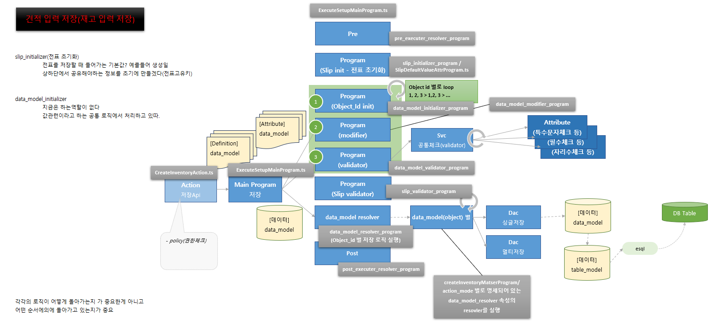
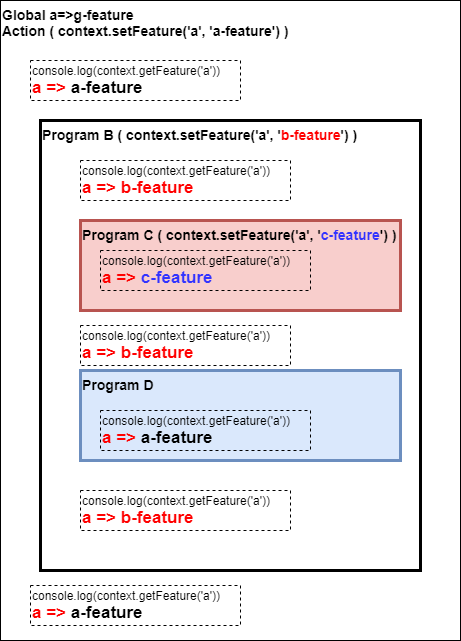

# Daily Retrospective

**작성자**: 허수경

**작성일시**: 2025-01-07(화)

## 1. 오늘 배운 내용 (필수)

- DB Validator와 File Validator
- Resolver
- Feature
- 전체흐름

### DB Validator와 File Validator

---

#### Validator 역할

- 유효성 검사

#### DB Validator

- 사용자가 설정한 Validator가 **DB에 저장**됩니다.
- 사용자가 특정 필드(예: 일자, 담당자 등)를 필수로 설정한 경우, 해당 설정이 DB Validator에 반영됩니다.

#### File Validator

- **비즈니스 로직의 유효성 검사**를 파일 형태로 관리합니다.
- `ExecuteSetupMainProgram.ts` 파일에서 모듈 단위로 검사 과정을 처리합니다.

### Resolver

---

- 특정 속성(`attr_id`)을 기반으로 관련 프로그램을 실행합니다.

#### Resolver 예시

- `inventory_attr_map.ts`

  - 업무별(재고) 속성(attribute) 관리 파일
  - `action_mode`에 따라 pre > initializer > validator > post 순서로 진행한다.
  - 속성 중에서 알림을 저장하는 프로그램을 실행시킨다.

  ```typescript
  return {
    attr_id: definition_attrs.post_executer.save_notification,
    attr_type: EN_ATTR_TYPE.PostExecuter,
    prop_id: "",
    data: {
      resolver: ICreateNotificationWrapperProgram, // 해당 프로그램 실행
    },
  };
  ```

### Feature

---

- 특정 목적을 위해 설계된 클래스입니다.
- 하나의 `Feature Interface`와 여러개의 `Feature 구현체`가 관계를 맺을 수 있습니다. (1:N의 관계가 가능합니다.)

#### 1. Feature 명세

Feature의 명세는 2가지로 구성됩니다.

**1-1 FeatureIdentifier**

- 해당 feature를 외부에서 참조하기 위한 식별자
- runtime과 compile time에 feature를 특정할 수 있는 key역할을 합니다.
- 반드시 Feature Interface와 동일한 이름으로 합니다.
- 변수명과 feature_id가 일치해야 합니다.
- feature의 구현체(class)가 속한 usecase의 @abstration에 feature interface와 동일한 파일에 선언 합니다.

**1-2 Feature Interface**

- feature 사용하기 위한 interface
- Feature를 사용하는 방법을 나타냅니다.
- 반드시 IFeature를 상속 받아야 합니다.
- 반드시 Feature Identifier의 변수명(feature_id)와 동일한 이름으로 만들어야 합니다.
- feature의 구현체(class)가 속한 usecase의 @abstration에 feature identifier 동일한 파일에 선언 합니다.

#### 2. Feature 구현 및 생성

- Feature 구현시 1에서 선언한 Feature Interface를 import하여 해당 기능을 구현 해야 합니다.
- `usecase @implement`에 구현 합니다. (외부 module에서 참조 가능)
- 생성 방법
  1. 직접 import하여 new하는 방법
  2. default feature 등록을 하여 생성하는 방법

#### 3. Feature 예시

**3-0 요구사항**

- 전표 저장로직은 공통으로 구현되어 있다.(`executesetupmainprogram`)

1. 재고 전표를 저장할 때는 이력을 파일로 저장해야 한다.
2. 회계 전표를 저장할 때는 이력을 DB에 저장해야 한다.

**3-1 Feature 명세하기**

```typescript
// 03.eocunt.usecase > server > @abstration > ICreateHistoryTestFeature.ts
import { FeatureIdentifier, IFeature } from "ecount.infra.base/abstraction";

export const ICreateHistoryTestFeature = new FeatureIdentifier(
  "ICreateHistoryTestFeature"
);
export interface ICreateHistoryTestFeature extends IFeature {
  execute(): void;
  sayHello(): string;
  // 여러 함수 생성 가능
}
```

**3-2 Feature 구현 및 생성**

1. 직접 import하여 new하는 방법

- 구현체

```ts
// 03.ecount.usecase > server > CreateFileHistoryFeature.ts
import { IExecutionContext } from "ecount.infra.bridge/base";
import { default_feature } from "ecount.infra.common/decorator";
import { ICreateHistoryTestFeature } from "ecount.usecase.setup/@abstraction";

// @default_feature(ICreateHistoryTestFeature)
export class CreateFileHistoryFeature implements ICreateHistoryTestFeature {
  feature_id: string = ICreateHistoryTestFeature.feature_id;
  context: IExecutionContext;

  execute(): void {}

  sayHello(): string {
    return "hello";
  }
}
```

- Action / Program 에 Feature Injection 주입

```ts
configuration_context.setFeature<ICreateHistoryTestFeature>(
  ICreateHistoryTestFeature,
  new CreateFileHistoryFeature()
);
```

2. default feature 등록을 하여 생성하는 방법

- 구현체

```ts
// 03.ecount.usecase > server > CreateFileHistoryFeature.ts
import { IExecutionContext } from "ecount.infra.bridge/base";
import { default_feature } from "ecount.infra.common/decorator";
import { ICreateHistoryTestFeature } from "ecount.usecase.setup/@abstraction";

@default_feature(ICreateHistoryTestFeature)
export class CreateFileHistoryFeature implements ICreateHistoryTestFeature {
  feature_id: string = ICreateHistoryTestFeature.feature_id;
  context: IExecutionContext;

  execute(): void {}

  sayHello(): string {
    return "hello";
  }
}
```

```ts
execution_context.getFeature<ICreateHistoryTestFeature>(
  ICreateHistoryTestFeature
);
```

- `@default_feature` 데코레이터로 인해 구현체와 IFeatureIdentifier가 매핑이 됩니다.
- 누구도 set하지 않은 상태에서 getFeature를 하게 되면 Default Feature가 생성됩니다.

### 전체흐름

---



- 흐름과 파일(파일 또는 프로그램)과 매핑
- 현재는 각각의 로직이 어떻게 동작하는지를 이해하기보다, **어떤 순서에 의해 실행되고 있는지**를 이해하는 것이 더 중요하다는 성준 책임님의 말씀이 있었습니다.

#### 초기화(initializer)는 왜 하는걸까?

1. **`slip_initializer` (전표 초기화)**

   - **역할**: 상단과 하단에서 공유해야 하는 정보를 초기에 생성합니다.
   - **예시**: 전표 저장 시 필요한 생성일과 같은 기본값을 미리 생성하여, 상/하단에서 동일한 정보를 사용할 수 있도록 설정합니다.

2. **`data_model_initializer`**
   - **현재 역할**: 현재 별도의 역할은 수행하지 않고 있습니다.
   - **관련 정보**: 값과 관련된 공통 로직에서 처리되고 있다고 합니다.

---

## 2. 동기에게 도움 받은 내용 (필수)

- 성철님께서 저녁 메뉴 주문을 대신 해주셨고. 또한, 점심시간에는 음료를 사 주셔서 감사했습니다.
- 점심 식사 후, 주현님과 아연님과 함께 의자 정리를 하며 작은 일도 함께할 수 있어 좋았습니다.
- 주원님과 `feature` 생성 방법에 대해 이야기를 나누며 궁금증을 공유했고, 주현님께 힌트를 얻어 해결할 수 있었습니다.
- 민준님께서 `setFeature`를 사용해야 하는 이유와 관련된 여러 가지 사항에 대해 상세히 설명해 주셔서 큰 도움을 받았습니다.

### + 동기들 질문으로 얻은 지식

#### Q. Feature를 new 생성하면 데이터 정합성이 보장이 안되지 않나요?

- (성준책임님)`Feature`를 구현할 때 데이터를 가공한다면 문제가 될텐데 가공하지 않아서 문제가 되지않는다.

#### Q. feature를 쓰는 이유가 if문을 제거하기 위해서라고 이해했는데, TempleteWidgetFactory파일을 보니까 switch문에 따라서 다른 feature를 생성해주고 있는 걸로 보여서요! 혹시 해당 파일에선 switch를 사용하는 다른 이유가 있는걸까요?

- (성준책임님)제기준에서는 저 코딩을 구현한 인원이 5.0 기준적인 정답의 측면으로 접근하면
  파일을 분리하기에 조금 과하다고 판단해서 하나의 판일에 분기처리를 했을 것으로 예상합니다.(저는 분리하는게 맞다고 보고요.)

#### Q. program의 역할을 feature가 대체할 수 있나요?

- (성준책임님)대체할수 있지만 program을 feature의 영역으로 확장하기에는 과하다 입니다.

---

## 3. 개발 기술적으로 성장한 점 (선택)

### 1. 교육 과정 상 배운 내용이 아닌 개인적 호기심을 해결하기 위해 추가 공부한 내용

#### Feature Scope



- 일반 변수나 함수의 스코프와는 달리, **스코프 체인**은 발생하지 않습니다.
  - 예를 들어, **ProgramB**에서 등록한 `'a' feature`와 **ProgramD**에서 확인한 `'a' feature`는 서로 다른 것으로 동작함을 확인할 수 있습니다.
- `feature`를 변수로 지정하지 않고, **`setFeature`**를 통해 등록하면 다른 `feature`에서 활용할 수 있습니다.
  - **`setFeature`를 통한 등록**을 통해 feature 간 데이터를 공유하거나 재사용성을 높일 수 있습니다.

### 3. 위 두 주제 중 미처 해결 못한 과제. 앞으로 공부해볼 내용.

#### default feature 등록을 하여 생성하는 방법

- `feature`를 등록하는 방법에는 두 가지가 있습니다. 그중 하나는 `@default_feature` 데코레이터를 사용하여 기본 feature를 등록하는 방식입니다.
- 동일한 feature identifier(interface)에 2개 이상의 default가 존재하면 **build 시 오류**가 발생한다고 알려져 있습니다. 하지만, 제가 실습해본 결과 **build 시에는 오류가 발생하지 않았고**, 디버깅 중 아래와 같은 에러가 발생했습니다:
  - **`ReferenceError: Unresolvable reference [ICreateHistoryFeature]`**
- 왜 이런 에러가 발생했고 동일 identifier에 여러 default가 등록되었을 때의 처리 방식 및 예방법에 대해 공부해보고 싶습니다.
