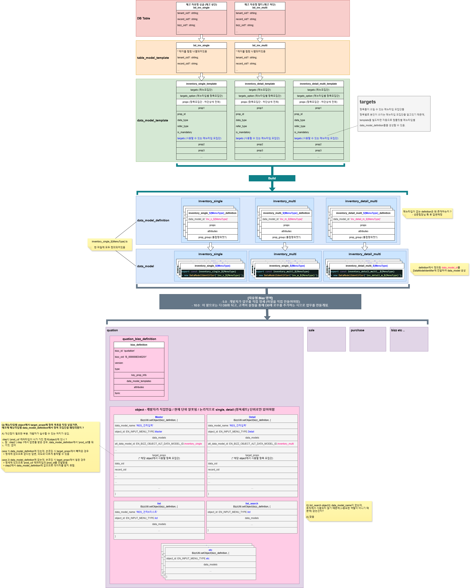

# Daily Retrospective

**작성자**: 고건호
**작성일시**: 2025-01-08

## 1. 오늘 배운 내용

- 5.0 Framework에서 사용하는 용어 공부


(현철님께서 그려주신 흐름도, 감사합니다.)

## 2. 동기에게 도움 받은 내용

오늘 성범 책임님께서 오전에 일찍 온 사람들끼리 커피 마시러 가자고 먼저 다가와서 말을 걸어주셨습니다. 일찍 온 연아님과 함께 성범 책임님께서 사주신 맛있는 커피를 먹을 수 있었습니다.

---

## 3. 개발 기술적으로 성장한 점 (선택)

아래의 3가지 주제 중 하나를 선택하여 작성합니다.

### 1. 교육 과정 상 배운 내용이 아닌 개인적 호기심을 해결하기 위해 추가 공부한 내용

#### `CreateInventoryAction`과 `GetInventoryDataAction`의 `onConfigure()` 함수 파라미터가 달랐던 이유

재고의 데이터를 읽어올 때 호출되는 `GetInventoryDataAction.ts`의 `onConfigure()` 함수는 아래와 같습니다.

```typescript
protected onConfigure(configuration_context: IConfigurationContext): void {
  const execution_context = configuration_context as unknown as IExecutionContext;

  ...
}
```

파라미터로 `configuration_context`를 받아주고, `onConfigure()` 함수 내부에서 `execution_context`를 변수 생성하여 가져온 `configuration_context`를 형변환 시켜주고 있습니다.

하지만 `견적서 입력` 시에 호출되는 `CreateInventoryAction.ts`의 `onConfigure()` 함수는 `GetInventoryAction.ts`과 조금 달랐습니다.

```typescript
protected onConfigure(configuration_context: IConfigurationContext, execution_context: IExecutionContext): void {
  ...
}
```

파라미터로 `configuration_context` 외에 `execution_context`도 받아주고 있는데 이 두 파라미터는 각각 `IConfigurationContext`와 `IExecutionContext` 타입입니다.

`configuration_context`의 타입인 `IConfigurationContext`를 타고 들어가보면 아래와 같습니다.

```typescript
// IConfigurationContext.ts
import { IFeatureCollectionContainer } from "../feature";

export interface IConfigurationContext extends IFeatureCollectionContainer {}
```

마찬가지로 `IFeatureCollectionContainer`를 타고 들어가면 아래 코드가 나옵니다.

```typescript
// IFeatureCollectionContainer.ts
import { IException } from "ecount.fundamental.define/exception";
import { FeatureIdentifier } from "../base";
import { IFeature } from "./IFeature";

export interface IReadonlyFeatureCollectionContainer {
  getFeature<TFeature extends IFeature>(
    id: FeatureIdentifier,
    exception_if_not_found?: IException
  ): TFeature;
  tryGetFeature<TFeature extends IFeature>(
    id: FeatureIdentifier | string
  ): TFeature | undefined;
  hasFeature(id: FeatureIdentifier): boolean;
}

export interface IFeatureCollectionContainer
  extends IReadonlyFeatureCollectionContainer {
  setFeature<TFeature extends IFeature>(
    id: FeatureIdentifier,
    feature: TFeature
  ): void;
}
```

코드에서 확인할 수 있듯이 `IFeatureCollectionContainer`는 `IReadonlyFeatureCollectionContainer` 인터페이스를 상속받아 `setFeature()` 함수를 정의한 인터페이스입니다.

그리고 이제 `onConfigure()` 함수의 다른 파라미터인 `execution_context`의 타입인 `IExecutionContext`를 타고 들어가보면 아래와 같은 흐름을 확인할 수 있습니다.

```typescript
// index.ts
...
interface IExecutionContext extends IBaseExecutionContext<IExecutionContext> {
	readonly session: TServerSessionInfo;
	entity: IEntityResolver<IExecutionContext, SEntityIdentifier>;
	readonly timezone: $TimeZoneInfo;
	readonly language: string;
	readonly culture: $CultureInfo;
	readonly http: $HttpServerContext;
	readonly module: IModuleInfo;
	readonly bizz_mgr: IBizzManager<IExecutionContext>;
	getBizzStack(): IBizzStack;
	getTimeZoneTime(dateTime: Date): Date;
	createNewContext(metaContext: $MetadataContext<any>): IExecutionContext;
}
...
```

`IExecutionContext`가 상속 받은 `IBaseExecutionContext`는 아래와 같습니다.

```typescript
// IBaseExecutionContext.ts
import { ActionDtoBase, IContextBase } from "ecount.infra.base/abstraction";
import {
  ISessionInfo,
  user_info,
  tenant_info,
  IEntityResolver,
} from "./shortcut";
import { app_info } from "./shortcut/app_info";
import { manager } from "@shared_infra_bridge/feature";
/**
 * Base Interface of ecount.solution ExecutionContext
 *
 * 1. Create Date: 2022-12-01
 * 2. Creator: 16017jinyoung
 * 3. Description:
 * 4. History:
 */
export interface IBaseExecutionContext<
  TContext extends IContextBase = IContextBase
> extends IContextBase {
  ...
}
```

여기에서 다시 `IBaseExecutionContext`가 상속 받은 `IContextBase`를 타고 들어가보면,

```typescript
// IContextBase.ts
import { IReadonlyFeatureCollectionContainer } from "../feature";

export interface IContextBase extends IReadonlyFeatureCollectionContainer {}
```

`IContextBase`가 `configuration_context`의 타입인 `IConfigurationContext`를 타고 들어갔을 때 확인할 수 있었던 `IReadonlyFeatureCollectionContainer`를 상속 받고 있음을 확인할 수 있습니다.

이러한 과정을 거치며 각각의 파라미터가 상속 받은 인터페이스들을 확인하기 전, 제가 최초에 추측했던 두 클래스의 파라미터가 다른 이유는, `execution_context`가 `configuration_context`의 상위 타입이거나 이를 포함하는 구조로 동작할 것이라는 생각이었습니다.

하지만 인터페이스를 자세히 살펴본 결과, 두 파라미터는 상속 관계에 있지 않았고 `GetInventoryDataAction` 내에 작성된

```typescript
const execution_context = configuration_context as unknown as IExecutionContext;
```

코드도 설명이 되지 않았습니다.

그래서 성범 책임님께 이와 관련한 질문을 드려본 결과, 리팩토링 과정에서 반영된 수정 사항이 `CreateInventoryAction`에 먼저 적용된 것이고, `GetInventoryDataAction`에는 아직 반영되기 전이라 그런 차이가 존재하는 것 같다는 대답을 들을 수 있었습니다.

그리고 추가적으로 성준 책임님께도 이와 관련한 질문을 드렸는데, 성준 책임님께도 설계 의도는 2개의 파라미터를 사용하는 방법을 의도했을 것으로 예상된다는 답변을 받았습니다.

### 2. 오늘 직면했던 문제 (개발 환경, 구현)와 해결 방법

`견적서 입력`이 정상적으로 실행되지 않던 문제가 있었습니다. 그로 인해 `CreateInventoryAction`의 디버깅을 제대로 하지 못했는데, 산출물 폴더의 최신 커밋을 fetch 해온 뒤 rebase를 해주니 정상적으로 동작하여 디버깅을 진행할 수 있었습니다.
