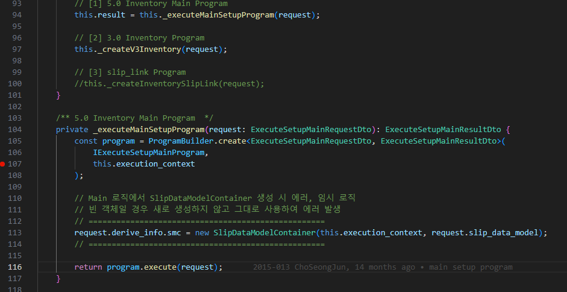

# Daily Retrospective

**작성자**: [김도형]  
**작성일시**: [2025-01-08]

## 1. 오늘 배운 내용 (필수)

- 어제 미처 해결 못한 과제
  - 견적서 입력 저장 flow 이해하기 (재고 데이터 처리 코드 구조 분석)
- 데이터 구조
- descriptor


**견적서 입력**

오늘은 어제 해결하지 못했던 견적서 입력 저장 flow에 대해 공부하였습니다. 견적서 입력 메뉴에서 하나의 데이터를 입력/저장하고, 디버깅을 통해 어떤 흐름으로 진행되는 지 파악하였습니다.


### 1. CreateInventoryAction(Action, 진입점)

클라이언트의 요청을 처리하는 진입점으로 데이터를 Program으로 전달하고, 필요한 Feature를 설정하며 데이터 흐름을 처리하는 곳입니다. 디버거를 통해 request 데이터를 살펴보았습니다. 하단에서 입력한 정보는 quotationXdetail에서 확인할 수 있었고, 상단 정보는 quotationXmaster에서 확인할 수 있었습니다. 수업 시간에 개념적으로만 이해했던 내용들을 직접 눈으로 확인해보면서 ...

```bash
- Context
    - app : action_cache_sys_version : 'v5'
    - module
        - CatchAllRoute
            - 0 : 'quotation'
            - 1 : 'input'
        - moduleName : 'app.inventory'
        - modulePath : 'action/CreateInventoryAction'
- request
    - action_mode : 'NEW'
    - bizz_sid : 'B-...'
    - data
        - slip_data_model
            - action_mode : 'NEW'
            - bizz_sid : 'B-...'
            - data_model
                - quotationXdetail
                    - 0 = {..}
                        - inv_m$prod_cd = '00030'
                        - inv_m$prod_nm = '설날포기김치선물세트'
                        - inv_m$prod_sid = '00030'
                        - inv_m$record_sid = '70FCI...'

                - quotationXmaster
                    - 0 = {...}
                        - inv_s$action_mode = "GET_CREATE"
                        - inv_s#bizz_sid = 'B-...'
                        - inv_s$data_model_id = 'inv_s'
                        - inv_s$menu_sid = 'M-...'
                        - inv_s$record_sid = '70FCI6T..'
                        - inv_s$trx_type = {}
                            - code = '12'
                            - name = '부가세율 미적용'
                            - sid = '12'
    // ...

```

### 2. ActionProgramResolveProgram.ts

현재 program에서 smc는 비어있는 상태이고, action에서 넘겨받은 slip_data_model만 가진 상태입니다.


resolver는 ICreateInventoryProgram를 가지고 있고, resolver가 존재한다면, ProgramBuilder.create에 의해서 새로운 program이 생성되고, slip_data_model과 파생 정보 등을 포함한 데이터를 넘겨주며 execute()를 실행합니다.


### 3. CreateInventoryProgram.ts

ActionProgramResolveProgram에서 넘겨받은 정보들을 확인할 수 있습니다. 필요한 로직을 처리한 후, ExecuteSetupMainProgram이 실행되는 것으로 보입니다.




### 4. ExecuteSetupMainProgram.ts

Main Program에서는 Action에서 호출된 Program과 init/modify/validate/post/pre 등 여러 Program을 단계적으로 처리하는 것으로 보입니다. 그 중에서 가장 눈에 띄는 것은 이전에 존재하지 않았던 smc와 dmc 가 초기화된 것입니다. MainProgram에서 smc가 생성되고, `this.smc = pre_data_model_resolver_program.execute(this.smc);` 을 통해 필요한 작업을 수행합니다. `this.dmc = this.smc.getDataModelContainers();`에서 smc에 저장되어 있던 dmc list들을 넘겨주고, forEach를 활용하여 각 dmc에서 data model을 불러오고, data_model_resolver_program을 실행시켜 action_mode에 따라 정보를 매핑하여 데이터를 넘겨주는 것 같습니다.

디버거를 통해 모든 데이터의 흐름을 파악하고 싶지만, 지금은 전체적인 흐름을 파악하는 것에 초점을 두고 SlipDataModelContainerBase 에서부터의 흐름은 넘어가겠습니다.


**smc**


**dmc**


### 5. Pre_execute_resolver_program (pre)

프로그램 실행 전 데이터를 준비 및 초기화하는 단계입니다.

### 6. Slip_init_Program (ISlipDefaultValueAttrProgram)

전표 데이터를 초기화하고, 프로그램 실행에 필요한 초기값과 기본 데이터 모델을 생성합니다.

### 7. 기본값 세팅된 slip_data_model을 다시 dmc data_model에 매핑

```typescript
//=============================================================================
/* ----------- Dmc별 prop initializer, modifier, validator 실행 ----------- */
for (const dmc of this.dmc) {
  //------------------------------------------------------------------------
  // [#3] data_model initializer
  //------------------------------------------------------------------------
  data_model_initializer_program.execute(dmc);

  //------------------------------------------------------------------------
  // [#4] data_model modifier
  //------------------------------------------------------------------------
  data_model_modifier_program.execute(dmc);

  //------------------------------------------------------------------------
  // [#5] data_model validator
  //------------------------------------------------------------------------
  const validator_result = data_model_validator_program.execute({
    data_model_container: dmc,
    menu_type,
  });

  if (!_.vIsEmpty(validator_result.exception)) {
    validator_error_list.push(...validator_result.exception.details);
  }
}
```

### 8. data_model_initializer_program(object_id init)

각 데이터 모델 컨테이너 즉, dmc의 내부 속성을 초기화합니다. 이 단계에서는 데이터 모델의 기본 구조와 값 설정을 하게 됩니다.

### 9. data_model_modifier_program(object_id modifier)

데이터 모델의 속성을 수정하거나 동적으로 업데이트하는 역할을 합니다. 예를 들면, 견적서 입력에서 사용자 입력 값에 따라 특정 필드 값을 동적으로 변경할 수 있습니다.

### 10. data_model_validator_program (object_id validator)

데이터 모델이 정의된 규칙과 일치하는 지 검증하는 역할을 합니다. 유효하지 않을 경우 예외를 발생시켜 잘못된 데이터를 필터링합니다.

### 11. slip_validator_program (slip validator)

전표 기준 비즈니스 로직을 처리합니다. 허용되지 않은 창고나 유효하지 않은 날짜에 대한 검증을 수행합니다.

### 12. data_model_resolver_program

데이터 모델을 해석하여 최종 결과 데이터를 생성하는 역할을 합니다. 상단 / 하단 / 부속 data_model 단위로 처리합니다. dmc를 기준으로 데이터를 해석하고, 각 데이터 모델에 맞는 최종 데이터를 생성 후 반환하게 됩니다.

### 13. pre_data_model_resolver_program

데이터 모델별로 개별 해석을 수행합니다. 데이터 모델 구조를 정리하고, 이후의 처리 로직을 준비합니다.

### 14. CreateInventoryMasterProgram

action_mode 별로 명세되어 있는 data_model_resolver 속성의 resolver를 실행하게 됩니다.

### 15. CreateInventoryDetailProgram

최종적으로 dmc에 저장된 정보를 꺼내서 테이블 모델로 변환하는 곳입니다.

### 16. DB 저장

재고 싱글 자유형 / 재고 멀티 자유형 에 따라 각 테이블에 데이터가 저장됩니다.

<br>

## 데이터 구조

### 데이터 구조의 기본 원칙

- 입력, 조회, 현황에서 사용되는 기본 항목들은 동일함

- 동일한 데이터를 보는 방식에 따라 조회와 현황으로 구분됨

- `상단 기준 → 조회`

- `하단 로우 기준 → 현황`

### 인벤토리 싱글 시스템 구조

- 테이블 기준으로 구성

- 재고상단테이블(master.ts)에 기본 항목 포함

```
거래처코드
거래처명
창고코드
창고명
추가항목들
```

### 데이터 모델 생성 프로세스

1. Data_model_template(inventory_single.ts)

2. 빌드 시 inventory_single_input.ts 즉, data_model_definition 생성( 실제 사용할 항목만 추출하여 definition 생성)

### 데이터 모델과 테이블 모델의 분리

- `데이터 모델`: 5.0 재고 상단 테이블의 항목들

- `테이블 모델`: 실제 데이터베이스 스키마

- `분리 이유`: 테이블 스키마 변경 시 코드 수정을 최소화하기 위함
  두 모델 간의 매칭 시스템 존재

### 빌드 프로세스

- 서버의 abstration/data_model 디렉토리에 DTO 생성

- 견적 업무의 기존 항목들이 master.ts에 포함됨

- 이 구조를 통해 데이터의 일관성을 유지하면서도 다양한 뷰와 기능을 제공할 수 있게 설계되어 있음

## descriptor

업무별 명세에 대한 정보를 관리합니다. master.ts 등 파일로 명세한 내용을 descriptor에서 확인할 수 있습니다.

```typescript
getValuesByReferType<TDataType = any>(
		refer_type: ($$refer_type | $$refer_type_indicator) | ($$refer_type | $$refer_type_indicator)[],
		...optional: ($$refer_type | $$refer_type_indicator)[]
	): TDataType[] {
		const values = [] as TDataType[];
		const prop_ids = this.descriptor.getPropIdsByReferType(refer_type, ...optional);
		if (prop_ids && prop_ids.length) {
			// 현재는 refertype 유니크하다고 간주
			const prop_id = prop_ids[0];
			(this.data_model as any).forEach((data: any) => {
				values.push(DataModelUtil.getValue(data, this.descriptor, prop_id as string) as TDataType);
			});
		}
		return values;
	}
```

## 2. 동기에게 도움 받은 내용 (필수)

지은님과 다은님과 주원님과 연아님과 data_model_template, data_model, data_model_definition 등 개념들에 대해 토론하고, 3층에서 휴식 시간을 함께 가졌습니다.

성범 책임님께 smc, dmc가 만들어지고 난 후에 어떤 흐름으로 저장/데이터 추출 등의 과정을 거치는 지 여쭤보았습니다.

현철님과 강민님과 밖에서 커피를 사먹었습니다. 강민님이 내기에서 졌습니다. (잘먹었습니다 ㅎ)

---

## 3. 개발 기술적으로 성장한 점 (선택)

아래의 3가지 주제 중 하나를 선택하여 작성합니다.

### 1. 교육 과정 상 배운 내용이 아닌 개인적 호기심을 해결하기 위해 추가 공부한 내용

#### 변수 앞에 쓰이는 $의 역할

동기들과 함께 변수 앞에 쓰이는 $가 어떤 역할을 하는 지 얘기하다가 개발 본부장님께서 교육장을 방문해주셔서 여쭤보았습니다.

- $\$는 날짜 타입, 달력 타입, text 타입과 같이 데이터 유형을 정의할 때 사용합니다.

- $는 네이티브 외에 이카운트가 자체적으로 만든 글로벌 객체를 가리킵니다. 즉, 변수입니다.

### 2. 오늘 직면했던 문제 (개발 환경, 구현)와 해결 방법

#### 1. Data model template과 Data model 간의 관계

inventory_single, inventory_single_input 파일 구조에 대한 이해가 부족하여 어려움을 겪었습니다. 혼란스러웠던 주요 원인은 부문장님의 이론 수업에서 설명해주신 DMC에 포함되는 data model definition의 개념과 팀장님께서 설명해주신 data model definition의 개념이 조금 달랐기 때문입니다. 이러한 차이점을 해소하기 위해 팀장님께 질문을 드렸고, 부문장님과 팀장님이 말씀하셨던 개념이 조금은 다른 점이 있어서 부문장님과 얘기해보고 다시 말씀해주신다고 하셨습니다. 그리고 추가로 말씀해주신 부분은 inventory_single_input은 data model definition이고, inventory_single은 data model template 이라는 것입니다. data model은 inventory_single_input에 정의된 definition에 따라 실제로 만들어지는 데이터라고 생각하게 되었습니다. 앞으로 기능 구현을 직접해보면서 명확해질 것이라고 생각합니다.

#### 2. refer_type과 prop_id

getValueByReferType 함수를 분석하면서 refer_type과 prop_id의 관계에 대해 의문이 생겼습니다. 두 값이 현재는 동일한데도 refer_type을 통해 prop_id를 찾은 후 최종값을 조회하는 이유가 궁금했습니다.
성범 책임님께 여쭤본 결과, prop_id는 변경 가능성이 있는 값이므로, refer_type과 구분하여 관리함으로써 데이터 구조 변화에 대비하고 잠재적 오류를 예방할 수 있다는 점을 알게 되었습니다. 이를 통해 코드의 안정성과 확장성을 고려한 설계의 중요성을 배울 수 있었습니다.

### 3. 위 두 주제 중 미처 해결 못한 과제. 앞으로 공부해볼 내용.

- lodash는 무엇일까?
- object가 하는 구체적인 역할
- definition에 타입이 존재하던데 그것은 무엇일까?

---

## 4. 소프트 스킬면에서 성장한 점 (선택)

동기들과 함께 토론하면서 배우는 점이 많은 것 같습니다. 특히 개발 과정에서 마주치는 문제나 의문점들을 서로 공유하고 토론하는 과정이 매우 유익했습니다. 오늘도 refer_type과 prop_id의 관계에 대해 동기들과 이야기를 나누었는데, 각자 다른 관점에서 바라보는 시각이 흥미로웠습니다.
