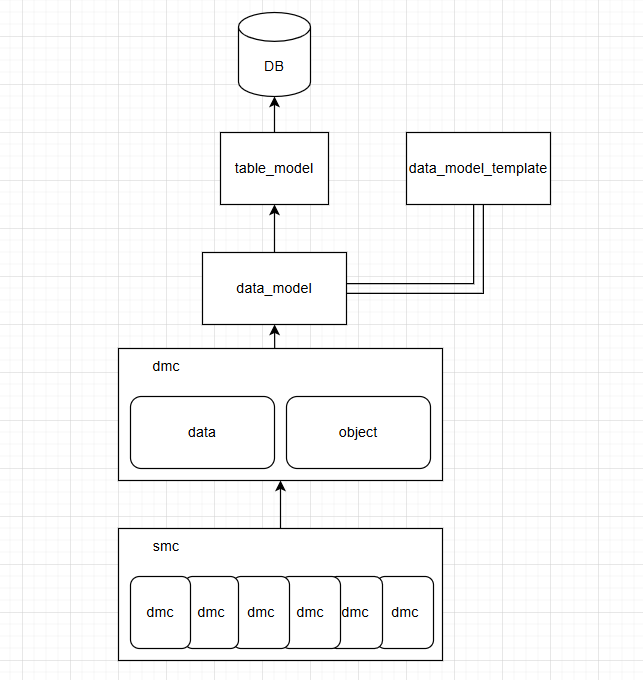

# Daily Retrospective

**작성자**: [김승준]  
**작성일시**: [2025-01-08]

## 1. 오늘 배운 내용 (필수)

### data_model

-   table_model : 테이블 스키마(컬럼)

    -   우리가 흔히 알고 있는 dto와 유사
    -   원본은 동일하게 만들어 놓고 쓰자
    -   동일한 데이터를 보는 방식에 따라 조회, 현황으로 나눠짐

-   data_model_template : 데이터모델을 여러 개 생성할 때 도와주는 도구<br>
    ex)[`inventory_single.ts`](#inventory_singlets)
-   data_model: dto, 서버 상에서 사용하는 데이터들을 담는 것<br>

    ```ts
    //ex) inventory_single_input.ts
    export const inventory_single_input = new DataModelIdentifier("inv_s_input");
    ```

-   data_model_definition : data_model에 대한 명세, data model 에서 실제로 사용할 것들을 필터링<br>
    ex) [`inventory_single_input.ts`](#inventory_single_inputts), `inventory_single_list.ts`
-   dmc(data model container)

    -   data model : data model definition로 생성한 객체, data를 가지고 있음.
    -   data model definition (object) : 저장소 설정으로 어떤항목을 설정했나, 명세 (object)
    -   속성

-   descriptor : 업무별 명세에 대한 정보를 관리(메뉴에서 어떤 항목을 쓸 것인지 설정한 항목) <br>-> master.ts 등 파일로 명세한 내용을 descriptor에서 확인할 수 있음.

-   smc = [dmc1, dmc2, dmc3]
-   dmc1 = data(data_model), object(definition)

#### 구조도

\*\*개인적인 이해를 바탕으로 그렸기 때문에 잘못된 구조일 수 있습니다.


## 2. 동기에게 도움 받은 내용 (필수)

-   data_model_template과 data_model의 관계에 대해 잘 이해하지 못했는데 **주현님**께서 설명해주셨습니다.
-   오늘은 자리에 앉아서 혼자 공부하기 보다는 동기분과 함께 설명하는 것들을 들은 시간이 많은 하루였습니다. 혼자서 공부할 때 이해도 안되고 잘 안되던 부분들이 얘기를 나누며 더 잘 이해되는 것 같아서 좋았습니다.
-   손가락에 작은 상처가 났는데 **연아님**께서 귀여운 밴드를 주셨습니다

## 3. 개발 기술적으로 성장한 점 (선택)

### 1. 교육 과정 상 배운 내용이 아닌 개인적 호기심을 해결하기 위해 추가 공부한 내용

#### [프로그램 흐름 (복습)](#프로그램-흐름코드)

-   프로그램 흐름을 직접 디버깅해보며 복습하였습니다.

### 2. 오늘 직면했던 문제 (개발 환경, 구현)와 해결 방법

-   디버깅 과정에서 `ActionProgramResolveProgram.ts` 에서 `ICreateInventoryProgram` 호출되는 과정을 찾지 못해 어려움을 겪었습니다.<br>
    **주원님**께서 **조성준팀장님**에게 질문을 통해 디버깅 과정상에서 `input.ts`를 통해 호출된다는 것을 알려주었습니다.

### 3. 앞으로 공부해볼 내용.

-   직접 디버그해보며 견적서 입력의 프로그램 흐름을 따라가 보는 과정에서 오류로 인해 마지막까지 확인하지 못한 것이 아쉽습니다. 오류가 정확히 무슨이유에서 나는지 확인해보고, 고칠 수 있다면 고쳐보고 싶습니다. 고칠 수 없다면 다른 방법으로 프로그램 흐름을 끝까지 확인해 보고 싶습니다.

# 소스코드

## inventory_single.ts

```ts
template_id: 'inventory_single', //템플릿이 빌드되어 각 data model을 생성할 때 사용
data_model_id: 'inv_s', // data_model_id : [template_id]_[target]
targets: { // definition으로 생성할 대상(ex. 메뉴타입)을 설정
    [EN_MENU_TYPE.Input]: null,
    [EN_MENU_TYPE.Upload]: null,
    [EN_MENU_TYPE.List]: null,
    [EN_MENU_TYPE.ListSearch]: null,
    [EN_MENU_TYPE.Status]: null,
    [EN_MENU_TYPE.StatusSearch]: null,
    [EN_MENU_TYPE.OutstandingStatus]: null,
    [EN_MENU_TYPE.OutstandingStatusSearch]: null,
    [EN_MENU_TYPE.Trans]: null,
    [EN_MENU_TYPE.All]: null,
},
target_option: { // definition 대상 별 설정할 옵션
...

...
{
    prop_id: 'record_seq_no',
    data_type: '$$sequence',
    refer_type: 'record_seq_no',
    is_mandatory: true,
    attributes: {
        Renderer: {
            display_state: false,
        },
    },
    targets: [EN_MENU_TYPE.List, EN_MENU_TYPE.Input, EN_MENU_TYPE.Upload, EN_MENU_TYPE.Trans], // 어떤 데이터 모델에서 해당 항목을 사용할 것인지
},
...
```

## inventory_single_input.ts

```ts

const inventory_single_input_Definition: IDataModelDefinition = {
	data_model_id: 'inv_s_input',
	props: [    // 데이터를 구성하는 항목 목록, 각 항목의 주요 정의를 포함
		{ prop_id: 'tenant_sid', data_type: '$$sid', refer_type: 'tenant_sid', refer_group: 'sid' },
		{ prop_id: 'record_sid', data_type: '$$sid', refer_type: 'record_sid', is_key: true, refer_group: 'sid' },
...
    ],
    attributes: [ // 데이터 모델 내 항목들의 속성 목록
        { attr_type: EN_ATTR_TYPE.Renderer, attr_id: 'display_state', data: false, prop_id: 'record_sid' },
        { attr_type: EN_ATTR_TYPE.Renderer, attr_id: 'display_state', data: false, prop_id: 'bizz_sid' },
        { attr_type: EN_ATTR_TYPE.Renderer, attr_id: 'display_state', data: false, prop_id: 'bizz_class_sid' },
        { attr_type: EN_ATTR_TYPE.Renderer, attr_id: 'display_state', data: false, prop_id: 'menu_sid' },
        { attr_type: EN_ATTR_TYPE.Renderer, attr_id: 'display_state', data: false, prop_id: 'data_sid' },
        { attr_type: EN_ATTR_TYPE.Renderer, attr_id: 'display_state', data: false, prop_id: 'record_seq_no' },
...

```

## 프로그램 흐름(코드)

1. `CreateInventoryAction.ts`

    ```ts
    ...
    const program = ProgramBuilder.create<IActionProgramResolveProgramRequestDto, IActionProgramResolveProgramResult>(IActionProgramResolveProgram, context);

    const result = program.execute(slip_dto);
    ...
    ```

    `IActionProgramResolveProgram`을 이용해 `ActionProgramResolveProgram` 호출

2. `ActionProgramResolveProgram.ts`

    ```ts
    ...
    const resolver = this.execution_context.bizz_mgr
        .getMenuDefinition(this.execution_context, this.execution_context.action.bizz_sid, this.execution_context.action.menu_sid || "")
        ?.attributes?.find((x) => x.attr_id == definition_attrs.info.action_program_resolver)?.data[action_mode];
        //input.ts를 돌면서 해당하는 resolver를 가져온다.
        //[EN_ACTION_MODE.Create]: 'ICreateInventoryProgram'

    if (resolver) {
        const program = ProgramBuilder.create<ExecuteSetupMainRequestDto, ExecuteSetupMainResultDto>(resolver, this.execution_context);
        return program.execute({
            slip_data_model: slip_data_model,
            additional_info: additional_info,
            derive_info: derive_info,
            current_template: current_template,
        }) as unknown as ProgramResult;
    }
    ...
    ```

    `input.ts`

    ```ts
    ...
    {
    		prop_id: '',
    		attr_id: definition_attrs.info.data_model_resolver,
    		attr_type: EN_ATTR_TYPE.Information,
    		data: {
    			[EN_ACTION_MODE.Create]: 'ICreateInventoryProgram',
    			[EN_ACTION_MODE.Modify]: 'IModifyInventoryProgram',
    			[EN_ACTION_MODE.Delete]: 'IModifyStatusInventoryProgram' /* 삭제 */,
    			[EN_ACTION_MODE.UnDelete]: 'IModifyStatusInventoryProgram' /* 삭제취소 */,
    			[EN_ACTION_MODE.Remove]: 'IRemoveInventoryProgram' /* 데이터 완전삭제 */,
    			[EN_ACTION_MODE.Confirm]: 'IModifyConfirmInventoryProgram' /* 확인 */,
    			[EN_ACTION_MODE.UnConfirm]: 'IModifyConfirmInventoryProgram' /* 확인취소 */,
    		} as definition_attrs.info.data_model_resolver,
    	},
    ...
    ```

    `input.ts`를 이용해 `ICreateInventoryProgram` 호출

3. `CreateInventoryProgram.ts`

    ```ts
    private _executeMainSetupProgram(request: ExecuteSetupMainRequestDto): ExecuteSetupMainResultDto {
    	const program = ProgramBuilder.create<ExecuteSetupMainRequestDto, ExecuteSetupMainResultDto>(
    		IExecuteSetupMainProgram,
    		this.execution_context
    	);
    ```

    `IExecuteSetupMainProgram` 호출

4. `ExecuteSetupMainProgram.ts`

    1. `pre_executer_resolver_program`

        ```ts
        //------------------------------------------------------------------------
        // [#1] pre_executer resolver
        //------------------------------------------------------------------------
        pre_executer_resolver_program.execute({
            definitions: smc_definition,
            slip_attributes: this.smc.getAttrsByAttrType(EN_ATTR_TYPE.PreExecuter),
            slip_data_model: slip,
        });
        ```

    2. `slip_initializer_program`
        ```ts
        //------------------------------------------------------------------------
        // [#2] slip initializer
        //------------------------------------------------------------------------
        // dmc 생성하지 않고, 데이터 모델 원본을 직접 변경한다.
        slip_initializer_program.execute({
            definitions: smc_definition,
            slip_attributes: this.smc.getAttrsByAttrType(EN_ATTR_TYPE.Initializer),
            slip_data_model: slip,
        });
        ```
    3. 반복(dmc별)

        1. `data_model_initializer_program`
        2. `data_model_modifier_program`
        3. `data_model_validator_program`

        ```ts
        for (const dmc of this.dmc) {
            //------------------------------------------------------------------------
            // [#3] data_model initializer
            //------------------------------------------------------------------------
            data_model_initializer_program.execute(dmc);

            //------------------------------------------------------------------------
            // [#4] data_model modifier
            //------------------------------------------------------------------------
            data_model_modifier_program.execute(dmc);

            //------------------------------------------------------------------------
            // [#5] data_model validator
            //------------------------------------------------------------------------
            const validator_result = data_model_validator_program.execute({
                data_model_container: dmc,
                menu_type,
            });

            if (!_.vIsEmpty(validator_result.exception)) {
                validator_error_list.push(...validator_result.exception.details);
            }
        }
        ```

    4. `slip_validator_program`
        ```ts
        //------------------------------------------------------------------------
        // [#6] slip valiator
        //------------------------------------------------------------------------
        // 전표 기준 비즈니스 로직 처리(허용창고, 편집제한일자등..)
        const slip_validator_result = slip_validator_program.execute({
            dmc: this.dmc,
            slip_data_model: slip,
            slip_attributes: this.smc.getAttrsByAttrType(EN_ATTR_TYPE.Validator),
            additional_info: request.additional_info,
        });
        ```
    5. `pre_data_model_resolver_program`
        ```ts
        //------------------------------------------------------------------------
        // [#7] data_model resolver
        //------------------------------------------------------------------------
        this.smc = pre_data_model_resolver_program.execute(this.smc);
        this.dmc = this.smc.getDataModelContainers();
        ```
    6. `data_model_resolver_program`

        ```ts
        //------------------------------------------------------------------------
        // [#8] data_model resolver
        //------------------------------------------------------------------------
        // 상단 / 하단 / 부속 data_model 단위로 처리
        // checkJSJ getDataModelContainser 소스정리
        const slip_created_result: { [key: string]: IResolveInventoryDataModelProgramResult } = {};
        const return_data_model: IArrayDataModelMapper = {};
        _.vForEach(this.dmc, (dmc) => {
            const data_model = dmc.getDataModel();
            // if (_.vIsEmpty(data_model)) return;

            slip_created_result[dmc.data_model_id] = data_model_resolver_program.execute({
                action_mode: slip.action_mode,
                dmc,
                data_sid: slip.data_sid,
            });

            return_data_model[dmc.data_model_id] = data_model as [{ [prop_id: string]: any }];
        });
        ```

        `action mode`에 따라 `data_model_resolver` 을 실행

        - 테스트 코드에서는 현재 이 부분에서 오류가 나타남.
          
        - `04.ecount.application/ecount.application.entry/src/server/context/excution_context/ExecutionContextFactory.ts`
          

    7. `post_executer_resolver_program`
        ```ts
        //------------------------------------------------------------------------
        // [#10] 개별 전표 저장후
        //------------------------------------------------------------------------
        post_executer_resolver_program.execute({
            definitions: smc_definition,
            slip_attributes: this.smc.getAttrsByAttrType(EN_ATTR_TYPE.PostExecuter),
            slip_data_model: slip,
            dmcs: this.dmc,
        });
        ```
