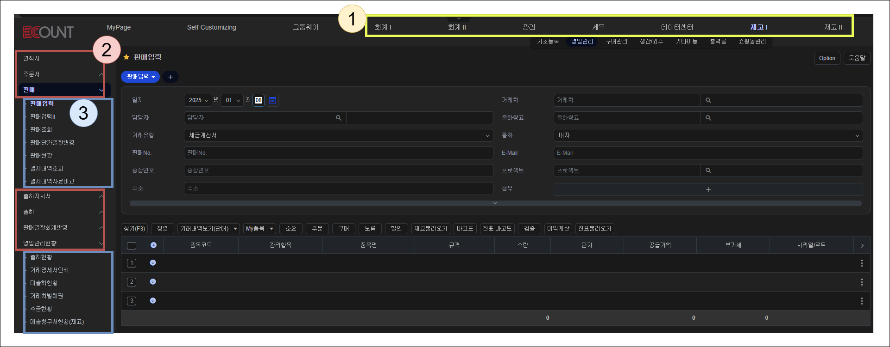
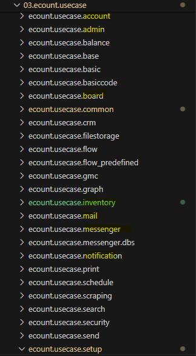
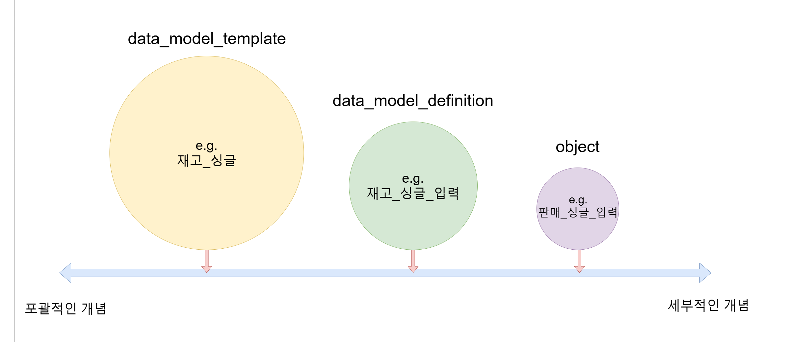
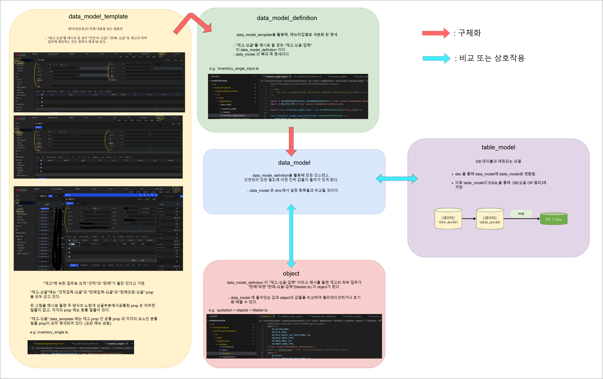

# Daily Retrospective

**작성자**: [박주현]  
**작성일시**: [2025-01-08]

# 1. 오늘 배운 내용

## 1️⃣ 5.0 개발 용어 리마인드

모호했던 개념들을 다시 한 번 다잡는 시간을 가졌습니다.

먼저 업무 성격(module), 업무(bizz), 메뉴(menu) 를 살펴보겠습니다.



### (1) 업무 성격(module)

1번 노랑 박스에 해당하는 UI 상 1 depth 카테고리들은 "업무 성격"이라고 부릅니다. 기획단에선 "업무 성격"이라는 워딩을 많이 사용하고, 개발자들은 모듈이라는 워딩을 많이 사용합니다. 이유는 디렉토리 구조에 있습니다.



프로젝트 아래 위치한 모듈 별로 디렉토리 구조를 갖기 때문입니다. 여기서 특이한 점이 2가지 있습니다.

```
1번 cummon 모듈
cummon 모듈은 매칭되는 "업무 성격"이 없습니다. 공통화 작업을 한 곳으로서 다른 모듈에서 사용가능하게끔 만든 기능을 모아둔 디렉토리입니다.
```

```
2번 기초등록
업무 성격 아래 바로 나오는 "기초등록"은 따로 모듈로 빼놓았습니다. 1 depth 카테고리에 있지 않지만 중요한 기능이기 때문입니다. "기초등록" 카테고리는 basic과 basiccode 모듈에서 다루어집니다.
```

### (2) 업무(bizz)

공통화된 업무 성격 아래에 위치한 각각의 카테고리입니다. UI 상 2 depth 에 위치하고 개발 용어로 "bizz", 일반 용어로는 "업무" 라고 부릅니다.

### (3) 메뉴(menu)

업무를 이용하기 위한 도구입니다. 업무에 대해 각각의 행위를 할 수 있는 카테고리입니다. UI 상 3 depth 에 위치하고 있습니다.

---

5.0 의 철학은 서비스 공통화 입니다. 공통화 작업을 위해 여러 업무를 하나의 카테고리로 묶으려 하였고, 이로인해 여러 개념들이 탄생했습니다.
그 중 `data_model_template`, `data_model_definition`, `data_model`, `object` 개념들이 있습니다.



### (4) data_model_template

`data_model_template` 은 공통화된 전표 틀을 부를 수 있는 최상위 개념입니다. 대표적인 예시로 "재고\_싱글"(inventory_single.ts)이 있습니다.

### (5) data_model_definition

`data_model_template` 보다 조금 더 뾰족하게(구체화해, 세부적으로) 폭을 좁힌 개념이 `data_model_definition` 입니다. data*model_template을 활용해 메뉴타입별로 세분화 됩니다.
"재고*싱글"이 `data_model_template` 이라면 "재고*싱글*입력"(inventory_single_input.ts)이 바로 `data_model_definition` 입니다.

### (6) data_model

`data_model` 은 명세인 `data_model_definition`을 활용해 실제로 각각의 properity 들이 값을 갖는 인스턴스라고 볼 수 있습니다.
inventory_single_input.ts 은 `data_model_definition` 이자 `data_model`인데 개발자들과 협의할 때 구분짓기 위해 다음과 같이 소통합니다.

```
1) inventory_single_input
> data_model 입니다.
dataModelIdentifier로 구현

2) inventory_single_input_Defintion
> data_model_definition입니다.
IDataModelDefunition으로 구현
```

### (7) object

`object` 는 data_model의 항목 중 해당 업무에서 사용하고자하는 항목을 특정하는 역할을 합니다. 업무 성격이 아닌 업무의 메뉴로 더욱 뾰족한 개념입니다. 이런 `object` 추후에 UI 에서 받아온 data_model 프로퍼티 값을 비교하여 밸리데이션 하거나 셋팅을 해줍니다.

### (8) table_model

가공된 `data_model`이 DB에 저장되기 위해선 `table_model`로 변환시켜줘야합니다. `table_model`은 DB 테이블과 실질적으로 매칭이 되는 클래스며 ESQL을 통해 DB 에 영구적으로 반영됩니다.

아래는 위 내용을 간략하게 표현한 도식입니다.



결국 5.0의 핵심은 data_model 이고 각각의 program과 svc는 data_model을 가공하거나 밸리데이션을 하기 위함이고, 이런 data_model은 table_model 로 치환되어 DB에 저장됩니다. UI 에서 오는 요청은 SMC를 활용해 DMC 에 담겨옵니다. 이 DMC 에는 data_model과 data_model_definition 을 통해 비교하고 값을 채워 넣습니다. 앞으론 smc 와 dmc 를 더욱 깊게 이해해야 할 것 같습니다.

# 2. 동기에게 도움 받은 내용

근래에 5.0으로 들어오면서 많은 동기들과 이야기를 나누고 도움을 받습니다. 특히나 분단별로 도움을 받는 양상이 크며, 저도 제가 속한 분단의 모든 분들께 도움을 받았습니다. 특히나 현철님이 계셔서 모호한 개념들을 여쭤보고 개발내용과 UI 내용을 1대1 매칭하기 수월했습니다. 전향자 선배분들이 많은 도움을 주셔서 정말 좋습니다. 성철님과 다은님도 이카운트 내부 정보와 개념들을 볼 수 있는 자료 또는 페이지를 제공해주셔 큰 도움이 됐습니다.
타 분단에서는 민준님과 성재님과 많은 이야기를 나눴고, 수경님, 아연님, 연아님 등 많은 분들과 이야기 나눴습니다.

---

# 3. 개발 기술적으로 성장한 점

### 3-3. 위 미처 해결 못한 과제. 앞으로 공부해볼 내용

GMC 서버가 무엇인지 궁금하여 알아보았습니다. 성준 팀장님께서 주신 파일에 서버 도식도가 있었는데, login 서버 말고 gmc 서버가 존재했습니다. 관리용 데이터를 처리하기 위한 서버라는데, 관리용 데이터가 무엇인지 궁금하고, 이 서버의 기능이 어떤 기능을 제공하는지 궁금했습니다.

---

# 4. 소프트 스킬면에서 성장한 점

그림판으로 여태까지 작업하다가 draw.io 로 작업하며, 불을 만난 원시인이 된 기분이었습니다. 평소에도 알고리즘 흐름이나 다이어그램을 나타낼 때 많이 사용했는데, 피그마나 미리캔버스처럼 막힌줄 알았지만 그렇지 않아서 좋았습니다.

---

# 5. 제안하고 싶은 내용

오늘은 진도면에서 앞으로 나가지 않고 한 번 더 리마인드하는 시간을 가졌는데, 5.0 개념 이해 측면에서는 오늘이 가장 많이 습득하고 성장한 것 같습니다. 이런 시간들이 자주 있으면 좋을 거 같습니다.
