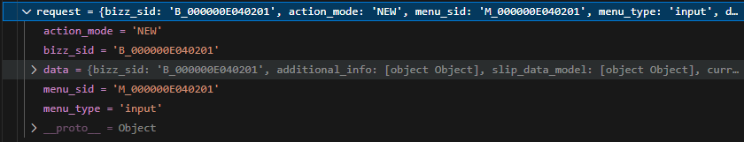
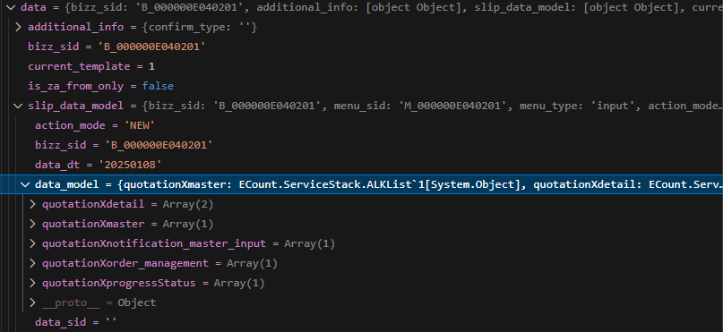

# Daily Retrospective

**작성자**: [설다은]  
**작성일시**: [2025-01-08]

## 1. 오늘 배운 내용 (필수)

### 🗒️[흐름 및 디렉토리 구조의 이해 (복습)]

오늘은 이제까지 배웠던 개념들을 복습하는 시간을 가졌다.<br>
워낙 다양한 파일과 폴더들이 있다보니 그 목적이 명확히 나뉘어져있다고 해도 찾아가는게 쉽지 않다는 것을 느꼈다.<br>
03.ecount.usecase와 04.ecount.application의 디렉토리 구조도 달라서 계속 보면서 익숙해지는 수 밖에는 없을 것 같다.<br>
또한, 각 파일마다 안에 담고 있는 소스의 양이 방대해서 그것들이 뭔지 파악하는 것도 연습이 필요해보인다.<br>

**1. data_model_template (Inventory_single)**

- tabel_model 기준으로 각각 상단/하단/디테일하단 등이 생성된다. (기준으로 생성되는 것이지 완전히 같지는 않다.)<br>
- 해당 파일에는 targets(메뉴모집단), targets_option(메뉴타입별 항목모집단), props(재고상단의 항목모집단)이 존재한다.<br>
- props안에 있는 prop은 각각 자신이 쓰일 수 있는 targets라는 메뉴타입의 모집단을 가지고 있다.<br>

**2. data_model (Inventory_single_input, \_list, \_staus, ...)**

- data_model_definition과 data_model이 한 파일에 있다.<br>
- data_model<br>

```ts
export const inventory_single_input = new DataModelIdentifier("inv_s_input");
```

- data_model_definition<br>

```ts
const inventory_single_input_Definition: IDataModelDefinition = {
data_model_id: 'inv_s_input',
props: [
```

**3. ${업무명}(quotation) > bizz_definition**<br>

- 업무에 대한 데이터를 담은 파일이다.<br>

**4. ${업무명}(quotation) > objects > master, list, detail, ...**<br>

- 업무에서 쓰이는 data_model의 디테일별로 가지고 있는 정보들이 담긴다.<br>
- 이 안에 target_props를 통해 해당 object에서 사용할 항목의 모집단을 정의한다.<br>

```ts
BizzUtil.setObject(bizz_definition, {
	data_model_name: 'RES_견적입력',
	object_id: EN_INPUT_MENU_TYPE.Master,
	data_models: [
		{
			alt_data_model_id: EN_BIZZ_OBJECT_ALT_DATA_MODEL_ID.inventory_single,
			data_model_identifier: inventory_single_input,
			alias_name_code: 'rex01104', // 견적서
			target_props: [
				'data_sid',
				'record_sid',
				'bizz_sid',
				'bizz_class_sid',
```

### 🗒️[견적서입력 저장 디버깅]

견적서입력에서 데이터를 저장하는 로직에 실제 BP를 찍어서 디버깅을 해보았다.<br>
일단은 뭐가 뭔지 몰라서 const가 있는 부분은 다 찍어서 각 BP마다 어떤 데이터가 들어오는지 확인해봤다.<br>

```ts
// 04.ecount.application\VeloxApps\app.inventory\src\server\action\CreateInventoryAction.ts
executeSync(context: IExecutionContext, request: ActionDataBase<InventoryRequestDto>): ExecuteSetupMainResultDto {
		const { action_mode, menu_type } = request;

        /*BP*/ const bizz_manager = context.getFeature<manager.IBizzManager>(manager.IBizzManager);

		/*BP*/ const bizz_definition = bizz_manager.getBizzDefinition(context, context.action.bizz_sid);
		/*BP*/ const derive_target = bizz_definition?.attributes?.find((attr) =>
			_.vIsEquals(attr.attr_id, definition_attrs.info.derive_use_info)
		)?.data?.list as DeriveBizzInfoTargetDto[];

		/*BP*/ const slip_dto = {
			bizz_sid: context.action.action_mode,
			action_mode: EN_ACTION_MODE.Create,
			menu_type: EN_MENU_TYPE.Input, // menu_type,
			slip_data_model: request.data.slip_data_model,
			derive_info: {
				smc: {} as SlipDataModelContainer,
				derive_target: derive_target,
			},
			current_template: request.data.current_template,
			is_za_from_only: request.data.is_za_from_only,
			additional_info: request.data.additional_info,
			notification: request.data.notification,
		} as IActionProgramResolveProgramRequestDto;

		/*BP*/ const program = ProgramBuilder.create<
			IActionProgramResolveProgramRequestDto,
			IActionProgramResolveProgramResult
		>(IActionProgramResolveProgram, context);

		/*BP*/ const result = program.execute(slip_dto);

		return result;
	}
```

request부분을 보면 action_mode, bizz_sid, data(실제입력값), menu_sid, menu_type이 들어온걸 알 수 있다.<br>



data를 열고 들어가면 `slip_data_model` > `data_model`이 있는데 여기에 각 data_model_id별로 값이 담겨 있다.<br>



실제로 디버깅을 해보면서 어느시점에 어떤 데이터가 들어가는지 눈으로 확인해보니 신기했고, 이후에는 이 값이 어떻게 들어오는건지 디테일한 부분을 확인해야겠다.<br>

## 2. 동기에게 도움 받은 내용 (필수)

**지은님**<br>
목감기때문에 고생하고 있는데 약을 주셨다.

**현철님**<br>
본인이 이해하기 위해 만든 도식화를 공유해주셔서 흐름 이해에 도움이 되었다.

**성범책임님**<br>
descriptor에 대해서 설명을 해주셨다.

## 3. 개발 기술적으로 성장한 점 (선택)

### 1. 교육 과정 상 배운 내용이 아닌 개인적 호기심을 해결하기 위해 추가 공부한 내용

**1. 파티셔닝**<br>
이카운트는 연도를 기준으로 테이블을 `파티셔닝` 해 놓은 것으로 알고 있다.<br>
해당 용어를 어디선가 자주 듣기는 했는데 그게 뭔지 제대로 공부해본적은 없어서 찾아보았다.<br><br>
**파티셔닝 :**<br>
소프트웨어적으로 데이터베이스를 분산처리하여 성능 저하를 방지하고 관리하는 것<br><br>

**파티셔닝이 필요한 이유 :** <br>
서비스가 점점 커지다보면 저장해야할 데이터의 양이 많아지는데, 이렇게되면 DB시스템의 용량에 한계가 오고 결국 성능저하를 초래하게 된다.<br><br>

**파티셔닝의 장/단점 :** <br>
DB 관리를 쉽게 하기 위한 파티셔닝에도 장단점이 존재한다.<br><br>
_장점 :_ <br>

- 파티션단위로 백업/추가/삭제/변경이 가능하다.<br>
  - 전체 데이터를 손실할 가능성이 낮아지며, 데이터 가용성이 향상됨.<br>
  - 파티션별로 백업 및 복구가 가능함.<br>
  - 파티션 단위로 I/O 분산이 가능하여 UPDATE성능이 향상됨.<br>
- 파티션단위로 조회 및 DML수행이 가능하다.<br>
  <br>

_단점 :_ <br>

- 테이블 간 join 비용이 증가한다.<br>
- 테이블과 인덱스를 별도로 파티셔닝할 수 없다. (같이 파티셔닝)<br>

**파티셔닝의 종류 :** <br>

1. 수평 파티셔닝 : 한 테이블의 각 행을 다른 테이블에 분산하는 것<br>
   장점 : 데이터 개수를 기준으로 파티셔닝을 하기 때문에 데이터와 인덱스의 수가 작아지고 성능이 향상된다.<br>
   단점 : 데이터를 찾는 과정이 기존보다 복잡하여 latency가 증가하고, 한 서버가 고정나면 데이터의 무결성이 깨질 수 있다.<br>
2. 수직 파티셔닝 : 테이블 일부 열을 다른 테이블에 분산하는 것<br>
   장점 : 자주사용하는 컬럼 등을 분리시켜 성능을 향상할 수 있다.
   단점 : 수평파티셔닝과 동일하다.

###### ※ latency : 데이터가 한 지점에서 다른 지점으로 이동하는데 걸리는 시간 = 응답시간

**파티셔닝의 분할기준 :** <br>

1. 범위분할 : 연속적인 숫자나 날짜를 기준으로 파티셔닝
2. 목록분할 : 특정 값의 목록을 기준으로 파티셔닝 (ex. country라는 컬럼의 값이 Iceland, Norway, Sweden, Finland, Denmark 중 하나의 행을 빼서 북유럽국가 파티션을 구성할 수 있다.)
3. 해시분할 : 파티션 키의 해시값에 의해 파티셔닝을 한다. (균등한 데이터분할 가능하지만 특정 데이터가 어느 해시 파티션에 있는지 판단 어려움.)
4. 합성분할 : 1~3 분할기준을 결합한 것<br>
   <br>

**2. 소스코드 중 '$', '$$'의 의미**<br>

`$` : 이카운트에서 쓰기 위해 자체적으로 만든 변수<br>
`$$` : 데이터타입<br>

```ts
// 04.ecount.application\ecount.application.common\src\browser\data_model\DataModelContainer.ts 소스일부
setValueByReferType = <T, TSubscriberData>(
  refer_type: $$refer_type | $$refer_type_indicator,
  data: ((draft: T) => void) | T,
  index = 0,
  option?: IDataModelChangeOption<TSubscriberData>
): void => {
  const prop_id = this.getPropIdByReferType(refer_type);

  if (!prop_id) {
    $ECount.logger.error(`There's no matched prop_id for setValue. dmc_id: ${this.data_model_id} refer_type: ${refer_type}`);
    return;
  }

  this.setValueByPropId(prop_id, data, index, option);
};
```

(본부장님이 설명해주심)

### 2. 오늘 직면했던 문제 (개발 환경, 구현)와 해결 방법

### 3. 위 두 주제 중 미처 해결 못한 과제. 앞으로 공부해볼 내용.

설명을 들으면 들으수록 이해되는게 아니라 더 헷갈리는 느낌이 들었다.<br>
이게 기획에서의 흐름과 개발에서의 흐름이 충돌되어 그런 것인지, 디렉토리가 너무 많아서 그런건지 모르겠지만 계속 소스를 보다보면 해결되겠지 하는 마음으로 공부를 하고 있다.<br>
컨디션이 좋지 않아서 집중력이 저하되었는데 체력관리가 필요할 것 같다.<br>
체력이 떨어지니까 공부하는 시간도 오래걸리고 머릿속에 넣는것도 한계가 있는 것 같다.<br>
