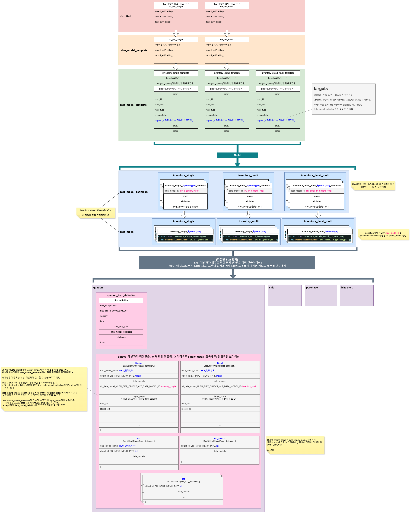

# Daily Retrospective

**작성자**: [최현철]  
**작성일시**: [2025-01-08]

## 1. 오늘 배운 내용 (필수)

1. data_model

2. bizz_definition

3. table_model

4. smc : dmc의 배열을 들고있다.

## 2. 동기에게 도움 받은 내용 (필수)

1. 디버깅을 찍어보려고 할 때 로컬환경에서 테스트코드 접속이 안되는 오류가 있었는데, 건호/강민님께서 해당 문제를 해결해주셨습니다.

   - 산출물폴더 삭제 후 다시 클론

2. 오늘 수업을 이해해보기 위해 도식을 그렸는데, 승준/성재/건호/주현/강민님께서 제가 이해하기 위한 도식을 제가 직접 설명하도록 유도해주셨습니다. (다들 알고계시면서 제가 더 잘 이해하기위해 제가 직접 설명할 수 있는 기회를 주시려고 배려하셨습니다.)

---

## 3. 개발 기술적으로 성장한 점 (선택)

### 3. 위 두 주제 중 미처 해결 못한 과제. 앞으로 공부해볼 내용.

smc, dmc에 대해 아직 명확치 않습니다.
smc는 많은 것들을 포함하고 있고, 그중 하나로 dmc의 리스트를 들고있는 것 같습니다.
따라서 smc가 가지고있는 dmc리스트를 순회하면서 dmc 각각을 처리하는 로직들이 존재하는 것 같습니다.
또한, dmc안에도 많은 것들이 들어있는 것 같습니다.
그 중 하나가 object이고, 해당 bizz에 해당 항목이 설정되어있는지를 object에서 확인하게 되는 것 같습니다.

어떻게 쓰이는지, 전체적으로 무엇을 모두 들고있는지는 아직 이해하지 못했고, 오늘 배운내용과 관련있는 내용만 파악하여 아직 볼게 많은 것 같습니다.

---

## 4. 소프트 스킬면에서 성장한 점 (선택)

강민님의 꼼꼼함을 배웠습니다.
저는 개념적으로만 이해하고 그렇곘거니~ 하고 넘어가는 것들이 많은데, 강민님께서는 직접 디버깅을 통해서 흐름을 따라가보는 꼼꼼함을 가지셨습니다.

---

## 5. 제안하고 싶은 내용

어제 적었던 제안사항이 꼭 채택되면 좋겠습니다~ (동기들 야근시간/택시관련)

오늘 개념설명 후 충분한 자습(소화) 시간이 있어서 좋았습니다.
아마 외화구현을 해보는 시간을 가졌다면, 오늘정도까지 이해하지는 못했을 것 같습니다.
