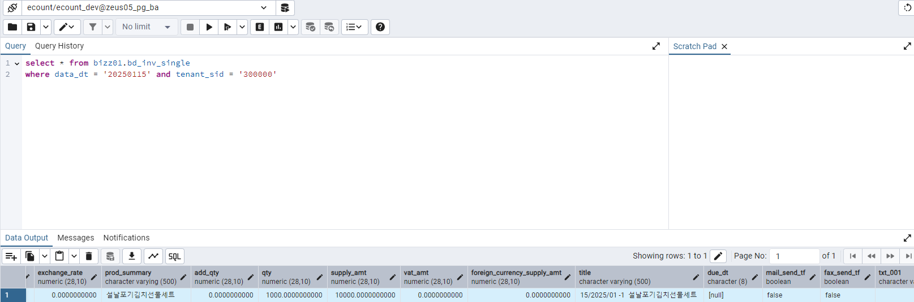
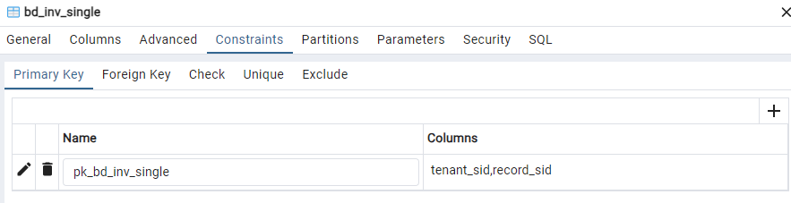

# Daily Retrospective

**작성자**: [김도형]  
**작성일시**: [2025-01-09]

## 1. 오늘 배운 내용 (필수)

- 외화 코드 구현 기초 작업

## 1. ENUM 데이터 추가

`D:\ecxsolution\ecount.nextv5\ecount.solution\src\01.ecount.fundamental\ecount.fundamental.define\src\enum\Enums.ts`

```typescript
// enum.ts

export const enum EN_BIZZ_TYPE {
  ForeignCurrency = "foreign_currency",
}

export const enum EN_BIZZ_OBJECT_ALT_DATA_MODEL_ID {
  foreign_currency = "foreign_currency",
}
```

## 2. bizz 추가

`D:\ECXSolution\ecount.nextv5\ecount.solution\src\04.ecount.application\ecount.application.entry\src\server\context\execution_context\bizz.ts`

```typescript
import { foreign_currency } from 'ecount.usecase.tutorials/@abstraction';

// 추가
// EDT 외화
	{ definition: foreign_currency.ForeignCurrencyDefinition, bizz_sid: 'TB_000000E040114' },
```

## 3. Data model definition 구현

`D:\ecxsolution\ecount.nextv5\ecount.solution\src\03.ecount.usecase\ecount.usecase.tutorials\data_model_template\foreign_currency\foreign_currency.ts`

```bash
ecount.solution\03.ecount.usecase\ecount.usecase.tutorials\

 - data_model_template 폴더 생성
    - index.ts
    - tsconfig.json
    - foreign_currency 폴더 생성
        - foreign_currency.ts
```

`foreign_currency\foreign_currency.ts` 파일

```typescript
import { IDataModelTemplateInfo } from "@template-builder/definition";
import {
  EN_CUST_TYPE,
  EN_EXECUTE_CALLER_TYPE,
  EN_MENU_TYPE,
  EN_VIEW_TYPE,
} from "ecount.fundamental.define/enum";

export const foreign_currency: IDataModelTemplateInfo = {
  template_id: "foreign_currency",
  targets: {
    [EN_MENU_TYPE.List]: null,
    [EN_MENU_TYPE.ListSearch]: null,
    [EN_MENU_TYPE.Input]: null,
  },
  props: [
    {
      prop_id: "tenant_sid",
      data_type: "$$sid",
      refer_type: "tenant_sid",
      refer_group: "sid",
      is_key: true,
      attributes: {
        Renderer: {
          display_state: false,
        },
      },
    },

    {
      prop_id: "foreign_currency",
      data_type: "$$code",
      refer_type: "foreign_currency",
      refer_group: "foreign_currency",
      prop_name: "외화코드",
      targets: [EN_MENU_TYPE.List, EN_MENU_TYPE.Input],
      attributes: {
        Renderer: {
          display_state: false,
        },
      },
    },
    {
      prop_id: "foreign_currency_cd",
      data_type: "$$txt",
      refer_type: "foreign_currency_cd",
      refer_group: "foreign_currency",
      prop_name: "외화코드",
      targets: [EN_MENU_TYPE.List, EN_MENU_TYPE.Input],
    },
    {
      prop_id: "foreign_currency_nm",
      data_type: "$$txt",
      refer_type: "foreign_currency_nm",
      refer_group: "foreign_currency",
      prop_name: "외화명",
      targets: [EN_MENU_TYPE.List, EN_MENU_TYPE.Input],
    },
    {
      prop_id: "exchange_rate",
      data_type: "$$decimal",
      refer_type: "exchange_rate",
      refer_group: "exchange_rate",
      prop_name: "환율",
      targets: [EN_MENU_TYPE.List, EN_MENU_TYPE.Input],
    },
    {
      prop_id: "category",
      data_type: "$$enum",
      refer_type: "category",
      refer_group: "category",
      prop_name: "카테고리",
      targets: [EN_MENU_TYPE.Input],
    },
    {
      prop_id: "category",
      data_type: "$$txt",
      refer_type: "category",
      refer_group: "category",
      prop_name: "카테고리",
      targets: [EN_MENU_TYPE.List],
    },
    {
      prop_id: "status_type",
      prop_name_code: "사용구분",
      prop_name: "사용구분",
      data_type: "$$enum",
      refer_type: "status_type",
      refer_group: "status_type",
      is_mandatory: true,
      targets: [EN_MENU_TYPE.List, EN_MENU_TYPE.Input],
    },
  ],
};
```

`index.ts` 파일

```typescript
export { foreign_currency } from "./foreign_currency/foreign_currency";
```

`tsconfig.json` 파일

```typescript
{
	"extends": "D:/ecxsolution/ecount.nextv5/@env/ecountv5/Env/dev/typescript/tsconfig/tsconfig.datamodel.template.json",
	"compilerOptions": {
		"outDir": "D:/ecxsolution/ecount.nextv5/ecount.solution/src/04.ecount.application/template-builder/modules/template/ecount.usecase.tutorials"
	}
}

```

## 4. @build.config.template.js 파일 추가

`D:\ecxsolution\ecount.nextv5\ecount.solution\src\03.ecount.usecase\@build.config.template.js`

```typescript
// configs 배열 내 추가
{
        moduleName: 'ecount.usecase.tutorials',
        projectPath: './ecount.usecase.tutorials',
        matches: ['{projectPath}/data_model_template/'],
        entry: '{projectPath}/data_model_template/index.ts'
},
```

## 5. 업무 명세 (foreign_currency)

```bash
03.ecount.usecase
    - ecount.usecase
        - tutorials
            - src
                - server
                    - @abstraction
                        - index.ts
                        - definition
                            - foreign_currency
                                - index.ts
                                - menus
                                    - index.ts
                                    - list.ts
                                    - input.ts
                                - objects
                                    - index.ts
                                    - list.ts
                                    - master.ts
                                - foreign_currency_definition.ts`
```

`@abstraction\index.ts` 파일

```typescript
export * from "@shared_usecase_tutorials/@abstraction";
export * from "./program";
export * as foreign_currency from "./definition/foreign_currency";
```

`definition\foreign_currency\index.ts` 파일

```typescript
export { bizz_definition as ForeignCurrencyDefinition } from "./foreign_currency_definition";

export * from "./objects/";
export * from "./menus/";
```

`definition\foreign_currency\foreign_currency_definition.ts` 파일

```typescript
import { EN_BIZZ_TYPE, EN_BIZZ_VERSION } from "ecount.fundamental.define/enum";
import { IBizzDefinition } from "ecount.infra.base/abstraction";

export const bizz_definition: IBizzDefinition = {
  bizz_id: "foreign_currency",
  bizz_sid: "TB_000000E040114",
  type: EN_BIZZ_TYPE.ForeignCurrency,
  version: EN_BIZZ_VERSION.$5_0_Framework,
  data_model_templates: [
    { data_model_template_id: "foreign_currency", alias: "main" },
  ],
  menus: {},
  objects: {},
  form: {},
  key_prop_info: {
    data_model_id: "foreign_currency",
    prop_id: "foreign_currency_cd",
  },
} as IBizzDefinition;
```

`definition\foreign_currency\menus\` 폴더

- `list.ts`

```typescript
import {
  EN_MENU_INFO_TYPE,
  EN_MENU_TYPE,
} from "ecount.fundamental.define/enum";
import { BizzUtil, IMenuDataModelInfo } from "ecount.infra.base/abstraction";
import { bizz_definition } from "../foreign_currency_definition";

BizzUtil.setMenu(bizz_definition, {
  menu_sid: "TM_000000E040111",
  menu_name: "외화 조회",
  menu_type: EN_MENU_TYPE.List,
  data_model: [
    {
      object_id: EN_MENU_TYPE.List,
      menu_role: EN_MENU_INFO_TYPE.List,
    } as IMenuDataModelInfo,
  ],
});
```

- `input.ts`

```typescript
import {
  EN_ACTION_MODE,
  EN_ATTR_TYPE,
  EN_INPUT_MENU_TYPE,
  EN_MENU_TYPE,
} from "ecount.fundamental.define/enum";
import { BizzUtil, IMenuDataModelInfo } from "ecount.infra.base/abstraction";
import { bizz_definition } from "../foreign_currency_definition";

BizzUtil.setMenu(bizz_definition, {
  menu_sid: "TM_000000E040114",
  menu_name: "외화 입력",
  menu_type: EN_MENU_TYPE.Input,
  data_model: [
    {
      object_id: EN_INPUT_MENU_TYPE.Master,
      menu_role: EN_INPUT_MENU_TYPE.Master,
    } as IMenuDataModelInfo,
  ],
  attributes: [
    {
      prop_id: "",
      attr_id: "api",
      attr_type: EN_ATTR_TYPE.Api,
      data: {
        //				[EN_ACTION_MODE.Create]: ICreateForeignCurrencyAction,
        //				[EN_ACTION_MODE.Modify]: IModifyForeignCurrencyAction,
        //				[EN_ACTION_MODE.Delete]: IModifyStatusForeignCurrencyAction,
        //				[EN_ACTION_MODE.ReUse]: IModifyStatusForeignCurrencyAction,
        //				[EN_ACTION_MODE.UnUse]: IModifyStatusForeignCurrencyAction,
        //                              [EN_ACTION_MODE.UnDelete]: IRemoveForeignCurrencyAction,
      },
    },
  ],
});
```

`definition\foreign_currency\objects\` 폴더

- `list.ts`

```typescript
import {
  BizzUtil,
  IBizzObjectDefinition,
  IImportTargetPropInfo,
} from "ecount.infra.base/abstraction";
import { bizz_definition } from "../foreign_currency_definition";
import {
  EN_ACTION_MODE,
  EN_ATTR_TYPE,
  EN_BIZZ_OBJECT_ALT_DATA_MODEL_ID,
  EN_MENU_TYPE,
} from "ecount.fundamental.define/enum";
import { foreign_currency_list } from "./../../../data_model";
import { definition_attrs } from "ecount.usecase.base/@abstraction";

BizzUtil.setObject(bizz_definition, {
  object_id: EN_MENU_TYPE.List,
  data_models: [
    {
      data_model_identifier: foreign_currency_list,
      alt_data_model_id: EN_BIZZ_OBJECT_ALT_DATA_MODEL_ID.foreign_currency,
      target_props_options: {
        prop_option: {
          tenant_sid: { is_key: true },
          foreign_currency_cd: { is_key: true },
        } as { [key: string]: IImportTargetPropInfo },
      },
    },
  ],
  attributes: [{}],
} as IBizzObjectDefinition);
```

- `master.ts`

```typescript
import {
  BizzUtil,
  IBizzObjectDefinition,
  IImportTargetPropInfo,
} from "ecount.infra.base/abstraction";
import { bizz_definition } from "../foreign_currency_definition";
import {
  EN_ACTION_MODE,
  EN_ATTR_TYPE,
  EN_BIZZ_OBJECT_ALT_DATA_MODEL_ID,
  EN_INPUT_MENU_TYPE,
} from "ecount.fundamental.define/enum";
import { foreign_currency_input } from "./../../../data_model";
import { definition_attrs } from "ecount.usecase.base/@abstraction";

BizzUtil.setObject(bizz_definition, {
  object_id: EN_INPUT_MENU_TYPE.Master,
  data_models: [
    {
      data_model_identifier: foreign_currency_input,
      alt_data_model_id: EN_BIZZ_OBJECT_ALT_DATA_MODEL_ID.foreign_currency,
      //target_props
      target_props_options: {
        prop_option: {
          tenant_sid: { is_key: true },
          foreign_currency_cd: { is_key: true },
        } as { [key: string]: IImportTargetPropInfo },
      },
    },
  ],
  attributes: [
    {
      attr_id: definition_attrs.info.data_model_resolver,
      attr_type: EN_ATTR_TYPE.Information,
      data: {
        //				[EN_ACTION_MODE.Create]: 'ICreateForeignCurrencyMasterProgram',
        //				[EN_ACTION_MODE.Modify]: 'IModifyForeignCurrencyMasterProgram',
        //				[EN_ACTION_MODE.Delete]: 'IModifyStatusForeignCurrencyMasterProgram',
        //				[EN_ACTION_MODE.UnDelete]: 'IModifyStatusForeignCurrencyMasterProgram',
        //				[EN_ACTION_MODE.Remove]: 'IDeleteForeignCurrencyMasterProgram',
      } as definition_attrs.info.data_model_resolver,
      prop_id: "",
    },
  ],
} as IBizzObjectDefinition);
```

## foreign_currency.ts 를 빌드하면 생기는 파일

```
03.ecount.usecase
    - ecount.usecase.tutorials
        - src
            - @shared_usecase_tutorials (interface)
                - @abstraction
                    - data_model
                        - index.ts
                        - foreign_currency
                            - foreign_currency_list_search.ts
                            - foreign_currency_input.ts
                            - foreign_currency_list.ts
                            - index.ts
            - server (definition)
                - @abstraction
                    - data_model
                        - index.ts
                        - foreign_currency
                            - foreign_currency_list_search.ts
                            - foreign_currency_input.ts
                            - foreign_currency_list.ts
                            - index.ts

04.ecount.application
    - template-builder
        - modules
            - template
                - ecount.usecase.tutorials
                    - index.js
                    - foreign_currency
                        - foreign_currency.js
```

## 2. 동기에게 도움 받은 내용 (필수)

attribute의 개념에 대한 이해가 부족해서 성재님, 민준님과 토론 중, 현철님께서 attribute의 개념에 대해 다시 정리해주셨습니다.

주원님과 foreign_currency 를 빌드하면 data model이 만들어지는 과정을 토론하였습니다.

오늘도 역시 강민님과 수업에서 배운 내용 중 이해가 되지 않는 부분을 토론하였습니다. 그리고 강민님, 건호님, 성재님, 연아님, 승준님과 밖에서 점심 식사를 함께 하였습니다.

성철님께서 저녁 식사 메뉴를 주문해주시고, 현철님과 둘이서 세팅까지 해주셨습니다. 함께 해도 됐을텐데 수고해주셔서 감사했습니다.

---

## 3. 개발 기술적으로 성장한 점 (선택)

### 1. 교육 과정 상 배운 내용이 아닌 개인적 호기심을 해결하기 위해 추가 공부한 내용

### 배운 내용 복습

오늘은 실제 API 개발 방법에 대해 깊이 있게 학습했습니다. 그 중에서도 어제 디버깅을 통해 확인했던 CreateInventoryAction API가 데이터를 처리하는 방식에 대해 복습하는 시간을 가졌습니다. 클라이언트로부터 요청이 들어오면, 이 Action은 먼저 요청 데이터를 slip_dto라는 형태로 변환합니다. 이 과정에서 bizz_manager와 bizz_definition을 초기화하여 필요한 비즈니스 로직을 정의하고, attributes 속성을 통해 실제 처리해야 할 데이터를 특정합니다. 특히 주목할 만한 점은 ActionProgramResolver의 역할입니다. 이 컴포넌트는 bizz_mgr.getMenuDefinition 메서드를 통해 메뉴 정의를 검색하고, action_program_resolver 속성을 기준으로 실행할 프로그램을 찾아냅니다. 이렇게 찾아낸 resolver는 ProgramBuilder.create를 통해 실제 프로그램 객체를 생성하고 실행하게 됩니다.

또한 오늘 작성한 dto와 enum들이 어떻게 활용되는지도 명확히 이해할 수 있었습니다. 이들은 bizz_manager를 통해 바인딩되며, 주로 Action과 DAC에서 사용됩니다. 예를 들어, data_model_id를 기반으로 smc와 dmc를 생성하거나 매핑하는 과정에서 이들이 핵심적인 역할을 합니다. 이러한 학습을 통해 프레임워크가 요청-응답 사이클을 어떻게 관리하는지, 그리고 데이터 모델이 어떻게 비즈니스 로직과 연결되는지 구체적으로 이해할 수 있었습니다. 이 모든 과정에서 가장 인상 깊었던 점은 프레임워크가 비즈니스 로직과 데이터 처리를 명확히 분리하면서도, bizz_manager를 통해 이들을 효과적으로 연결하는 방식이었습니다. 이는 코드의 유지보수성과 확장성을 크게 향상시킬 수 있는 설계라고 생각합니다.

하지만, 아쉬웠던 점은 3.0에서 5.0으로 개발 중인 과도기이므로 몇 가지 숙제들이 있었습니다. 같은 개념의 데이터를 두 가지 방식(Code 타입과 일반 데이터 타입)으로 관리해야 하는 상황,기존 3.0 시스템의 로직을 5.0에 맞게 재구성하는 과정에서 발생하는 구조적 차이 등이 있습니다. 예를 들어, 단순히 'cust_cd = wh_cd'와 같은 매핑을 할 때도 Code 타입 체크라는 추가적인 절차가 필요한 상황입니다. 이러한 과도기적 특성으로 인해 개발 과정이 다소 복잡해지고, 추가적인 코드 검증이 필요한 상황입니다. 하지만 이는 새로운 시스템으로의 안정적인 전환을 위한 필수적인 과정이며, 향후 더 나은 시스템 구조를 위한 중요한 학습 기회가 되고 있습니다. 앞으로는 이러한 과도기적 특성을 고려하여, 코드의 일관성을 유지하면서도 유지보수가 용이한 구조를 만들어가는 것이 중요할 것 같습니다. 더불어, 많이 배울 수 있는 기회일지도 모른다는 생각도 듭니다.

### 재고를 입력하고, PG에서 확인해보기

재고를 입력하고, PG에 실제로 데이터가 저장되는 지 확인해보는 시간을 가졌습니다. 25년 1월 15일로 날짜를 설정하고, 데이터를 추가해보았습니다. 회사 코드와 data_dt만 설정해서 `bizz01.bd_inv_single` 테이블을 조회해보았습니다. 아래와 같이 실제 데이터가 쌓이는 것을 확인할 수 있었습니다.



수업 시간에 배웠던 tenant_sid와 record_sid가 PK로 되어있는 것을 확인할 수 있었습니다. 수업을 통해 개념을 정리하고, 실습을 통해 실제 데이터를 확인함으로서 확실하게 이해할 수 있었습니다.



### RAC(Remote Access Control)

DAC가 데이터베이스 접근을 제어하는 역할을 한다면, RAC는 외부 서버와의 통신을 담당하는 구조입니다. 두 시스템이 매우 유사한 구조를 가지고 있습니다. 둘 다 Builder 패턴을 사용해 인스턴스를 생성하고, execution_context를 통해 실행 컨텍스트를 관리하며, onExecute 메서드를 구현하여 핵심 로직을 작성한다는 공통점이 있었습니다.

RAC의 경우 HTTP 통신을 위한 send와 sendAs라는 두 가지 메서드를 제공하는데, 이 부분에서 프레임워크의 세심한 설계가 돋보였습니다. send 메서드는 특화된 응답 처리를 자동으로 해주고, sendAs는 개발자가 직접 응답 타입을 지정할 수 있게 하여 유연성을 제공합니다. 또한 RacCommand, V3RacCommand, V3GmcRacCommand와 같이 상황에 맞는 기본 추상 클래스를 제공함으로써, 개발자가 필요한 기능을 쉽게 구현할 수 있도록 지원하고 있다는 점도 인상적이었습니다.

이러한 구조화된 접근 방식은 코드의 일관성을 유지하고 유지보수성을 높이는 데 큰 도움이 될 것 같습니다. 특히 외부 서버와의 통신이 많은 현대 웹 애플리케이션에서 RAC와 같은 구조화된 프레임워크의 중요성을 다시 한번 실감하게 되었습니다.

### 2. 오늘 직면했던 문제 (개발 환경, 구현)와 해결 방법

### 산출물 폴더 rebase 과정에서 마주한 문제

```bash
git rebase ecount/master-hotfix
```

오늘은 개발 중 발생한 git rebase 문제를 해결하는 과정에서 많은 것을 배웠습니다. 개발 중인 브랜치에서 master-hotfix의 최신 변경사항을 반영하기 위해 rebase를 시도했는데, 예상보다 많은 충돌이 발생했습니다. 처음에는 당황스러웠지만, 성범 책임님께 여쭤가면서 문제를 해결하였습니다.

```bash
cd d:\ecountv5
git fetch --all
git reset HEAD --hard
git clean -fdx
git rebase ecount/master-hotfix
pause
```

이 스크립트는 순차적으로

1. 모든 원격 저장소의 최신 정보를 가져오고
2. 현재 브랜치를 HEAD로 완전히 초기화하며
3. 추적되지 않는 모든 파일들을 깨끗이 제거한 후
4. master-hotfix 브랜치의 최신 내용을 반영하는 작업을 수행합니다

특히 git reset HEAD --hard와 git clean -fdx 명령어를 통해 작업 디렉토리를 완전히 깨끗한 상태로 만드는 것이 중요했습니다. 이는 현재 3.0에서 5.0으로 전환하는 과도기적 상황에서 발생할 수 있는 예상치 못한 충돌들을 방지하는 데 매우 효과적이었습니다.

### 조성준 팀장님께 드렸던 질문

`Q1.` program들마다 Setup이라는 단어들이 포함된 program과 그렇지 않은 program 이 존재하는데, 실제 비즈니스 로직을 처리하기 전에 초기화해주는 역할이라고 이해하면 될까요? Action 쪽에서도 GetSetupMenuAttrAction 이런식으로 쓰이더라구요.

`A1.` 초기화라는 표현이 로직을 실행하기 위한 속성정보를 가져온다는 의미이면 맞습니다.

<br>

`Q2.` bizz.ts 에서 definition을 정의할 때, foreign_currency.ForeignCurrencyDefinition으로 사용하고 있는데요. foreign_currency로 호출하는 이유가 무엇이며, foreign_currency가 앞에 붙는 이유가 무엇인가요? Enum type으로 정의한 것과 연관이 있을까요?

`A2.` import { foreign_currency } from 'ecount.usecase.tutorials/@abstraction'; 이렇게 했을 때, 이건 해당 경로의 폴더의 index파일을 가리키게 되는겁니다.

답변해주신 내용을 듣고 index.ts 파일의 존재 이유를 명확하게 알게 되었습니다.

<br>

`Q3.` foreign_currency 인 data model template을 빌드하게 되면 @shared_usecase_tutorials와 src/server/@abstraction에서 각각 인터페이스와 definition이 생기는 이유에 대해서 여쭤보고 싶습니다.

`A3.` data_model_definition으로 사용하려는 목적과
data_model의 interface로 사용하려는 목적인겁니다.

<br>

`Q4.` 외화등록 화면에는 있지만, foreign_currency 템플릿에는 없는 attribute들이 존재하던데, 앞으로 계속 코드를 작성하면서 해당 기능들을 만들어가는걸까요?

`A4.` 네 그렇습니다.

<br>

`Q5.` menus/list와 objects/list의 차이가 궁금합니다.

`A5.` depth 구분이 모호하고 최종방향과는 조금 다르게 구조가 되어 있습니다. 업무설정을 할때, 외화를 구성하는 object 단위들만 있어야되지만
현재는 조회,현황등의 개념도 포함되어 있습니다. 예를 들어, 상단/하단/오던과리 등. (있다고 하면) "최초 기획 방향을 가기전이라 현재 개발현을 위해 구조가 그렇게 되어 있다." 정도로 이해하시면 될것 같습니다.

<br>

`Q6.` 외화등록을 직접 테스트하고, pg에서 확인하고 싶은데 어떤 테이블을 통해 쿼리를 찍어볼 수 있을까요? 견적서 입력의 경우에는 bizz01.bd_inv_single에서 확인해보았습니다.

`A6.` 현재 외화코드는 3.0으로 구현되어있어서 확인해 볼 수 없고, Pg테이블을 저희가 만들겁니다.

### 3. 위 두 주제 중 미처 해결 못한 과제. 앞으로 공부해볼 내용.

- 지금까지 배운 내용을 제대로 이해하고, 내 것으로 만들기

---

## 4. 소프트 스킬면에서 성장한 점 (선택)

3.0에서 5.0으로 넘어가는 과도기적 상황에서 발생한 문제들을 해결하면서 더 적극적인 태도를 가지게 되었습니다. 특히 rebase 과정에서 충돌이 발생했을 때, 단순히 도움을 요청하기보다는 먼저 문제의 원인을 파악하고 해결 방법을 찾아보려 노력했습니다.

또한, 데이터 모델을 작성하는 과정에서도 기존 코드를 단순히 따라하는 것이 아니라, 왜 이런 구조로 설계되었는지 적극적으로 질문하고 이해하려 했습니다. 특히 bizz_manager를 통한 데이터 바인딩 과정에 대해 깊이 있게 파악하려 노력했고, 이는 전체 시스템 구조를 이해하는 데 큰 도움이 되었습니다.
