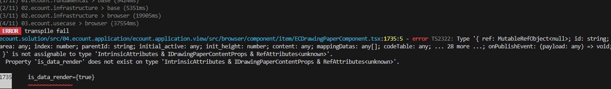

# Daily Retrospective

**작성자**: [김승준]  
**작성일시**: [2025-01-09]

## 1. 오늘 배운 내용 (필수)

-   소스코드 최신화를 진행했습니다.
-   Data Model Template, Data Model Definition, Menu Definition, Object Definition를 샘플 소스를 통해 실습을 진행했습니다.

## 2. 동기에게 도움 받은 내용 (필수)

-   강민님, 건호님, 성재님, 도형님, 연아님, 민준님과 함께 다산정에서 점심식사를 했습니다. 간만에 김밥이 아닌 다양한 음식을 먹으니 좋았습니다.
-   연아님, 주원님과 함께 3층에서 리프레시 시간을 가졌습니다.
-   성범 책임님께서 소스코드 최신화 이후 빌드 오류나는 부분을 해결해주셨습니다. 책임님이 웬만한 오류는 해결해주셔서 든든합니다.

---

## 3. 개발 기술적으로 성장한 점 (선택)

### 오늘 직면했던 문제 (개발 환경, 구현)와 해결 방법

-   소스 코드 rebase 이후 빌드를 진행하자 에러가 나타났습니다.
    

    -   이유 : 소스 코드는 최신화 되었지만 산출물 코드가 최신화가 안되서 그런것.<br>
        -> 산출물 코드에는 단순히 빌드를 통해나온 코드 뿐만이 아니라, ci/cd 환경변수 등 빌드를 위한 모든 파일이 존재함. 따라서 이러한 부분에 변경사항이 있다면 최신코드를 받아와야 함.
    -   해결 방법 : 산출물 코드 rebase -> config 재설정 -> 빌드<br>
        -> 이 과정에서 많은 오류가 있었지만 **성범 책임님**이 해결해주셨습니다.

        1. 산출물 rebase 과정에서 conflict 발생, 빌드 시 다시 덮어씌울 것이라 생각해 무시하고 진행. `D:\ecountv5\build\build_info.json`
        2. 빌드는 성공했으나, 디버깅 과정에서 브라우저가 멈춰버리는 문제 발생.
        3. conflict를 무시한 부분이 제대로 빌드가 안된것을 확인
        4. 산출물에서 새로 브랜치를 만들어 진행

### 앞으로 공부해볼 내용.

-   산출물 코드가 단순히 소스 코드가 빌드되어서 나온 것이라고 생각했는데, 다른 파일들도 있다는 것을 알게되었습니다. 이후에도 같은 문제가 발생했을 때 확인해야할 파일이 무엇인지 해당 파일이 어떤 역할을 하는지 알고 싶습니다.

# 실습 코드

### enum 추가

`D:\ecxsolution\ecount.nextv5\ecount.solution\src\01.ecount.fundamental\ecount.fundamental.define\src\enum\Enums.ts`

```ts
export const enum EN_BIZZ_TYPE {
  ...
  ForeignCurrency = 'foreign_currency',
}
...
export const enum EN_BIZZ_OBJECT_ALT_DATA_MODEL_ID {
  ...
  foreign_currency = 'foreign_currency',
}
```

### bizz.ts

`D:\ECXSolution\ecount.nextv5\ecount.solution\src\04.ecount.application\ecount.application.entry\src\server\context\execution_context\bizz.ts`

```ts
import { foreign_currency } from 'ecount.usecase.tutorials/@abstraction';
...
export const bizz_all = [
    ...
    { definition: foreign_currency.ForeignCurrencyDefinition, bizz_sid: 'TB_000000E040114' },
] as { definition: IBizzDefinition; bizz_sid: string | string[] }[];
```

## Data Model Template

-   tutorials/data_model_template/.../foreign_currency.ts 파일 생성
    `\03.ecount.usecase\ecount.usecase.tutorials\data_model_template\foreign_currency\foreign_currency.ts`

```ts
import { IDataModelTemplateInfo } from '@template-builder/definition';
import { EN_CUST_TYPE, EN_EXECUTE_CALLER_TYPE, EN_MENU_TYPE, EN_VIEW_TYPE } from 'ecount.fundamental.define/enum';

export const foreign_currency: IDataModelTemplateInfo = {
	template_id: 'foreign_currency',    // 템플릿이 빌드되어 각 data model을 생성할 때 사용    data_model_id : [template_id]_[target]
	targets: {  // definition으로 생성할 대상(ex. 메뉴타입)을 설정합니다.
		[EN_MENU_TYPE.List]: null,
		[EN_MENU_TYPE.ListSearch]: null,
		[EN_MENU_TYPE.Input]: null,
	},
	props: [    // 사용할 항목을 정의합니다.
		{
			prop_id: 'tenant_sid',
			data_type: '$$sid',
			refer_type: 'tenant_sid',
			refer_group: 'sid',
			is_key: true,
			attributes: {   // 데이터 모델 내 항목들의 속성 목록,
            // depth가 깊어짐 -> 데이터 모델의 속성에 위치
				Renderer: {
					display_state: false,
				},
			},
		},

        ...
    ],
}
```

`03.ecount.usecase\ecount.usecase.tutorials\data_model_template\tsconfig.json` 파일 생성

```json
{
    "extends": "D:/ecxsolution/ecount.nextv5/@env/ecountv5/Env/dev/typescript/tsconfig/tsconfig.datamodel.template.json",
    "compilerOptions": {
        "outDir": "D:/ecxsolution/ecount.nextv5/ecount.solution/src/04.ecount.application/template-builder/modules/template/ecount.usecase.tutorials"
    }
}
```

`03.ecount.usecase\ecount.usecase.tutorials\data_model_template\index.ts` 파일생성

```ts
export { foreign_currency } from "./foreign_currency/foreign_currency";
```

-> `foreign_currency.ts` 빌드

### Data Model Definition

-   data model template에 의해 생성됨
-   `\03.ecount.usecase\ecount.usecase.tutorials\src\server\@abstraction\data_model\foreign_currency\foreign_currency_input.ts`,<br> `foreign_currency_list_search.ts`,<br> `foreign_currency_list.ts`,<br> `index.ts`,<br> `../index.ts`가 생성됨.

```ts
import { IDataModelDefinition, DataModelIdentifier } from 'ecount.fundamental.datamodel/definition';
import { EN_ATTR_TYPE } from 'ecount.fundamental.define/enum';

export const foreign_currency_input = new DataModelIdentifier('foreign_currency_input');

const foreign_currency_input_Definition: IDataModelDefinition = {
	data_model_id: 'foreign_currency_input', // 데이터의 역할에 따라 id를 부여
	props: [        // 데이터를 구성하는 항목 목록입니다. 각 항목의 주요 정의를 포함
		{ prop_id: 'tenant_sid', data_type: '$$sid', refer_type: 'tenant_sid', is_key: true, refer_group: 'sid' },
		{
			prop_id: 'foreign_currency',
			data_type: '$$code',
			refer_type: 'foreign_currency',
			prop_name: '외화코드',
			refer_group: 'foreign_currency',
		},
        ...
    ],
    attributes: [       // 데이터 모델 내 항목들의 속성 목록, 항목의 속성을 항목 definition 내에 위치하면 depth가 깊어져 데이터 모델에 항목의 속성이 위치하게 됨.
		{ attr_type: EN_ATTR_TYPE.Renderer, attr_id: 'display_state', data: false, prop_id: 'tenant_sid' },
		{ attr_type: EN_ATTR_TYPE.Renderer, attr_id: 'display_state', data: false, prop_id: 'foreign_currency' },
	],
};
foreign_currency_input.definition = foreign_currency_input_Definition;
```

### Bizz Definition

`\03.ecount.usecase\ecount.usecase.tutorials\src\server\@abstraction\definition\foreign_currency\foreign_currency_definition.ts` 파일생성

```ts
import { EN_BIZZ_TYPE, EN_BIZZ_VERSION } from "ecount.fundamental.define/enum";
import { IBizzDefinition } from "ecount.infra.base/abstraction";

export const bizz_definition: IBizzDefinition = {
    bizz_id: "foreign_currency", // 업무의 의미에 따라 id를 부여
    bizz_sid: "TB_000000E040114", // 업무의 고유 sid
    type: EN_BIZZ_TYPE.ForeignCurrency, // 재고, 회계, 기초코드, 게시판 등 업무 분류를 구분
    version: EN_BIZZ_VERSION.$5_0_Framework, // 업무의 프레임워크 버전
    data_model_templates: [{ data_model_template_id: "foreign_currency", alias: "main" }], // 업무에서 사용하고 있는 데이터모델 템플릿 목록
    menus: {}, // 업무 관련 메뉴 목록, 메뉴 등록 시점에 추가 됨
    objects: {}, // 업무의 속성 목록
    form: {}, // 업무에서 사용하는 object 목록, object 등록 시점에 추가 됨
    key_prop_info: {
        // 업무 데이터 상 실제 고유키 역할을 하는 항목과 화면에 표시될 때 고유키를 대체하는 항목에 대한 정보
        data_model_id: "foreign_currency",
        prop_id: "foreign_currency_cd",
    },
} as IBizzDefinition;
```

`\03.ecount.usecase\ecount.usecase.tutorials\src\server\@abstraction\definition\foreign_currency\index.ts` 파일 생성

```ts
export { bizz_definition as ForeignCurrencyDefinition } from "./foreign_currency_definition"; // bizz_definition을 (export const bizz_definition)  foreign_currency_definition로 부르겠다.

export * from "./menus";
export * from "./objects";
```

### Menu Definition

-   foreign_currency/.../menus/input.ts
    `\03.ecount.usecase\ecount.usecase.tutorials\src\server\@abstraction\definition\foreign_currency\menus\input.ts`<br>

```ts
import { EN_ACTION_MODE, EN_ATTR_TYPE, EN_INPUT_MENU_TYPE, EN_MENU_TYPE } from "ecount.fundamental.define/enum";
import { BizzUtil, IMenuDataModelInfo } from "ecount.infra.base/abstraction";
import { bizz_definition } from "../foreign_currency_definition";

BizzUtil.setMenu(bizz_definition, {
    menu_sid: "TM_000000E040114", // 메뉴의 고유 sid
    menu_name: "외화 입력", // 실제 표시할 메뉴 이름입니다.
    menu_type: EN_MENU_TYPE.Input, // 업무 데이터에 대한 메뉴 역할 구분입니다.
    data_model: [{ object_id: EN_INPUT_MENU_TYPE.Master, menu_role: EN_INPUT_MENU_TYPE.Master } as IMenuDataModelInfo], // 메뉴에서 사용하는 데이터 모델 목록입니다. 메뉴 내 데이터모델의 역할과 사용할 데이터 모델을 지정합니다.

    attributes: [
        // 메뉴의 속성 목록입니다.
        {
            prop_id: "",
            attr_id: "api",
            attr_type: EN_ATTR_TYPE.Api,
            data: {
                ...
            },
        },
    ],
});
```

### Object Definition

```ts
import { BizzUtil, IBizzObjectDefinition, IImportTargetPropInfo } from "ecount.infra.base/abstraction";
import { bizz_definition } from "../foreign_currency_definition";
import { EN_ACTION_MODE, EN_ATTR_TYPE, EN_BIZZ_OBJECT_ALT_DATA_MODEL_ID, EN_INPUT_MENU_TYPE } from "ecount.fundamental.define/enum";
import { foreign_currency_input } from "./../../../data_model";
import { definition_attrs } from "ecount.usecase.base/@abstraction";

BizzUtil.setObject(bizz_definition, {
    object_id: EN_INPUT_MENU_TYPE.Master,
    data_models: [
        {
            data_model_identifier: foreign_currency_input,
            alt_data_model_id: EN_BIZZ_OBJECT_ALT_DATA_MODEL_ID.foreign_currency,
            //target_props
            target_props_options: {
                prop_option: {
                    tenant_sid: { is_key: true },
                    foreign_currency_cd: { is_key: true },
                } as { [key: string]: IImportTargetPropInfo },
            },
        },
    ],
    attributes: [
        {
            attr_id: definition_attrs.info.data_model_resolver,
            attr_type: EN_ATTR_TYPE.Information,
            data: {
                //				[EN_ACTION_MODE.Create]: 'ICreateForeignCurrencyMasterProgram',
                //				[EN_ACTION_MODE.Modify]: 'IModifyForeignCurrencyMasterProgram',
                //				[EN_ACTION_MODE.Delete]: 'IModifyStatusForeignCurrencyMasterProgram',
                //				[EN_ACTION_MODE.UnDelete]: 'IModifyStatusForeignCurrencyMasterProgram',
                //				[EN_ACTION_MODE.Remove]: 'IDeleteForeignCurrencyMasterProgram',
            } as definition_attrs.info.data_model_resolver,
            prop_id: "",
        },
    ],
} as IBizzObjectDefinition);
```
