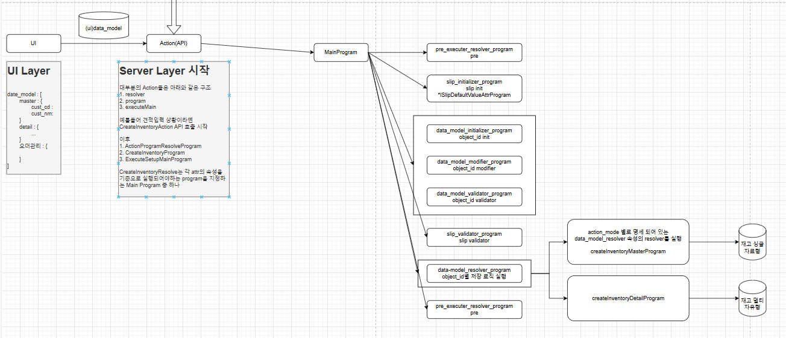
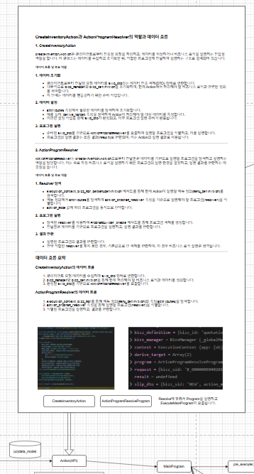
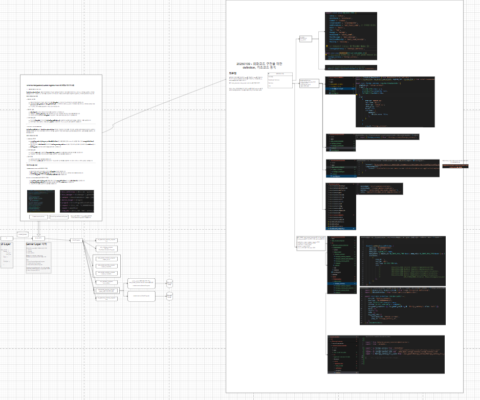

# Daily Retrospective  
**작성자**: [나강민]  
**작성일시**: [2025-01-09]  

## 1. 오늘 배운 내용 (필수)  



이번주 월요일부터 계속 진행하고 있는 전체 구조에 대해서 내가 오늘 작성한 코드와 배움이 어디서 사용하고 있을지 계속 생각하면서 진행했습니다.

오늘의 주요 배움은 이제 실제로 기능을 개발하기 위한 API를 프레임워크 상에서 어떻게 개발을 해야하는지 방법 중 '외화코드구현'을 통해 아래 흐름 전체에서 우리가 관심을 가져야 할 dmc, smc들의 데이터들을 어떻게 정의하고 쓸 것인지에 대해 실습하는 시간을 가졌습니다. 

아래의 그림에서 오늘 우리가 작성한 data_model들은 제가 생각하기에 request 요청을 받았을 때 서버에서 이해할 수 있는 데이터의 형태로 변경해야겠다라는 생각으로 이해하고 MainProgram을 가기 전 smc와 dmc를 만들 수 있는 준비물들이 필요하겠다고 생각했습니다. 



그래서 Action(API)를 받는 과정에서 'CreateInventoryAction API'를 받아서 하는 역할과 데이터 흐름을 확인해보면서 어떻게 데이터들이 오늘 내가 작성한 dto, enum과 바인딩 될지 궁금하여 흐름을 잡았습니다. 

### CreateInventoryAction과 ActionProgramResolver의 역할과 데이터 흐름

#### 1. **CreateInventoryAction**

`CreateInventoryAction`은 클라이언트로부터 전송된 요청을 처리하고, 데이터를 저장하거나 비즈니스 로직을 실행하는 진입점 역할을 합니다. 이 클래스는 데이터를 수집하고 초기화한 뒤, 적합한 프로그램에 전달하여 실행하는 구조로 설계되어 있습니다.

##### 데이터 흐름 및 주요 역할

**1. 데이터 초기화**  
- 클라이언트로부터 전달된 요청 데이터를 `slip_dto`라는 데이터 전송 객체(DTO) 형태로 변환합니다.  
- 내부적으로 `bizz_manager`와 `bizz_definition`을 초기화하여, 현재 Action에서 처리해야 할 비즈니스 로직과 관련된 정의를 파악합니다.  
- 이 단계는 데이터를 핸들링하기 위한 준비 작업입니다.

**2. 데이터 설정**  
- `attributes` 속성에서 필요한 데이터를 탐색하여 초기화합니다.  
- 예를 들어, `derive_target` 속성을 검색하여 Action이 처리해야 할 대상 데이터를 특정합니다.  
- 이러한 설정 작업을 통해 `slip_dto`가 완성되고, 이후 프로그램 실행 준비가 완료됩니다.

**3. 프로그램 실행**  
- 준비된 `slip_dto`를 기반으로 `ActionProgramResolver`를 호출하여 실행할 프로그램을 식별하고, 이를 실행합니다.  
- 프로그램의 실행 결과는 최종 결과(`result`)로 반환되며, 이는 Action의 실행 결과로 사용됩니다.

---

#### 2. **ActionProgramResolver**

`ActionProgramResolver`는 `CreateInventoryAction`으로부터 전달받은 데이터를 기반으로 실행할 프로그램을 탐색하고 실행하는 역할을 담당합니다. 이는 주로 특정 비즈니스 로직을 실행하기 위한 프로그램의 실행 환경을 설정하고, 실행 결과를 반환하는 데 중점을 둡니다.

##### 데이터 흐름 및 주요 역할

**1. Resolver 탐색**  
- `execution_context.bizz_mgr.getMenuDefinition` 메서드를 통해 현재 Action이 실행할 메뉴 정의(`menu_definition`)를 검색합니다.  
- 메뉴 정의에서 `attributes`를 탐색하여 `action_program_resolver` 속성을 기준으로 실행해야 할 프로그램(`resolver`)을 식별합니다.  
- `action_mode` 값에 따라 프로그램을 동적으로 선택합니다.

**2. 프로그램 실행**  
- 탐색된 `resolver`를 사용하여 `ProgramBuilder.create` 메서드를 통해 프로그램 객체를 생성합니다.  
- 전달받은 데이터를 기반으로 프로그램을 실행하고, 실행 결과를 반환합니다.

**3. 결과 반환**  
- 실행된 프로그램의 결과를 반환합니다.  
- 만약 적합한 `resolver`를 찾지 못한 경우, 기본값으로 빈 객체를 반환하며, 이 경우 비즈니스 로직 실행은 생략됩니다.

---

### 데이터 흐름 요약

#### CreateInventoryAction의 데이터 흐름
1. 클라이언트 요청 데이터를 수집하여 `slip_dto` 형태로 변환합니다.  
2. `bizz_manager`와 `bizz_definition`을 통해 현재 처리해야 할 비즈니스 로직과 데이터를 정의합니다.  
3. 완성된 `slip_dto`를 기반으로 `ActionProgramResolver`를 호출합니다.

#### ActionProgramResolver의 데이터 흐름
1. `execution_context.bizz_mgr`를 통해 메뉴 정의(`menu_definition`)와 속성(`attributes`)을 탐색합니다.  
2. `action_program_resolver` 속성을 통해 실행할 프로그램(`resolver`)을 식별합니다.  
3. 식별된 프로그램을 실행하고, 결과를 반환합니다.

---

### 요약

#### CreateInventoryAction
- 클라이언트 요청 데이터를 수집하고 초기화하여, 실행할 프로그램(`ActionProgramResolver`)을 호출하는 역할을 수행합니다.
- 데이터를 DTO(`slip_dto`) 형태로 구성한 뒤, 이를 프로그램에 전달합니다.

#### ActionProgramResolver
- 전달받은 데이터를 기반으로 적합한 프로그램을 식별합니다.
- 프로그램을 실행하고, 실행 결과를 반환합니다.

---

### 데이터 흐름 요약 표

| 단계                  | 입력 데이터                              | 처리 내용                               | 출력 데이터                    |
|-----------------------|------------------------------------------|----------------------------------------|-------------------------------|
| **CreateInventoryAction** | 클라이언트 요청 데이터                     | `slip_dto`로 변환, 속성 탐색 및 초기화   | `slip_dto`, 초기화된 데이터      |
| **ActionProgramResolver** | `slip_dto`, `bizz_manager`, `menu_definition` | `resolver` 탐색, 프로그램 실행           | 실행 결과 (`ProgramResult`)   |

이렇게 흐름이 이어나가는데, Action에서 bizz_manager를 통해 오늘 우리가 작성한 dto들과 enum들이 여러부분에서 사용되지만 주로 Action과 dac에서 사용할거라고 예측하여 확인해본 결과 binding은 해당 bizz_manager에서 진행되고 있음을 확인할 수 있었습니다. 

bizz_manager와 데이터 정의 흐름
데이터 초기화

클라이언트 요청 데이터를 수집한 뒤, bizz_manager를 통해 필요한 데이터 정의를 가져옵니다.
getMenuDefinition 메서드는 메뉴(Menu)와 연결된 속성과 정의를 반환합니다.
속성 탐색

반환된 정의에서 attributes를 탐색하고, 현재 작업에 필요한 속성(예: action_program_resolver)을 선택합니다.
속성은 프로그램 실행, 데이터 흐름 제어 등에 사용됩니다.
데이터 모델 연결

속성 정보와 data_model_id를 기반으로 데이터 모델을 생성(smc, dmc)하거나 매핑합니다.
데이터 모델은 프로그램 실행에 필요한 데이터를 제공하는 핵심 역할을 합니다.


그러면 정의 하는 방법은 아래 그림과 같은 순서로 진행하면서 코드를 작성하면 됩니다. 


여기서 제가 생각했을 때 중요한 점은 menu, object는 제가 직접 정의해야하는 definition이지만 이미 input, status, research와 같은 기능들을 공통적으로 이어져 있기 때문에 내가 받아야하는 데이터 타입을 기준으로 템플릿 마냥 사용하면 되는 구조였다는 것을 알게 되었습니다.

```typescript
내가 작성한 외화코드 input
import { EN_ACTION_MODE, EN_ATTR_TYPE, EN_INPUT_MENU_TYPE, EN_MENU_TYPE } from 'ecount.fundamental.define/enum';
import { BizzUtil, IMenuDataModelInfo } from 'ecount.infra.base/abstraction';
import { bizz_definition } from '../foreign_currency_definition';


BizzUtil.setMenu(bizz_definition, {
    menu_sid: 'TM_000000E040114',
    menu_name: '외화 입력',
    menu_type: EN_MENU_TYPE.Input,
    data_model: [{ object_id: EN_INPUT_MENU_TYPE.Master, menu_role: EN_INPUT_MENU_TYPE.Master } as IMenuDataModelInfo],
    attributes: [
        {
            prop_id: '',
            attr_id: 'api',
            attr_type: EN_ATTR_TYPE.Api,
            data: {
                //				[EN_ACTION_MODE.Create]: ICreateForeignCurrencyAction,
                //				[EN_ACTION_MODE.Modify]: IModifyForeignCurrencyAction,
                //				[EN_ACTION_MODE.Delete]: IModifyStatusForeignCurrencyAction,
                //				[EN_ACTION_MODE.ReUse]: IModifyStatusForeignCurrencyAction,
                //				[EN_ACTION_MODE.UnUse]: IModifyStatusForeignCurrencyAction,
                //                              [EN_ACTION_MODE.UnDelete]: IRemoveForeignCurrencyAction,
            },
        },
    ],
})

------------------------------------------------------------------
다른 쪽 defintion input 코드

import { EN_ACTION_MODE, EN_ATTR_TYPE, EN_INPUT_MENU_TYPE, EN_MENU_TYPE } from 'ecount.fundamental.define/enum';
import { BizzUtil, IMenuDefinition } from 'ecount.infra.base/abstraction';
import { bizz_definition } from '../scrap_deduct_bizz_definition';
import { definition_attrs } from 'ecount.usecase.base/@abstraction';
import { ICreateVatfilingAction } from '@shared_usecase_tax/@abstraction';

BizzUtil.setMenu(bizz_definition, {
	menu_name: 'RES_스크랩등 매입세액 공제신고서',
	menu_type: EN_MENU_TYPE.Input,
	menu_sid: 'M_000000E200609',
	data_model: [
		{ object_id: EN_INPUT_MENU_TYPE.Basic, menu_role: EN_INPUT_MENU_TYPE.Basic },
		{ object_id: EN_INPUT_MENU_TYPE.Master, menu_role: EN_INPUT_MENU_TYPE.Master },
		{ object_id: EN_INPUT_MENU_TYPE.Detail, menu_role: EN_INPUT_MENU_TYPE.Detail },
	],
	attributes: [
		// {
		// 	attr_id: definition_attrs.info.derive_to_bizz_info,
		// 	attr_type: EN_ATTR_TYPE.Information,
		// 	data: {
		// 		//initializer: 'IInitializeDeriveToBizzForVatSlipKrProgram', //IInitializeDeriveToBizzForVAT_KORProgram
		// 	} as definition_attrs.info.derive_to_bizz_info,
		// 	prop_id: 'details_array', // prop_id: `details_array${nation_code}`(EAD ejh)
		// },
		{
			attr_id: definition_attrs.info.data_model_resolver,
			attr_type: EN_ATTR_TYPE.Information,
			data: {
				// [EN_ACTION_MODE.Get]: 'IGetVatSlipProgram',
				[EN_ACTION_MODE.Create]: 'ICreateVatfilingProgram',
				[EN_ACTION_MODE.Modify]: 'IModifyVatfilingProgram',
				[EN_ACTION_MODE.Delete]: 'IModifyStatusVatfilingProgram',
				[EN_ACTION_MODE.UnDelete]: 'IModifyStatusVatfilingProgram',
				[EN_ACTION_MODE.Confirm]: 'IModifyConfirmVatfilingProgram',
				[EN_ACTION_MODE.UnConfirm]: 'IModifyConfirmVatfilingProgram',
				// [EN_ACTION_MODE.ChangeDate]: 'IModifyDateVatSlipProgram',
			} as definition_attrs.info.data_model_resolver,
			prop_id: '',
		},
		{
			prop_id: '',
			attr_id: 'api',
			attr_type: EN_ATTR_TYPE.Api,
			data: {
				[EN_ACTION_MODE.Create]: ICreateVatfilingAction,
				//[EN_ACTION_MODE.Create]: ICreateInventoryAction,
				// [EN_ACTION_MODE.Modify]: IModifyInventoryAction,
				// [EN_ACTION_MODE.Delete]: IDeleteInventoryAction /* 삭제 */,
				// [EN_ACTION_MODE.UnDelete]: IUnDeleteInventoryAction /* 삭제취소 */,
				// //[EN_ACTION_MODE.Remove]: IRemoveInventoryAction /* 데이터 완전삭제 */,
				// [EN_ACTION_MODE.Confirm]: IConfirmInventoryAction /* 확인 */,
				// [EN_ACTION_MODE.UnConfirm]: IUnConfirmInventoryAction /* 확인취소 */,
			},
		},
		// {
		// 	prop_id: 'derive_slip_history',
		// 	attr_id: definition_attrs.info.derive_array_info,
		// 	attr_type: EN_ATTR_TYPE.Information,
		// 	data: [
		// 		{
		// 			data_model_id: 'vatslipkorXmaster',
		// 			change_data_model_id: 'vatslipkorXmaster',
		// 			menu_type: EN_INPUT_MENU_TYPE.Master,
		// 			connection_info: [],
		// 		} as definition_attrs.info.derive_array_info,
		// 	],
		// },
	],
} as IMenuDefinition);


```

현재까지의 배움의 흐름도 


## 2. 동기에게 도움 받은 내용 (필수)
연아님 : 오늘 커피를 사주셨습니다.. 그리고 아침에 항상 귤을 건내주시는데 감사합니다 ㅜㅜ

성철님 : 공유게시판을 못찾아서 눈물흘리다가 공유해주셔서 살았습니다. 감사합니다.

현철님 : 매번 높은 퀄리티의 자료들을 만들어서 보여주시며 설명해주시는데 항상 감동받습니다. 감사합니다. 

도형님 : 진도를 따라가지 못하고 있을 때 항상 자리에 찾아와서 내가 모르는 부분과 도형님이 아는 부분들을 이야기를 나누며 더 많은 부분들을 알게 해주셔서 감사합니다. 

민준님 : 전체 로직 흐름 및 효율성에 대해서 이야기를 나누러 와주시는데 항상 가르침만 주시고 가셔서 죄송하고 감사합니다. 

성준책임님 : 항상 애매하게 모르는 것들이나 생각한 것들이 맞을까? 고민이 있을 때마다 좋은 답변으로 항상 고민을 너무 쉽게 해결해주셔서 감사합니다. 

건호님 : 매일 데리고 다니면서 웃겨주셔서 감사합니다. 

수경님 : enum에 대해서 생각을 하지 않고 있다가 같이 enum에 대한 고찰을 이야기해서 감사했습니다.

---

## 3. 개발 기술적으로 성장한 점 (선택)

### 2. 오늘 직면했던 문제 (개발 환경, 구현)와 해결 방법


#### 문제 상황
현철님께서 최신 코드를 가져오고, 프로젝트를 삭제 후 다시 클론받아 실행했음에도 계속 견적 화면이 제대로 뜨지 않는 문제가 발생했습니다. 디버깅 중 `404 오류`가 확인되었고, 이를 해결하기 위해 원인을 분석했습니다.

#### 해결 과정
초기에는 최신 파일들을 `rebase`하라는 공지를 따라 조치했으나 문제는 해결되지 않았습니다. 이후 웹 디버거 콘솔을 분석하며 `.js` 파일 뒤에 붙은 고유한 난수값(또는 해시값)을 발견했고, 이를 **Cache Busting** 문제로 판단했습니다.

---

### 브라우저 캐시와 Cache Busting

#### 1. 브라우저 캐시란?
브라우저는 웹사이트의 성능을 개선하기 위해 정적 파일(HTML, CSS, JavaScript, 이미지 등)을 **캐싱**합니다.  
- **장점**: 네트워크 요청 감소 및 빠른 로딩 속도.  
- **단점**: 파일이 업데이트되더라도, 브라우저가 여전히 캐싱된 오래된 파일을 사용할 가능성이 있음.

#### 2. Cache Busting의 필요성
웹 애플리케이션 업데이트 시, 새로운 파일이 반영되지 않는 문제를 방지하기 위해 Cache Busting 기법을 사용합니다. 이는 파일 URL 뒤에 고유한 값을 추가하여 브라우저가 최신 파일을 가져오도록 유도하는 방식입니다.

---

### 난수값의 역할
`main.js` 파일 뒤에 붙는 난수값 또는 해시는 브라우저 캐시 무효화를 위해 사용됩니다. 대표적인 방식은 다음과 같습니다:

1. **난수 값 또는 타임스탬프 추가**  
   - 예: `main.js?ver=12345678`  
   - **장점**: 간단한 구현.  
   - **단점**: 파일이 변경되지 않아도 매번 캐시가 무효화될 수 있음.

2. **파일 내용 기반 해시 추가**  
   - 예: `main.abc123.js`  
   - **장점**: 파일이 변경된 경우에만 새로운 URL이 생성되어 불필요한 캐시 무효화를 방지.  
   - **단점**: 구현이 비교적 복잡.

---

### 결론
이번 문제는 브라우저 캐시로 인해 발생한 것으로, **Cache Busting** 개념을 이해하고 적용하는 것이 해결의 열쇠였습니다.  
- **해결 방법**: 브라우저 디버거의 **Disable Cache** 옵션을 선택하거나, 배포 시 파일에 고유 난수 또는 해시값을 추가하는 방식으로 최신 파일을 로드하도록 처리했습니다.  
이를 통해 오래된 캐시 문제를 해결하고 견적 화면이 정상적으로 로드되도록 했습니다.


## 4. 소프트 스킬면에서 성장한 점  (선택)  

교육을 진행하면서, **혼자만의 노력으로는 길을 잃기 쉽다**는 점을 깨닫게 되었습니다. 다행히, 동기들 모두가 협력하는 문화를 자연스럽게 만들어가고 있었습니다. 예를 들어, 교육장에서 동기들이 서로의 강점을 인정하며 특정 주제에 대해 "이 부분은 XX 동기님이 더 잘 알 것 같다"며 질문하러 돌아다니는 모습을 보며, **서로의 지식과 경험을 공유하는 환경**이 형성되고 있음을 느꼈습니다.

이 과정에서 저는 **효율성과 구조를 중시하는 사고 방식**을 발전시켰습니다. 생각을 나누고 토론을 통해 더 나은 방향을 찾으며, 단순히 개인적인 관점이 아닌 **팀의 관점에서 문제를 해결하는 접근법**을 배우게 되었습니다.

특히, 협업 과정에서 제가 성장한 부분은 **의사소통 능력**입니다.  
- 나만 이해할 수 있는 전문 용어나 추상적인 표현을 최대한 배제하려고 노력했습니다.  
- 내 말의 의도와 목적을 더 명확히 전달하기 위해 **예시를 들어 설명하는 방식**을 채택했습니다.  

이를 통해 상대방이 제 의도를 쉽게 파악할 수 있도록 돕고, 협업 과정에서 불필요한 오해를 줄이며 더 생산적인 논의를 이끌어 낼 수 있었습니다. 결과적으로, **의사소통과 협업의 스킬**이 한 단계 성장했음을 느꼈습니다.

---

