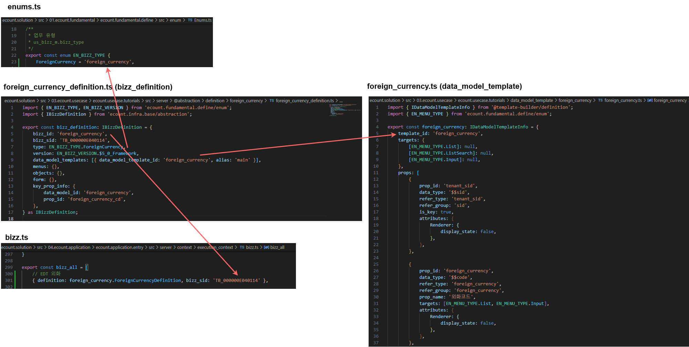
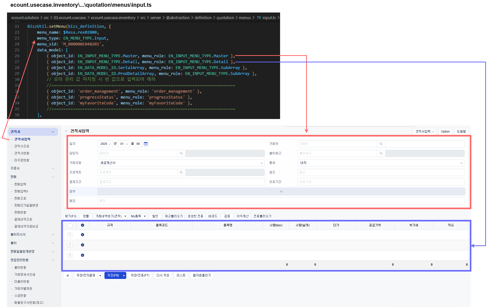

# Daily Retrospective

**작성자**: 나아연

**작성일시**: 2025-01-09

## 1. 오늘 배운 내용 (필수)

'외화(foreign_currency)'라는 업무(bizz)를 추가하는 과정을 실습했다.

**업무 추가 과정**

- `enums.ts`에 업무 유형(EN_BIZZ_TYPE)과 축약 용어(EN_BIZZ_OBJECT_ALT_DATA_MODEL_ID)를 추가한다.

  ```ts
  // ecount.nextv5\ecount.solution\src\01.ecount.fundamental\ecount.fundamental.define\src\enum\Enums.ts

  export const enum EN_BIZZ_TYPE {
  ...
    ForeignCurrency = 'foreign_currency',
  }

  export const enum EN_BIZZ_OBJECT_ALT_DATA_MODEL_ID {
    ...
    foreign_currency = 'foreign_currency',
  }
  ```

- `bizz.ts`에 해당 업무(bizz)는 어떤 명세(definition)를 사용할건지, bizz_sid가 무엇인지 추가한다.

  - bizz_sid은 랜덤생성은 아니고, 사내 컨벤션에 맞춰 직접 할당한다고 한다.
  - `bizz_ts`에 추가하는 이유는 요청을 받았을 때 bizz_sid로부터 필요한 bizz_definition을 찾기 위함이 아닐까 추측한다.
  - 생성했던 `foreign_currency_definition.ts`를 별칭을 추가해 잘 export 해야 한다..

  ```ts
  // index.ts
  export { bizz_definition as ForeignCurrencyDefinition } from './foreign_currency';

  // ecount.nextv5\ecount.solution\src\04.ecount.application\ecount.application.entry\src\server\context\execution_context\bizz.ts
  export const bizz_all = [
    ...,
    { definition: foreign_currency.ForeignCurrencyDefinition, bizz_sid: 'TB_000000E040114' },
  ]
  ```

**data_model_definition 생성 과정**

- ecount.usecase.xxx/data_model_template/foreign_currency/ 하위에 `foregin_currency.ts`를 생성한다.

  - 경로에서 알 수 있듯이 data_model_template을 정의하는 파일이다.
  - IDataModelTemplateInfo 인터페이스에 맞는 객체를 정의한다.
  - templateId는 필수이며 targets, props 등을 선택적으로 정의할 수 있다.
  - data\*model\*id는 data_model_template 파일명과 targets을 조합해서 생성한다. `[template_id]__[target]`
  - data_model_template에서 정의한 IPropRuleDefinition에 attributes가 있다면 이것도 data_model_definition의 Attributes로 만들어준다.

  ```ts
  // data_model_template (foreign_currency.ts)
  	props: [
  		{
  			prop_id: 'foreign_currency',
  			data_type: '$$code',
  			refer_type: 'foreign_currency',
  			refer_group: 'foreign_currency',
  			prop_name: '외화코드',
  			targets: [EN_MENU_TYPE.List, EN_MENU_TYPE.Input],
  			attributes: {
  				Renderer: {
  					display_state: false,
  				},
  			},
  		},
    ...

  // data_model_definition
  	props: [
  		{
  			prop_id: 'foreign_currency',
  			data_type: '$$code',
  			refer_type: 'foreign_currency',
  			prop_name: '외화코드',
  			refer_group: 'foreign_currency',
  		},
    ...
    ],
    attributes: [
  	  { attr_type: EN_ATTR_TYPE.Renderer, attr_id: 'display_state', data: false, prop_id: 'foreign_currency' },
      ...
    ],
  ```

- 빌드로 data_model_template에 맞는 data_model_definition을 생성하기 위해서는 빌드 설정을 추가해야 한다.

  - 매번 해야 하는걸까?..

  ```tsx
  // ecount.nextv5\ecount.solution\src\03.ecount.usecase\@build.config.template.js
  {
        moduleName: 'ecount.usecase.tutorials',
        projectPath: './ecount.usecase.tutorials',
        matches: ['{projectPath}/data_model_template/'],
        entry: '{projectPath}/data_model_template/index.ts'
  },
  ```

**업무/메뉴/object definition 생성 과정**

- 업무 명세(bizz_definition)를 정의한다.

  ```ts
  // ecount.nextv5\ecount.solution\src\03.ecount.usecase\ecount.usecase.tutorials\src\server\@abstraction\definition\foreign_currency\foreign_currency_definition.ts
  export const bizz_definition: IBizzDefinition = {
    bizz_id: "foreign_currency",
    bizz_sid: "TB_000000E040114",
    type: EN_BIZZ_TYPE.ForeignCurrency,
    version: EN_BIZZ_VERSION.$5_0_Framework,
    data_model_templates: [{ data_model_template_id: "foreign_currency", alias: "main" }],
    menus: {},
    objects: {},
    form: {},
    key_prop_info: {
      data_model_id: "foreign_currency",
      prop_id: "foreign_currency_cd",
    },
  } as IBizzDefinition;
  ```

- 메뉴 명세(menu_definition)를 추가한다.

  - 외화 업무 명세(foreign_currency_definition)에 어떤 메뉴를 세팅할지 정의하는 명세다.
  - 아래의 경우 외화를 입력하는 메뉴의 명세다.
  - 입력-input, 조회-list 와 같은 네이밍을 가지는 것 같다.

  ```ts
  // ecount.solution\src\03.ecount.usecase\ecount.usecase.tutorials\src\server\@abstraction\definition\foreign_currency\menu\input.ts

  import { bizz_definition } from "../foreign_currency_definition";

  BizzUtil.setMenu(bizz_definition, {
    menu_sid: "TM_000000E040114",
    menu_name: "외화 입력",
    menu_type: EN_MENU_TYPE.Input,
    data_model: [{ object_id: EN_INPUT_MENU_TYPE.Master, menu_role: EN_INPUT_MENU_TYPE.Master } as IMenuDataModelInfo],
    attributes: [
      {
        prop_id: "",
        attr_id: "api",
        attr_type: EN_ATTR_TYPE.Api,
        data: {
          [EN_ACTION_MODE.Create]: ICreateForeignCurrencyAction,
          ...
        },
      },
    ],
  });
  ```

- object definition을 추가한다.
  - 외화 입력 메뉴는 Create Action에 의해 외화를 생성하겠다고 (ICreateForeignCurrencyMasterProgram) 명세한다.
  ```ts
  BizzUtil.setObject(bizz_definition, {
    object_id: EN_INPUT_MENU_TYPE.Master,
    data_models: [
      {
        data_model_identifier: foreign_currency_input,
        alt_data_model_id: EN_BIZZ_OBJECT_ALT_DATA_MODEL_ID.foreign_currency,
        //target_props
        target_props_options: {
          prop_option: {
            tenant_sid: { is_key: true },
            foreign_currency_cd: { is_key: true },
          } as { [key: string]: IImportTargetPropInfo },
        },
      },
    ],
    attributes: [
      {
        attr_id: definition_attrs.info.data_model_resolver,
        attr_type: EN_ATTR_TYPE.Information,
        data: {
          [EN_ACTION_MODE.Create]: "ICreateForeignCurrencyMasterProgram",
          ...
        } as definition_attrs.info.data_model_resolver,
        prop_id: "",
      },
    ],
  } as IBizzObjectDefinition);
  ```

## 2. 동기에게 도움 받은 내용 (필수)

## 3. 개발 기술적으로 성장한 점 (선택)

### 2. 오늘 직면했던 문제 (개발 환경, 구현)와 해결 방법

오늘 작성했던 definition들이 어디에 적용되는지 코드만 봐서는 이해가 잘 가지 않아 화면을 찾아보며 이해하려고 노력했다.





### 3. 위 두 주제 중 미처 해결 못한 과제. 앞으로 공부해볼 내용.

data_model_template을 빌드했더니 `@shared_usecase_tutorials/` 와 `server/` 하위에 각각 data_model이 생성된 것을 확인했다.

```ts
// ecount.nextv5\ecount.solution\src\03.ecount.usecase\ecount.usecase.tutorials\src\@shared_usecase_tutorials\@abstraction\data_model\foreign_currency\foreign_currency_input.ts

export interface foreign_currency_input {
  tenant_sid?: $$sid;
  foreign_currency?: $$code;
  foreign_currency_cd?: $$txt;
  foreign_currency_nm?: $$txt;
  exchange_rate?: $$decimal;
  category?: $$enum;
  status_type?: $$enum;
}

// ecount.nextv5\ecount.solution\src\03.ecount.usecase\ecount.usecase.tutorials\src\server\@abstraction\data_model\foreign_currency\foreign_currency_input.ts
export const foreign_currency_input = new DataModelIdentifier('foreign_currency_input');

const foreign_currency_input_Definition: IDataModelDefinition = {
	data_model_id: 'foreign_currency_input',
	props: [...],
	attributes: [...],
};
foreign_currency_input.definition = foreign_currency_input_Definition;
```

왜 두개의 data_model이 생기는지 이해하지 못했다.

## 5. 제안하고 싶은 내용

menu와 object를 실제 ecount 화면과 비교하면서 정리했더니 이해가 쉬웠습니다. 서비스 화면과 용어를 함께 설명하는 방법으로 진행하면 다른 내용도 이해에 도움이 되지 않을까 생각합니다.
