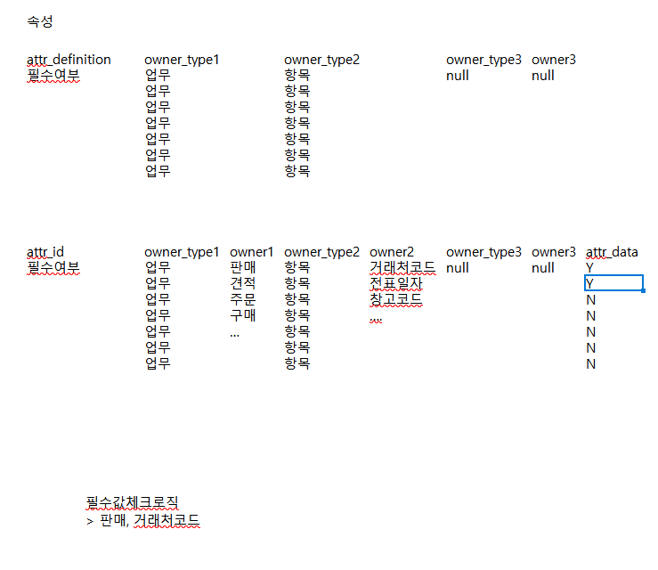
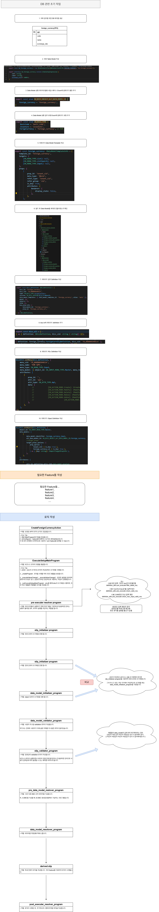

# Daily Retrospective  
**작성자**: [박성재]  
**작성일시**: [2025-01-09]  

## 1. 오늘 배운 내용 (필수)  
- 5.0 프레임워크 용어 및 로직 흐름 Q&A
- Attribute에 대한 이해
- 외화코드 구현 실습
- 비즈니스 로직 흐름 재정리

</br>

## 5.0 프레임워크 용어 및 로직 흐름 Q&A

### 1. Data Model과 Slip Data Model의 차이점
Data Model은 DMC에서 관리하는 데이터이고, Slip Data Model은 SMC에서 관리하는 데이터입니다. Slip Data Model이 Data Model 을 집합으로 들고있으므로, 보통 보다 큰 개념이라고 생각하면 될 것 같습니다.

### 2. Slip이란?
slip은 하나의 전표를 의미한다고 합니다. 

하나의 전표에는 Object들(상단, 하단, 오던관리 등)이 모여있습니다.

### 3. pre_executer_resolver_program Vs slip_initializer_program Vs data_model_initializer_program

#### 3-1. slip_initializer_program
전표 단위의 초기화를 수행합니다. 예를들어 만약에 전표 생성,수정 시간들은 클라이언트에서 입력받을 필요없이
서버에서 만들어줘야하는 데이터들을 초기화하는 프로그램입니다.

#### 3-2. data_model_initializer_program
Object 단위의 초기화를 수행하는 프로그램입니다.

#### 3-3. pre_executer_resolver_program
하위 로직들이 실행되기 전에 프로그램상 고정적으로 발생하면 안되는
상황이 벌어질 경우, 로직의 실행을 차단하는 역할을 합니다.

### 4. pre_data_model_reslover_program Vs data_model_resolover_prog

#### pre_data_model_reslover_program
서로 다른 DMC간의  데이터를 가공하는 역할을합니다. 즉, A dmc를 가공할때, B dmc정보를 활용해서 가공하고 싶을 때 사용할 수 있습니다.

#### data_model_resolover_program
데이터를 저장하는 등, 직접 DB에 액세스하는 로직을 수행합니다.

### 5. slip_validator는 사용자 설정에 따라 로직이 동적으로 변하는경우도 있는걸까?
네 있습니다. `data_model`의 값에 따라 체크해야되는 경우가 있습니다. 예를들어, 상단의 어떤 값과 하단의 어떤 값이 일치해야하는 경우, 혹은 하단의 어떤값과 하단의 어떤값2는 반드시 일치해야하는 경우는 사용자 설정에 따라 `data_model`들을 비교해서 `validation` 체크를 수행해야합니다. 이럴때는 로직이 동적으로 변한다고 할 수 있습니다.

</br>

## Attribute에 대한 이해
오늘 현철님께서 Attribute가 무엇인지 개념에 대해서 설명해주셨습니다. 해당 설명을 듣고 이해한 내용을 정리해보겠습니다.


`Attribute`란 기획에서는 **"속성"** 이라고 표현하며, 하나의 로직이 수행될 때 사용자가 설정한 설정 또는 요청에 따라 어떻게 로직이 돌아야되는지 결정해주는 놈이라고 할 수 있습니다.

```typescript
attributes: [
		{
			attr_id: definition_attrs.info.copy_initialize_info,
			attr_type: EN_ATTR_TYPE.Information,
			prop_id: '',
			data: {
				//runtime에 결정되는 값들
				initial_target: ['data_dt', 'no_001'],
				//copy에서 reset 되는 항목
				reset_undefined: [
					'data_sid',
					'record_sid',
					'repo_sid',
					'trx_conn_sid',
					'writer',
					'write_sid',
					'write_dtm',
					'writer_nm',
					'updater',
					'update_dtm',
					'update_sid',
					'updater_nm',
					'data_no',
					'data_dt_no',
					'confirm_type',
					'progress_status',
					'progress_status_sid',
					'hid',
				],
				// 지정된 값으로 초기화 되는 항목
				reset_defined: {
					slip_link: {
						attached_list: [],
					},
					version_no: 0,
					fax_send_tf: false, // checkEID dev.102545
					mail_send_tf: false,
					data_input_type: EN_DATA_INPUT_TYPE.Web,
				},
			} as definition_attrs.info.copy_initialize_info,
		},
        // ...
]
```

예를들어 필수값 체크 로직이 돌게될 때, 업무는 `판매`이며, 대상 항목은 `거래처코드` 등등의 사용자 요청 정보들이 있을 것입니다. 해당 요청 정보들에 해당될 때 어떠한 값으로 대상값을 결정해서 로직을 돌 것인지 항상 이 `attribute`에게 물어보게됩니다.

그럼 `attribute`는 주어진 사용자 요청 정보들과 owner가 누구인지에 따라 자신이 가진 `data`를 선별해서 알려주게 됩니다. 그럼 로직을 돌던 주체는 `attribute`를 통해 로직을 도는데 필요한 `data`를 얻게되고, 그에 따라 로직이 분기되어 처리되게 되는 것입니다.

최종적으로는 이 `Attribute`가 코드에서는 모두 사라질 계획이며, `Attribute` 정보를 DB에 저장해놓고 상황에 따라 로직이 알아서 돌게끔하는 것이 앞으로의 목표라고 이해했습니다.

</br>

## 외화코드 구현 실습
드디어 우리가 직접 코드를 작성하는 실습을 하게되었습니다. 가장 간단한 `외화코드` 업무를 기준으로 실습을 진행했습니다. 로직을 작성하기 전 `Definition`을 정의하는 단계까지 간단하게 실습해보았습니다.

```typescript
```

### 1. Data Model 공통 데이터모델ID 네임스페이스 Enum에 원화코드 별칭 추가
```typescript
export const enum EN_BIZZ_OBJECT_ALT_DATA_MODEL_ID {
	none = '',
	inventory_single = 'inv_s',
	inventory_multi = 'inv_m',
    // ...
    // 튜토리얼
	foreign_currency = 'foreign_currency',
}
```

### 2. Data Model 공통 업무 유형 Enum에 원화코드 유형 추가
```typescript
export const enum EN_BIZZ_TYPE {
	BasicCode = 'basic_code',
	Inventory = 'inventory',
    // ...
    // 튜토리얼
	ForignCurrency = 'foreign_currency', // 외화
}
```

### 3. bizz.ts에 외화코드 definition 추가
```typescript
export const bizz_all = [
	// 기타
	{ definition: slip_relation.slipRelationBizzDefinition, bizz_sid: 'slip_relation' },
    // ...
    { definition: foreign_currency.ForeignCurrencyDefinition, bizz_sid: 'TB_000000E040114' },
]
```

### 4. 외화코드 Data Model Template 작성
```typescript
import { IDataModelTemplateInfo } from '@template-builder/definition';
import { EN_CUST_TYPE, EN_EXECUTE_CALLER_TYPE, EN_MENU_TYPE, EN_VIEW_TYPE } from 'ecount.fundamental.define/enum';

export const foreign_currency: IDataModelTemplateInfo = {
	template_id: 'foreign_currency',
	targets: {
		[EN_MENU_TYPE.List]: null,
		[EN_MENU_TYPE.ListSearch]: null,
		[EN_MENU_TYPE.Input]: null,
	},
	props: [
		{
			prop_id: 'tenant_sid',
			data_type: '$$sid',
			refer_type: 'tenant_sid',
			refer_group: 'sid',
			is_key: true,
			attributes: {
				Renderer: {
					display_state: false,
				},
			},
		},

		{
            // ...
        }
    ]
}
```

### 6. 빌드를 위한 tsconfig.json 파일 추가
```typescript
{
	"extends": "D:/ecxsolution/ecount.nextv5/@env/ecountv5/Env/dev/typescript/tsconfig/tsconfig.datamodel.template.json",
	"compilerOptions": {
		"outDir": "D:/ecxsolution/ecount.nextv5/ecount.solution/src/04.ecount.application/template-builder/modules/template/ecount.usecase.tutorials"
	}
}
```

### 7. 업무 Definition 작성
```typescript
import { EN_BIZZ_TYPE, EN_BIZZ_VERSION } from 'ecount.fundamental.define/enum';
import { IBizzDefinition } from 'ecount.infra.base/abstraction';

export const bizz_definition: IBizzDefinition = {
	bizz_id: 'foreign_currency',
	bizz_sid: 'TB_000000E040114',
	type: EN_BIZZ_TYPE.ForignCurrency,
	version: EN_BIZZ_VERSION.$5_0_Framework,
	data_model_templates: [{ data_model_template_id: 'foreign_currency', alias: 'main' }],
	menus: {},
	objects: {},
	form: {},
	key_prop_info: {
		data_model_id: 'foreign_currency',
		prop_id: 'foreign_currency_cd',
	},
} as IBizzDefinition;
```

### 8. 메뉴 Definition 작성
```typescript
// input.ts
import { EN_ACTION_MODE, EN_ATTR_TYPE, EN_INPUT_MENU_TYPE, EN_MENU_TYPE } from 'ecount.fundamental.define/enum';
import { BizzUtil, IMenuDataModelInfo } from 'ecount.infra.base/abstraction';
import { bizz_definition } from '../foreign_currency_definition';

BizzUtil.setMenu(bizz_definition, {
	menu_sid: 'TM_000000E040114',
	menu_name: '외화 입력',
	menu_type: EN_MENU_TYPE.Input,
	data_model: [{ object_id: EN_INPUT_MENU_TYPE.Master, menu_role: EN_INPUT_MENU_TYPE.Master } as IMenuDataModelInfo],
	attributes: [
		{
			prop_id: '',
			attr_id: 'api',
			attr_type: EN_ATTR_TYPE.Api,
			data: {
				//				[EN_ACTION_MODE.Create]: ICreateForeignCurrencyAction,
				//				[EN_ACTION_MODE.Modify]: IModifyForeignCurrencyAction,
				//				[EN_ACTION_MODE.Delete]: IModifyStatusForeignCurrencyAction,
				//				[EN_ACTION_MODE.ReUse]: IModifyStatusForeignCurrencyAction,
				//				[EN_ACTION_MODE.UnUse]: IModifyStatusForeignCurrencyAction,
				//                              [EN_ACTION_MODE.UnDelete]: IRemoveForeignCurrencyAction,
			},
		},
	],
});

// list.ts
// ...
```

### 8. Object Definition 작성
```typescript
// master.ts
import { BizzUtil, IBizzObjectDefinition, IImportTargetPropInfo } from 'ecount.infra.base/abstraction';
import { bizz_definition } from '../foreign_currency_definition';
import {
	EN_ACTION_MODE,
	EN_ATTR_TYPE,
	EN_BIZZ_OBJECT_ALT_DATA_MODEL_ID,
	EN_INPUT_MENU_TYPE,
} from 'ecount.fundamental.define/enum';
import { foreign_currency_input } from './../../../data_model';
import { definition_attrs } from 'ecount.usecase.base/@abstraction';

BizzUtil.setObject(bizz_definition, {
	object_id: EN_INPUT_MENU_TYPE.Master,
	data_models: [
		{
			data_model_identifier: foreign_currency_input,
			alt_data_model_id: EN_BIZZ_OBJECT_ALT_DATA_MODEL_ID.foreign_currency,
			//target_props
			target_props_options: {
				prop_option: {
					tenant_sid: { is_key: true },
					foreign_currency_cd: { is_key: true },
				} as { [key: string]: IImportTargetPropInfo },
			},
		},
	],
	attributes: [
		{
			attr_id: definition_attrs.info.data_model_resolver,
			attr_type: EN_ATTR_TYPE.Information,
			data: {
				//				[EN_ACTION_MODE.Create]: 'ICreateForeignCurrencyMasterProgram',
				//				[EN_ACTION_MODE.Modify]: 'IModifyForeignCurrencyMasterProgram',
				//				[EN_ACTION_MODE.Delete]: 'IModifyStatusForeignCurrencyMasterProgram',
				//				[EN_ACTION_MODE.UnDelete]: 'IModifyStatusForeignCurrencyMasterProgram',
				//				[EN_ACTION_MODE.Remove]: 'IDeleteForeignCurrencyMasterProgram',
			} as definition_attrs.info.data_model_resolver,
			prop_id: '',
		},
	],
} as IBizzObjectDefinition);

// list.ts
// ...
```

### 느낀 점
직접 그래도 실습을 해보니 이전보다 5.0의 개념들과 프레임워크에 대해 친숙해질 수 있는 시간이었습니다. 큰 그림만 알았다면 구현을 위해 보다 세부적인 과정을 느껴볼 수 있었습니다.

</br>

## 비즈니스 로직 흐름 재정리
저번부터 간략하게 정리해왔던 비즈니스 로직의 흐름을 `외화코드` 업무를 기준으로 좀 더 내용을 채워 다시한번 정리해봤습니다.



</br>

## 2. 동기에게 도움 받은 내용 (필수)

#### 최현철 선임
Attribute가 그래서 무엇인지 계속 이해가 안되었는데, 현철님이 기획에서 Attribute가 어떻게 정의되는지와 곁들여서 함께 설명해주셔서 이해에 많은 도움이 되었습니다.

#### 김도형 선임
Attribute에 대해서 현철님이 설명해주시고나서, Owner에 대한 정보는 왜 Attribute에 없는지 의문이었는데 resolver와 함께 도형님의 생각을 말씀해주셔서 도움이 되었습니다.

#### 김민준 선임
로직의 큰 흐름에 대해 제가 별도로 정리한 내용들을 보며, 민준님의 생각들을 말씀해주셨는데 덕분에 한번 더 흐름을 정리할 수 있는 기회가 되어 좋았습니다.

---

## 3. 개발 기술적으로 성장한 점 (선택)

### 2. 5.0 프레임워크 코드에서 겪은 import, export 이슈

실습으로 진행된 외화 코드의 로직을을 구현하면서, `bizz.ts`에 작성했던 `foreign_currency_definition`을 추가하는 과정에서 인식이 안되는 문제가 생겼습니다.

```typescript
import { foreign_currency } from 'ecount.usecase.tutorials/@abstraction';
```

다양한 시도를 해보았는데, 위 `import` 문에서 `foreign_currency`를 찾을 수 없거나 `from`절에 `Not Allowed 2Depth More`이라는 에러가 발생하고 있었습니다.

저는 Js에서 모듈을 `import`하고 `export`하는 방법에 대한 이해가 부족하다고 생각하여 공부하였고 크게 2가지 원인을 찾을 수 있었습니다.

### 원인 1. 중첩 export에 대한 이해 부족
Javascript 에서는 `export`를 통해 모듈을 외부로 반환할 때, `from`절을 통해 해당 경로에서 반환된 `export` 결과물을 그대로 받아 이어서 반환할 수 있습니다. 이 때 5.0에서는 모듈 관리를 `index.ts`라는 파일을 통해서 하고 있었고 디렉토리 depth에 마다 해당 `index.ts`가 존재해야 부모/자식 관계처럼 `depth`를 이어나갈 수 있게 됩니다.

하지만 저는 이에 대한 이해가 부족하여, 내부 디렉토리의 `index.ts`에만 `export`문을 선언하여 외부 `index.ts`에서 이어받아서 외부로 노출시키는 것을 가능하도록 해주지 못하고 있었습니다.

### 원인 2. 5.0의 import 규칙(ESlint)에 대한 이해 부족
이카운트에서는 `EXlint`를 통해 `import` 작성 규칙 및 참조 규칙을 정의하고 있었습니다. 해당 규칙을 어기면 컴파일 에러가 발생하는데, 규칙들 중 **절대 경로인 경우 2 depth까지만 허용**한다는 규칙이 존재했습니다. 

해당 규칙이 존재하는 문서 자체를 제대로 읽지 않아 이해도가 부족한 상태였고 자연스럽게 문제를 맞닥뜨릴수 밖에 없는 상황이었던 것입니다.

### 해결
위 두 정보를 얻고나서, 적용해보니 원하는대로 `import`와 `export`를 작성하여 성공적으로 외부에 노출시키고 참조할 수 있었습니다. 앞으로는 메뉴얼이나 문서를 좀 더 꼼꼼히 읽어봐야겠다는 생각을 하였습니다.

---

## 4. 소프트 스킬면에서 성장한 점  (선택)  
오늘은 다른 동기분들을 신경쓰기 보다는 상대적으로 저 자신의 공부에 집중을 많이 한 하루였습니다. 생각보다 다른 날보다 공부 효율이 많이 높았던 하루라고 느꼈으며, 아무래도 아직은 이런 시간이 저에게 많이 필요하구나라는걸 느꼈습니다.

스스로 부족한 부분을 많이 채워나가는 시간을 앞으로 많이 가져야겠다고 느꼈습니다.

---


