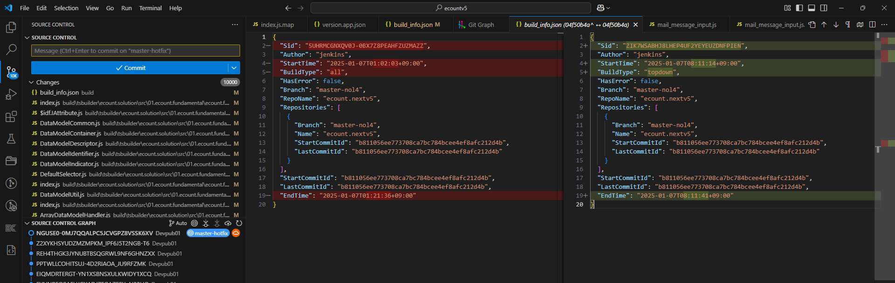
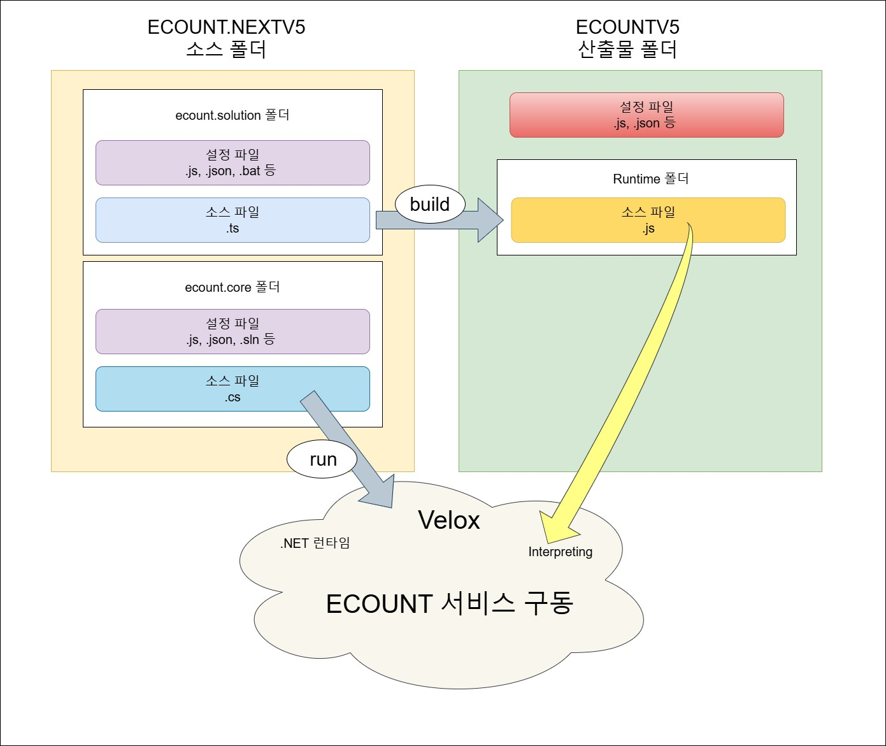

# Daily Retrospective

**작성자**: [박주현]  
**작성일시**: [2025-01-09]

# 1. 오늘 배운 내용

## 1️⃣ 외화코드를 예시로 실제 설정을 구현해 보았습니다.

### (1) 01프로젝트에서 ENUM 등록

```ts
export const enum EN_BIZZ_OBJECT_ALT_DATA_MODEL_ID {
  foreign_currency = "foreign_currency",
}
```

```ts
export const enum EN_BIZZ_TYPE {
  ForeignCurrency = "foreign_currency",
}
```

새롭게 업무 성격을 등록해주기 위해 foreign_currency 를 Enum 에 등록해줍니다.

### (2) 외화코드 data_model_template

```ts
import { IDataModelTemplateInfo } from "@template-builder/definition";
import {
  EN_CUST_TYPE,
  EN_EXECUTE_CALLER_TYPE,
  EN_MENU_TYPE,
  EN_VIEW_TYPE,
} from "ecount.fundamental.define/enum";

export const foreign_currency: IDataModelTemplateInfo = {
  template_id: "foreign_currency",
  targets: {
    [EN_MENU_TYPE.List]: null,
    [EN_MENU_TYPE.ListSearch]: null,
    [EN_MENU_TYPE.Input]: null,
  },
  props: [
    {
      prop_id: "tenant_sid",
      data_type: "$$sid",
      refer_type: "tenant_sid",
      refer_group: "sid",
      is_key: true,
      attributes: {
        Renderer: {
          display_state: false,
        },
      },
    },

    {
      prop_id: "foreign_currency",
      data_type: "$$code",
      refer_type: "foreign_currency",
      refer_group: "foreign_currency",
      prop_name: "외화코드",
      targets: [EN_MENU_TYPE.List, EN_MENU_TYPE.Input],
      attributes: {
        Renderer: {
          display_state: false,
        },
      },
    },
    {
      prop_id: "foreign_currency_cd",
      data_type: "$$txt",
      refer_type: "foreign_currency_cd",
      refer_group: "foreign_currency",
      prop_name: "외화코드",
      targets: [EN_MENU_TYPE.List, EN_MENU_TYPE.Input],
    },
    {
      prop_id: "foreign_currency_nm",
      data_type: "$$txt",
      refer_type: "foreign_currency_nm",
      refer_group: "foreign_currency",
      prop_name: "외화명",
      targets: [EN_MENU_TYPE.List, EN_MENU_TYPE.Input],
    },
    {
      prop_id: "exchange_rate",
      data_type: "$$decimal",
      refer_type: "exchange_rate",
      refer_group: "exchange_rate",
      prop_name: "환율",
      targets: [EN_MENU_TYPE.List, EN_MENU_TYPE.Input],
    },
    {
      prop_id: "category",
      data_type: "$$enum",
      refer_type: "category",
      refer_group: "category",
      prop_name: "카테고리",
      targets: [EN_MENU_TYPE.Input],
    },
    {
      prop_id: "category",
      data_type: "$$txt",
      refer_type: "category",
      refer_group: "category",
      prop_name: "카테고리",
      targets: [EN_MENU_TYPE.List],
    },
    {
      prop_id: "status_type",
      prop_name_code: "사용구분",
      prop_name: "사용구분",
      data_type: "$$enum",
      refer_type: "status_type",
      refer_group: "status_type",
      is_mandatory: true,
      targets: [EN_MENU_TYPE.List, EN_MENU_TYPE.Input],
    },
  ],
};
```

업무 성격을 기초코드나 다른 업무성격으로 하지 않고, 외화코드가 최상위 개념으로서 업무성격까지 나타나게끔 했습니다. 즉, "업무 성격"과 "업무" 가 외화 코드로 같습니다.
외화코드 조회(리스트), 저장(input)의 상단 항목들이 전부 기입되어 있습니다. 외화코드는 하단이 없기 때문에 명명을 `foreign_currency_single.ts` 이 아닌 `foreign_currency.ts`로 하였습니다.

### (2) foreign_currency_definition

```ts
import { EN_BIZZ_TYPE, EN_BIZZ_VERSION } from "ecount.fundamental.define/enum";
import { IBizzDefinition } from "ecount.infra.base/abstraction";

export const bizz_definition: IBizzDefinition = {
  bizz_id: "foreign_currency",
  bizz_sid: "TB_000000E040114",
  type: EN_BIZZ_TYPE.ForeignCurrency,
  version: EN_BIZZ_VERSION.$5_0_Framework,
  data_model_templates: [
    { data_model_template_id: "foreign_currency", alias: "main" },
  ],
  menus: {},
  objects: {},
  form: {},
  key_prop_info: {
    data_model_id: "foreign_currency",
    prop_id: "foreign_currency_cd",
  },
} as IBizzDefinition;
```

data_model_template 을 기반으로 foreign_currency 의 업무 definition 을 생성합니다.
`data_model_template` 을 빌드하면 자동으로 등록해둔 메뉴의 data_model 을생성해 줍니다.

**e.g.**

### foreign_currency_input_Definition

```ts
/**
 * NOTE:
 *   This file is generated by "data model template" and modifying it directly is not allowed.
 */

import {
  IDataModelDefinition,
  DataModelIdentifier,
} from "ecount.fundamental.datamodel/definition";
import { EN_ATTR_TYPE } from "ecount.fundamental.define/enum";

export const foreign_currency_input = new DataModelIdentifier(
  "foreign_currency_input"
);

const foreign_currency_input_Definition: IDataModelDefinition = {
  data_model_id: "foreign_currency_input",
  props: [
    {
      prop_id: "tenant_sid",
      data_type: "$$sid",
      refer_type: "tenant_sid",
      is_key: true,
      refer_group: "sid",
    },
    {
      prop_id: "foreign_currency",
      data_type: "$$code",
      refer_type: "foreign_currency",
      prop_name: "외화코드",
      refer_group: "foreign_currency",
    },
    {
      prop_id: "foreign_currency_cd",
      data_type: "$$txt",
      refer_type: "foreign_currency_cd",
      prop_name: "외화코드",
      refer_group: "foreign_currency",
    },
    {
      prop_id: "foreign_currency_nm",
      data_type: "$$txt",
      refer_type: "foreign_currency_nm",
      prop_name: "외화명",
      refer_group: "foreign_currency",
    },
    {
      prop_id: "exchange_rate",
      data_type: "$$decimal",
      refer_type: "exchange_rate",
      prop_name: "환율",
      refer_group: "exchange_rate",
    },
    {
      prop_id: "category",
      data_type: "$$enum",
      refer_type: "category",
      prop_name: "카테고리",
      refer_group: "category",
    },
    {
      prop_id: "status_type",
      data_type: "$$enum",
      refer_type: "status_type",
      prop_name: "사용구분",
      prop_name_code: "사용구분",
      is_mandatory: true,
      refer_group: "status_type",
    },
  ],
  attributes: [
    {
      attr_type: EN_ATTR_TYPE.Renderer,
      attr_id: "display_state",
      data: false,
      prop_id: "tenant_sid",
    },
    {
      attr_type: EN_ATTR_TYPE.Renderer,
      attr_id: "display_state",
      data: false,
      prop_id: "foreign_currency",
    },
  ],
};
foreign_currency_input.definition = foreign_currency_input_Definition;
```

### foreign_currency_list_search

```ts
/**
 * NOTE:
 *   This file is generated by "data model template" and modifying it directly is not allowed.
 */

import {
  IDataModelDefinition,
  DataModelIdentifier,
} from "ecount.fundamental.datamodel/definition";
import { EN_ATTR_TYPE } from "ecount.fundamental.define/enum";

export const foreign_currency_list_search = new DataModelIdentifier(
  "foreign_currency_list_search"
);

const foreign_currency_list_search_Definition: IDataModelDefinition = {
  data_model_id: "foreign_currency_list_search",
  props: [
    {
      prop_id: "tenant_sid",
      data_type: "$$sid",
      refer_type: "tenant_sid",
      is_key: true,
      refer_group: "sid",
    },
  ],
  attributes: [
    {
      attr_type: EN_ATTR_TYPE.Renderer,
      attr_id: "display_state",
      data: false,
      prop_id: "tenant_sid",
    },
  ],
};
foreign_currency_list_search.definition =
  foreign_currency_list_search_Definition;
```

### foreign_currency_list_Definition

```ts
/**
 * NOTE:
 *   This file is generated by "data model template" and modifying it directly is not allowed.
 */

import {
  IDataModelDefinition,
  DataModelIdentifier,
} from "ecount.fundamental.datamodel/definition";
import { EN_ATTR_TYPE } from "ecount.fundamental.define/enum";

export const foreign_currency_list = new DataModelIdentifier(
  "foreign_currency_list"
);

const foreign_currency_list_Definition: IDataModelDefinition = {
  data_model_id: "foreign_currency_list",
  props: [
    {
      prop_id: "tenant_sid",
      data_type: "$$sid",
      refer_type: "tenant_sid",
      is_key: true,
      refer_group: "sid",
    },
    {
      prop_id: "foreign_currency",
      data_type: "$$code",
      refer_type: "foreign_currency",
      prop_name: "외화코드",
      refer_group: "foreign_currency",
    },
    {
      prop_id: "foreign_currency_cd",
      data_type: "$$txt",
      refer_type: "foreign_currency_cd",
      prop_name: "외화코드",
      refer_group: "foreign_currency",
    },
    {
      prop_id: "foreign_currency_nm",
      data_type: "$$txt",
      refer_type: "foreign_currency_nm",
      prop_name: "외화명",
      refer_group: "foreign_currency",
    },
    {
      prop_id: "exchange_rate",
      data_type: "$$decimal",
      refer_type: "exchange_rate",
      prop_name: "환율",
      refer_group: "exchange_rate",
    },
    {
      prop_id: "category",
      data_type: "$$txt",
      refer_type: "category",
      prop_name: "카테고리",
      refer_group: "category",
    },
    {
      prop_id: "status_type",
      data_type: "$$enum",
      refer_type: "status_type",
      prop_name: "사용구분",
      prop_name_code: "사용구분",
      is_mandatory: true,
      refer_group: "status_type",
    },
  ],
  attributes: [
    {
      attr_type: EN_ATTR_TYPE.Renderer,
      attr_id: "display_state",
      data: false,
      prop_id: "tenant_sid",
    },
    {
      attr_type: EN_ATTR_TYPE.Renderer,
      attr_id: "display_state",
      data: false,
      prop_id: "foreign_currency",
    },
  ],
};
foreign_currency_list.definition = foreign_currency_list_Definition;
```

### 메뉴 definition

```ts
import {
  EN_MENU_INFO_TYPE,
  EN_MENU_TYPE,
} from "ecount.fundamental.define/enum";
import { BizzUtil, IMenuDataModelInfo } from "ecount.infra.base/abstraction";
import { bizz_definition } from "../foreign_currency_definition";

BizzUtil.setMenu(bizz_definition, {
  menu_sid: "TM_000000E040111",
  menu_name: "외화 조회",
  menu_type: EN_MENU_TYPE.List,
  data_model: [
    {
      object_id: EN_MENU_TYPE.List,
      menu_role: EN_MENU_INFO_TYPE.List,
    } as IMenuDataModelInfo,
  ],
});
```

### Object 생성

```ts
import {
  BizzUtil,
  IBizzObjectDefinition,
  IImportTargetPropInfo,
} from "ecount.infra.base/abstraction";
import { bizz_definition } from "../foreign_currency_definition";
import {
  EN_ACTION_MODE,
  EN_ATTR_TYPE,
  EN_BIZZ_OBJECT_ALT_DATA_MODEL_ID,
  EN_MENU_TYPE,
} from "ecount.fundamental.define/enum";
import { foreign_currency_list } from "./../../../data_model";
import { definition_attrs } from "ecount.usecase.base/@abstraction";

BizzUtil.setObject(bizz_definition, {
  object_id: EN_MENU_TYPE.List,
  data_models: [
    {
      data_model_identifier: foreign_currency_list,
      alt_data_model_id: EN_BIZZ_OBJECT_ALT_DATA_MODEL_ID.foreign_currency,
      target_props_options: {
        prop_option: {
          tenant_sid: { is_key: true },
          foreign_currency_cd: { is_key: true },
        } as { [key: string]: IImportTargetPropInfo },
      },
    },
  ],
  attributes: [{}],
} as IBizzObjectDefinition);
```

```ts
import {
  BizzUtil,
  IBizzObjectDefinition,
  IImportTargetPropInfo,
} from "ecount.infra.base/abstraction";
import { bizz_definition } from "../foreign_currency_definition";
import {
  EN_ACTION_MODE,
  EN_ATTR_TYPE,
  EN_BIZZ_OBJECT_ALT_DATA_MODEL_ID,
  EN_INPUT_MENU_TYPE,
} from "ecount.fundamental.define/enum";
import { foreign_currency_input } from "./../../../data_model";
import { definition_attrs } from "ecount.usecase.base/@abstraction";

BizzUtil.setObject(bizz_definition, {
  object_id: EN_INPUT_MENU_TYPE.Master,
  data_models: [
    {
      data_model_identifier: foreign_currency_input,
      alt_data_model_id: EN_BIZZ_OBJECT_ALT_DATA_MODEL_ID.foreign_currency,
      //target_props
      target_props_options: {
        prop_option: {
          tenant_sid: { is_key: true },
          foreign_currency_cd: { is_key: true },
        } as { [key: string]: IImportTargetPropInfo },
      },
    },
  ],
  attributes: [
    {
      attr_id: definition_attrs.info.data_model_resolver,
      attr_type: EN_ATTR_TYPE.Information,
      data: {
        //				[EN_ACTION_MODE.Create]: 'ICreateForeignCurrencyMasterProgram',
        //				[EN_ACTION_MODE.Modify]: 'IModifyForeignCurrencyMasterProgram',
        //				[EN_ACTION_MODE.Delete]: 'IModifyStatusForeignCurrencyMasterProgram',
        //				[EN_ACTION_MODE.UnDelete]: 'IModifyStatusForeignCurrencyMasterProgram',
        //				[EN_ACTION_MODE.Remove]: 'IDeleteForeignCurrencyMasterProgram',
      } as definition_attrs.info.data_model_resolver,
      prop_id: "",
    },
  ],
} as IBizzObjectDefinition);
```

오늘은 UI 에서 보여지기 위한 항목 설정 셋팅들을 했고, 어제 배운 개념들을 소스코드적으로 살펴보았습니다.

# 2. 동기에게 도움 받은 내용

성범 책임님께 5.0외에 이카운트 관련된 내용들을 많이 배웠습니다. 현철님과 성철님께 서비스와 이카운트 역사에 대해 배웠습니다. 건호님, 승준님, 민준님, 강민님, 아연님, 수경님과 폴더 구조와 깃 관련하여 이야기를 나누면 이해를 높였습니다. 주원님, 도형님, 연아님, 성재님 등 많이 분들에게 오늘 파일 생성하며 5.0에 대해 함께 문제를 해결했습니다.

---

# 3. 개발 기술적으로 성장한 점

## 3-2. 오늘 직면했던 문제 (개발 환경, 구현)와 해결 방법

외화코드 data_model_template 를 만들고 빌드를 하였는데, 메뉴에 따른 data_model 이 만들어 지지 않았습니다.

```ts
export * as foreign_currency from "./definition/foreign_currency";
```

index.ts 에 경로를 추가 하지 않아서 그랬습니다. 소스 코드 파일만 index 에 추가하는 줄 알았는데, 디렉토리 경로 또한 index 에 추가 해주어야했습니다.
해당 경로를 읽고 파일을 만드는 것이라 생각했습니다.

## 3-3. 위 미처 해결 못한 과제. 앞으로 공부해볼 내용

브랜치를 통일화 하기 위해 오늘 모두 최신 master-hotfix 브랜치를 자신의 브랜치에 rebase 하는 작업을 가졌습니다. 소스 폴더를 빌드하면 변경 내용들이 산출물 폴더에 반영이 됩니다. 따라서 전 소스코드를 최신화 시키고, 빌드하여 산출물 내용 또한 최신화할 생각을 했습니다.

하지만 동기들은 산출물 폴더 또한 rebase 하여 최신화를 하고 있었습니다. 저는 해당 방식이
잘못된 방식이라 생각하고 성준 팀장님께 여쭤봤습니다.

```
Q.
안녕하세요, 팀장님! 여쭤볼게 있습니다. 저희 서비스가 지금 v5 개발폴더와 산출물 폴더 두개가 있는데, 전 v5 폴더만 최신작업을 하고, 빌드를 하면 산출물 폴더에도 반영이 되어 최신화가 된다고 생각하는데, 다른 분들 중엔 산출물 폴더도 rebase 하신 분들이 계셨습니다.

제가 잘못 알고 있는 걸까요? 이카운트 아침 업무로 rebase 작업은 두 폴더 모두 하는 걸까요? 아니면 v5 만 rebase 하고 빌드해서 산출물도 최신 반영을 하는 걸까요?

A.
산출물은 최신 branch를 사용하고, 내 수정내역만 빌드해서 최신 산출물위에 적용하는 방식으로 해요. 원래 내 산출물과 최신산출물을 rebase, 병합 하면 번거로워요

Q.2
산출물은 최신 branch를 사용하라는 말씀이 PULL 받아오라는 말씀인가요? 아니면 V5 의 REBASE로 최신으로 된 브랜치를 빌드하면 최신 브랜치가 된다는 말씀인가요?

A.2
1. 산출물은 항상 최신을 사용한다.
(master-hotfix)

2. 소스 branch 최신내역을 리베이스하고, 내가 수정한 내역만 빌드한다.

3. 최신반영 + 수정내역이 적용된 소스가 산출물로 만들어진다.

Q.3
아하 최신 브랜치라는게 마스터-핫픽스를 이용하라는 말씀이군요. 저희는 브랜치가 같아야 한다고 생각을 해서 지금 V5에 EDT/JJJ/123 이라고 만들었으면 산출물 폴더에도 브랜치를 똑같이 EDT/JJJ/123 을 만들어야 벨록스 RUN 이되는 줄 알았습니다.

A.3
그렇지 않습니다~
편의상  산출물명을 같이 만들어서 관리는 하고 있고,

배포프로그램을 통해 빌드를 수행할수 있는데 그때는 이름이 동일해야됩니다.
```

성준 팀장님 말씀에 의하여 제가 이해한 방식이 맞습니다. 하지만 이건 틀린 방법이었습니다. 그리고 결과적으로 산출물 폴더를 최신 브랜치를 rebase 한 분들이 맞았습니다. 이유는 다음과 같습니다.

소스 코드를 최신화시키고 빌드하면 산출물에 반영됩니다. 하지만 빌드가 되지 않았습니다. 산출물 폴더에는 아래 그림의 빨간 박스와 같이 설정 파일들이 있는데, 25년도가 되고, 큰 업데이트가 되면서 설정파일이 바뀌어 빌드가 되지 않는 것이였습니다.

**변경된 설정 파일**



성범 책임님께선 산출물 폴더에도 가끔 변경점이 생겨 rebase 하는게 낫다고 하셨습니다. 설정 파일의 sid 설정과 같은 내용들이 변경됐기 때문에 최신 커밋으로 받아와야했습니다. 성범 책임님을 비롯하여 다른 분들과 함께 모두의 문제를 해결했습니다.



이해를 높이면서 한 동기 분이 질문을 하셨습니다. "왜 산출물 폴더로 따로 관리하지? 한 폴더 내에서 관리하면 안되나?"
다음 질문에 전 이렇게 생각하여 답변했습니다.

1. ts 를 변경할 때마다 무수히 많은 js 파일들이 생기고 이것은 각각 변경사항이 됩니다. 많은 변경사항이 있기에 산출물 폴더에서 기록을 지울 때도 20000 변경사항을 지워야하고 그랬습니다. 이렇게 하나의 폴더에 함께 두면 프로젝트가 매우매우 무거워지고, 개발효율에 영향을 준다고 생각했습니다.

2. 개발과 결과물을 분리하면서 벨록스가 인터프리팅해야하는 영역을 확실하게 지정해주고 각가의 폴더의 역할과 책임을 확실하게 할 수 있습니다.

위 그림으로 이카운트 서비스가 로컬에서 실행되는지도 궁금증이 남았습니다.

---

# 4. 소프트 스킬면에서 성장한 점

많은 분들께 더 도움을 줄 수 있도록 성장했습니다.

---
