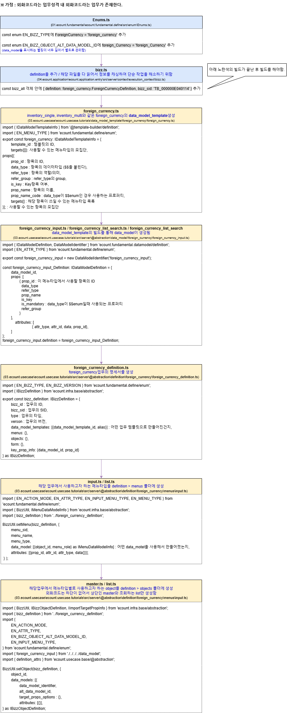

# Daily Retrospective

**작성자**: [설다은]  
**작성일시**: [2025-01-09]

## 1. 오늘 배운 내용 (필수)

 
오늘은 외화코드를 실제로 구현하는 시간을 가졌다. 
비즈니스로직을 구현하기 전 업무를 만들고 data_model_template을 통해 data_model을 만들고 업무에 필요한 menus와 objects를 추가하는 작업을 했다. 
아직 각 파일안에 있는 프로퍼티들이 뭔지 제대로 알지는 못하지만, 이런것들이 들어가는구나~하는 흐름과 틀 정도는 익숙해지는시간이었다. 

## 2. 동기에게 도움 받은 내용 (필수)

**지은님, 연아님** 
rebase를 한 후 산출물과 버전이 달라서 build할 때 오류가 났어야하는데 나지 않았다. rebase가 제대로 안된 것 같다며 같이 도와주셨다.

## 3. 개발 기술적으로 성장한 점 (선택)

아래의 3가지 주제 중 하나를 선택하여 작성합니다.

### 1. 교육 과정 상 배운 내용이 아닌 개인적 호기심을 해결하기 위해 추가 공부한 내용

rebase를 하다가 오류가 났을 때 지은님이 도와주면서 stash관련 명령어를 썻다. 이게 어떤 개념인지를 공부해봤다.

`stash`

- 변경사항을 이시적으로 저장하는 기능
- 아직 커밋하기엔 이른 경우나 다른 브랜치로 체크아웃할 때 변경사항을 유지하고 싶을 때
- 변경사항을 일시적으로 저장하고 나중에 다시 사용할 수 있도록

<git stash 관련 명령어> 
`git stash`를 통해서 현재 적용된 커밋 이후로 변경된 모든 사항들이 stash공간으로 이동된다.

`git stash pop`을 통해 다른 브랜치의 커밋에 stash로 저장해둔 코드들을 적용한다. (스택에 쌓인 가장 최근의 변경사항을 불러와 작업 디렉토리에 적용 + 스택에서 제거)

`git stash -p` p옵션을 통해 huck을 기준으로 변경사항을 하나씩 확인하며 원하는 변화만 stash에 담는다. 
(huck : git에서 하나의 변경사항이 담긴 단위) 

`git branch list` 리스트 상의 번호로 apply, drop, pop을 적용할 수 있다. (ex git stash apply stash@{1}) 

`git stash branch '브랜치명' 새로운 브랜치를 만들어서 pop을 진행함.

### 2. 오늘 직면했던 문제 (개발 환경, 구현)와 해결 방법

문제상황 : git rebase를 진행 후 다시 디버깅을 하는데 저장 버튼을 클릭한 순간 syntax에러가 났었다. 
해결방법 : vscode와 local을 둘 다 끄고 다시 에러가 난 파일만 다시 빌드 후 실행하니까 디버깅이 잘 되고 저장도 되었다. 몇일 디버깅을 하다보니 가끔 이런 비슷한 문제가 발생하는데 그때마다 이 방법으로 해보고 안되면 다른 방법을 찾아야겠다. 
