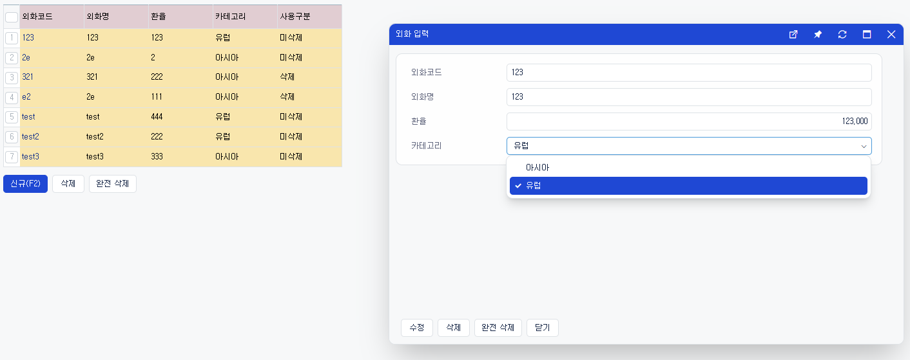

# Daily Retrospective  
**작성자**: 이연아  
**작성일시**: 2025-01-09  

## 1. 오늘 배운 내용 (필수)  
### 외화 코드 실습


해당 이미지와 같은 외화 업무 구현하기

#### 기초작업
1. Enum 추가
ecount.solution\src\01.ecount.fundamental\ecount.fundamental.define\src\enum\Enums.ts
```typescript
/**
 * 업무 유형
 * us_bizz_m.bizz_type
 */
export const enum EN_BIZZ_TYPE {
	...
	ForeignCurrency = 'foreign_currency',
}
```
- 기초코드의 카테고리가 맞을것으로 예상하나 연습삼아 해보는 용도

```typescript
/**
 * alternative data_model_id to be reserved
 */

export const enum EN_BIZZ_OBJECT_ALT_DATA_MODEL_ID {
	...
	foreign_currency = 'foreign_currency',
}
```
- data_model의 이름이 너무 길어져서 따로 별칭으로 지정해서 관리

2. bizz.ts 추가 - definition 추가
- definition에 명세되어 있는 파일을 다 읽어서 해당 정보를 캐싱해주면, 단순 작업이 해소 될 것으로 예상
```typescript
import { foreign_currency } from 'ecount.usecase.tutorials/@abstraction';

export const bizz_all = [
	// EDT 외화
	{ definition: foreign_currency.ForeignCurrencyDefinition, bizz_sid: 'TB_000000E040114' },
 ] as { definition: IBizzDefinition; bizz_sid: string | string[] }[];
```

3. 빌드를 위한 config 추가
ecount.solution\src\03.ecount.usecase\@build.config.template.js
```javascript
// configs 배열 내 추가
{
	moduleName: 'ecount.usecase.tutorials',
	projectPath: './ecount.usecase.tutorials',
	matches: ['{projectPath}/data_model_template/'],
	entry: '{projectPath}/data_model_template/index.ts'
},
```

#### DataModel Definition
DB 예상 모습?
```SQL
CREATE TABLE IF NOT EXISTS base.foreign_currency_20250109_xxx_ecback
(
    tenant_sid character varying(100) COLLATE pg_catalog."default" NOT NULL,
    foreign_currency_cd character varying(100) COLLATE pg_catalog."default" NOT NULL,
    foreign_currency_nm character varying(100) COLLATE pg_catalog."default",
    exchange_rate numeric(28,10),
    category character varying(100) COLLATE pg_catalog."default",
    write_dtm timestamp(3) without time zone NOT NULL,
    status_type character varying(3) COLLATE pg_catalog."default",
    CONSTRAINT foreign_currency_20250109_xxx_ecback_pkey PRIMARY KEY (tenant_sid, foreign_currency_cd)
)
```

foreign_currency의 **data_model_template**을 생성한다.
++ index 파일, tsconfig.json 파일 생성한다.

ecount.solution\src\03.ecount.usecase\ecount.usecase.tutorials\data_model_template\foreign_currency\foreign_currency.ts
```typescript
import { IDataModelTemplateInfo } from '@template-builder/definition';
import { EN_CUST_TYPE, EN_EXECUTE_CALLER_TYPE, EN_MENU_TYPE, EN_VIEW_TYPE } from 'ecount.fundamental.define/enum';

export const foreign_currency: IDataModelTemplateInfo = {
	// 템플릿 목적에 따라 id 지정, 템플릿이 빌드되어 각 data model을 생성할 때 사용
	template_id: 'foreign_currency',
	// definition으로 생성할 대상 설정 - 외화 메뉴 타입 
	targets: {
		[EN_MENU_TYPE.List]: null,
		[EN_MENU_TYPE.ListSearch]: null,
		[EN_MENU_TYPE.Input]: null,
	},
	// 사용할 항목 정의
	props: [
		{
			prop_id: 'tenant_sid',
			data_type: '$$sid',
			refer_type: 'tenant_sid',
			refer_group: 'sid',
			is_key: true,
			attributes: {
				Renderer: {
					display_state: false,
				},
			},
		},

		{
			prop_id: 'foreign_currency',
			data_type: '$$code',
			refer_type: 'foreign_currency',
			refer_group: 'foreign_currency',
			prop_name: '외화코드',
			targets: [EN_MENU_TYPE.List, EN_MENU_TYPE.Input],
			attributes: {
				Renderer: {
					display_state: false,
				},
			},
		},
		{
			prop_id: 'foreign_currency_cd',
			data_type: '$$txt',
			refer_type: 'foreign_currency_cd',
			refer_group: 'foreign_currency',
			prop_name: '외화코드',
			// 항목을 사용할 메뉴 타겟 설정
			targets: [EN_MENU_TYPE.List, EN_MENU_TYPE.Input],
		},
		{
			prop_id: 'foreign_currency_nm',
			data_type: '$$txt',
			refer_type: 'foreign_currency_nm',
			refer_group: 'foreign_currency',
			prop_name: '외화명',
			targets: [EN_MENU_TYPE.List, EN_MENU_TYPE.Input],
		},
		{
			prop_id: 'exchange_rate',
			data_type: '$$decimal',
			refer_type: 'exchange_rate',
			refer_group: 'exchange_rate',
			prop_name: '환율',
			targets: [EN_MENU_TYPE.List, EN_MENU_TYPE.Input],
		},
		{
			prop_id: 'category',
			data_type: '$$enum', //입력시 선택할 수 있게
			refer_type: 'category',
			refer_group: 'category',
			prop_name: '카테고리',
			targets: [EN_MENU_TYPE.Input],
		},
		{
			prop_id: 'category',
			data_type: '$$txt',	// 조회시 텍스트로 확인
			refer_type: 'category',
			refer_group: 'category',
			prop_name: '카테고리',
			targets: [EN_MENU_TYPE.List],
		},
		{
			prop_id: 'status_type',
			prop_name_code: '사용구분',
			prop_name: '사용구분',
			data_type: '$$enum', // y, n으로 구분해서 사용
			refer_type: 'status_type',
			refer_group: 'status_type',
			is_mandatory: true,
			targets: [EN_MENU_TYPE.List, EN_MENU_TYPE.Input],
		},
	],
};
```
- foreign_currency를 어떻게 일반화(테이블 통합) 할것인가는 아직 고려가 안된 상황.
- foreign_currency를 재고 상단 개념과 유사하게 이해

#### Definition
1. foreign_currency의 업무 definition을 생성한다.
ecount.solution\src\03.ecount.usecase\ecount.usecase.tutorials\src\server\@abstraction\definition\foreign_currency\foreign_currency_definition.ts
```typescript
import { EN_BIZZ_TYPE, EN_BIZZ_VERSION } from 'ecount.fundamental.define/enum';
import { IBizzDefinition } from 'ecount.infra.base/abstraction';

export const bizz_definition: IBizzDefinition = {
	bizz_id: 'foreign_currency',
	bizz_sid: 'TB_000000E040114',
	type: EN_BIZZ_TYPE.ForeignCurrency,
	version: EN_BIZZ_VERSION.$5_0_Framework,
	data_model_templates: [{ data_model_template_id: 'foreign_currency', alias: 'main' }],
	menus: {},
	objects: {},
	form: {},
	key_prop_info: {
		data_model_id: 'foreign_currency',
		prop_id: 'foreign_currency_cd',
	},
} as IBizzDefinition;
```

2. foreign_currency의 menu definition을 생성한다.
- input.ts
- list.ts

3. foreign_currency의 object definition을 생성한다.
- master.ts
- list.ts

=> 각 index 파일 생성한다.

빌드를 하면 data_model이 자동으로 생성되는 것을 확인할 수 있다.

**foreign_currency_input**
ecount.solution\src\03.ecount.usecase\ecount.usecase.tutorials\src\server\@abstraction\data_model\foreign_currency\foreign_currency_input.ts
```typescript
/**
 * NOTE:
 *   This file is generated by "data model template" and modifying it directly is not allowed.
 */

import { IDataModelDefinition, DataModelIdentifier } from 'ecount.fundamental.datamodel/definition';
import { EN_ATTR_TYPE } from 'ecount.fundamental.define/enum';

export const foreign_currency_input = new DataModelIdentifier('foreign_currency_input');

const foreign_currency_input_Definition: IDataModelDefinition = {
	data_model_id: 'foreign_currency_input',
	props: [
		{ prop_id: 'tenant_sid', data_type: '$$sid', refer_type: 'tenant_sid', is_key: true, refer_group: 'sid' },
		{
			prop_id: 'foreign_currency',
			data_type: '$$code',
			refer_type: 'foreign_currency',
			prop_name: '외화코드',
			refer_group: 'foreign_currency',
		},
		{
			prop_id: 'foreign_currency_cd',
			data_type: '$$txt',
			refer_type: 'foreign_currency_cd',
			prop_name: '외화코드',
			refer_group: 'foreign_currency',
		},
		{
			prop_id: 'foreign_currency_nm',
			data_type: '$$txt',
			refer_type: 'foreign_currency_nm',
			prop_name: '외화명',
			refer_group: 'foreign_currency',
		},
		{
			prop_id: 'exchange_rate',
			data_type: '$$decimal',
			refer_type: 'exchange_rate',
			prop_name: '환율',
			refer_group: 'exchange_rate',
		},
		{
			prop_id: 'category',
			data_type: '$$enum',
			refer_type: 'category',
			prop_name: '카테고리',
			refer_group: 'category',
		},
		{
			prop_id: 'status_type',
			data_type: '$$enum',
			refer_type: 'status_type',
			prop_name: '사용구분',
			prop_name_code: '사용구분',
			is_mandatory: true,
			refer_group: 'status_type',
		},
	],
	attributes: [
		{ attr_type: EN_ATTR_TYPE.Renderer, attr_id: 'display_state', data: false, prop_id: 'tenant_sid' },
		{ attr_type: EN_ATTR_TYPE.Renderer, attr_id: 'display_state', data: false, prop_id: 'foreign_currency' },
	],
};
foreign_currency_input.definition = foreign_currency_input_Definition;
```


## 2. 동기에게 도움 받은 내용 (필수)
- 아침 일찍 출근해서 수경님과 이야기하면서 복습하고, 아침을 먹으며 리프레시 할 수 있었습니다. 감사합니다!
- 오전 시작부터 강민님이 소스코드 rebase하는 과정을 도와주셨습니다. 감사합니다!
- 산출물 폴더 최신화하는 과정에서 성재님에게 도움을 받았습니다. 감사합니다!
- 실습 과정중에 오류가 발생했는데, 주원님이 먼저 다가와서 도움을 주셨습니다. 감사합니다~.~

---

## 3. 개발 기술적으로 성장한 점 (선택)
### 1. 교육 과정 상 배운 내용이 아닌 개인적 호기심을 해결하기 위해 추가 공부한 내용
외화코드 작성 중에 import를 제대로 하지 않아 발생하는 오류를 겪었습니다. 이번 기회에 회사에서 사용하는 import 규칙에 대해 정리해보았습니다.

#### 절대 경로인 경우 2 depth까지만 허용
valid
```typescript
import { some } from 'ecount.applition.base/action';
```

invalid
```typescript
import { some } from 'ecount.applition.base/action/some';
```

#### 하위모듈 참조 금지
valid
```typescript
//from ecount.usecase.common
import { some } from 'ecount.fundamental.define/enum';
```

invalid
```typescript
//from ecount.usecase.common
import { some } from 'ecount.application.common/action';
```

#### 자기 모듈은 **상대경로**로 참조
valid
```typescript
//from ecount.usecase.common/@abstraction
import { some } from '../../dto';
```

invalid
```typescript
//from ecount.usecase.common/@abstraction
import { some } from 'ecount.usecase.common/@abstraction';
```

#### 타 모듈은 **절대경로**로 참조
valid
```typescript
//from ecount.usecase.common/program
import { some } from 'ecount.usecase.common/svc';
```

invalid
```typescript
//from ecount.usecase.common/program
import { some } from '../../program';
```

#### 상대경로로만 참조 금지
valid
```typescript
import { some } from '../../dto';
```

invalid
```typescript
import { some } from '../..';
```

#### `TableModel` export/import
valid
- export 사용 예시
```typescript
export * as ms from './ms'; // 프로바이더 이름을 alias로 사용
export * as my from './my';
export * as pg from './pg';
```
    
- import 사용 예시
```typescript
import { pg } from 'ecount.infra.bridge/table_model';

const eSql = $ESql.from<pg.cust>(pg.cust)
```

#### Usecase의 모듈 의존 관계
Usecase안에 있는 다른 모듈의 마이크로 모듈을 import 하는 경우에는 @abstraction, @implement 만 import 할 수 있다.

```typescript
// 03.ecount.usecase/ecount.usecase.board/src/server/svc/index.ts
import { some } from 'ecount.usecase.basic/@abstraction'; // valid
import { some } from 'ecount.fundamental.define/enum'; // valid 1레이어
import { some } from 'ecount.usecase.common/svc'; // invalid
import { some } from 'ecount.usecase.basic/svc'; // invalid

// 04.ecount.application/ecount.application.features/src/server/command/index.ts
import { some } from 'ecount.usecase.common/@implement' // valid
import { some } from 'ecount.usecase.common/svc'; // invalid
```


### 2. 오늘 직면했던 문제 (개발 환경, 구현)와 해결 방법
소스 코드를 rebase하고 빌드하는 과정에서 오류를 겪었습니다.</br>
대부분의 동기들도 똑같은 오류를 마주했는데, 성범 책임님과 동기들의 도움으로 해결할 수 있었습니다.</br>

오류의 원인은 산출물 폴더를 최신화하지 않아서 발생한 오류였습니다.</br>
원인을 파악하고 산출물 폴더에 최신화를 통해 해결하려고 했습니다. 그 과정에서도 충돌이 발생했고, 결과적으로 원래 사용하던 branch를 삭제하고 새로 브랜치를 만들어서 최신 코드를 받아올 수 있었습니다.</br>

오늘은 많은 사람들의 도움을 받아 해결했지만, rebase를 해야하는 이유를 느낄 수 있던 유익한 시간이었습니다.
