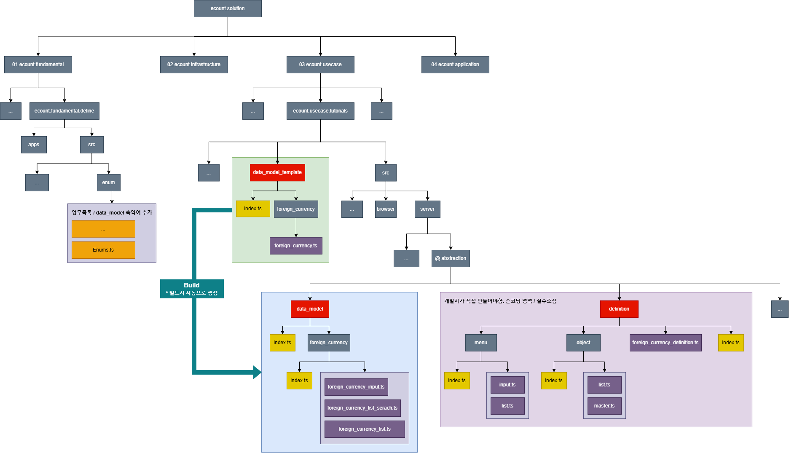

# Daily Retrospective

**작성자**: [최현철]  
**작성일시**: [2025-01-09]

## 1. 오늘 배운 내용 (필수)

1. 산출물 폴더 최신버전으로 rebase 하기

2. 외화등록 구현해보기 ( ~ object/menu definition 까지)

- 어제배운 내용을 바탕으로 직접 만들어보며 개념 대입해보기
  

## 2. 동기에게 도움 받은 내용 (필수)

1. 오전 산출물폴더 rebase 과정에서 승준/건호/강민님에게 도움을 받았습니다.

- 디버깅 안찍히는 문제 : 개발자도구 캐시사용 관련 (강민님이 도움)
- 빌드 안보이는 문제 : devTool 재설치 (건호님 도움)

2. 외화등록 실습과정 중 data_model_template 빌드가 안되는 문제를 승준/강민님께서 해결해주셨습니다.

- config 파일에 오타 tutorial > tutorials

---

## 3. 개발 기술적으로 성장한 점 (선택)

### 3. 위 두 주제 중 미처 해결 못한 과제. 앞으로 공부해볼 내용.

index 파일을 활용하여 참조해나가는 과정

---

## 5. 제안하고 싶은 내용

엊그제 적었던 제안사항이 꼭 채택되면 좋겠습니다~ (동기들 야근시간/택시관련)
