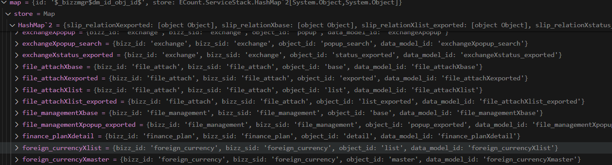

# Daily Retrospective  
**작성자**: [김민준]  
**작성일시**: [2025-01-10]  

## 1. 오늘 배운 내용 (필수)  


## 실습

`CreateForeignCurrencyProgram`
- `request` 데이터를 바탕으로 `smc`로 만들어 `ExecuteSetupMainProgram`의 파라미터로 넘깁니다.
- `SlipDataModelContainer`는 `data_model_id`를 바탕으로 `data_model_definition`을 `bizz_manager`에서 찾아옵니다.

```typescript
@program_impl(ICreateForeignCurrencyProgram)
export class CreateForeignCurrencyProgram
  extends BaseProgram<ExecuteSetupMainRequestDto, ExecuteSetupMainResultDto>
  implements ICreateForeignCurrencyProgram
{
  constructor(execution_context: IExecutionContext) {
    super(execution_context);
  }

  private result: ExecuteSetupMainResultDto;

  protected onExecute(request: ExecuteSetupMainRequestDto): ExecuteSetupMainResultDto {
    const errors: IException[] = [];
    try {
      this._runCreateInventoryProcess(request);
    } catch (e: any) {
      if (e.isSessionTimeout) {
        throw ExceptionBuilder.create<ITimeoutException>(ITimeoutException, { isSessionTimeout: true });
      }

      if (Exception.verify(e)) {
        errors.push(e as IException);
      } else {
        throw e;
      }
    } finally {
      if (!_.vIsEmpty(errors)) {
        this.result.error = ExceptionBuilder.create<ICommonException>(ICommonException, {
          error_info: errors,
        });
      }
    }

    return this.result;
  }
  @_transaction(TransactionOption.Required)
  private _runCreateInventoryProcess(request: ExecuteSetupMainRequestDto): void {
    this.result = {
      error: {},
    } as ExecuteSetupMainResultDto;
    // [1] 5.0 ForeignCurrency Main Program
    this.result = this._executeMainSetupProgram(request);
  }

  /** 5.0 ForeignCurrency Main Program  */
  private _executeMainSetupProgram(request: ExecuteSetupMainRequestDto): ExecuteSetupMainResultDto {
    const program = ProgramBuilder.create<ExecuteSetupMainRequestDto, ExecuteSetupMainResultDto>(
      ITempExecuteSetupMainProgram,
      this.execution_context
    );

    // Main 로직에서 SlipDataModelContainer 생성 시 에러, 임시 로직
    // 빈 객체일 경우 새로 생성하지 않고 그대로 사용하여 에러 발생
    // ===================================================
    request.derive_info.smc = new SlipDataModelContainer(this.execution_context, request.slip_data_model);
    // ===================================================

    return program.execute(request);
  }
}
```


## 2. 동기에게 도움 받은 내용 (필수)

- **주현님, 아연님, 강민님**과 같은 문제를 겪었는데 다들 합심해서 문제를 해결하려 노력했습니다.

- **승준님, 성재님, 강민님, 건호님**과 한식 뷔페에서 밥을 먹었는데 동기분들과 같이 밥을 먹을 수 있어서 행복했어요 ㅎㅎ.

- **수경님**이 항상 문제가 발생했을 때 도와주려고 해주세요. 수경님짱!!

## 3. 개발 기술적으로 성장한 점 (선택)
아래의 3가지 주제 중 하나를 선택하여 작성합니다.

### 1. 교육 과정 상 배운 내용이 아닌 개인적 호기심을 해결하기 위해 추가 공부한 내용

#### **제너레이터**

- 일반 함수
    - 일반 함수는 하나의 값(혹은 0개)만을 반환합니다.

- 제너레이터
    - 여러 개의 값을 필요에 따라 하나씩 반환할 수 있습니다.
    - 제너레이터와 이터러블 객체를 함께 사용하면 손쉽게 데이터 스트림을 만들 수 있습니다.

```javascript
function* generateSequence() {
    yield 1; // {value: 1, done: false}
    yield 2;  // {value: 2, done: false}
    return 3; // {value: 3, done: true}
}

let generator = generateSequence();
console.log(generator) // [object Generator]
```

- 제너레이터 함수는 일반 함수와 동작 방식이 다릅니다. 제너레이터 함수를 호출하면 코드가 실행되지 않고, 대신 실행을 처리하는 특별 객체, '제너레이터 객체'가 반환됩니다.

실행
- `next()`는 제너레이터의 주요 메서드입니다. `next`를 호출하면 가장 가까운 `yield <value>`문을 만날 때 까지 실행이 지속됩니다. `yield <value>`을 만나면 실행이 멈추고 산출하고자 하는 값은 `value`가 바깥 코드에 반환됩니다.
- `yield`의 뜻은 산출하다.

`next()`가 반환하는 값

```javascript
{
    value: any
    done: boolean
}
```

`return <value>`가 실행되면?
- 제너레이터의 끝을 알립니다. 
```javascript
{
    value: <value>,
    done: true
}
```

#### 제너레이터와 이터러블
- 제너레이터는 **이터러블**입니다. 

```typescript
// SlipDataModelContainerBase.ts

*createDataModelContainer(
	data_model_option_creator?: <TDataModel = any>(
			data_model_definition?: IDataModelDefinition,
			data_model?: TDataModel
		) => IDataModelOptions | undefined,
		sub_array_db_info_list?: SelectAffiliationListResultDto[]
	): IterableIterator<IDataModelContainer> {
		let sub_arrays: SUB_ARRAY_INFO[] = [];
		for (const [data_model_id, data_model] of Object.entries(this.slip_data_model.data_model || {})) {
			const dmc = this._createDataModelContainer(data_model_id, data_model, data_model_option_creator);

			// 부속 prop_id 있으면 부속 정보 담아둔다 (추후 삭제 필요: 모든 Definition에서 sub_array_info 삭제시)
			sub_arrays = sub_arrays.concat(this.findSubArrayInfo(dmc));
			this.dmc[dmc.data_model_id] = dmc;
			yield dmc;
		}
```
- 실제로 반환 타입이 `IterableIterator`인 것을 확인할 수 있었으며, `yield` 키워드로 데이터를 반환하는 것을 알 수 있었습니다.

## 2. 오늘 직면했던 문제 (개발 환경, 구현)와 해결 방법

**`data_model_definition`을 찾아오지 못하는 문제**

- `SlipDataModelContainer`를 통해 smc를 만들던 도중 `data_model_definition`을 찾지 못하는 문제가 발생했습니다.

```typescript
private createDataModelDefinition(data_model_id: string) {
    const definition = this.bizz_manager.getDataModelDefinition(this.execution_context, data_model_id);
    if (definition) { // definition = undefined;
        this.definitions[data_model_id] = definition;
    } else {
        Exception.throw(
            ExceptionBuilder.create(ISystemException, {
                message: 'Not found definition.',
            })
        );
    }
}
```

- debug를 통해 확인해보니 `BizzManagerBase`에서 `data_model_id`가 `slip_data_model.ts`에서 정의한 `ForeignCurrencyXmaster`가 `foreign_currency_input`으로 변경되어야 definition을 찾을 수 있는데 `data_model_id`가 바뀌지 않는 문제가 있었습니다.

```typescript
import { IDataModelDefinition, DataModelIdentifier } from 'ecount.fundamental.datamodel/definition';
import { EN_ATTR_TYPE } from 'ecount.fundamental.define/enum';

export const foreign_currency_input = new DataModelIdentifier('foreign_currency_input');

const foreign_currency_input_Definition: IDataModelDefinition = {
	data_model_id: 'foreign_currency_input', // 이걸로 definition 찾아오는데 왜 data_currency_id가 다를까..?
	props: [
		{ prop_id: 'tenant_sid', data_type: '$$sid', refer_type: 'tenant_sid', is_key: true, refer_group: 'sid' },
		{
			prop_id: 'foreign_currency',
			data_type: '$$code',
			refer_type: 'foreign_currency',
			prop_name: '외화코드',
			refer_group: 'foreign_currency',
		},
        // ~~~
    ]
}
```
`MemCacheManagerBase.ts`
- memCache가 `data_model_id` 변환 값을 관리하는데 `bizzManager`가 `object`를 관리합니다. 
- 저의 경우에는 `bizz_manager`가 `object_definition`을 관리해야되는데 `./index.ts`에 `object_definition` 내보내기가 되지 않아서 생기는 문제였습니다.
```typescript
	getMemCachedData<TEntity = any>(
		execution_context: TContext | undefined,
		id: TIdentifier,
		key: string
	): MemCachedData<TEntity, TIdentifier, TContext> | undefined {
		for (const mgr of this._allMgr()) {
			const map = mgr.getOrAddStore(id, execution_context);
			if (map && map.store && map.store.has(key)) {
				return {
					data: map.store.get(key),
					mgr: mgr,
				};
			}
		}
		return undefined;
	}
```




### 3. 위 두 주제 중 미처 해결 못한 과제. 앞으로 공부해볼 내용.

위 주제는 각각 하나의 선택항목으로 간주합니다.
(위 주제에서 2개 작성하면 2개 선택항목 작성한 셈)

---

**`CreateForeignCurrencyProgram`에서 `TempExecuteSetupMainProgram`을 사용해야하는 이유**

- `ExecuteSetupMainProgram`을 실행하니 `IValueResolverConfigureFeature` feature를 가져오는 과정에서 구현체를 가져오지 못하여 `Exception`이 발생하는 것을 확인했습니다.   

```typescript
		const flowv2_configure_feature =
			this.execution_context.getFeature<IValueResolverConfigureFeature>(IValueResolverConfigureFeature);
```

- 다른 Action 코드를 확인해보니 `Action` 레이어에서 feature 구현체를 넣어주는 것을 확인할 수 있었습니다.   

```typescript
        // ChangeMenuAccountAction.ts
		configuration_context.setFeature<IValueResolverConfigureFeature>(
			IValueResolverConfigureFeature,
			new AccountExecuteMainValueResolverConfigureFeature(execution_context)
		);
```

- `IValueResolverConfigureFeature`가 어떤 역할을 하는지 궁금합니다.

## 4. 소프트 스킬면에서 성장한 점  (선택)  

- 동기분들과 함께 협업하여 같은 문제에 대해서 디버깅과 추론을 하는 시간을 가질 수 있었습니다. 앞으로도 이런 시간을 가져서 동기분들과 의견을 주고 받을 수 있는 시간이 있었으면 좋겠습니다.